- [ブラシ : グラデーションとシェーダー](#ブラシ--グラデーションとシェーダー)
  - [グラデーションブラシ](#グラデーションブラシ)
    - [colorStops で色の分布を変更する](#colorstops-で色の分布を変更する)
    - [TileMode でパターンを繰り返す](#tilemode-でパターンを繰り返す)
    - [ブラシサイズを変更する](#ブラシサイズを変更する)
  - [画像をブラシとして使用する](#画像をブラシとして使用する)
  - [高度な例: カスタムブラシ](#高度な例-カスタムブラシ)
    - [AGSL の RuntimeShader ブラシ](#agsl-の-runtimeshader-ブラシ)
  - [参考情報](#参考情報)


# ブラシ : グラデーションとシェーダー 

Compose の [Brush](https://developer.android.com/reference/kotlin/androidx/compose/ui/graphics/Brush?hl=ja&_gl=1*5jb017*_up*MQ..*_ga*MTQ1NzI0ODE0NC4xNzI2NzI4Nzk2*_ga_6HH9YJMN9M*MTcyNjcyODc5Ni4xLjAuMTcyNjcyODc5Ni4wLjAuNzY3NTIxMjY2) では、画面上で何かを描画する際の手法を記述します。これは、描画領域（円、四角、パスなど）に適用される色を定義するものです。 [LinearGradient](https://developer.android.com/reference/kotlin/androidx/compose/ui/graphics/LinearGradient?hl=ja&_gl=1*5jb017*_up*MQ..*_ga*MTQ1NzI0ODE0NC4xNzI2NzI4Nzk2*_ga_6HH9YJMN9M*MTcyNjcyODc5Ni4xLjAuMTcyNjcyODc5Ni4wLjAuNzY3NTIxMjY2) ブラシ、 [RadialGradient](https://developer.android.com/reference/kotlin/androidx/compose/ui/graphics/RadialGradient?hl=ja&_gl=1*5jb017*_up*MQ..*_ga*MTQ1NzI0ODE0NC4xNzI2NzI4Nzk2*_ga_6HH9YJMN9M*MTcyNjcyODc5Ni4xLjAuMTcyNjcyODc5Ni4wLjAuNzY3NTIxMjY2) ブラシ、単色の [SolidColor](https://developer.android.com/reference/kotlin/androidx/compose/ui/graphics/SolidColor?hl=ja&_gl=1*5jb017*_up*MQ..*_ga*MTQ1NzI0ODE0NC4xNzI2NzI4Nzk2*_ga_6HH9YJMN9M*MTcyNjcyODc5Ni4xLjAuMTcyNjcyODc5Ni4wLjAuNzY3NTIxMjY2) ブラシなど、描画で役に立つ組み込みのブラシがいくつか用意されています。

ブラシは、 [Modifier.background()](https://developer.android.com/reference/kotlin/androidx/compose/ui/Modifier?hl=ja&_gl=1*5jb017*_up*MQ..*_ga*MTQ1NzI0ODE0NC4xNzI2NzI4Nzk2*_ga_6HH9YJMN9M*MTcyNjcyODc5Ni4xLjAuMTcyNjcyODc5Ni4wLjAuNzY3NTIxMjY2#(androidx.compose.ui.Modifier.background(androidx.compose.ui.graphics.Color,androidx.compose.ui.graphics.Shape))) 、 [TextStyle](https://developer.android.com/reference/kotlin/androidx/compose/ui/text/TextStyle?hl=ja&_gl=1*10zie6d*_up*MQ..*_ga*MTQ1NzI0ODE0NC4xNzI2NzI4Nzk2*_ga_6HH9YJMN9M*MTcyNjcyODc5Ni4xLjAuMTcyNjcyODc5Ni4wLjAuNzY3NTIxMjY2) 、 [DrawScope](https://developer.android.com/reference/kotlin/androidx/compose/ui/graphics/drawscope/DrawScope?hl=ja&_gl=1*10zie6d*_up*MQ..*_ga*MTQ1NzI0ODE0NC4xNzI2NzI4Nzk2*_ga_6HH9YJMN9M*MTcyNjcyODc5Ni4xLjAuMTcyNjcyODc5Ni4wLjAuNzY3NTIxMjY2) の描画呼び出しで使用可能で、描画するコンテンツにペイント スタイルを適用できます。

たとえば、水平グラデーション ブラシを DrawScope の円に適用できます。

```kotlin
val brush = Brush.horizontalGradient(listOf(Color.Red, Color.Blue))
Canvas(
    modifier = Modifier.size(200.dp),
    onDraw = {
        drawCircle(brush)
    }
)
```

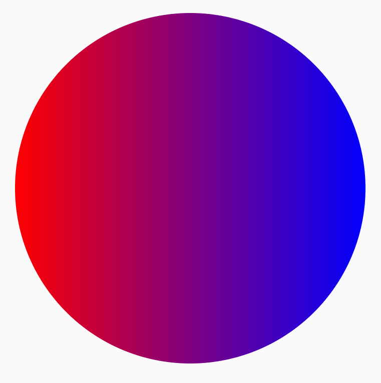


## グラデーションブラシ

さまざまな組み込みのグラデーション ブラシを使用して、多様なグラデーション効果を適用できます。これらのブラシでは、グラデーションの生成で使用する色のリストを指定できます。

以下に、使用可能なグラデーションブラシの一覧を示します。

- [Brush.horizontalGradient(colorList)](https://developer.android.com/reference/kotlin/androidx/compose/ui/graphics/Brush?hl=ja&_gl=1*1mfiy6l*_up*MQ..*_ga*MTQ1NzI0ODE0NC4xNzI2NzI4Nzk2*_ga_6HH9YJMN9M*MTcyNjcyODc5Ni4xLjAuMTcyNjcyODc5Ni4wLjAuNzY3NTIxMjY2#horizontalGradient(kotlin.collections.List,kotlin.Float,kotlin.Float,androidx.compose.ui.graphics.TileMode))

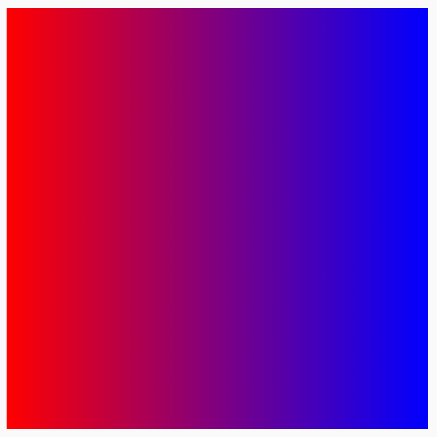


- [Brush.linearGradient(colorList)](https://developer.android.com/reference/kotlin/androidx/compose/ui/graphics/Brush?hl=ja&_gl=1*1mfiy6l*_up*MQ..*_ga*MTQ1NzI0ODE0NC4xNzI2NzI4Nzk2*_ga_6HH9YJMN9M*MTcyNjcyODc5Ni4xLjAuMTcyNjcyODc5Ni4wLjAuNzY3NTIxMjY2#linearGradient(kotlin.Array,androidx.compose.ui.geometry.Offset,androidx.compose.ui.geometry.Offset,androidx.compose.ui.graphics.TileMode))

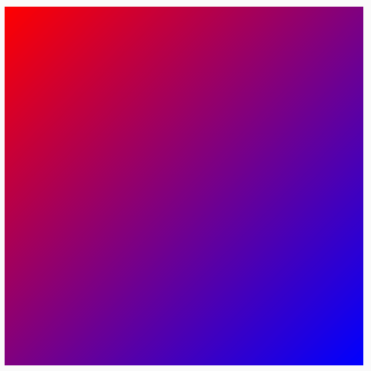


- [Brush.verticalGradient(colorList)](https://developer.android.com/reference/kotlin/androidx/compose/ui/graphics/Brush?hl=ja&_gl=1*1mfiy6l*_up*MQ..*_ga*MTQ1NzI0ODE0NC4xNzI2NzI4Nzk2*_ga_6HH9YJMN9M*MTcyNjcyODc5Ni4xLjAuMTcyNjcyODc5Ni4wLjAuNzY3NTIxMjY2#verticalGradient(kotlin.collections.List,kotlin.Float,kotlin.Float,androidx.compose.ui.graphics.TileMode))

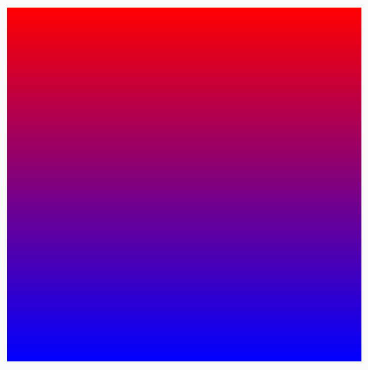


- [Brush.sweepGradient(colorList)](https://developer.android.com/reference/kotlin/androidx/compose/ui/graphics/Brush?hl=ja&_gl=1*1mfiy6l*_up*MQ..*_ga*MTQ1NzI0ODE0NC4xNzI2NzI4Nzk2*_ga_6HH9YJMN9M*MTcyNjcyODc5Ni4xLjAuMTcyNjcyODc5Ni4wLjAuNzY3NTIxMjY2#sweepGradient(kotlin.Array,androidx.compose.ui.geometry.Offset))

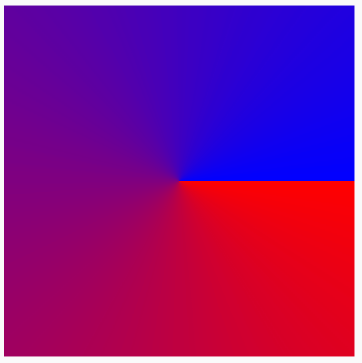

注: 色が滑らかに移り変わるように、たいていの場合は、最後の色を最初と同じ色に設定するのが良いです。


- [Brush.radialGradient(colorList)](https://developer.android.com/reference/kotlin/androidx/compose/ui/graphics/Brush?hl=ja&_gl=1*1mfiy6l*_up*MQ..*_ga*MTQ1NzI0ODE0NC4xNzI2NzI4Nzk2*_ga_6HH9YJMN9M*MTcyNjcyODc5Ni4xLjAuMTcyNjcyODc5Ni4wLjAuNzY3NTIxMjY2#radialGradient(kotlin.Array,androidx.compose.ui.geometry.Offset,kotlin.Float,androidx.compose.ui.graphics.TileMode))

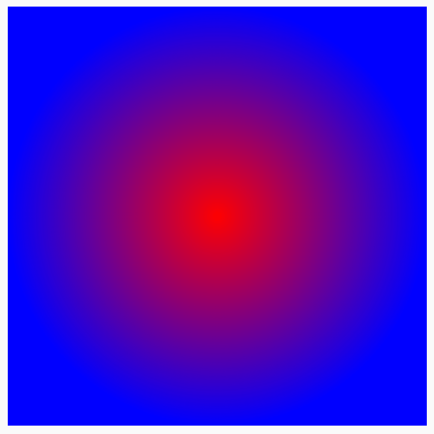


### colorStops で色の分布を変更する

グラデーションにあらわれる色をカスタマイズするには、それぞれの色の colorStops 値を調整します。colorStops は 0 から 1 の割合で指定します。これは、開始地点の色を 0 として、終了地点の色を 1 にして、その進捗率に応じて、間の色の値を設定します。 1 より大きい値を指定すると、その色はグラデーションの中でレンダリングされなくなります。

ある色の量を小さくしたり、あるいは大きくしたりなど、異なる量になるようにカラーストップを構成できます。

```kotlin
val colorStops = arrayOf(
    0.0f to Color.Yellow,
    0.2f to Color.Red,
    1f to Color.Blue
)
Box(
    modifier = Modifier
        .requiredSize(200.dp)
        .background(Brush.horizontalGradient(colorStops = colorStops))
)
```

色は、colorStop ペアで定義される指定されたオフセットで分散され、赤と青よりも黄色が少なくなります。

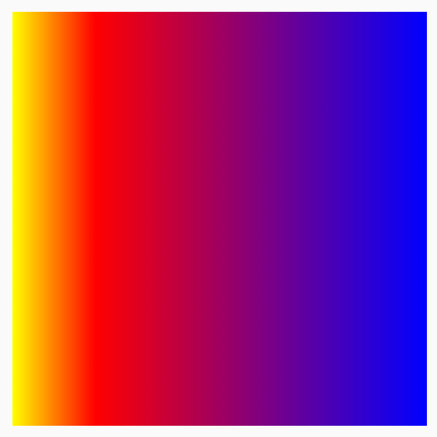


### TileMode でパターンを繰り返す

各グラデーション ブラシには、 [TileMode](https://developer.android.com/reference/kotlin/androidx/compose/ui/graphics/TileMode?hl=ja&_gl=1*a64dma*_up*MQ..*_ga*MTQ1NzI0ODE0NC4xNzI2NzI4Nzk2*_ga_6HH9YJMN9M*MTcyNjcyODc5Ni4xLjAuMTcyNjcyODc5Ni4wLjAuNzY3NTIxMjY2) を設定するオプションがあります。グラデーションの開始と終了を設定していない場合、デフォルトで領域全体が塗りつぶされるため、TileMode に気づかないかもしれません。TileMode は、領域のサイズがブラシのサイズより大きい場合にのみ、グラデーションをタイル化します。

次のコードの場合、endX が 50.dp に設定され、サイズが 200.dp に設定されているため、グラデーション パターンが 4 回繰り返されます。

```kotlin
val listColors = listOf(Color.Yellow, Color.Red, Color.Blue)
val tileSize = with(LocalDensity.current) {
    50.dp.toPx()
}
Box(
    modifier = Modifier
        .requiredSize(200.dp)
        .background(
            Brush.horizontalGradient(
                listColors,
                endX = tileSize,
                tileMode = TileMode.Repeated
            )
        )
)
```

以下の表は、異なる TileMode が上記の HorizontalGradient の例の場合でどのように機能するかを説明しています。

- [TileMode.Repeated](https://developer.android.com/reference/kotlin/androidx/compose/ui/graphics/TileMode?hl=ja&_gl=1*1290w7q*_up*MQ..*_ga*MTQ1NzI0ODE0NC4xNzI2NzI4Nzk2*_ga_6HH9YJMN9M*MTcyNjcyODc5Ni4xLjAuMTcyNjcyODc5Ni4wLjAuNzY3NTIxMjY2#Repeated())

最後の色から最初の色までエッジが繰り返されます。

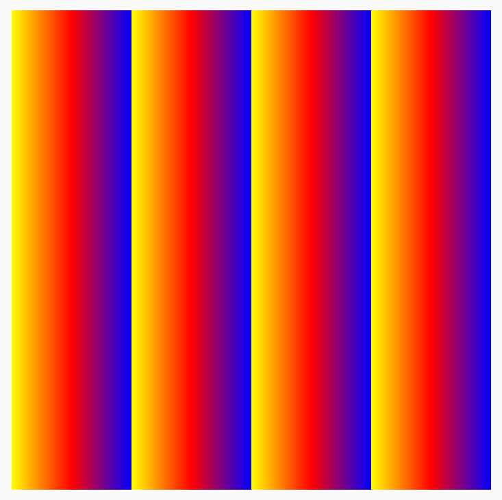


- [TileMode.Mirror](https://developer.android.com/reference/kotlin/androidx/compose/ui/graphics/TileMode?hl=ja&_gl=1*8plxa0*_up*MQ..*_ga*MTQ1NzI0ODE0NC4xNzI2NzI4Nzk2*_ga_6HH9YJMN9M*MTcyNjcyODc5Ni4xLjAuMTcyNjcyODc5Ni4wLjAuNzY3NTIxMjY2#Mirror())

エッジで反転して、最後の色から最初の色の順で表示されます。

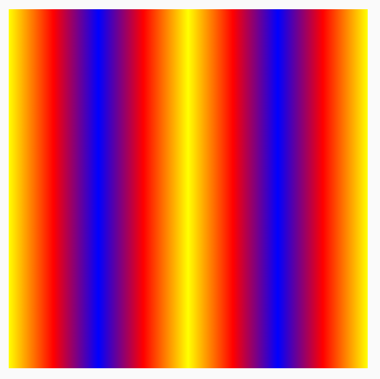


- [TileMode.Clamp](https://developer.android.com/reference/kotlin/androidx/compose/ui/graphics/TileMode?hl=ja&_gl=1*8plxa0*_up*MQ..*_ga*MTQ1NzI0ODE0NC4xNzI2NzI4Nzk2*_ga_6HH9YJMN9M*MTcyNjcyODc5Ni4xLjAuMTcyNjcyODc5Ni4wLjAuNzY3NTIxMjY2#Clamp())

エッジで最後の色に固定されます。それ以降の領域は、その色に最も近い色で塗りつぶされます。

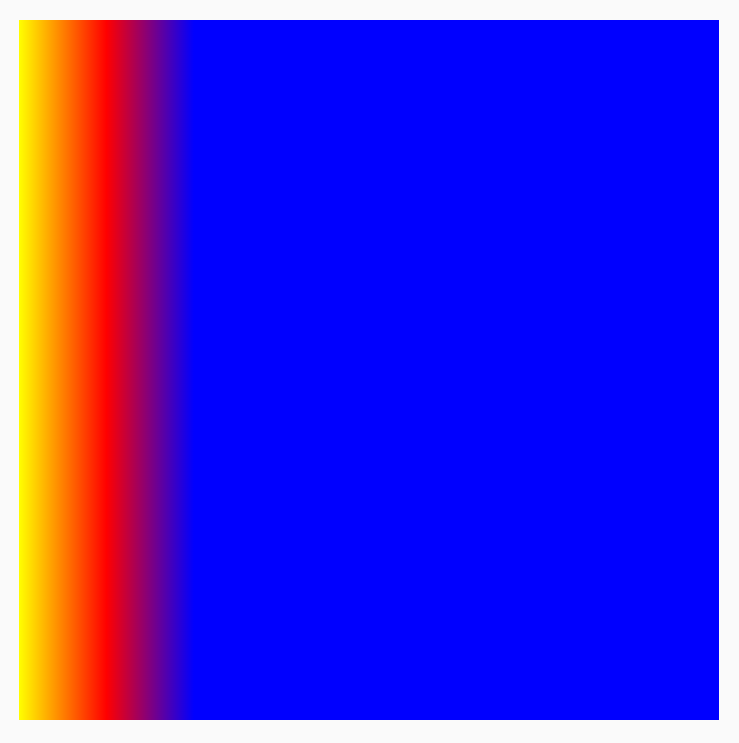


- [TileMode.Decal](https://developer.android.com/reference/kotlin/androidx/compose/ui/graphics/TileMode?hl=ja&_gl=1*8plxa0*_up*MQ..*_ga*MTQ1NzI0ODE0NC4xNzI2NzI4Nzk2*_ga_6HH9YJMN9M*MTcyNjcyODc5Ni4xLjAuMTcyNjcyODc5Ni4wLjAuNzY3NTIxMjY2#Decal())

境界のサイズまでのみレンダリングされます。TileMode.Decal では、透明な黒を利用して元の境界の外側のコンテンツがサンプリングされますが、TileMode.Clamp ではエッジの色がサンプリングされます。

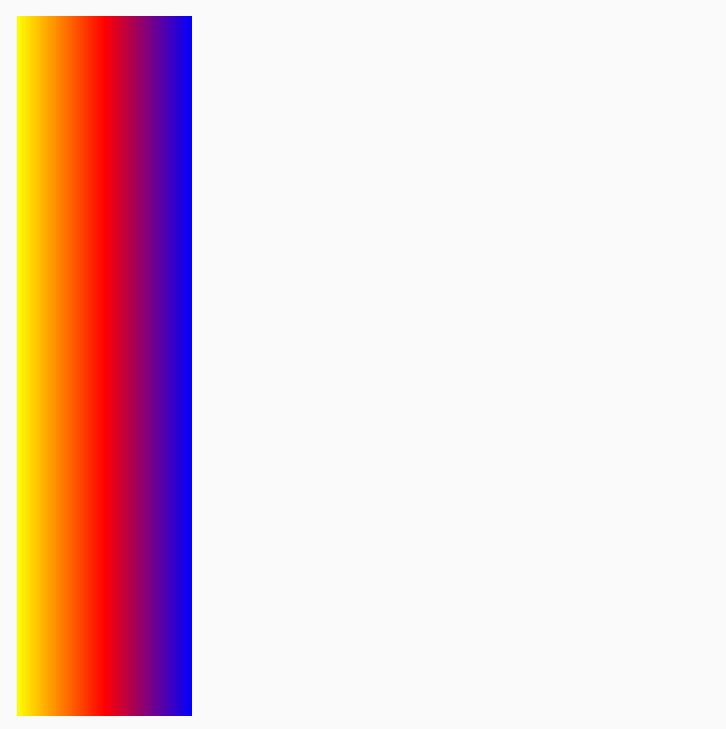

注: TileMode.Decal は API 31 以降でのみ使用できます。TileMode.isSupported() を使用して、TileMode がデバイスでサポートされているかどうかを確認します。サポートされていない TileMode を使用すると、デフォルトの TileMode.Clamp が適用されます。
TileMode は、他の方向性のあるグラデーションでも同様に機能します。違いは反復が発生する方向です。


### ブラシサイズを変更する

ブラシを適用する領域のサイズがわかっている場合は、上記の TileMode セクションで説明したように、タイル endX を設定できます。DrawScope を開いている場合は、 [size](https://developer.android.com/reference/kotlin/androidx/compose/ui/graphics/drawscope/DrawScope?hl=ja&_gl=1*3ijzhd*_up*MQ..*_ga*MTQ1NzI0ODE0NC4xNzI2NzI4Nzk2*_ga_6HH9YJMN9M*MTcyNjcyODc5Ni4xLjAuMTcyNjcyODc5Ni4wLjAuNzY3NTIxMjY2#size()) プロパティを使用して領域のサイズを取得できます。

描画する領域のサイズが不明な場合（たとえば、Brush がテキストに適用される場合）、Shader を拡張して、createShader 関数で描画領域のサイズを利用できます。

参考 : Shader とは、一般的に、画面に表示するものを計算してくれる処理のことを示します。

この例では、サイズを 4 分の 1 にして、パターンを 4 回繰り返します。

```kotlin
val listColors = listOf(Color.Yellow, Color.Red, Color.Blue)
val customBrush = remember {
    object : ShaderBrush() {
        override fun createShader(size: Size): Shader {
            return LinearGradientShader(
                colors = listColors,
                // from と to は、グラデーションを実施する向き (ベクトル) を示す。
                from = Offset.Zero,
                to = Offset(size.width / 4f, 0f),
                tileMode = TileMode.Mirror
            )
        }
    }
}
Box(
    modifier = Modifier
        .requiredSize(200.dp)
        .background(customBrush)
)
```

この実装方法では、先ほどのブラシの幅を固定長 ( 50 dp ) にしていたのとは異なり、親のサイズに合わせて、動的にブラシのサイズを決定することができます。


円形グラデーションなど、他のグラデーション ブラシのサイズを変更することもできます。サイズと中心を指定しない場合、グラデーションは DrawScope の全領域を塗りつぶします。また、円形グラデーションの中心は DrawScope 領域の中心にデフォルトで設定されます。この場合、円形グラデーションの中心が、幅と高さのうち小さいほうの中心として表示されます。

```kotlin
Box(
    modifier = Modifier
        .fillMaxSize()
        .background(
            Brush.radialGradient(
                listOf(Color(0xFF2be4dc), Color(0xFF243484))
            )
        )
)
```


半径サイズを最大に設定するように円形グラデーションが変更されると、次のように、円形グラデーションの効果が改善されることがわかります。

```kotlin
val largeRadialGradient = object : ShaderBrush() {
    override fun createShader(size: Size): Shader {
        val biggerDimension = maxOf(size.height, size.width)
        return RadialGradientShader(
            colors = listOf(Color(0xFF2be4dc), Color(0xFF243484)),
            center = size.center,
            radius = biggerDimension / 2f,
            colorStops = listOf(0f, 0.95f)
        )
    }
}

Box(
    modifier = Modifier
        .fillMaxSize()
        .background(largeRadialGradient)
)
```

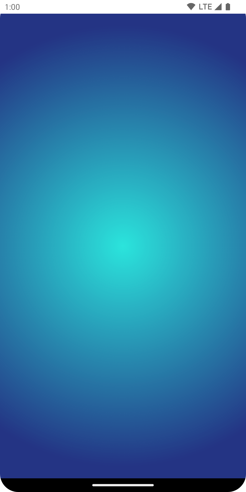

シェーダーの作成に渡される実際のサイズは、呼び出された場所から決定されることに注意してください。デフォルトで、サイズが Brush の最後の作成と異なる場合、または、シェーダーの作成に使用された状態オブジェクトが変更された場合、Brush がその Shader を内部で再割り当てします。

次のコードは、描画領域のサイズの変化に応じて、シェーダーを異なるサイズで 3 回作成します。

```kotlin
val colorStops = arrayOf(
    0.0f to Color.Yellow,
    0.2f to Color.Red,
    1f to Color.Blue
)
val brush = Brush.horizontalGradient(colorStops = colorStops)
Box(
    modifier = Modifier
        .requiredSize(200.dp)
        .drawBehind {
            drawRect(brush = brush) // will allocate a shader to occupy the 200 x 200 dp drawing area
            inset(50f) {
      /* Will allocate a shader to occupy the 180 x 180 dp drawing area as the
       inset scope reduces the drawing  area by 10 pixels on the left, top, right,
      bottom sides */
                drawRect(brush = brush)
                inset(100f) {
        /* will allocate a shader to occupy the 170 x 170 dp drawing area as the
         inset scope reduces the  drawing area by 5 pixels on the left, top,
         right, bottom sides */
                    drawRect(brush = brush)
                }
            }
        }
)
```


## 画像をブラシとして使用する

ImageBitmap を Brush として使用するには、画像を ImageBitmap として読み込み、ImageShader ブラシを作成します。

```kotlin
val imageBrush =
    ShaderBrush(ImageShader(ImageBitmap.imageResource(id = R.drawable.dog)))

// ImageShader ブラシを background と一緒に使用する。
Box(
    modifier = Modifier
        .requiredSize(200.dp)
        .background(imageBrush)
)

// ImageShader ブラシを TextStyle と一緒に使用する。
Text(
    text = "Hello Android!",
    style = TextStyle(
        brush = imageBrush,
        fontWeight = FontWeight.ExtraBold,
        fontSize = 36.sp
    )
)

// ImageShader ブラシを DrawScope#drawCircle() と一緒に使用する。
Canvas(onDraw = {
    drawCircle(imageBrush)
}, modifier = Modifier.size(200.dp))
```

ブラシが、背景、テキスト、キャンバスなど、異なる複数の描画に適用されます。出力は次のようになります。


## 高度な例: カスタムブラシ

### AGSL の RuntimeShader ブラシ

[AGSL](https://developer.android.com/develop/ui/views/graphics/agsl?hl=ja&_gl=1*16jp4oy*_up*MQ..*_ga*MTQ1NzI0ODE0NC4xNzI2NzI4Nzk2*_ga_6HH9YJMN9M*MTcyNjcyODc5Ni4xLjAuMTcyNjcyODc5Ni4wLjAuNzY3NTIxMjY2) では、 [GLSL](https://developer.android.com/develop/ui/views/graphics/agsl/agsl-vs-glsl?hl=ja&_gl=1*16jp4oy*_up*MQ..*_ga*MTQ1NzI0ODE0NC4xNzI2NzI4Nzk2*_ga_6HH9YJMN9M*MTcyNjcyODc5Ni4xLjAuMTcyNjcyODc5Ni4wLjAuNzY3NTIxMjY2) Shader 機能が一部提供されています。Shader を AGSL で記述して、Compose のブラシで使用できます。

Shader ブラシを作成するには、まず AGSL シェーダー文字列として Shader を定義します。

```kotlin
@Language("AGSL")
val CUSTOM_SHADER = """
    uniform float2 resolution;
    layout(color) uniform half4 color;
    layout(color) uniform half4 color2;

    half4 main(in float2 fragCoord) {
        float2 uv = fragCoord/resolution.xy;

        float mixValue = distance(uv, vec2(0, 1));
        return mix(color, color2, mixValue);
    }
""".trimIndent()
```

上のシェーダーは 2 つの入力色を受け取り、描画領域の左下（vec2(0, 1)）からの距離を計算して、距離に基づいて 2 つの色間で mix を実行します。これにより、グラデーション効果が得られます。

次に、Shader ブラシを作成し、resolution のユニフォームを設定します。これは、描画領域のサイズと、カスタム グラデーションへの入力として使用する color と color2 です。

```kotlin
val Coral = Color(0xFFF3A397)
val LightYellow = Color(0xFFF8EE94)

@RequiresApi(Build.VERSION_CODES.TIRAMISU)
@Composable
@Preview
fun ShaderBrushExample() {
    Box(
        modifier = Modifier
            .drawWithCache {
                val shader = RuntimeShader(CUSTOM_SHADER)
                val shaderBrush = ShaderBrush(shader)
                shader.setFloatUniform("resolution", size.width, size.height)
                onDrawBehind {
                    shader.setColorUniform(
                        "color",
                        android.graphics.Color.valueOf(
                            LightYellow.red, LightYellow.green,
                            LightYellow
                                .blue,
                            LightYellow.alpha
                        )
                    )
                    shader.setColorUniform(
                        "color2",
                        android.graphics.Color.valueOf(
                            Coral.red,
                            Coral.green,
                            Coral.blue,
                            Coral.alpha
                        )
                    )
                    drawRect(shaderBrush)
                }
            }
            .fillMaxWidth()
            .height(200.dp)
    )
}
```

これを実行すると、画面に次のものがレンダリングされます。


なお、すべて数学ベースの計算であるため、シェーダーでは、単なるグラデーションだけでなく、はるかに多くのことを実現できます。AGSL の詳細については、AGSL のドキュメントをご覧ください。

注: RuntimeShaders は Android 13 以降でのみ動作します。コンポーザブルを API if-else チェックでラップし、適切なフォールバックを提供します。


## 参考情報

Compose でブラシを使用するその他の例については、以下のリソースをご確認ください。

- [Compose でブラシテキストの色をアニメーションにする 🖌️](https://medium.com/androiddevelopers/animating-brush-text-coloring-in-compose-%EF%B8%8F-26ae99d9b402)
- [Compose のカスタム グラフィックとレイアウト - Android Dev Summit 2022](https://youtu.be/xcfEQO0k_gU)
- [JetLagged サンプル - RuntimeShader ブラシ](https://github.com/android/compose-samples/blob/main/JetLagged/app/src/main/java/com/example/jetlagged/Background.kt)

