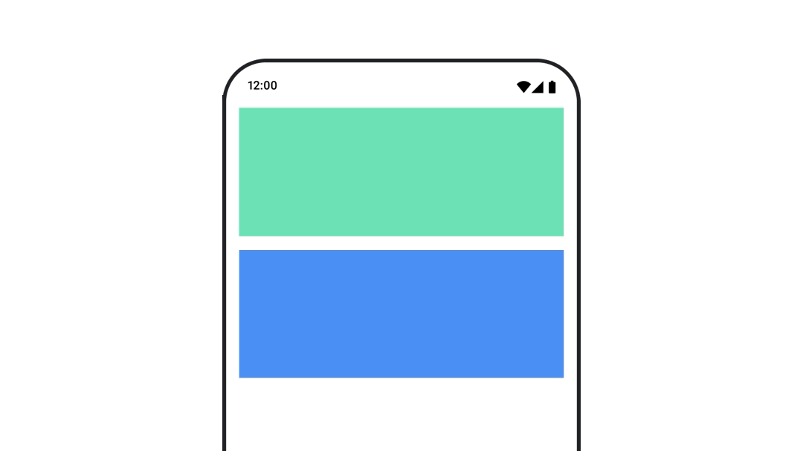
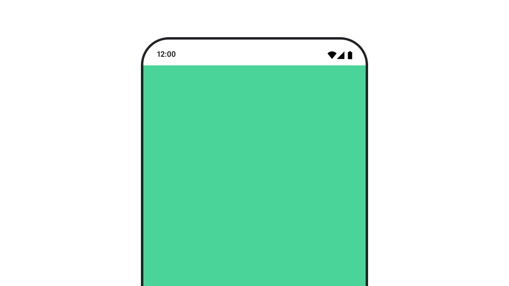
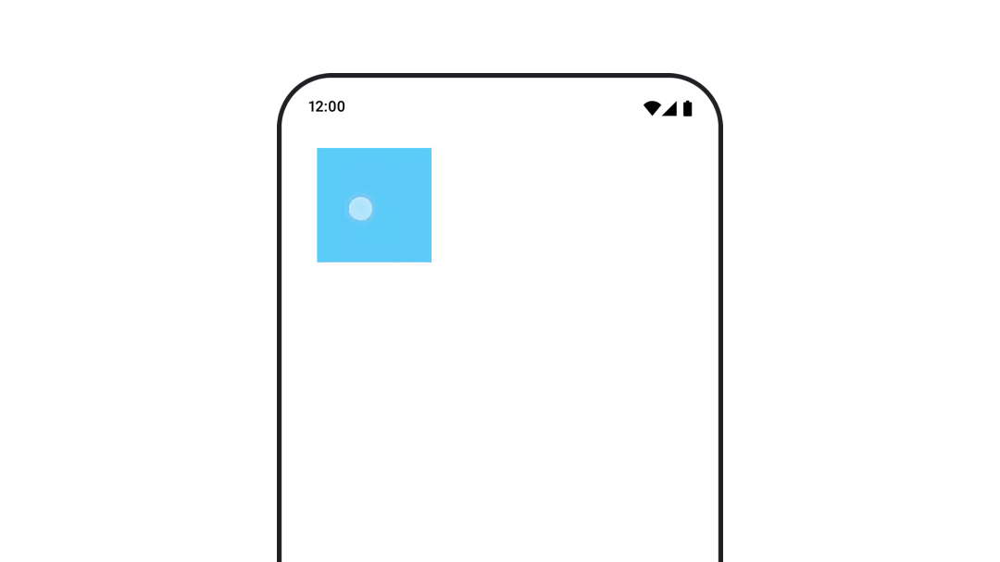
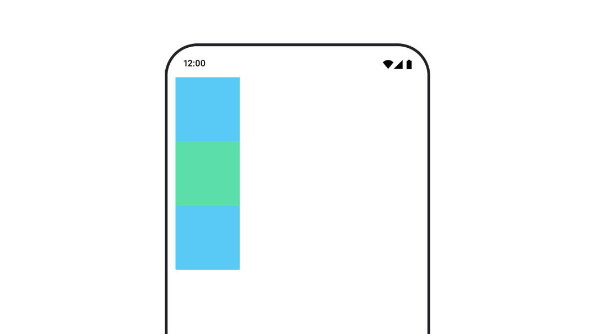
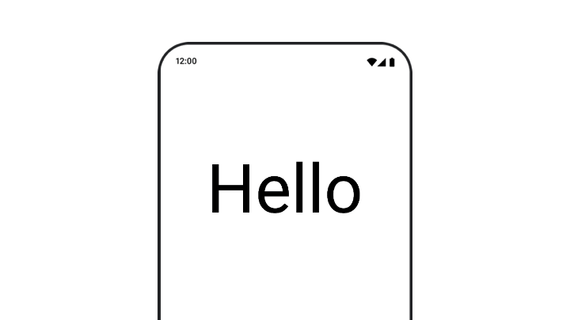
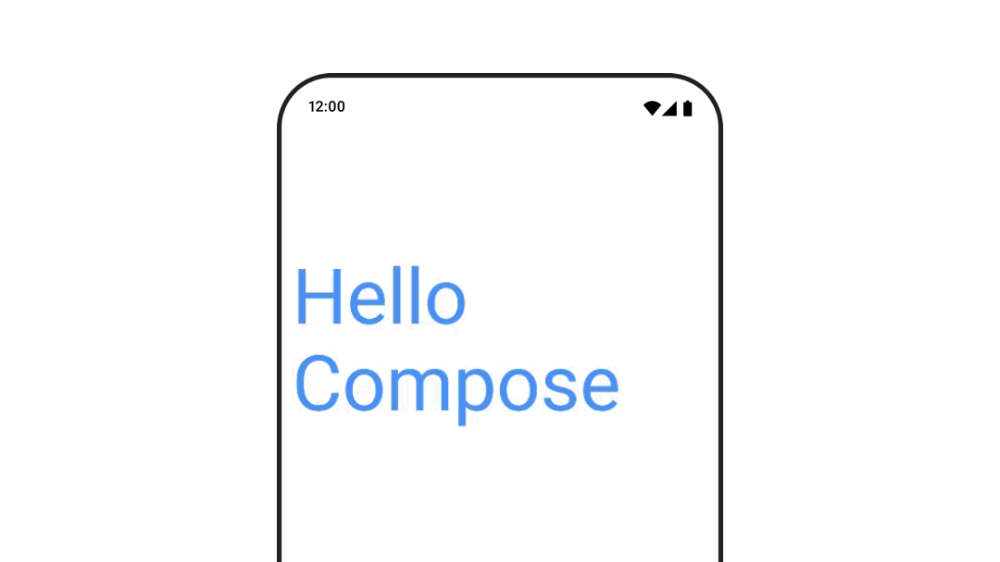
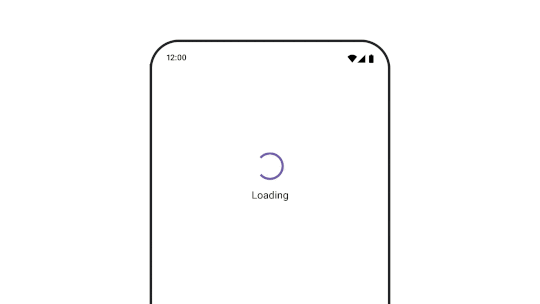
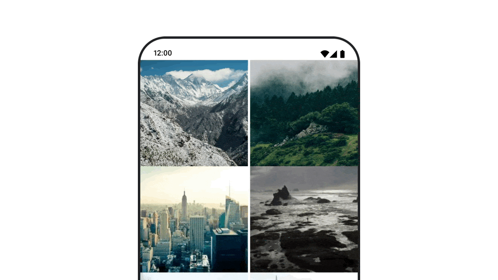
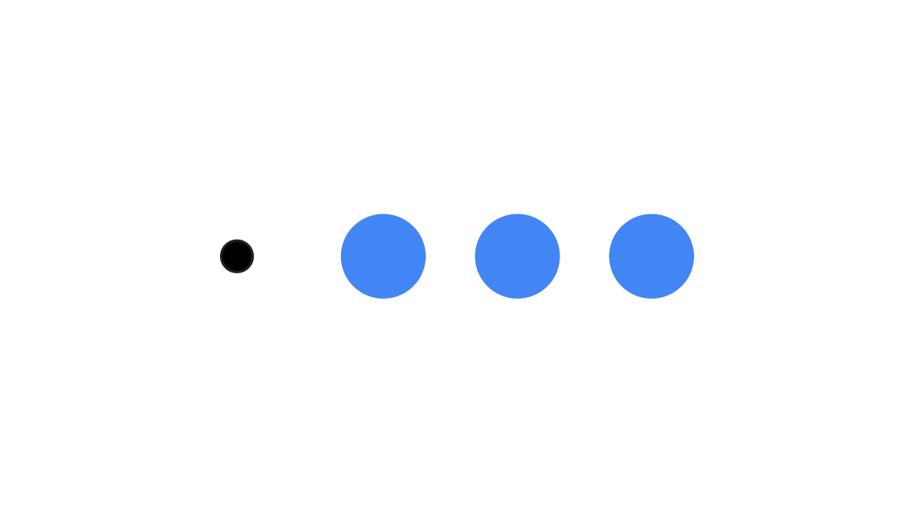
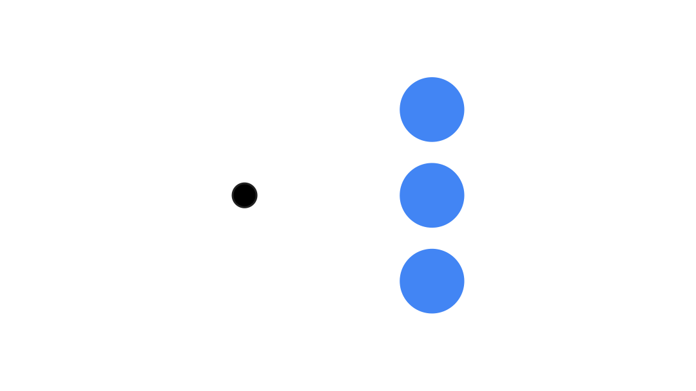

- [Compose のアニメーションに関するクイックガイド](#compose-のアニメーションに関するクイックガイド)
  - [一般的なコンポーザブルプロパティをアニメーション化する](#一般的なコンポーザブルプロパティをアニメーション化する)
    - [表示 / 非表示をアニメーション化する](#表示--非表示をアニメーション化する)
    - [背景色をアニメーション化する](#背景色をアニメーション化する)
    - [コンポーザブルのサイズをアニメーション化する](#コンポーザブルのサイズをアニメーション化する)
    - [コンポーザブルの位置をアニメーション化する](#コンポーザブルの位置をアニメーション化する)
    - [コンポーザブルのパディングをアニメーション化する](#コンポーザブルのパディングをアニメーション化する)
    - [コンポーザブルの昇格をアニメーション化する](#コンポーザブルの昇格をアニメーション化する)
    - [テキストの拡大縮小、変換、回転をアニメーション化する](#テキストの拡大縮小変換回転をアニメーション化する)
    - [テキストの色をアニメーション化する](#テキストの色をアニメーション化する)
  - [異なるタイプのコンテンツに切り替える](#異なるタイプのコンテンツに切り替える)
  - [さまざまなデスティネーションに移動しながらアニメーション化する](#さまざまなデスティネーションに移動しながらアニメーション化する)
  - [アニメーションを繰り返す](#アニメーションを繰り返す)
  - [コンポーザブルの起動時にアニメーションを開始する](#コンポーザブルの起動時にアニメーションを開始する)
  - [連続したアニメーションを作成する](#連続したアニメーションを作成する)
  - [同時実行アニメーションを作成する](#同時実行アニメーションを作成する)
  - [アニメーションのパフォーマンスを最適化する](#アニメーションのパフォーマンスを最適化する)
  - [アニメーションのタイミングを変更する](#アニメーションのタイミングを変更する)
  - [参考情報](#参考情報)


# Compose のアニメーションに関するクイックガイド

Compose には多くのアニメーション メカニズムが組み込まれており、どれを選択すればよいか判断するのは難しい場合があります。一般的なアニメーションのユースケースは次のとおりです。利用可能なさまざまな API オプションの詳細については、 [Compose Animation のドキュメント](https://developer.android.com/develop/ui/compose/animation/introduction?hl=ja&_gl=1*jlnu6n*_up*MQ..*_ga*MTQ1NzI0ODE0NC4xNzI2NzI4Nzk2*_ga_6HH9YJMN9M*MTcyNjk4ODY0OC41LjAuMTcyNjk4ODcxNy4wLjAuMTEzNzQ3MjYyMA..) をご覧ください。


## 一般的なコンポーザブルプロパティをアニメーション化する

Compose は、多くの一般的なアニメーションのユースケースを解決できる便利な API を提供します。このセクションでは、コンポーザブルの一般的なプロパティをアニメーション化する方法を説明します。


### 表示 / 非表示をアニメーション化する


[AnimatedVisibility](https://developer.android.com/develop/ui/compose/animation/composables-modifiers?_gl=1*tjfhtz*_up*MQ..*_ga*MTQ1NzI0ODE0NC4xNzI2NzI4Nzk2*_ga_6HH9YJMN9M*MTcyNjk4ODY0OC41LjAuMTcyNjk4ODY0OC4wLjAuMTEzNzQ3MjYyMA..#animatedvisibility) を使用して、Composable を非表示または表示します。AnimatedVisibility 内の子は、独自の開始または終了遷移に Modifier.animateEnterExit() を使用できます。

```kotlin
var visible by remember {
    mutableStateOf(true)
}

// アニメーションが終了すると、アイテムは最終的にコンポジションから削除されます。
AnimatedVisibility(visible) {
    // 任意のコンポーザブル
}
```

AnimatedVisibility の enter および exit パラメータを使用すると、コンポーザブルが表示されたり消えたりするときの動作を設定できます。詳細については、 [完全なドキュメント](https://developer.android.com/develop/ui/compose/animation/composables-modifiers?_gl=1*xee4xt*_up*MQ..*_ga*MTQ1NzI0ODE0NC4xNzI2NzI4Nzk2*_ga_6HH9YJMN9M*MTcyNjk4ODY0OC41LjAuMTcyNjk4ODY0OC4wLjAuMTEzNzQ3MjYyMA..#animatedvisibility) をお読みください。

コンポーザブルの可視性をアニメーション化するもう 1 つのオプションは、 [animateFloatAsState](https://developer.android.com/develop/ui/compose/animation/value-based?_gl=1*xee4xt*_up*MQ..*_ga*MTQ1NzI0ODE0NC4xNzI2NzI4Nzk2*_ga_6HH9YJMN9M*MTcyNjk4ODY0OC41LjAuMTcyNjk4ODY0OC4wLjAuMTEzNzQ3MjYyMA..#animate-as-state) を使用して時間の経過と共にアルファをアニメーション化することです。

animateFloatAsState は、単なる mutableFloatStateOf とは異なり、 1.0f から 0f までの変換を、一瞬で行うのではなく、スムーズに行ってくれる機能 ( AnimationSpec ) が付いていると思われます。

```kotlin
var visible by remember {
    mutableStateOf(true)
}
val animatedAlpha by animateFloatAsState(
    targetValue = if (visible) 1.0f else 0f,
    label = "alpha"
)
Box(
    modifier = Modifier
        .size(200.dp)
        .graphicsLayer {
            alpha = animatedAlpha
        }
        .clip(RoundedCornerShape(8.dp))
        .background(colorGreen)
        .align(Alignment.TopCenter)
) {
}
```

ただし、アルファを変更すると、コンポーザブルがコンポジション内に残り、配置されているスペースを占有し続けるという注意点があります。これにより、スクリーン リーダーやその他のアクセシビリティ メカニズムが、画面上のアイテムを引き続き考慮する可能性があります。一方、AnimatedVisibility は、最終的にアイテムをコンポジションから削除します。




### 背景色をアニメーション化する



```kotlin
val animatedColor by animateColorAsState(
    if (animateBackgroundColor) colorGreen else colorBlue,
    label = "color"
)
Column(
    modifier = Modifier.drawBehind {
        drawRect(animatedColor)
    }
) {
    // your composable here
}
```

このオプションは、Modifier.background() を使用するよりもパフォーマンスが優れています。Modifier.background() は、ワンショットの色設定には適していますが、時間の経過とともに色をアニメーション化する場合、必要以上に再合成が発生する可能性があります。

背景色を無限にアニメーション化するには、 [アニメーションの繰り返しに関するセクション](#アニメーションを繰り返す) を参照してください。


### コンポーザブルのサイズをアニメーション化する


Compose では、コンポーザブルのサイズをいくつかの方法でアニメーション化できます。コンポーザブルのサイズの変更間のアニメーションには、 [animateContentSize()](https://developer.android.com/reference/kotlin/androidx/compose/animation/package-summary?_gl=1*1oar4db*_up*MQ..*_ga*MTQ1NzI0ODE0NC4xNzI2NzI4Nzk2*_ga_6HH9YJMN9M*MTcyNjk4ODY0OC41LjAuMTcyNjk4ODY0OC4wLjAuMTEzNzQ3MjYyMA..#(androidx.compose.ui.Modifier).animateContentSize(androidx.compose.animation.core.FiniteAnimationSpec,kotlin.Function2)) を使用します。

たとえば、1 行から複数​​行に拡張できるテキストを含むボックスがある場合、Modifier.animateContentSize() を使用してよりスムーズな遷移を実現できます。

```kotlin
var expanded by remember { mutableStateOf(false) }
Box(
    modifier = Modifier
        .background(colorBlue)
        .animateContentSize()
        .height(if (expanded) 400.dp else 200.dp)
        .fillMaxWidth()
        .clickable(
            interactionSource = remember { MutableInteractionSource() },
            indication = null
        ) {
            expanded = !expanded
        }

) {

}
```

**注意: ここでは修飾子の順序が重要です。必ずサイズ修飾子の前に配置してください。**

[AnimatedContent](https://developer.android.com/develop/ui/compose/animation/composables-modifiers?_gl=1*19mp0b0*_up*MQ..*_ga*MTQ1NzI0ODE0NC4xNzI2NzI4Nzk2*_ga_6HH9YJMN9M*MTcyNjk4ODY0OC41LjAuMTcyNjk4ODY0OC4wLjAuMTEzNzQ3MjYyMA..#animatedcontent) を [SizeTransform](https://developer.android.com/reference/kotlin/androidx/compose/animation/package-summary?_gl=1*19mp0b0*_up*MQ..*_ga*MTQ1NzI0ODE0NC4xNzI2NzI4Nzk2*_ga_6HH9YJMN9M*MTcyNjk4ODY0OC41LjAuMTcyNjk4ODY0OC4wLjAuMTEzNzQ3MjYyMA..#SizeTransform(kotlin.Boolean,kotlin.Function2)) とともに使用して、サイズ変更がどのように行われるかを記述することもできます。


### コンポーザブルの位置をアニメーション化する



コンポーザブルの位置をアニメーション化するには、 `Modifier.offset{ }` と `animateIntOffsetAsState()` を組み合わせて使用​​します。

```kotlin
var moved by remember { mutableStateOf(false) }
val pxToMove = with(LocalDensity.current) {
    100.dp.toPx().roundToInt()
}
val offset by animateIntOffsetAsState(
    targetValue = if (moved) {
        IntOffset(pxToMove, pxToMove)
    } else {
        IntOffset.Zero
    },
    label = "offset"
)

Box(
    modifier = Modifier
        .offset {
            offset
        }
        .background(colorBlue)
        .size(100.dp)
        .clickable(
            interactionSource = remember { MutableInteractionSource() },
            indication = null
        ) {
            moved = !moved
        }
)
```

注意: これによって、親がコンポーザブルを配置する場所を認識することは変わりません。したがって、兄弟が配置される場所に影響はありません。この結果、兄弟が互いの上または下に描画される可能性があります。オフセットは、Modifier.offset{} の子レイアウトの位置にのみ影響します。

位置やサイズをアニメーション化するときにコンポーザブルが他のコンポーザブルの上または下に描画されないようにするには、Modifier.layout{} を使用します。この修飾子は、サイズと位置の変更を親に伝播し、それが他の子に影響します。

たとえば、列内でボックスを移動していて、ボックスの移動時に他の子も移動する必要がある場合は、次のように Modifier.layout{} でオフセット情報を含めます。

```kotlin
var toggled by remember {
    mutableStateOf(false)
}
val interactionSource = remember {
    MutableInteractionSource()
}
Column(
    modifier = Modifier
        .padding(16.dp)
        .fillMaxSize()
        .clickable(indication = null, interactionSource = interactionSource) {
            toggled = !toggled
        }
) {
    val offsetTarget = if (toggled) {
        IntOffset(150, 150)
    } else {
        IntOffset.Zero
    }
    val offset = animateIntOffsetAsState(
        targetValue = offsetTarget, label = "offset"
    )
    Box(
        modifier = Modifier
            .size(100.dp)
            .background(colorBlue)
    )
    Box(
        modifier = Modifier
            .layout { measurable, constraints ->
                // isLookingAhead については後述します。(※ 1 )
                val offsetValue = if (isLookingAhead) offsetTarget else offset.value
                val placeable = measurable.measure(constraints)
                layout(placeable.width + offsetValue.x, placeable.height + offsetValue.y) {
                    placeable.placeRelative(offsetValue)
                }
            }
            .size(100.dp)
            .background(colorGreen)
    )
    Box(
        modifier = Modifier
            .size(100.dp)
            .background(colorBlue)
    )
}
```



(※ 1 ) 通常、Compose のレイアウトは親から子に対して制約（コンストレイント）を伝え、子要素はその制約内で自分のサイズを決定しますが、時には「子要素がどれくらいのサイズを要求するか」だけを知りたい場合があります。例えば、IntrinsicWidth や IntrinsicHeight などを利用して、子要素の理想的な幅や高さを調べたいときです。 **`isLookingAhead == true` のとき、レイアウトエンジンはその時点での確定したサイズではなく、見積もりのためのサイズ計算をしていることを意味します。** これにより、レイアウトが見積もりと最終的な配置で異なる動作を取ることができ、より複雑なレイアウトロジックが可能になります。


### コンポーザブルのパディングをアニメーション化する


コンポーザブルのパディングをアニメーション化するには、animateDpAsState と Modifier.padding() を組み合わせて使用​​します。

```kotlin
var toggled by remember {
    mutableStateOf(false)
}
val animatedPadding by animateDpAsState(
    if (toggled) {
        0.dp
    } else {
        20.dp
    },
    label = "padding"
)
Box(
    modifier = Modifier
        .aspectRatio(1f)
        .fillMaxSize()
        .padding(animatedPadding)
        .background(Color(0xff53D9A1))
        .clickable(
            interactionSource = remember { MutableInteractionSource() },
            indication = null
        ) {
            toggled = !toggled
        }
)
```


### コンポーザブルの昇格をアニメーション化する

https://youtu.be/pirM2MPHcKQ

コンポーザブルの高度をアニメーション化するには、animateDpAsState を Modifier.graphicsLayer{ } と組み合わせて使用​​します。高度を一度だけ変更する場合は、Modifier.shadow() を使用します。影をアニメーション化する場合は、Modifier.graphicsLayer{ } 修飾子を使用する方がパフォーマンスが優れています。

```kotlin
val mutableInteractionSource = remember {
    MutableInteractionSource()
}
val pressed = mutableInteractionSource.collectIsPressedAsState()
val elevation = animateDpAsState(
    targetValue = if (pressed.value) {
        32.dp
    } else {
        8.dp
    },
    label = "elevation"
)
Box(
    modifier = Modifier
        .size(100.dp)
        .align(Alignment.Center)
        .graphicsLayer {
            this.shadowElevation = elevation.value.toPx()
        }
        .clickable(interactionSource = mutableInteractionSource, indication = null) {
        }
        .background(colorGreen)
) {
}
```

または、 [Card](https://developer.android.com/reference/kotlin/androidx/compose/material3/package-summary?_gl=1*9m1dqt*_up*MQ..*_ga*MTQ1NzI0ODE0NC4xNzI2NzI4Nzk2*_ga_6HH9YJMN9M*MTcyNjk4ODY0OC41LjAuMTcyNjk4ODY0OC4wLjAuMTEzNzQ3MjYyMA..#Card(androidx.compose.ui.Modifier,androidx.compose.ui.graphics.Shape,androidx.compose.material3.CardColors,androidx.compose.material3.CardElevation,androidx.compose.foundation.BorderStroke,kotlin.Function1)) コンポーザブルを使用して、elevation プロパティを状態ごとに異なる値に設定します。


### テキストの拡大縮小、変換、回転をアニメーション化する



テキストの拡大縮小、移動、または回転をアニメーション化する場合は、TextStyle の textMotion パラメータを [TextMotion.Animated](https://developer.android.com/reference/kotlin/androidx/compose/ui/text/style/TextMotion?_gl=1*1eo3pox*_up*MQ..*_ga*MTQ1NzI0ODE0NC4xNzI2NzI4Nzk2*_ga_6HH9YJMN9M*MTcyNjk4ODY0OC41LjAuMTcyNjk4ODY0OC4wLjAuMTEzNzQ3MjYyMA..) に設定します。これにより、テキスト アニメーション間の遷移がスムーズになります。テキストの移動、回転、または拡大縮小を行うには、 [Modifier.graphicsLayer{ }](https://developer.android.com/develop/ui/compose/graphics/draw/modifiers?_gl=1*1eo3pox*_up*MQ..*_ga*MTQ1NzI0ODE0NC4xNzI2NzI4Nzk2*_ga_6HH9YJMN9M*MTcyNjk4ODY0OC41LjAuMTcyNjk4ODY0OC4wLjAuMTEzNzQ3MjYyMA..#graphicsLayer) を使用します。

```kotlin
val infiniteTransition = rememberInfiniteTransition(label = "infinite transition")
val scale by infiniteTransition.animateFloat(
    initialValue = 1f,
    targetValue = 8f,
    animationSpec = infiniteRepeatable(tween(1000), RepeatMode.Reverse),
    label = "scale"
)
Box(modifier = Modifier.fillMaxSize()) {
    Text(
        text = "Hello",
        modifier = Modifier
            .graphicsLayer {
                scaleX = scale
                scaleY = scale
                transformOrigin = TransformOrigin.Center
            }
            .align(Alignment.Center),
        // Text composable does not take TextMotion as a parameter.
        // Provide it via style argument but make sure that we are copying from current theme
        // Text コンポーザブルは、 TextMotion をパラメータを持っていません。
        // そのため、スタイル引数の中で指定しますが、
        // このスタイルは、現在のテーマからコピーしていることに注意してください。
        style = LocalTextStyle.current.copy(textMotion = TextMotion.Animated)
    )
}
```


### テキストの色をアニメーション化する



テキストの色をアニメーション化するには、BasicText コンポーザブルの color ラムダを使用します。

```kotlin
val infiniteTransition = rememberInfiniteTransition(label = "infinite transition")
val animatedColor by infiniteTransition.animateColor(
    initialValue = Color(0xFF60DDAD),
    targetValue = Color(0xFF4285F4),
    animationSpec = infiniteRepeatable(tween(1000), RepeatMode.Reverse),
    label = "color"
)

BasicText(
    text = "Hello Compose",
    color = {
        animatedColor
    },
    // ...
)
```


## 異なるタイプのコンテンツに切り替える



異なるコンポーザブル間でアニメーション化するには [AnimatedContent](https://developer.android.com/reference/kotlin/androidx/compose/animation/package-summary?_gl=1*vp46wq*_up*MQ..*_ga*MTQ1NzI0ODE0NC4xNzI2NzI4Nzk2*_ga_6HH9YJMN9M*MTcyNjk4ODY0OC41LjAuMTcyNjk4ODY0OC4wLjAuMTEzNzQ3MjYyMA..#AnimatedContent(kotlin.Any,androidx.compose.ui.Modifier,kotlin.Function1,androidx.compose.ui.Alignment,kotlin.Function2)) を使用します。コンポーザブル間で標準的なフェードだけが必要な場合は、Crossfade を使用します。

```kotlin
var state by remember {
    mutableStateOf(UiState.Loading)
}
AnimatedContent(
    state,
    transitionSpec = {
        fadeIn(
            animationSpec = tween(3000)
        ) togetherWith fadeOut(animationSpec = tween(3000))
    },
    modifier = Modifier.clickable(
        interactionSource = remember { MutableInteractionSource() },
        indication = null
    ) {
        state = when (state) {
            UiState.Loading -> UiState.Loaded
            UiState.Loaded -> UiState.Error
            UiState.Error -> UiState.Loading
        }
    },
    label = "Animated Content"
) { targetState ->
    when (targetState) {
        UiState.Loading -> {
            LoadingScreen()
        }
        UiState.Loaded -> {
            LoadedScreen()
        }
        UiState.Error -> {
            ErrorScreen()
        }
    }
}
```

AnimatedContent は、さまざまな種類の開始および終了のトランジションを表示するようにカスタマイズできます。詳細については、 [AnimatedContent のドキュメント](https://developer.android.com/develop/ui/compose/animation/composables-modifiers?_gl=1*iojpr0*_up*MQ..*_ga*MTQ1NzI0ODE0NC4xNzI2NzI4Nzk2*_ga_6HH9YJMN9M*MTcyNzAxMDUyNS42LjAuMTcyNzAxMTEwOC4wLjAuMjExOTE4MjU4OQ..#animatedcontent) を読むか、 [AnimatedContent に関するこのブログ投稿](https://medium.com/androiddevelopers/customizing-animatedcontent-in-jetpack-compose-629c67b45894) をお読みください。


## さまざまなデスティネーションに移動しながらアニメーション化する



[navigation-compose](https://developer.android.com/jetpack/androidx/releases/navigation?_gl=1*8t5l9d*_up*MQ..*_ga*MTQ1NzI0ODE0NC4xNzI2NzI4Nzk2*_ga_6HH9YJMN9M*MTcyNzA1ODYzMS43LjAuMTcyNzA1ODYzMS4wLjAuNDcwOTk5NDY.) アーティファクトを使用するときにコンポーザブル間の遷移をアニメーション化するには、コンポーザブルで enterTransition と exitTransition を指定します。また、トップレベルの NavHost ですべてのデスティネーションに使用するデフォルトのアニメーションを設定することもできます。

```kotlin
val navController = rememberNavController()
NavHost(
    navController = navController, startDestination = "landing",
    enterTransition = { EnterTransition.None },
    exitTransition = { ExitTransition.None }
) {
    composable("landing") {
        ScreenLanding(
            // ...
        )
    }
    composable(
        "detail/{photoUrl}",
        arguments = listOf(navArgument("photoUrl") { type = NavType.StringType }),
        enterTransition = {
            fadeIn(
                animationSpec = tween(
                    300, easing = LinearEasing
                )
            ) + slideIntoContainer(
                animationSpec = tween(300, easing = EaseIn),
                towards = AnimatedContentTransitionScope.SlideDirection.Start
            )
        },
        exitTransition = {
            fadeOut(
                animationSpec = tween(
                    300, easing = LinearEasing
                )
            ) + slideOutOfContainer(
                animationSpec = tween(300, easing = EaseOut),
                towards = AnimatedContentTransitionScope.SlideDirection.End
            )
        }
    ) { backStackEntry ->
        ScreenDetails(
            // ...
        )
    }
}
```

入力コンテンツと出力コンテンツに異なる効果を適用する、さまざまな種類の Enter および Exit トランジションがあります。詳細については、 [ドキュメント](https://developer.android.com/develop/ui/compose/animation/composables-modifiers?_gl=1*arhof3*_up*MQ..*_ga*MTQ1NzI0ODE0NC4xNzI2NzI4Nzk2*_ga_6HH9YJMN9M*MTcyNzA1ODYzMS43LjAuMTcyNzA1ODYzMS4wLjAuNDcwOTk5NDY.#enter-exit-transition) を参照してください。

注: Enter および Exit トランジションは、navigation-compose [2.7.0-alpha01](https://developer.android.com/jetpack/androidx/releases/navigation?_gl=1*arhof3*_up*MQ..*_ga*MTQ1NzI0ODE0NC4xNzI2NzI4Nzk2*_ga_6HH9YJMN9M*MTcyNzA1ODYzMS43LjAuMTcyNzA1ODYzMS4wLjAuNDcwOTk5NDY.#2.7.0-alpha01) 以降でのみ使用できます。


## アニメーションを繰り返す


アニメーションを継続的に繰り返すには、infiniteRepeatable や animationSpec とともに [rememberInfiniteTransition](https://developer.android.com/reference/kotlin/androidx/compose/animation/core/InfiniteTransition?_gl=1*y0vnbv*_up*MQ..*_ga*MTQ1NzI0ODE0NC4xNzI2NzI4Nzk2*_ga_6HH9YJMN9M*MTcyNzA1ODYzMS43LjAuMTcyNzA1ODYzMS4wLjAuNDcwOTk5NDY.) を使用します。RepeatModes を変更して、アニメーションを繰り返す方法を指定します。

finiteRepeatable を使用して、設定した回数を繰り返します。

```kotlin
val infiniteTransition = rememberInfiniteTransition(label = "infinite")
val color by infiniteTransition.animateColor(
    initialValue = Color.Green,
    targetValue = Color.Blue,
    animationSpec = infiniteRepeatable(
        animation = tween(1000, easing = LinearEasing),
        repeatMode = RepeatMode.Reverse
    ),
    label = "color"
)
Column(
    modifier = Modifier.drawBehind {
        drawRect(color)
    }
) {
    // your composable here
}
```


## コンポーザブルの起動時にアニメーションを開始する

[LaunchedEffect](https://developer.android.com/develop/ui/compose/side-effects?_gl=1*1pkiatm*_up*MQ..*_ga*MTQ1NzI0ODE0NC4xNzI2NzI4Nzk2*_ga_6HH9YJMN9M*MTcyNzA1ODYzMS43LjAuMTcyNzA1ODYzMS4wLjAuNDcwOTk5NDY.#launchedeffect) は、コンポーザブルがコンポジションに入るときに実行されます。コンポーザブルの起動時にアニメーションを開始するので、これを使用してアニメーションの状態変更を制御できます。起動時にアニメーションを開始するには、animateTo メソッドで Animatable を使用します。

```kotlin
val alphaAnimation = remember {
    Animatable(0f)
}
LaunchedEffect(Unit) {
    alphaAnimation.animateTo(1f)
}
Box(
    modifier = Modifier.graphicsLayer {
        alpha = alphaAnimation.value
    }
)
```

注意: Lazy レイアウト内で LaunchedEffects を使用する場合は注意してください。アイテムがコンポジションに再び入ると、LaunchedEffects は再起動します。たとえば、リストを画面外にスクロールして画面に戻ったときに、これが発生する可能性があります。代わりに、Lazy レイアウトの外側で状態をホイストして、コンポジションのスクロールインとスクロールアウトごとにアニメーションが発生しないようにします。


## 連続したアニメーションを作成する



Animatable コルーチン API を使用して、順次または同時アニメーションを実行します。Animatable で animateTo を 1 つずつ呼び出すと、各アニメーションは前のアニメーションが終了するまで待機してから続行されます。これは、一時停止関数であるためです。

```kotlin
val alphaAnimation = remember { Animatable(0f) }
val yAnimation = remember { Animatable(0f) }

LaunchedEffect("animationKey") {
    alphaAnimation.animateTo(1f)
    yAnimation.animateTo(100f)
    yAnimation.animateTo(500f, animationSpec = tween(100))
}
```

## 同時実行アニメーションを作成する



同時アニメーションを実現するには、コルーチン API ( [Animatable#animateTo()](https://developer.android.com/reference/kotlin/androidx/compose/animation/core/Animatable?_gl=1*1b4c11v*_up*MQ..*_ga*MTQ1NzI0ODE0NC4xNzI2NzI4Nzk2*_ga_6HH9YJMN9M*MTcyNzA1ODYzMS43LjAuMTcyNzA1ODYzMS4wLjAuNDcwOTk5NDY.#animateTo(kotlin.Any,androidx.compose.animation.core.AnimationSpec,kotlin.Any,kotlin.Function1)) または [animate](https://developer.android.com/reference/kotlin/androidx/compose/animation/core/package-summary?_gl=1*1b4c11v*_up*MQ..*_ga*MTQ1NzI0ODE0NC4xNzI2NzI4Nzk2*_ga_6HH9YJMN9M*MTcyNzA1ODYzMS43LjAuMTcyNzA1ODYzMS4wLjAuNDcwOTk5NDY.#animate(kotlin.Float,kotlin.Float,kotlin.Float,androidx.compose.animation.core.AnimationSpec,kotlin.Function2))()) ) 、または [Transition](https://developer.android.com/reference/kotlin/androidx/compose/animation/core/Transition?_gl=1*146v7u5*_up*MQ..*_ga*MTQ1NzI0ODE0NC4xNzI2NzI4Nzk2*_ga_6HH9YJMN9M*MTcyNzA1ODYzMS43LjAuMTcyNzA1ODYzMS4wLjAuNDcwOTk5NDY.) API を使用します。コルーチン コンテキストで複数の launch 関数を使用すると、アニメーションが同時に起動されます。

```kotlin
val alphaAnimation = remember { Animatable(0f) }
val yAnimation = remember { Animatable(0f) }

LaunchedEffect("animationKey") {
    launch {
        alphaAnimation.animateTo(1f)
    }
    launch {
        yAnimation.animateTo(100f)
    }
}
```

[updateTransition](https://developer.android.com/reference/kotlin/androidx/compose/animation/core/package-summary?_gl=1*g392nt*_up*MQ..*_ga*MTQ1NzI0ODE0NC4xNzI2NzI4Nzk2*_ga_6HH9YJMN9M*MTcyNzA1ODYzMS43LjAuMTcyNzA1ODYzMS4wLjAuNDcwOTk5NDY.#updateTransition(kotlin.Any,kotlin.String)) API を使用すると、同じ状態を使用して、同時にさまざまなプロパティ アニメーションを駆動できます。次の例では、状態の変更によって制御される 2 つのプロパティ ( rect と borderWidth ) をアニメーション化します。

```kotlin
var currentState by remember { mutableStateOf(BoxState.Collapsed) }
val transition = updateTransition(currentState, label = "transition")

val rect by transition.animateRect(label = "rect") { state ->
    when (state) {
        BoxState.Collapsed -> Rect(0f, 0f, 100f, 100f)
        BoxState.Expanded -> Rect(100f, 100f, 300f, 300f)
    }
}
val borderWidth by transition.animateDp(label = "borderWidth") { state ->
    when (state) {
        BoxState.Collapsed -> 1.dp
        BoxState.Expanded -> 0.dp
    }
}
```


## アニメーションのパフォーマンスを最適化する

Compose のアニメーションはパフォーマンスの問題を引き起こす可能性があります。これはアニメーションの性質によるもので、フレームごとに画面上のピクセルをすばやく移動または変更して、動いているように見せます。

Compose のさまざまなフェーズ (構成、レイアウト、描画) について考えてみましょう。アニメーションがレイアウト フェーズを変更する場合、影響を受けるすべてのコンポーザブルを再レイアウトして再描画する必要があります。アニメーションが描画フェーズで発生する場合、全体的に作業が少なくなるため、レイアウト フェーズでアニメーションを実行する場合よりもデフォルトでパフォーマンスが向上します。

**アニメーション中にアプリが行う処理をできるだけ少なくするには、可能な場合は Modifier のラムダ バージョンを選択します。** これにより再構成がスキップされ、アニメーションが構成フェーズの外で実行されます。それ以外の場合は、 [Modifier.graphicsLayer{ }](https://developer.android.com/develop/ui/compose/graphics/draw/modifiers?_gl=1*18phxzm*_up*MQ..*_ga*MTQ1NzI0ODE0NC4xNzI2NzI4Nzk2*_ga_6HH9YJMN9M*MTcyNzA1ODYzMS43LjAuMTcyNzA1ODYzMS4wLjAuNDcwOTk5NDY.) を使用します。この修飾子は常に描画フェーズで実行されるためです。詳細については、パフォーマンス ドキュメントの [遅延読み取りセクション](https://developer.android.com/develop/ui/compose/performance/bestpractices?_gl=1*18phxzm*_up*MQ..*_ga*MTQ1NzI0ODE0NC4xNzI2NzI4Nzk2*_ga_6HH9YJMN9M*MTcyNzA1ODYzMS43LjAuMTcyNzA1ODYzMS4wLjAuNDcwOTk5NDY.#defer-reads) を参照してください。

Jetpack Compose では、Modifier にラムダ式を使ってアニメーションを実装することで、効率的な再コンポーズを実現できます。特に、animate*AsState 系の関数を使うことで、値の変化をスムーズにアニメーションさせられます。

以下は、Modifier にラムダ式を使った簡単なアニメーションの実装例です。この例では、ボタンをクリックすると、ボックスの大きさがアニメーションで変化します。

```kotlin
import androidx.compose.animation.core.animateDpAsState
import androidx.compose.foundation.background
import androidx.compose.foundation.layout.*
import androidx.compose.foundation.shape.RoundedCornerShape
import androidx.compose.material3.Button
import androidx.compose.material3.Text
import androidx.compose.runtime.*
import androidx.compose.ui.Modifier
import androidx.compose.ui.graphics.Color
import androidx.compose.ui.unit.dp
import androidx.compose.ui.tooling.preview.Preview

@Composable
fun AnimatedBox() {
    var isExpanded by remember { mutableStateOf(false) }

    // アニメーションで変更する値（Boxの大きさ）
    val boxSize by animateDpAsState(targetValue = if (isExpanded) 200.dp else 100.dp)

    Column(
        modifier = Modifier
            .fillMaxSize()
            .padding(16.dp),
        verticalArrangement = Arrangement.Center,
        horizontalAlignment = Alignment.CenterHorizontally
    ) {
        Box(
            modifier = Modifier
                .size(boxSize)
                .background(Color.Blue, RoundedCornerShape(10.dp))
        )

        Spacer(modifier = Modifier.height(20.dp))

        Button(onClick = { isExpanded = !isExpanded }) {
            Text("Toggle Size")
        }
    }
}
```

- animateDpAsState を使って、Dp のサイズをスムーズにアニメーション化しています。
- Modifier.size にラムダ式で渡したアニメーションされた値を適用しています。
- この実装は、変更が必要な部分だけが再コンポーズされるため、効率的です。

このように、Modifier の中でラムダ式を使ってアニメーションや状態の変更を直接反映することで、パフォーマンスの向上が期待できます。


## アニメーションのタイミングを変更する

Compose は、デフォルトでほとんどのアニメーションに **スプリング** アニメーションを使用します。スプリング、つまり物理ベースのアニメーションは、より自然な感じがします。また、固定時間ではなくオブジェクトの現在の速度を考慮するため、中断も可能です。デフォルトをオーバーライドする場合、上で説明したすべてのアニメーション API には、アニメーションの実行方法をカスタマイズするための animationSpec を設定する機能があり、特定の期間にわたって実行するか、より弾力性を持たせるかを選択できます。

以下は、さまざまな animationSpec オプションの概要です。

- [spring](https://developer.android.com/develop/ui/compose/animation/customize?_gl=1*hkgbz3*_up*MQ..*_ga*MTQ1NzI0ODE0NC4xNzI2NzI4Nzk2*_ga_6HH9YJMN9M*MTcyNzA1ODYzMS43LjAuMTcyNzA1ODYzMS4wLjAuNDcwOTk5NDY.#spring): 物理ベースのアニメーション。すべてのアニメーションのデフォルトです。stiffness または dumpingRatio を変更して、異なるアニメーションの外観と感触を実現できます。

- [tween](https://developer.android.com/develop/ui/compose/animation/customize?_gl=1*hkgbz3*_up*MQ..*_ga*MTQ1NzI0ODE0NC4xNzI2NzI4Nzk2*_ga_6HH9YJMN9M*MTcyNzA1ODYzMS43LjAuMTcyNzA1ODYzMS4wLjAuNDcwOTk5NDY.#tween) (between の略): 期間ベースのアニメーション。Easing 関数を使用して 2 つの値の間をアニメーション化します。

- [keyframes](https://developer.android.com/develop/ui/compose/animation/customize?_gl=1*hkgbz3*_up*MQ..*_ga*MTQ1NzI0ODE0NC4xNzI2NzI4Nzk2*_ga_6HH9YJMN9M*MTcyNzA1ODYzMS43LjAuMTcyNzA1ODYzMS4wLjAuNDcwOTk5NDY.#keyframes): アニメーションの特定のキー ポイントで値を指定するための仕様。

- [repeatable](https://developer.android.com/develop/ui/compose/animation/customize?_gl=1*hkgbz3*_up*MQ..*_ga*MTQ1NzI0ODE0NC4xNzI2NzI4Nzk2*_ga_6HH9YJMN9M*MTcyNzA1ODYzMS43LjAuMTcyNzA1ODYzMS4wLjAuNDcwOTk5NDY.#repeatable): RepeatMode で指定された特定の回数実行される期間ベースの仕様。

- [infiniteRepeatable](https://developer.android.com/develop/ui/compose/animation/customize?_gl=1*hkgbz3*_up*MQ..*_ga*MTQ1NzI0ODE0NC4xNzI2NzI4Nzk2*_ga_6HH9YJMN9M*MTcyNzA1ODYzMS43LjAuMTcyNzA1ODYzMS4wLjAuNDcwOTk5NDY.#infiniterepeatable): 永久に実行される期間ベースの仕様。

- [snap](https://developer.android.com/develop/ui/compose/animation/customize?_gl=1*hkgbz3*_up*MQ..*_ga*MTQ1NzI0ODE0NC4xNzI2NzI4Nzk2*_ga_6HH9YJMN9M*MTcyNzA1ODYzMS43LjAuMTcyNzA1ODYzMS4wLjAuNDcwOTk5NDY.#snap): アニメーションなしで終了値に瞬時にスナップします。

以下は animationSpec に何も指定しなかった場合 (左) と、カスタム animationSpec を設定した場合 (右) の例です。


[animationSpecs](https://developer.android.com/develop/ui/compose/animation/customize?_gl=1*1jve2ki*_up*MQ..*_ga*MTQ1NzI0ODE0NC4xNzI2NzI4Nzk2*_ga_6HH9YJMN9M*MTcyNzA1ODYzMS43LjAuMTcyNzA1ODYzMS4wLjAuNDcwOTk5NDY.#animationspec) の詳細については、完全なドキュメントをお読みください。


## 参考情報

Compose の楽しいアニメーションの例をもっと知りたい場合は、以下をご覧ください:

- [Compose の 5 つの簡単なアニメーション](https://www.youtube.com/watch?v=0mfCbXrYBPE&t=2s&ab_channel=AndroidDevelopers)
- [Compose でクラゲを動かす](https://medium.com/androiddevelopers/making-jellyfish-move-in-compose-animating-imagevectors-and-applying-agsl-rendereffects-3666596a8888)
- [Compose で AnimatedContent をカスタマイズする](https://medium.com/androiddevelopers/customizing-animatedcontent-in-jetpack-compose-629c67b45894)
- [Compose の Easing 関数を徐々に導入する](https://medium.com/androiddevelopers/easing-in-to-easing-curves-in-jetpack-compose-d72893eeeb4d)

