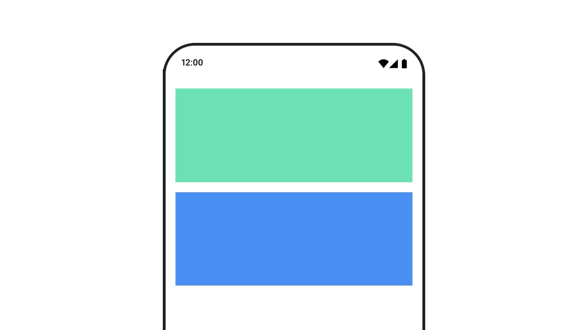

- [アニメーションの修飾子とコンポーザブル](#アニメーションの修飾子とコンポーザブル)
  - [組み込みのアニメーションコンポーザブル](#組み込みのアニメーションコンポーザブル)
    - [AnimatedVisibility で出現と消失をアニメーション化する](#animatedvisibility-で出現と消失をアニメーション化する)
      - [EnterTransition と ExitTransition の例](#entertransition-と-exittransition-の例)
      - [AnimatedVisibility 内の子の開始と終了をアニメーション化する](#animatedvisibility-内の子の開始と終了をアニメーション化する)
      - [AnimatedVisibility 内のアニメーションにカスタムアニメーションを追加する](#animatedvisibility-内のアニメーションにカスタムアニメーションを追加する)
    - [AnimatedContent を使用して、ターゲットの状態に基づいてアニメーション化する](#animatedcontent-を使用してターゲットの状態に基づいてアニメーション化する)
      - [AnimatedContent 内の子の開始と終了をアニメーション化する](#animatedcontent-内の子の開始と終了をアニメーション化する)
      - [AnimatedContent 内のアニメーションにカスタムアニメーションを追加する](#animatedcontent-内のアニメーションにカスタムアニメーションを追加する)
    - [Crossfade を使用して 2 つのレイアウト間をアニメーション化する](#crossfade-を使用して-2-つのレイアウト間をアニメーション化する)
  - [組み込みのアニメーション修飾子](#組み込みのアニメーション修飾子)
    - [animateContentSize でコンポーザブルのサイズ変更をアニメーション化する](#animatecontentsize-でコンポーザブルのサイズ変更をアニメーション化する)
  - [リストアイテムのアニメーション](#リストアイテムのアニメーション)


# アニメーションの修飾子とコンポーザブル

Compose には、一般的なアニメーションのユースケースに対応するための組み込みのコンポーザブルと修飾子が用意されています。


## 組み込みのアニメーションコンポーザブル

### AnimatedVisibility で出現と消失をアニメーション化する



[AnimatedVisibility](https://developer.android.com/reference/kotlin/androidx/compose/animation/package-summary?hl=ja&_gl=1*1xo3ium*_up*MQ..*_ga*OTQxMjc1NjExLjE3MjcwMTEwOTk.*_ga_6HH9YJMN9M*MTcyNzAxMTA5OC4xLjAuMTcyNzAxMTA5OS4wLjAuNTgwNTQzODM5#AnimatedVisibility(kotlin.Boolean,androidx.compose.ui.Modifier,androidx.compose.animation.EnterTransition,androidx.compose.animation.ExitTransition,kotlin.Function1)) コンポーザブルは、コンテンツの表示と非表示をアニメーション化します。

```kotlin
var visible by remember {
    mutableStateOf(true)
}
// Animated visibility will eventually remove the item from the composition once the animation has finished.
AnimatedVisibility(visible) {
    // 表示・非表示を切り替えたいコンポーザブル
}
```

デフォルトでは、コンテンツの表示にはフェードインと拡大が使われ、非表示にはフェードアウトと縮小が使われます。この遷移は、EnterTransition と ExitTransition を指定することでカスタマイズできます。

```kotlin
var visible by remember { mutableStateOf(true) }
val density = LocalDensity.current
AnimatedVisibility(
    visible = visible,
    enter = slideInVertically {
        // 上から 40 dp の位置からスライドインします。
        with(density) { -40.dp.roundToPx() }
    } + expandVertically(
        // 上から展開します。
        expandFrom = Alignment.Top
    ) + fadeIn(
        // 初期アルファ 0.3f でフェードインします。
        initialAlpha = 0.3f
    ),
    exit = slideOutVertically() + shrinkVertically() + fadeOut()
) {
    Text("Hello", Modifier.fillMaxWidth().height(200.dp))
}
```

上記の例に示すように、複数の EnterTransition オブジェクトまたは ExitTransition オブジェクトを + 演算子で結合できます。各オブジェクトは、動作をカスタマイズするためのオプション パラメータを受け入れます。詳細については、それぞれのリファレンスをご覧ください。


#### EnterTransition と ExitTransition の例

実際に動く動画が [公式サイト](https://developer.android.com/develop/ui/compose/animation/composables-modifiers?hl=ja&_gl=1*8pfila*_up*MQ..*_ga*OTQxMjc1NjExLjE3MjcwMTEwOTk.*_ga_6HH9YJMN9M*MTcyNzAxMTA5OC4xLjAuMTcyNzAxMTA5OS4wLjAuNTgwNTQzODM5#enter-exit-transition) にあるので、そちらを参照してください。

```kotlin
val state = remember {
    MutableTransitionState(false).apply {
        // state が参照されたら即座にアニメーションを開始します。
        targetState = true
    }
}
Column {
    AnimatedVisibility(visibleState = state) {
        Text(text = "Hello, world!")
    }


    // AnimatedVisibility の現在の状態を知るために、
    // MutableTransitionState を使用します。
    Text(
        text = when {
            state.isIdle && state.currentState -> "Visible"
            !state.isIdle && state.currentState -> "Disappearing"
            state.isIdle && !state.currentState -> "Invisible"
            else -> "Appearing"
        }
    )
}
```


#### AnimatedVisibility 内の子の開始と終了をアニメーション化する

AnimatedVisibility 内のコンテンツ（直接または間接の子）は、 [animateEnterExit](https://developer.android.com/reference/kotlin/androidx/compose/animation/AnimatedVisibilityScope?hl=ja&_gl=1*ouw3c8*_up*MQ..*_ga*OTQxMjc1NjExLjE3MjcwMTEwOTk.*_ga_6HH9YJMN9M*MTcyNzAxMTA5OC4xLjAuMTcyNzAxMTA5OS4wLjAuNTgwNTQzODM5#(androidx.compose.ui.Modifier).animateEnterExit(androidx.compose.animation.EnterTransition,androidx.compose.animation.ExitTransition,kotlin.String)) 修飾子を使用して、それぞれに異なるアニメーションの動作を指定できます。子それぞれの視覚効果は、AnimatedVisibility コンポーザブルで指定されたアニメーションと、子自身の開始アニメーションと終了アニメーションの組み合わせです。

```kotlin
var visible by remember { mutableStateOf(true) }

AnimatedVisibility(
    visible = visible,
    enter = fadeIn(),
    exit = fadeOut()
) {
    // Fade in/out は、外側の Box にも内側の Box にも適用されます。
    Box(Modifier.fillMaxSize().background(Color.DarkGray)) {
        Box(
            Modifier
                .align(Alignment.Center)
                .animateEnterExit(
                    // Slide in/out は、内側の Box にのみ適用されます。
                    enter = slideInVertically(),
                    exit = slideOutVertically()
                )
                .sizeIn(minWidth = 256.dp, minHeight = 64.dp)
                .background(Color.Red)
        ) {
            // コンポーザブルのコンテンツ
        }
    }
}
```

場合によっては、親の Box には全くアニメーションを適用しなくないけれど、子の Box にはアニメーションを設定したい場合があります。そのような場合は、 AnimatedVisibility コンポーザブルのパラメータに EnterTransition.None と ExitTransition.None を指定し、子の Box の Modifier.animateEnterExit() に個別のアニメーションを設定します。


#### AnimatedVisibility 内のアニメーションにカスタムアニメーションを追加する

組み込みの開始アニメーションと終了アニメーション以外のカスタム アニメーション効果を追加する場合は、AnimatedVisibility のコンテンツ ラムダ内の transition プロパティを使用して、元となる Transition インスタンスにアクセスします。

Transition インスタンスに追加されたアニメーションの状態は、AnimatedVisibility の開始アニメーションと終了アニメーションと同時に実行されます。

AnimatedVisibility は、Transition 内のすべてのアニメーションが終了するまで待ってから、コンテンツを削除します。

( animate*AsState を使用するなどして) Transition とは独立して作成された終了アニメーションについては、 AnimatedVisibility では考慮できないため、終了前にコンテンツ コンポーザブルを削除する場合があります。

```kotlin
var visible by remember { mutableStateOf(true) }

AnimatedVisibility(
    visible = visible,
    enter = fadeIn(),
    exit = fadeOut()
) { // this: AnimatedVisibilityScope
    //
    // このスコープの transition にアニメーションを追加すると
    // AnimatedVisibility に既に適用されているアニメーションに加え、
    // 追加したアニメーションも同時に実行されます。
    val background by transition.animateColor(label = "color") { state ->
        if (state == EnterExitState.Visible) Color.Blue else Color.Gray
    }
    Box(modifier = Modifier.size(128.dp).background(background))
}
```

Transition の詳細については、 [updateTransition](https://developer.android.com/develop/ui/compose/animation/value-based?hl=ja&_gl=1*uqe5td*_up*MQ..*_ga*OTQxMjc1NjExLjE3MjcwMTEwOTk.*_ga_6HH9YJMN9M*MTcyNzAxMTA5OC4xLjAuMTcyNzAxMTA5OS4wLjAuNTgwNTQzODM5#updatetransition) をご覧ください。


### AnimatedContent を使用して、ターゲットの状態に基づいてアニメーション化する

AnimatedContent コンポーザブルは、ターゲット状態に基づいてコンテンツが変化するのに応じて、コンテンツをアニメーション化します。

```kotlin
Row {
    var count by remember { mutableStateOf(0) }
    Button(onClick = { count++ }) {
        Text("Add")
    }
    AnimatedContent(targetState = count) { targetCount ->
        // 必ず、 count ではなく、 targetCount を使用してください。
        Text(text = "Count: $targetCount")
    }
}
```

必ずラムダ パラメータを使用し、それをコンテンツに反映する必要があります。API はこの値をキーとして使用して、現在表示されているコンテンツを識別します。

デフォルトでは、初期コンテンツがフェードアウトしてから、ターゲット コンテンツがフェードインします（この動作は [フェードスルー](https://material.io/design/motion/the-motion-system.html#fade-through) と呼ばれています）。

このアニメーションの動作をカスタマイズするには、transitionSpec パラメータに [ContentTransform](https://developer.android.com/reference/kotlin/androidx/compose/animation/ContentTransform?hl=ja&_gl=1*1firdw9*_up*MQ..*_ga*OTQxMjc1NjExLjE3MjcwMTEwOTk.*_ga_6HH9YJMN9M*MTcyNzAxMTA5OC4xLjAuMTcyNzAxMTA5OS4wLjAuNTgwNTQzODM5) オブジェクトを指定します。ContentTransform を作成するには、 ~~with~~ togetherWith 中置関数を使用して [EnterTransition](https://developer.android.com/reference/kotlin/androidx/compose/animation/EnterTransition?hl=ja&_gl=1*1o8oomi*_up*MQ..*_ga*OTQxMjc1NjExLjE3MjcwMTEwOTk.*_ga_6HH9YJMN9M*MTcyNzAxMTA5OC4xLjAuMTcyNzAxMTA5OS4wLjAuNTgwNTQzODM5) と [ExitTransition](https://developer.android.com/reference/kotlin/androidx/compose/animation/ExitTransition?hl=ja&_gl=1*1o8oomi*_up*MQ..*_ga*OTQxMjc1NjExLjE3MjcwMTEwOTk.*_ga_6HH9YJMN9M*MTcyNzAxMTA5OC4xLjAuMTcyNzAxMTA5OS4wLjAuNTgwNTQzODM5) を組み合わせます。 ( with 関数は非推奨になったため、代わりに togetherWith を使用してください。)

[SizeTransform](https://developer.android.com/reference/kotlin/androidx/compose/animation/package-summary?hl=ja&_gl=1*1o8oomi*_up*MQ..*_ga*OTQxMjc1NjExLjE3MjcwMTEwOTk.*_ga_6HH9YJMN9M*MTcyNzAxMTA5OC4xLjAuMTcyNzAxMTA5OS4wLjAuNTgwNTQzODM5#SizeTransform(kotlin.Boolean,kotlin.Function2)) を ContentTransform に適用するには、using 中置関数で接続します。

```kotlin
AnimatedContent(
    targetState = count,
    transitionSpec = {
        // 一つ前の数字と今回渡されてきた値を比較します。
        //
        // targetState と initialState は、このスコープ内で使用可能な
        // 現在の状態と一つ前の状態を表すプロパティです。
        if (targetState > initialState) {
            // 新しい数字が大きい場合は、その数字が上にスライドしてフェードインし、
            // 一つ前の小さい数字は上にスライドしてフェードアウトします。
            slideInVertically { height -> height } + fadeIn() togetherWith
                    slideOutVertically { height -> -height } + fadeOut()
        } else {
            // 新しい数字が小さい場合は、その数字が下にスライドしてフェードインし、
            // 一つ前の大きい数字は下にスライドしてフェードアウトします。
            slideInVertically { height -> -height } + fadeIn() togetherWith
                    slideOutVertically { height -> height } + fadeOut()
        }.using(
            // フェードされたスライドイン/アウトは範囲外に表示されるため、クリッピングを無効にします。
            SizeTransform(clip = false)
        )
    }
) { targetCount ->
    Text(text = "$targetCount")
}
```


togetherWith 関数のシグネチャは、 `EnterTransition.togetherWith(ExitTransition) : ContentTransform` となっています。

togetherWith 関数のシグネチャは、 `ContentTransform.using(SizeTransform?): ContentTransform` となっています。 SizeTransform は、コンテンツが変更された際に、コンポーザブルのサイズがどのように変換されるのかについての情報を持っているクラスです。

EnterTransition は、ターゲット コンテンツの表示方法を定義し、ExitTransition は、初期コンテンツの消失方法を定義します。AnimatedVisibility で使用可能なすべての EnterTransition 関数と ExitTransition 関数に加えて、AnimatedContent には [slideIntoContainer](https://developer.android.com/reference/kotlin/androidx/compose/animation/AnimatedContentScope?hl=ja&_gl=1*1tipiay*_up*MQ..*_ga*OTQxMjc1NjExLjE3MjcwMTEwOTk.*_ga_6HH9YJMN9M*MTcyNzAxMTA5OC4xLjAuMTcyNzAxMTA5OS4wLjAuNTgwNTQzODM5#slideIntoContainer(androidx.compose.animation.AnimatedContentScope.SlideDirection,androidx.compose.animation.core.FiniteAnimationSpec,kotlin.Function1)) と [slideOutOfContainer](https://developer.android.com/reference/kotlin/androidx/compose/animation/AnimatedContentScope?hl=ja&_gl=1*1tipiay*_up*MQ..*_ga*OTQxMjc1NjExLjE3MjcwMTEwOTk.*_ga_6HH9YJMN9M*MTcyNzAxMTA5OC4xLjAuMTcyNzAxMTA5OS4wLjAuNTgwNTQzODM5#slideOutOfContainer(androidx.compose.animation.AnimatedContentScope.SlideDirection,androidx.compose.animation.core.FiniteAnimationSpec,kotlin.Function1)) が用意されています。これらは slideInHorizontally/Vertically と slideOutHorizontally/Vertically に代わる便利な方法であり、AnimatedContent コンテンツの初期コンテンツとターゲット コンテンツのサイズに基づいてスライド距離を計算します。

SizeTransform は、初期コンテンツとターゲット コンテンツの間のサイズのアニメーション方法を定義します。アニメーションの作成時に、初期サイズとターゲット サイズの両方にアクセスできます。SizeTransform は、アニメーション中にコンテンツをコンポーネントのサイズに切り取るかどうかも制御します。

```kotlin
var expanded by remember { mutableStateOf(false) }
Surface(
    color = MaterialTheme.colorScheme.primary,
    onClick = { expanded = !expanded }
) {
    AnimatedContent(
        targetState = expanded,
        transitionSpec = {
            fadeIn(animationSpec = tween(150, 150)) togetherWith
                fadeOut(animationSpec = tween(150)) using
                SizeTransform { initialSize, targetSize ->
                    if (targetState) {
                        // キーフレームアニメーションを定義します。
                        keyframes {
                            // 最初は水平方向へのみ展開し、
                            // 水平方向への展開が完了した後に、
                            // 垂直方向への展開を開始します。

                            // IntSize は、パラメータに width と height を受け取ります。
                            //
                            // 150 ms 経過した時点で、
                            // 幅は目的の幅に到達し、
                            // 高さはアニメーション開始時点から変換がないものとします。
                            IntSize(targetSize.width, initialSize.height) at 150
                            
                            // 300 ms のアニメーションを定義します。
                            durationMillis = 300
                        }
                    } else {
                        keyframes {
                            // 最初は垂直方向のみ折りたたみ、
                            // 垂直方向の折りたたみが完了した後に、
                            // 水平方向への折りたたみを開始します。

                            IntSize(initialSize.width, targetSize.height) at 150
                            durationMillis = 300
                        }
                    }
                }
        }
    ) { targetExpanded ->
        if (targetExpanded) {
            // 展開後に表示したいコンポーザブル
        } else {
            // 折りたたみ後に表示したいコンポーザブル
        }
    }
}
```


#### AnimatedContent 内の子の開始と終了をアニメーション化する

[AnimatedVisibility と同様](#animatedvisibility-内の子の開始と終了をアニメーション化する) に、 [animateEnterExit](https://developer.android.com/reference/kotlin/androidx/compose/animation/AnimatedVisibilityScope?hl=ja&_gl=1*13wn0k4*_up*MQ..*_ga*OTQxMjc1NjExLjE3MjcwMTEwOTk.*_ga_6HH9YJMN9M*MTcyNzAxMTA5OC4xLjAuMTcyNzAxMTA5OS4wLjAuNTgwNTQzODM5#(androidx.compose.ui.Modifier).animateEnterExit(androidx.compose.animation.EnterTransition,androidx.compose.animation.ExitTransition,kotlin.String)) 修飾子は AnimatedContent のコンテンツ ラムダ内で使用できます。これを使用して、EnterAnimation と ExitAnimation を直接または間接の子のそれぞれに個別に適用します。


#### AnimatedContent 内のアニメーションにカスタムアニメーションを追加する

[AnimatedVisibility と同様](#animatedvisibility-内のアニメーションにカスタムアニメーションを追加する) に、transition フィールドは AnimatedContent のコンテンツ ラムダ内で使用できます。これを使用して、AnimatedContent 遷移と同時に実行されるカスタム アニメーション効果を作成します。詳細については、 [updateTransition](https://developer.android.com/develop/ui/compose/animation/value-based?hl=ja&_gl=1*x81ia4*_up*MQ..*_ga*OTQxMjc1NjExLjE3MjcwMTEwOTk.*_ga_6HH9YJMN9M*MTcyNzAxMTA5OC4xLjAuMTcyNzAxMTA5OS4wLjAuNTgwNTQzODM5#updatetransition) をご覧ください。


### Crossfade を使用して 2 つのレイアウト間をアニメーション化する

Crossfade は、クロスフェード アニメーション (※ 1 ) で 2 つのレイアウト間をアニメーション化します。 targetState パラメータに渡される値を切り替えると、コンテンツがクロスフェード アニメーションで切り替わります。

```kotlin
var currentPage by remember { mutableStateOf("A") }
Crossfade(targetState = currentPage) { screen ->
    when (screen) {
        "A" -> Text("Page A")
        "B" -> Text("Page B")
    }
}
```

(※ 1 ) クロスフェードアニメーションとは、以下のように、一つ前の要素は徐々に透明化し、新しい要素は徐々に不透明化するアニメーションです。

https://youtube.com/shorts/4wXuAKsGYvY?feature=share


## 組み込みのアニメーション修飾子

### animateContentSize でコンポーザブルのサイズ変更をアニメーション化する


animateContentSize 修飾子は、サイズ変更をアニメーション化します。

注: 修飾子チェーン内のどこに animateContentSize を配置するかが重要です。アニメーションを滑らかにするには、すべてのサイズの前に配置してください size や defaultMinSize などの修飾子を使用して、animateContentSize が確実に アニメーション化された値の変化をレイアウトに報告します。

```kotlin
var expanded by remember { mutableStateOf(false) }
Box(
    modifier = Modifier
        .background(colorBlue)
        .animateContentSize()
        .height(if (expanded) 400.dp else 200.dp)
        .fillMaxWidth()
        .clickable(
            interactionSource = remember { MutableInteractionSource() },
            indication = null
        ) {
            expanded = !expanded
        }

) {
}
```


## リストアイテムのアニメーション

Lazy リストまたは Lazy グリッド内でアイテムの並べ替えをアニメーション化する場合は、 [Lazy レイアウトアイテムのアニメーションに関するドキュメント](../4.マテリアルコンポーネント/19.リストとグリッド.md/#アイテム-アニメーション) をご覧ください。


