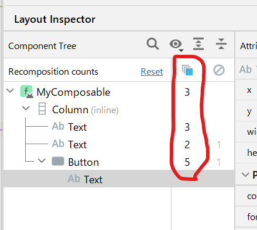

- [コンポーズされた回数を確認する](#コンポーズされた回数を確認する)
  - [手順](#手順)

# コンポーズされた回数を確認する

Android Studio を使用して、特定のコンポーザブル関数がコンポーズされた回数を確認する方法を記載します。

## 手順

1. Android Studio に実機を接続する。
2. アプリをデバッグビルドでインストールする。
3. Android Studio の右下あたりにある Running Devices タブを開く。
4. Running Devices ウィンドウの上部にある 「 + 」 ボタンをクリックして、アプリをインストールしたデバイスを選択する。
5. アプリを操作してコンポーズを実行する。
6. 下記の赤枠で囲った部分を確認する。

赤枠内の数字が、それぞれのコンポーザブル関数がコンポーズされた回数になります。

