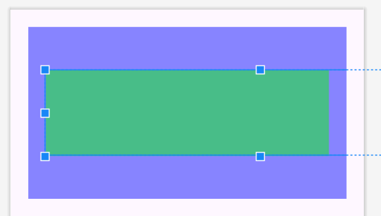
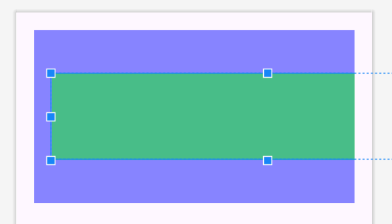

- [clipToPadding 属性](#cliptopadding-属性)
  - [概要](#概要)
  - [例](#例)

# clipToPadding 属性

## 概要

ViewGroup の clipToPadding 属性は、 boolean の値を返します。

ViewGroup 内に配置された子 View が、 ViewGroup の Padding エリア内に収まらずにはみ出した場合に、子 View のはみ出した部分をトリミングするかどうかを示します。

true の場合、はみ出した部分は (クリップ) 切り取られます。  
false の場合、はみ出した部分は切り取られず、 Padding 領域にも描画されます。

## 例

以下の例は、紫色の ViewGroup の中に、緑色の子 View が配置されています。緑色の View の横幅は、紫色の ViewGroup の横幅よりも長くなるように設定されています。

**clipToPadding が true の場合**

**clipToPadding が false の場合**

true の場合は、 Padding の領域に重なった部分は非表示になっており、  
false の場合は、表示されていることがわかります。

