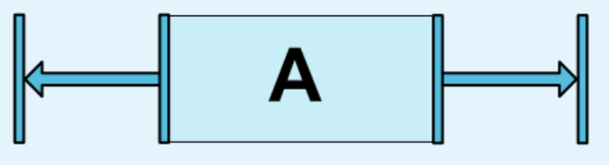

<!-- TOC depthFrom:1 depthTo:6 withLinks:1 updateOnSave:1 orderedList:0 -->

- [ConstraintLayout](#constraintlayout)
	- [リファレンスとして使うと良いサイト](#リファレンスとして使うと良いサイト)
	- [ConstraintLayout入門](#constraintlayout入門)
		- [制約を左右の2箇所に付けた場合](#制約を左右の2箇所に付けた場合)
		- [制約が付けられているViewがGONEになった場合](#制約が付けられているviewがgoneになった場合)
		- [チェーン](#チェーン)
			- [定義](#定義)
			- [動作](#動作)
	- [属性一覧](#属性一覧)
		- [layout_constraintHorizontal_weight / layout_constraintVertical_weight](#layout_constrainthorizontal_weight--layout_constraintvertical_weight)
	- [Q&A](#qa)
		- [chainStyle=packed かつ bias を設定したいときに bias が効かない](#chainstylepacked-かつ-bias-を設定したいときに-bias-が効かない)
		- [3つのViewを一列に並べた時、中央のViewの幅が広い時に自動的に折り返したい](#3つのviewを一列に並べた時中央のviewの幅が広い時に自動的に折り返したい)

<!-- /TOC -->

# ConstraintLayout

## リファレンスとして使うと良いサイト

要素が一つの場合、二つの場合と場合わけされており、探しやすい。

[[Android] ConstraintLayout レイアウト逆引きまとめ - Qiita](https://qiita.com/tktktks10/items/62d85dabac4bdb8c1f94#%EF%BC%91%E3%81%A4%E3%81%AE%E5%A0%B4%E5%90%88)

図がわかりやすい。特にChain Styleのところなど。

[ConstraintLayout, Developer Guide - Android Developers](https://developer.android.com/reference/androidx/constraintlayout/widget/ConstraintLayout)

## ConstraintLayout入門

### 制約を左右の2箇所に付けた場合

あるViewに制約を左右の2箇所に付けた場合、そのViewの幅が制約を付けた幅よりも小さければ、制約を付けたViewは左右の中央に配置されます。

これは、制約を上下の2箇所に付けた場合も同様です。

### 制約が付けられているViewがGONEになった場合

別のViewから制約が付けられているViewがGONEになった場合、GONEになったViewは縦横が0dp、マージンが0dpのViewと見なされて残ったViewのレイアウトが決定します。

GONEになった場合に、そのViewがあった位置に余白を設定したい場合は、以下の属性でマージンを設定します。
`layout_goneMarginStart`
`layout_goneMarginEnd`
`layout_goneMarginLeft`
`layout_goneMarginRight`
`layout_goneMarginTop`
`layout_goneMarginBottom`

### チェーン

#### 定義

チェーンとは、2つのViewが互いに制約を付けあっている状態である。

#### 動作

チェーンのデフォルトの動作は、利用可能なスペースに要素を均等に広げることです。

## 属性一覧

### layout_constraintHorizontal_weight / layout_constraintVertical_weight

縦、もしくは横に一列に並んだViewの高さ、幅を比率指定したい場合に使用します。

余白部分を上記の属性に指定した比率で配分します。
余白部分がViewで埋め尽くされるため、余白部分も比率指定したい場合は、`<space>`タグで、空のViewを作ります。

## Q&A

### chainStyle=packed かつ bias を設定したいときに bias が効かない

bias を指定したい方向（vertical or horizontal）に layout_weight が指定されているとbiasが効かない。
layout_weightを指定しつつ、biasを指定したい場合は、biasの代わりに<space\>タグで空白部分を埋めて、spaceのlayout_weightにbiasで指定したかった比率を指定する。

### 3つのViewを一列に並べた時、中央のViewの幅が広い時に自動的に折り返したい

以下の画面において、「Hello World!!!!!」が「1」と「2」の左右に合わせて自動的に折り返したい場合

**対応方法**

「Hello World!!!!!」の`layout_width`を`0dp`にする。
