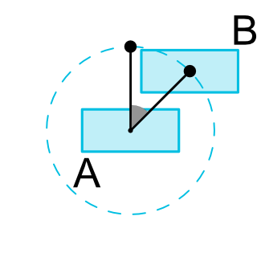

- [Viewを円状に配置する方法](#viewを円状に配置する方法)

# Viewを円状に配置する方法




```xml
 <View android:id="@+id/view1" ... />
 <!-- layout_constraintCircle は、中心となる View -->
 <!-- layout_constraintCircleRadius は、円の半径 -->
 <!-- layout_constraintCircleAngle は、円の角度（ 0 ～ 360 の数値で度数を指定する） -->
 <View android:id="@+id/view2" ...
     app:layout_constraintCircle="@+id/view1"
     app:layout_constraintCircleRadius="100dp"
     app:layout_constraintCircleAngle="45" />
```
