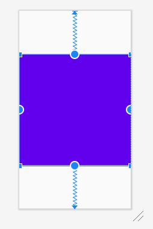

<!-- TOC START min:1 max:3 link:true asterisk:false update:true -->
- [縦横のアスペクト比で指定する方法](#縦横のアスペクト比で指定する方法)
  - [基本](#基本)
  - [縦横の両方向の長さが0dpで指定されている場合](#縦横の両方向の長さが0dpで指定されている場合)
  - [注意事項](#注意事項)
<!-- TOC END -->


# 縦横のアスペクト比で指定する方法

## 基本

以下のように、例えば横を`match_parent`として、アスペクト比を`1:1`にし、縦を自動的に設定したい場合の例を示す。



```xml
<?xml version="1.0" encoding="utf-8"?>
<androidx.constraintlayout.widget.ConstraintLayout xmlns:android="http://schemas.android.com/apk/res/android"
    xmlns:app="http://schemas.android.com/apk/res-auto"
    xmlns:tools="http://schemas.android.com/tools"
    android:layout_width="match_parent"
    android:layout_height="match_parent"
    tools:context=".MainActivity">


    <TextView
        android:id="@+id/textView"
        android:layout_width="match_parent"
        android:layout_height="0dp"
        android:background="@color/colorPrimary"
        app:layout_constraintBottom_toBottomOf="parent"
        app:layout_constraintDimensionRatio="1:1"
        app:layout_constraintEnd_toEndOf="parent"
        app:layout_constraintStart_toStartOf="parent"
        app:layout_constraintTop_toTopOf="parent" />
</androidx.constraintlayout.widget.ConstraintLayout>
```

- `android:layout_width="match_parent"` で横を画面いっぱいとする。
- `android:layout_height="0dp"` で縦を `match_constraint` とする。
- `layout_constraintDimensionRatio`で縦横比を指定する。
  - パラメータは `横:縦` の順番で縦横比を読み取る。


## 縦横の両方向の長さが0dpで指定されている場合

以下の例のように、縦横の両方向の長さが0dpで指定されている場合について解説します。

```xml
<View
  android:layout_width="0dp"
  android:layout_height="0dp"
  app:layout_constraintDimensionRatio="1:2"/>
```

基本的には、 **縦横比を満たし、親Viewに収まる最大サイズのView** が生成されます。  
つまり、Viewの縦方向を基準にとるのか、それとも横方向を基準にとるのかを  
自動的に算出して、親Viewに収まるようになっています。  

ただし、縦横比に接頭辞を付与することで、縦横どちらを基準にするかを指定することができます。

`W` を指定した場合は、 **高さ** が縦横比を無視して決定されることを意味します。  
つまり、まずは、高さが親Viewに収まる範囲で最大値をとるように決定されます。  
その後、指定された縦横比を満たすような横幅が計算されます。

`H` を指定した場合は、その逆になります。

`W` を指定すると、横幅が最大になるようなViewが生成されそうですが、その逆の動作になるのがポイントです。

```xml
<!-- 接頭辞の指定方法 -->
<!-- W を指定する例 -->
app:layout_constraintDimensionRatio="W,1:2"
<!-- H を指定する例 -->
app:layout_constraintDimensionRatio="H,1:2"
```


## 注意事項

ときどき、 `app:layout_constraintDimensionRatio` を指定しても、指定した比率で表示されないことがある。  

比率指定したい View の onMeasure() メソッドで、その View のサイズを動的に変更している場合、  
制約の付け方によっては、 `app:layout_constraintDimensionRatio` で指定した比率で表示されない。

動的に View のサイズを変更する場合には、 onMeasure() メソッドで高さ、幅の両方を指定する方法が  
安全であると思われる。
