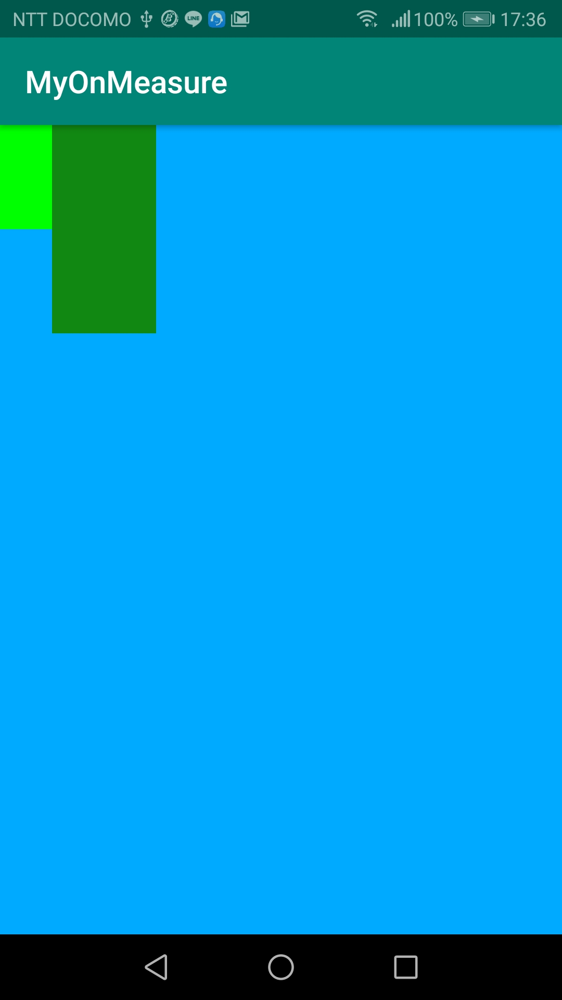

<!-- TOC START min:1 max:3 link:true asterisk:false update:true -->
- [onMeasure_onLayout_onDrawの使用方法](#onmeasure_onlayout_ondrawの使用方法)
	- [コード](#コード)
<!-- TOC END -->


# onMeasure_onLayout_onDrawの使用方法

以下のサンプルプロジェクトは、親ViewGroup(MyLinearLayout)の中にアスペクトが1:2(横:縦)の長方形を左上寄せで隣り合うように描画するカスタムビューです。



水色がMyLinearLayout（親ViewGroup）、明るい緑がAspectRatioRectangle（子View）の一つ目、濃い緑がAspectRatioRectangle（子View）の二つ目です。


## コード

**MainActivity.java**

```Java
public class MainActivity extends AppCompatActivity {

    @Override
    protected void onCreate(Bundle savedInstanceState) {
        super.onCreate(savedInstanceState);
        setContentView(R.layout.activity_main);
    }
}
```


**MyLinearLayout.java**

```Java
public class MyLinearLayout extends ViewGroup {

    public MyLinearLayout(Context context, @Nullable AttributeSet attrs) {
        super(context, attrs);
    }

    /**
     * 自分の子孫Viewも含め、自分自身のViewのサイズを計測or算出し、確定させる責務を持つメソッド
     *
     * 子Viewに対してサイズの制約を渡したい場合は、このViewでサイズ制約を算出し、
     * childView.measure(int, int)で子ViewのonMeasureにパラメータとして渡す。
     *
     * このViewで子Viewに対する制約を特に算出する必要がなく、レイアウトxmlどおりの制約のみで良い場合は、
     * super.onMeasure(int, int)を呼べば良い。super.onMeasureは子ViewのonMeasureメソッドを呼ぶために
     * 必要である。
     *
     * このViewが子Viewを持たない場合は、super.onMeasureを呼ぶ必要はない。ただし、その場合は、
     * setMeasuredDimension(int, int)を呼ぶ必要がある。必ず、super.onMeasureかsetMeasuredDimension
     * のどちらかは呼ぶ必要がある。これらのメソッドは、サイズを確定する役割がある。
     * サイズが確定するとは、measuredWidthやmeasuredHeightが決まっているということ。
     *
     * このメソッドは親子関係にあるViewとサイズの調整を行うため、複数回呼ばれることがある。
     *
     * @param widthMeasureSpec 親ViewでchildView.measure()メソッドを呼んだときに渡したパラメータ
     * @param heightMeasureSpec 親ViewでchildView.measure()メソッドを呼んだときに渡したパラメータ
     */
    @Override
    protected void onMeasure(int widthMeasureSpec, int heightMeasureSpec) {
        int childCount = getChildCount();
        for (int i = 0; i < childCount; i++) {
            View childView = getChildAt(i);
            int childWidthMeasureSpec =
                    MeasureSpec.makeMeasureSpec(100 * (i + 1), MeasureSpec.EXACTLY);
            int childHeightMeasureSpec =
                    MeasureSpec.makeMeasureSpec(200 * (i + 1), MeasureSpec.EXACTLY);
            childView.measure(childWidthMeasureSpec, childHeightMeasureSpec);
        }
        setMeasuredDimension(widthMeasureSpec, heightMeasureSpec);
    }

    /**
     * 子Viewを表示する位置を指定するメソッドである。
     * 自分自身のViewを表示する位置は親ViewのonLayoutメソッドで既に決まっている。
     * onLayoutをオーバーライドする場合は、その中で全ての子Viewのlayoutメソッドを呼ぶ必要がある。
     *
     * @param changed 前回描画時から変更があればtrue、なければfalse
     * @param l       自分自身のViewのLeftの位置を表すX座標。X座標の原点は親ViewのLeft（単位：px）
     * @param t       自分自身のViewのTopの位置を表すY座標。Y座標の原点は親ViewのTop（単位：px）
     * @param r       自分自身のViewのRightの位置を表すX座標。X座標の原点は親ViewのLeft（単位：px）
     * @param b       自分自身のViewのBottomの位置を表すY座標。Y座標の原点は親ViewのTop（単位：px）
     */
    @Override
    protected void onLayout(boolean changed, int l, int t, int r, int b) {
        int childCount = getChildCount();
        int childStartPos = 0;
        for (int i = 0; i < childCount; i++) {
            View childView = getChildAt(i);
            int childWidth = childView.getMeasuredWidth();
            childView.layout(childStartPos,
                    t,
                    childStartPos + childWidth,
                    childView.getMeasuredHeight());
            childStartPos = childStartPos + childWidth;
        }
    }

    @Override
    protected void onDraw(Canvas canvas) {
        super.onDraw(canvas);
    }
}
```


**AspectRatioRectangle.java**

```Java
public class AspectRatioRectangle extends View {

    // 縦 ÷ 横
    float mAspectRatio;

    public AspectRatioRectangle(Context context, AttributeSet attrs) {
        super(context, attrs);

        TypedArray a = context.getTheme().obtainStyledAttributes(
                attrs,
                R.styleable.AspectRatioRectangle,
                0, 0);

        try {
            mAspectRatio = a.getFloat(R.styleable.AspectRatioRectangle_aspectRatio, 0);
        } finally {
            a.recycle();
        }

        if (mAspectRatio < 0) mAspectRatio = 0;
    }

    @Override
    protected void onMeasure(int widthMeasureSpec, int heightMeasureSpec) {
        // 単位：px
        int widthSize = MeasureSpec.getSize(widthMeasureSpec);
        int heightSize = (int) (widthSize * mAspectRatio);

        setMeasuredDimension(widthSize, heightSize);
    }

    @Override
    protected void onLayout(boolean changed, int left, int top, int right, int bottom) {
        super.onLayout(changed, left, top, right, bottom);
    }

    @Override
    protected void onDraw(Canvas canvas) {
        super.onDraw(canvas);
    }
}
```


**activity_main.xml**

```xml
<?xml version="1.0" encoding="utf-8"?>
<com.example.myonmeasure.MyLinearLayout xmlns:android="http://schemas.android.com/apk/res/android"
    xmlns:app="http://schemas.android.com/apk/res-auto"
    xmlns:tools="http://schemas.android.com/tools"
    android:layout_width="match_parent"
    android:layout_height="match_parent"
    android:orientation="horizontal"
    android:background="#00aaff"
    tools:context=".MainActivity">

    <com.example.myonmeasure.AspectRatioRectangle
        android:layout_width="0px"
        android:layout_height="0px"
        android:background="#00ff00"
        app:aspectRatio="2" />

    <com.example.myonmeasure.AspectRatioRectangle
        android:layout_width="0px"
        android:layout_height="0px"
        android:background="#118811"
        app:aspectRatio="2"/>

</com.example.myonmeasure.MyLinearLayout>
```


**attrs.xml**

```xml
<?xml version="1.0" encoding="utf-8"?>
<resources>
    <declare-styleable name="AspectRatioRectangle">
        <attr name="aspectRatio" format="float" />
    </declare-styleable>
</resources>
```
