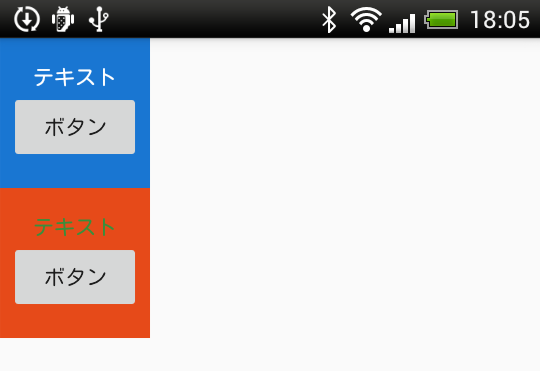

# <declare-styleable\>,<attr\>タグ

## <declare-styleable\>,<attr\>タグの使い方

カスタムViewを作成した際に、xmlで使用できるオリジナルのタグを定義する為に使用する。

### サンプル

以下のようなテキストとボタンを持ったカスタムViewを作るとします。



**custom_view.xml**

以下は上記のカスタムビューを定義したxmlです。

```Xml
<LinearLayout xmlns:android="http://schemas.android.com/apk/res/android"
    android:id="@+id/linearLayout"
    android:layout_width="match_parent"
    android:layout_height="match_parent"
    android:gravity="center"
    android:orientation="vertical">

    <TextView
        android:id="@+id/textView"
        android:layout_width="wrap_content"
        android:layout_height="wrap_content"
        android:text="テキスト" />

    <Button
        android:id="@+id/button"
        android:layout_width="wrap_content"
        android:layout_height="wrap_content"
        android:text="ボタン" />

</LinearLayout>
```


カスタムビュー内のViewで利用できるオリジナルのxml属性を定義します。
ただ、オリジナルとは言っても、既存の属性へのアクセスが簡単になるようなエイリアスを定義しているだけです。

**res/values/attrs.xml**

```Xml
<?xml version="1.0" encoding="utf-8"?>
<resources>
    <declare-styleable name="CustomView">
        <!--文字色-->
        <attr name="textColor" format="color" />
        <!--背景色-->
        <attr name="backgroundColor" format="color" />
    </declare-styleable>
</resources>
```

上記の例の場合、本来ならば、TextViewのテキスト色を変更する場合には、`custom_view.xml`内の`TextView`に`android:textColor="@color/blue"`などと記載しなければいけません。
しかし、カスタムView用の属性を定義することで、以下のようにCustomViewの利用側でTextViewのテキスト色を変更できるようになります。
これのメリットは、カスタムビューの呼び出し側から属性を設定できるようになったことで、カスタムビューごとに異なる値を簡単に設定できるところです。

`format`属性に指定する値は以下の表を参照してください。

属性      | 内容                   | 設定す値の例
----------|------------------------|----------------------------------------------------------------------
integer   | int値です。            | 10
float     | float値です。          | 0.5
string    | 文字列です。           | 文字列ですが@string/○○○も使用可です。
boolean   | boolean型です。        | true / false
enum      | 列挙型です。           | {normal = 1, round = 2, circle = 3}
flag      | ビットフラグです。     | {normal = 1, round = 2, circle = 4}
dimension | dimension単位です。    | 10dp,10pxとか、width=とかで設定しているサイズの値と同じです。
color     | Colorクラスです。      | #AA0000とかの他にresに定義したcolorリソースも@color/○○○で利用できます
reference | リソースIDの参照です。 | @+id/○○○○とか、@drawable/○○○とか
freaction | 有理数です。           | 10%とか百分率を指定してつかいます。

属性ごとに扱い方が異なります。
詳細は、以下のリンクを参照してください。

[styleableプロパティ全要素のリファレンスを書いてみた - Qiita](https://qiita.com/Hoshi_7/items/57c3a79c43efe05b5368)

CustomViewの利用側のxml

**activity_main.xml**

```xml
<LinearLayout xmlns:android="http://schemas.android.com/apk/res/android"
    xmlns:custom="http://schemas.android.com/apk/res-auto"
    android:layout_width="match_parent"
    android:layout_height="match_parent"
    android:orientation="vertical">

    <com.example.test.CustomView
        android:layout_width="100dp"
        android:layout_height="100dp"
        custom:backgroundColor="#1976D2"
        custom:textColor="#FFFFFF" />

    <com.example.test.CustomView
        android:layout_width="100dp"
        android:layout_height="100dp"
        custom:backgroundColor="#E64A19"
        custom:textColor="#388E3C" />

</LinearLayout>
```

名前空間の名前の定義はいつも通りルートのビューグループで定義します。
`xmlns:custom="http://schemas.android.com/apk/res-auto"`
`http〜`の部分は常に同じで問題ありません。
`custom`の部分は`app`とするのが一般的なようです。
`app`とした場合は、呼び出し側も`app`とするのを忘れないでください。

**CustomView.java**

```Java
public class CustomView extends LinearLayout {

    public CustomView(Context context, AttributeSet attrs) {
        super(context, attrs);
        View view = LayoutInflater.from(context).inflate(R.layout.custom_view, this);
        TextView textView = (TextView) view.findViewById(R.id.textView);
        LinearLayout linearLayout = (LinearLayout) view.findViewById(R.id.linearLayout);

        TypedArray array = context.obtainStyledAttributes(attrs, R.styleable.CustomView);
        int textColor = array.getColor(R.styleable.CustomView_setTextColor, 0);
        int backgroundColor = array.getColor(R.styleable.CustomView_setBackgroundColor, 0);
        textView.setTextColor(textColor);
        linearLayout.setBackgroundColor(backgroundColor);
        array.recycle();
    }
```

## 参考にしたサイト

[カスタムビューの作成 - そーやのAndroid開発ブログ](http://soya-android.hatenablog.com/entry/2017/02/04/184740)
