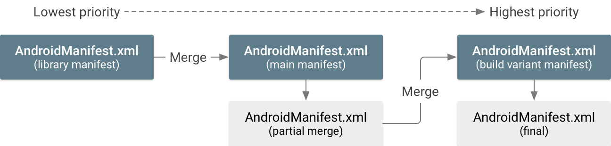

- [マニフェストファイルを管理する](#マニフェストファイルを管理する)
  - [複数のマニフェストファイルをマージする](#複数のマニフェストファイルをマージする)
    - [マージ優先順位](#マージ優先順位)
    - [マージ競合ヒューリスティック](#マージ競合ヒューリスティック)
    - [マージルールマーカー](#マージルールマーカー)
      - [ノードマーカー](#ノードマーカー)
      - [属性マーカー](#属性マーカー)
      - [マーカーセレクタ](#マーカーセレクタ)
      - [インポートライブラリの \<uses-sdk\> をオーバーライドする](#インポートライブラリの-uses-sdk-をオーバーライドする)
      - [暗黙的システム権限](#暗黙的システム権限)
    - [マージマニフェストを調査して競合を検出する](#マージマニフェストを調査して競合を検出する)
  - [マージポリシー](#マージポリシー)
  - [マニフェストにビルド変数を追加する](#マニフェストにビルド変数を追加する)
  - [引用元資料](#引用元資料)


# マニフェストファイルを管理する

このページでは、マニフェストマージの仕組みと、マージ優先順位を適用してマージ競合を解決する方法について説明します。


## 複数のマニフェストファイルをマージする

APK または Android App Bundle ファイルには AndroidManifest.xml ファイルが 1 つだけ含まれていますが、 Android Studio プロジェクトには、メインソースセット、ビルドバリアント、インポート済みライブラリによって提供される複数のマニフェストファイルが含まれる場合があります。アプリをビルドする際、 Gradle ビルドはすべてのマニフェストファイルを単一のマニフェストファイルにマージして、アプリ内にパッケージ化します。

マニフェストマージツールは、マージヒューリスティック (おそらく一番良いと思われる方法) に沿い、特別な XML 属性で定義したマージ優先順位に従って、各ファイルのすべての XML 要素を結合します。

ヒント: [[Merged Manifest] ビュー](#マージマニフェストを調査して競合を検出する) (後のセクションで説明) を使用すると、次のセクションで説明するように、マージ マニフェストの結果をプレビューしたり、競合エラーを確認したりできます。


### マージ優先順位

マージツールは、各マニフェストファイルの優先順位に基づいて、すべてのマニフェストファイルを 1 つのファイルに順次結合します。たとえば、3 つのマニフェストファイルがある場合、図 1 に示すように、優先度第 3 位のマニフェストが優先度第 2 位のマニフェストにマージされ、そのマージ結果が優先度第 1 位のマニフェストにマージされます。 **(最も優先度が低いファイルから最も優先度が高いファイルに順次マージ)**



相互にマージ可能なマニフェストファイルには 3 つの基本タイプがあります。以下に、マージ優先順位が最も高いものから順に示します。

1. ビルドバリアントのマニフェストファイル

バリアントに複数のソースセットがある場合、そのマニフェストの優先順位は次のようになります。

- ビルドバリアントマニフェスト（src/demoDebug/ など）
- ビルドタイプマニフェスト（src/debug/ など）
- プロダクトフレーバーマニフェスト（src/demo/ など）

フレーバーディメンションを使用している場合、マニフェストの優先順位は flavorDimensions プロパティ内にリストされている各ディメンションの順序に対応します（リスト内の登場順）。

2. アプリモジュールのメインマニフェストファイル

3. 含まれているライブラリ内のマニフェストファイル

複数のライブラリがある場合、マニフェストの優先順位は、Gradle dependencies ブロック内の登場順と一致します。

たとえば、ライブラリマニフェストはメインマニフェストにマージされ、次にメインマニフェストがビルドバリアントマニフェストにマージされます。注: すべてのソースセットで同じマージ優先順位になります。 [ソースセットでビルドする](https://developer.android.com/build/build-variants?hl=ja&_gl=1*4mzgct*_up*MQ..*_ga*MTE1ODIzNDI5Ny4xNzIxNzE2Njk2*_ga_6HH9YJMN9M*MTcyMTg3NTEwMy4zLjAuMTcyMTg3NTEwMy4wLjAuMA..#sourceset-build) をご覧ください。

注: ライブラリモジュールをビルドする場合、最終的なマージマニフェストには、ライブラリの依存関係のマニフェストの内容は含まれません。

重要: **build.gradle は、マージマニフェストファイル内の対応する属性をオーバーライドします。** たとえば、 build.gradle または build.gradle.kts ファイルの minSdk は、 `<uses-sdk>` マニフェスト要素内の対応する属性をオーバーライドします。混乱を避けるため、 `<uses-sdk>` 要素を削除し、 build.gradle ファイルでのみプロパティを定義してください。詳細については、ビルドを構成するをご覧ください。


### マージ競合ヒューリスティック

マージツールは、あるマニフェスト内のすべての XML 要素を、別のマニフェスト内の対応する要素に論理的にマッチングできますマッチング処理の詳細については、前のセクションのマージ優先順位をご覧ください。

優先度の低いマニフェスト内の要素が、優先度の高いマニフェスト内のどの要素にも一致しない場合、その要素はマージ後のマニフェストに追加されます。ただし、一致する要素が存在する場合、マージツールは各マニフェスト内の属性をマージしようとします。両方のマニフェスト内に同じ属性があるがその値が異なることをツールが検出した場合、マージの競合が発生します。

マージツールがすべての属性を単一の要素に結合しようとする際に起こり得る結果を表 1 に示します。

| 優先度の高い属性 | 優先度の低い属性 | 属性のマージ結果                                                                          |
| ---------------- | ---------------- | ----------------------------------------------------------------------------------------- |
| 値なし           | 値なし           | 値なし（デフォルト値を使用）                                                              |
| 値なし           | 値 B             | 値 B                                                                                      |
| 値 A             | 値なし           | 値 A                                                                                      |
| 値 A             | 値 A             | 値 A                                                                                      |
| 値 A             | 値 B             | **競合エラー** : [マージルールマーカー](#マージルールマーカー) を追加する必要があります。 |
|                  |                  |                                                                                           |

ただし、以下の場合は例外です。

- `<manifest>` タグ内の属性はマージされません。最も優先度が高いマニフェストの属性だけが使用されます。
- `<uses-feature>` 要素と `<uses-library>` 要素の android:required 属性では、論理和でマージされます。つまり、どちらか一方でも "true" の場合、 "true" が適用され、あるマニフェストに必要な機能またはライブラリが必ず含まれるようになります。
- `<uses-sdk>` タグ内の属性には、最も優先度の高いマニフェストの値が常に使用されます。ただし、次の場合を除きます。
  - 優先度の低いマニフェストの方が minSdk 値が大きい場合、overrideLibrary マージルールを適用しない限りエラーが発生します。
  - 優先度の低いマニフェストの方が targetSdkVersion 値が小さい場合、マージツールは、優先度の高いマニフェストの値を使用します。インポート ライブラリが引き続き適切に機能するために必要なシステム権限も追加されます（上位の Android バージョンの方が権限の制限が強化されている場合に対応するため）。この処理の詳細については、 [暗黙的システム権限](#暗黙的システム権限) をご覧ください。
- <intent-filter> 要素をマニフェスト間でマッチングすることはありません。各要素は一意と見なされ、マージ マニフェストの共通親要素に追加されます。

**属性間に他の競合がある場合、すべてエラーが発生します。** その場合、優先度の高いマニフェストファイルに特別な属性を追加して、マージツールに解決方法を指定する必要があります。マージルールマーカーについては、次のセクションをご覧ください。

**【重要】デフォルト属性値に依存しないでください。** すべての一意の属性が単一の要素に結合されるため、優先度の高いマニフェストが属性の値を宣言せずにデフォルト値に依存していた場合、予期しない結果が生じる可能性があります。たとえば、優先度の高いマニフェストが android:launchMode 属性を宣言していない場合、デフォルト値の "standard" が使用されますが、優先度の低いマニフェストが別の値を使用してこの属性を宣言していた場合、その値がマージ マニフェストに適用されます（デフォルト値をオーバーライドします）。使用する各属性は明示的に定義する必要があります。各属性のデフォルト値については、 [マニフェストリファレンス](https://developer.android.com/guide/topics/manifest/manifest-intro?hl=ja&_gl=1*3soub5*_up*MQ..*_ga*MTE1ODIzNDI5Ny4xNzIxNzE2Njk2*_ga_6HH9YJMN9M*MTcyMTg3NTEwMy4zLjAuMTcyMTg3NTEwMy4wLjAuMA..) をご覧ください。


### マージルールマーカー

マージルールマーカーは、マージ時の競合を解決したり、不要な要素や属性を **削除したりする際の優先順位を示す** ために使用する XML 属性です。マーカーは、要素全体または要素内の特定の属性に対して適用できます。

2 つのマニフェストファイルをマージする際、マージツールは、 **優先度の高いマニフェストファイル内にマーカーがないか検索** します。

すべてのマーカーは Android の `tools` 名前空間に属すため、次に示すように、初めに tools 名前空間を `<manifest>` 要素内で宣言する必要があります。

```xml
<manifest xmlns:android="http://schemas.android.com/apk/res/android"
    package="com.example.myapp"
    xmlns:tools="http://schemas.android.com/tools"> <!-- ←これ -->
```

注意: アプリ モジュールの場合、tools マージ マーカーはマージ後に削除されます。ただし、ライブラリ モジュールの場合、tools マージ マーカーはマージ後に削除されず、ダウンストリーム モジュールでのマージに影響する可能性があります。


#### ノードマーカー


#### 属性マーカー
#### マーカーセレクタ
#### インポートライブラリの \<uses-sdk\> をオーバーライドする
#### 暗黙的システム権限
### マージマニフェストを調査して競合を検出する
## マージポリシー
## マニフェストにビルド変数を追加する


## 引用元資料

[マニフェストファイルを管理する - Android Developers](https://developer.android.com/build/manage-manifests?hl=ja&_gl=1*1mmqfrb*_up*MQ..*_ga*MTE1ODIzNDI5Ny4xNzIxNzE2Njk2*_ga_6HH9YJMN9M*MTcyMTc4ODI5Mi4yLjAuMTcyMTc4ODI5Mi4wLjAuMA..#merge-manifests)


