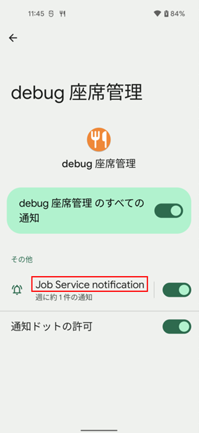
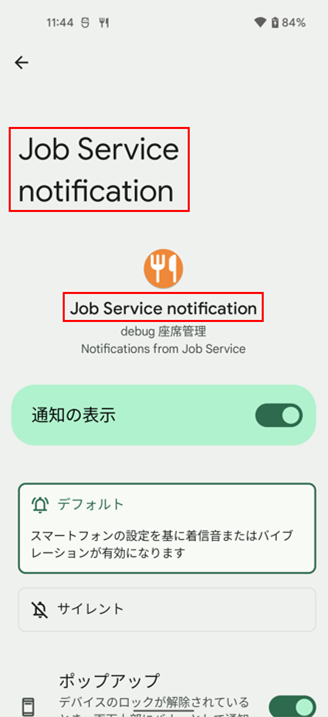
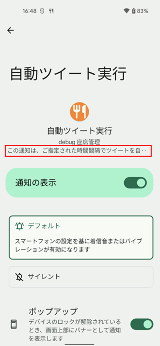

<!-- TOC START min:1 max:3 link:true asterisk:false update:true -->
- [通知チャネル](#通知チャネル)
	- [概要](#概要)
	- [OS互換性](#os互換性)
	- [重要度](#重要度)
	- [通知チャネル名（Name）が表示される場所](#通知チャネル名nameが表示される場所)
	- [通知チャネルの詳細（Description）が表示される場所](#通知チャネルの詳細descriptionが表示される場所)
	- [通知チャネルの動的な作成](#通知チャネルの動的な作成)
<!-- TOC END -->

# 通知チャネル

## 概要

通知チャネルとは、Android 8.0 (Oreo) から追加された新機能です。  
通知を種類ごとに複数のチャネルに割り振り、チャネルごとに通知における  
バイブレーションのオン・オフ、通知音の変更といった細かい設定を設定アプリから行える仕組みになっています。

Android 8.0（API レベル 26）以降、すべての通知はいずれかのチャネルに割り当てる必要があります。  
割り当てられていない通知は表示することができません。

各通知は、通知生成時に通知チャネル ID を必要とします。  
通知は通知チャネル ID を使用して、通知チャネルに紐づきます。

設定アプリでは、 「チャネル」 のことを 「カテゴリー」 と表示するらしいが、最近は 「その他」 と表示されるようになっているようだ。 (図 1 のベルアイコンの上の「その他」の部分のこと)

## OS互換性

Android 8.0（API レベル 26）をターゲットとしているアプリの場合は、通知チャネルを実装する必要があります。  
targetSdkVersion が 25 以下に設定されているアプリは、Android 8.0（API レベル 26）以降を  
搭載しているデバイス上で実行された場合でも、Android 7.1（API レベル 25）以前のデバイス上と同じように動作します。

サポートライブラリには通知チャネル用のAPIは用意されていません。そのため、`Build.VERSION.SDK_INT`  
を使用してAndroid 8.0（API レベル 26）以上の場合のみ通知チャネルを作成するようにします。

## 重要度

Android 8.0（API レベル 26）以降では、重要度は、通知チャネルごとに設定されます。  
(通知チャネルの `importance` 設定に従います。)  
Android 7.1（API レベル 25）以前は、通知ごとに設定されます。  
(通知の `priority` 設定に従います。)

通知の重要度によって、通知の表示方法と音が決定されます。  
重要度が高い通知ほど、目立つような表示方法と音が使用されます。  
重要度ごとの音と表示方法は以下の通りです。

| 重要度 | 音       | 表示方法                         |
|--------|----------|----------------------------------|
| 緊急   | 鳴る     | ヘッドアップ通知として表示される |
| 高     | 鳴る     | -                                |
| 中     | 鳴らない | -                                |
| 低     | 鳴らない | ステータスバーにも表示されない   |

Android 8 以降から、 「設定アプリ」 内の通知設定で、各アプリの各通知チャネルごとに  
「重要度」 という項目があり、それを変更することで、ユーザーは、音や表示方法を変更することができるように  
なりましたが、最新の端末 (確認できる範囲では、 Android 12 以降) では、 「重要度」 という項目は  
なくなっています。代わりに、ユーザーは、自由に音や表示方法を組み合わせて設定することが可能になりました。  
デフォルトでは、重要度に応じた音や表示方法が設定されていると思われます。

## 通知チャネル名（Name）が表示される場所

通知チャネル名 (Name) は、アプリ別通知設定トップ画面では、  
図 1 に示すように 1 箇所に表示されます。  
通知チャネル設定画面では、図 2 に示すように 2 箇所に表示されます。

**図 1 . アプリ別通知設定トップ画面**

**図 2 . 通知チャネル設定画面**

## 通知チャネルの詳細（Description）が表示される場所

通知チャネルの詳細 (Description) は、通知チャネル設定画面の図 3 の場所に表示されます。  
Description が長すぎる場合は、ドットで丸められて、表示しきることはできないようです。

**図 3 . 通知チャネル設定画面**

## 通知チャネルの動的な作成

ユーザーの選択に応じて通知チャンネルを作成することもできます。たとえば、メッセージアプリでユーザーが作成した会話グループごとに個別の通知チャンネルを設定できます。

