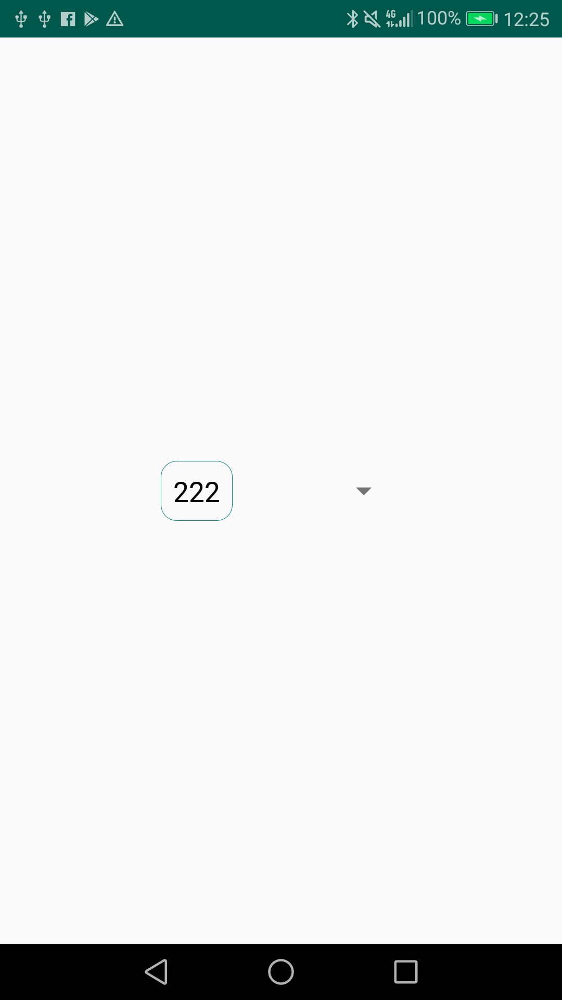

<!-- TOC START min:1 max:3 link:true asterisk:false update:true -->
- [ユーザーインターフェース関連](#ユーザーインターフェース関連)
	- [レイアウトを変更する方法1（テーマ自体をカスタマイズする方法）（個人的に非推奨）](#レイアウトを変更する方法1テーマ自体をカスタマイズする方法個人的に非推奨)
		- [よくある変更内容のサンプル](#よくある変更内容のサンプル)
		- [文字列を中央揃えにする](#文字列を中央揃えにする)
		- [参考にしたサイト](#参考にしたサイト)
	- [レイアウトを変更する方法2（Viewごとに変更する方法）（個人的に推奨）](#レイアウトを変更する方法2viewごとに変更する方法個人的に推奨)
	- [Spinnerのドロップダウン矢印を消す方法](#spinnerのドロップダウン矢印を消す方法)
	- [Spinnerの選択アイテム表示エリアのバックグラウンドを変更する方法](#spinnerの選択アイテム表示エリアのバックグラウンドを変更する方法)
	- [Spinnerのドロップダウンリストのバックグラウンドを変更する方法](#spinnerのドロップダウンリストのバックグラウンドを変更する方法)
	- [リストをダイアログ形式で表示する](#リストをダイアログ形式で表示する)
<!-- TOC END -->


# ユーザーインターフェース関連

## レイアウトを変更する方法1（テーマ自体をカスタマイズする方法）（個人的に非推奨）

### よくある変更内容のサンプル

この方法は、テーマ自体をカスタマイズする方法である。  
テーマよりも個別の View に設定された属性の方が優先的に適用されるという原則があるため、  
Spinner ウィジェットが読み込んでいる「ドロップダウンのレイアウト XML 」自体に設定された属性は  
変更することができない。例えば、ドロップダウンリストの高さは、この方法では変更することができない。  
そのため個人的には、テーマ自体をカスタマイズして Spinner の見た目を変更する方法は非推奨と考えている。

**Sample.xml**

```Xml
<resources>

    <style name="AppTheme" parent="android:Theme.Holo.Light.DarkActionBar">
        <!-- 1.下で定義したStyleを読み込む -->
        <item name="android:spinnerItemStyle">@style/SpinnerItemStyle</item>
        <item name="android:spinnerDropDownItemStyle">@style/SpinnerDropDownItemStyle</item>
    </style>

    <!-- 2.スピナー部分 -->
    <style name="SpinnerItemStyle" parent="android:Widget.Holo.Light.TextView.SpinnerItem">
        <!-- ここに変更したいレイアウトを記述する -->
        <item name="android:textSize">12sp</item>
    </style>

    <!-- 3.ドロップダウン部分 -->
    <style name="SpinnerDropDownItemStyle" parent="android:Widget.Holo.Light.DropDownItem">
        <!-- ここに変更したいレイアウトを記述する -->
        <item name="android:textSize">12sp</item>
    </style>

</resources>
```

<注意>  
上記のサンプルは、 `Spinner` のレイアウトに `android.R.layout.simple_spinner_item` を使用し、  
ドロップダウンのレイアウトに `android.R.layout.simple_spinner_dropdown_item` を使用している場合を  
想定しています。それ以外のレイアウトを使用する場合には、 `name` 属性あたりを変更しなければいけない  
可能性があります。


### 文字列を中央揃えにする

`android:gravity`属性を設定する。

**sample.xml**

```Xml
<item name="android:gravity">center</item>
```


#### 注意点

`<Spinner>` の `layout_width` を `wrap_content` にしないこと。  
`wrap_content` にしてしまうと、以下のようになってしまう。



<p>

つまり、角丸の枠の中では中央揃えになっているが、枠自体が`wrap_content`によって、  
`<Spinner>` Viewの中で左寄せになってしまうため、中央揃えに見えない。

対応方法としては、 `<Spinner>` の `layout_width` は `0dp` にしておき、 `ConstraintLayout` の  
制約で左右の幅を決める。もしくは、試してはいないが、 `match_parent` にするか、 `200dp` など  
固定値にするなどでも解決できるかもしれない。


### 参考にしたサイト

ググると「独自のレイアウトファイルを作成してそれを読み込む」系の方法が記載されているが、  
変更したいパラメータ以外も定義していてなんか不自然に感じる。  
以下のYAMさんのHPでは、レイアウトファイルをオーバーライドして必要な属性だけ定義しているし、  
Javaコードも変更する必要がなく、こちらがスマートな実装方法だと思われる。

正しいレイアウトの変更方法  
　[Android　Spinnerの選択肢をXMLで指定する - Y.A.M の 雑記帳](http://y-anz-m.blogspot.com/2014/04/androidspinnerxml.html)


## レイアウトを変更する方法2（Viewごとに変更する方法）（個人的に推奨）

方法 2 のやり方は、方法 1 のように指定できないパラメータが今のところないので、  
自由にレイアウトを指定することができると思われる。そのため、個人的に推奨している。

方法 2 のやり方は、以下の標準レイアウトを使用するのをやめて、自作のレイアウトを使用する方法である。

<標準レイアウト>  
`android.R.layout.simple_spinner_item`  
`android.R.layout.simple_spinner_dropdown_item`

**SampleActivity.java**

```Java
public class MainActivity extends AppCompatActivity {

    Spinner mSpinner;
    String[] mData = {"1111111111111","222","33333"};

    @Override
    protected void onCreate(Bundle savedInstanceState) {
        super.onCreate(savedInstanceState);
        setContentView(R.layout.activity_main);

        mSpinner = findViewById(R.id.spinner);

        // android.R.layout.simple_spinner_itemの代わりに独自レイアウトを使用
        ArrayAdapter<String> adapter = new ArrayAdapter<>(
                this,
                R.layout.spinner_selected_item,
                mData
        );
        // Adapter の生成方法によっては、以下のように記述する場合もある
        // adapter = ArrayAdapter.createFromResource(
        //         requireContext(),
        //         R.array.division_number_array,
        //         R.layout.spinner_selected_item);


        // android.R.layout.simple_spinner_dropdown_itemの代わりに独自レイアウトを使用
        adapter.setDropDownViewResource(R.layout.spinner_list_item);

        // spinner に adapter をセット
        mSpinner.setAdapter(adapter);
    }
}
```

**spinner_selected_item.xml**

```Xml
<?xml version="1.0" encoding="utf-8"?>
<TextView xmlns:android="http://schemas.android.com/apk/res/android"
    android:layout_width="match_parent"
    android:layout_height="wrap_content"
    android:background="@drawable/frame"
    android:ellipsize="marquee"
    android:singleLine="true"
    android:textAlignment="center"
    android:textSize="18dp" />
```

**spinner_list_item.xml**

```Xml
<?xml version="1.0" encoding="utf-8"?>
<CheckedTextView xmlns:android="http://schemas.android.com/apk/res/android"
    android:layout_width="match_parent"
    android:layout_height="wrap_content"
    android:ellipsize="marquee"
    android:padding="10dp"
    android:singleLine="true"
    android:textAlignment="center"
    android:textSize="18dp" />
```


## Spinnerのドロップダウン矢印を消す方法

Spinnerの`android:background`属性に何らかのリソースを設定すると矢印が消える。

**sample.xml**

```Xml
<Spinner
    android:background="@color/colorLightBlue"/>
```

`android:background` に指定したものはリストが表示される前の Spinner のバックグラウンドに表示される。  
大抵の場合、バックグラウンドには何も表示したくないはずなので、背景色に合わせた色を  
`@color/XXX` で指定するのが良い。


## Spinnerの選択アイテム表示エリアのバックグラウンドを変更する方法

**sample.xml**

```Xml
<Spinner
    android:background="@color/colorLightBlue"/>
```


## Spinnerのドロップダウンリストのバックグラウンドを変更する方法

**sample.xml**

```Xml
<Spinner
    android:popupBackground="@color/colorDark"/>
```


## リストをダイアログ形式で表示する

**sample.xml**

```Xml
<Spinner
    android:spinnerMode="dialog"/>
```
