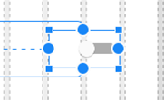
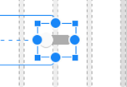

<!-- TOC START min:1 max:3 link:true asterisk:false update:true -->
- [スイッチを中央寄せにする方法](#スイッチを中央寄せにする方法)
<!-- TOC END -->


# スイッチを中央寄せにする方法

テキストなしの `Switch` を作成する場合、スイッチのビュー幅が、スイッチ自身の幅よりも大きいと  
スイッチ自身は、ビューの中で右寄りになります。 (図 1 を参照)



図 1 : スイッチが右寄りになった状態

スイッチ自身を中央に配置したい場合、 `android:gravity="center_horizon"` としたいところですが、  
これではスイッチ自身を中央に配置することはできません。

**現状、スイッチのビュー幅とスイッチ自身の幅が異なる場合は、スイッチ自身を中央に配置する方法はありません。**

スイッチ自身を中央寄せにしたい場合は、スイッチのビュー幅とスイッチ自身の幅を同じにすることで、  
所望のレイアウトを実現できる可能性があります。  
つまり、スイッチのビュー幅を `"wrap_content"` に設定します。

```xml
<Switch
    android:layout_width="wrap_content" />
```

図 1 の状態からスイッチの幅を `wrap_content` にした結果を図 2 に示します。



図 2 : スイッチを実質的に中央寄せにした状態
