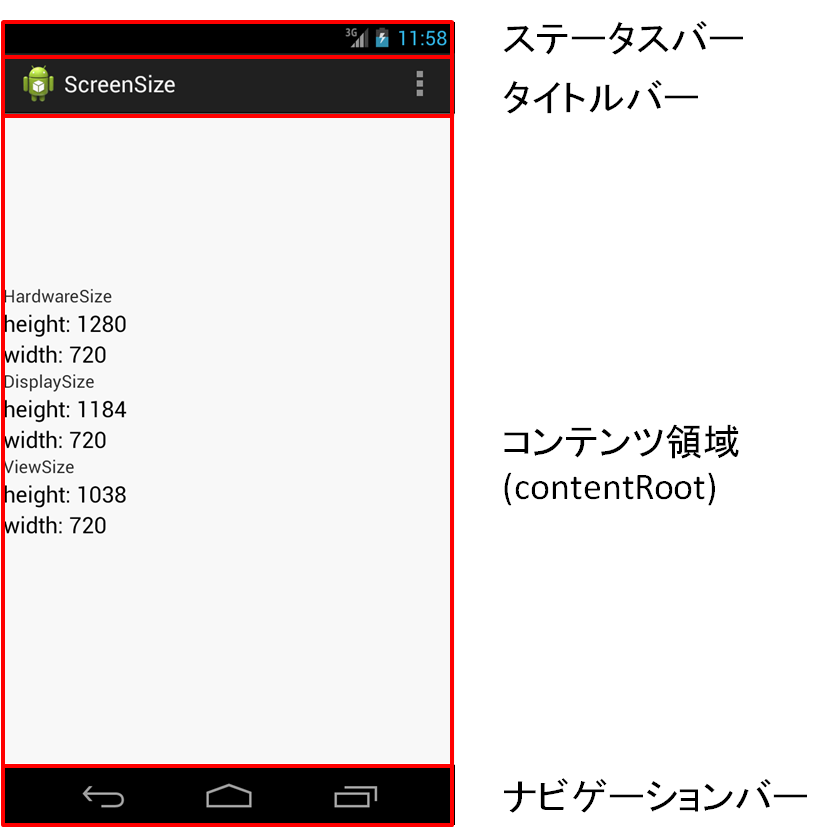

<!-- TOC depthFrom:1 depthTo:6 withLinks:1 updateOnSave:1 orderedList:0 -->

- [ActionBar](#actionbar)
	- [名称確認](#名称確認)
	- [主要なActionBar一覧](#主要なactionbar一覧)
	- [フルスクリーンのStyleの作り方](#フルスクリーンのstyleの作り方)

<!-- /TOC -->


# ActionBar

## 名称確認




## 主要なActionBar一覧

| テーマ                              | ステータスバー | タイトルバー | ナビゲーションバー |
|-------------------------------------|----------------|--------------|--------------------|
| Theme.AppCompat.Light.DarkActionBar | ○              | ○            | ○                  |
| Theme.AppCompat.Light.NoActionBar   | ○              | ×            | ○                  |


## フルスクリーンの Style の作り方

AppCompatのテーマを使用している場合は、フルスクリーンのテーマは用意されていないため、自分で作成する必要がある。


**styles.xml**

```xml
<style name="Theme.AppCompat.Light.NoActionBar.FullScreen" parent="@style/Theme.AppCompat.Light.NoActionBar">
    <item name="android:windowNoTitle">true</item>
    <item name="android:windowActionBar">false</item>
    <item name="android:windowFullscreen">true</item>
    <item name="android:windowContentOverlay">@null</item>
</style>
```


**AndroidManifest.xml**

```xml
<activity
   android:name=".activities.FullViewActivity"
   android:theme="@style/Theme.AppCompat.Light.NoActionBar.FullScreen"
/>
```
