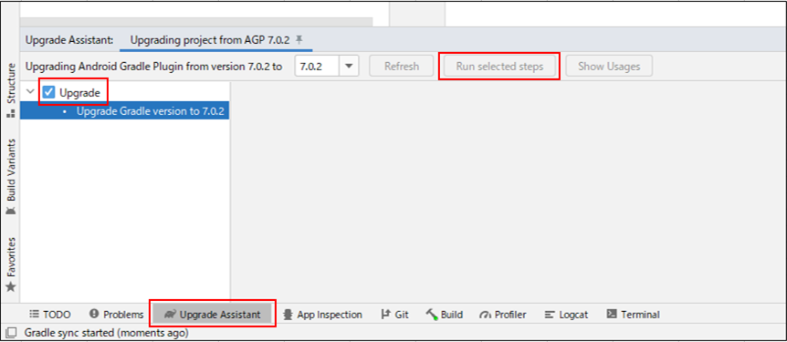

<!-- TOC START min:1 max:3 link:true asterisk:false update:true -->
- [build_gradleの自動アップデートによって変更された内容を打ち消してしまった場合](#build_gradleの自動アップデートによって変更された内容を打ち消してしまった場合)
  - [概要](#概要)
  - [再度、システムによって自動アップデートを実行してもらう方法](#再度システムによって自動アップデートを実行してもらう方法)
<!-- TOC END -->

# build_gradleの自動アップデートによって変更された内容を打ち消してしまった場合

## 概要

buil.gradle は、利用可能なアップデートがあると、 Android Studio の右下にポップアップで  
アップデートを開始するボタンを表示してくれることがある。  
このボタンをクリックして、アップデートを実行した後に、何らかの操作ミスでそのアップデートで  
変更された内容を打ち消してしまうことがある。  
そのような場合には、自分でそれまでの変更を再現することは困難である。

再度、システムによって自動アップデートを実行してもらう方法を以下に記載する。

## 再度、システムによって自動アップデートを実行してもらう方法

再度、システムによって自動アップデートを実行してもらうには、 `Upgrade Assistant` を使用する。

`Upgrade Assistant` は、 Android Studio のメニュータブから  
`Help -> Find Action` を選択し、検索ボックスに `Upgrade Assistant` と入力すれば、  
以下のような `Upgrade Assistant` ウィンドウを表示させることができる。

検索結果には `AGP Upgrade Assistant` と、ただの `Upgrade Assistant` が表示されるが、  
ただの `Upgrade Assistant` を選択すれば O.K.

`Upgrade Assistant` ウィンドウが表示されたら、左のほうに実行可能なアップグレード処理が表示されるので、  
その中から、 (おそらく全部になると思うが) 実行したいアップグレード処理を選択し、  
`Run selected steps` ボタンをクリックすれば、システムによって、必要なアップデートを  
自動的に実行してくれる。
