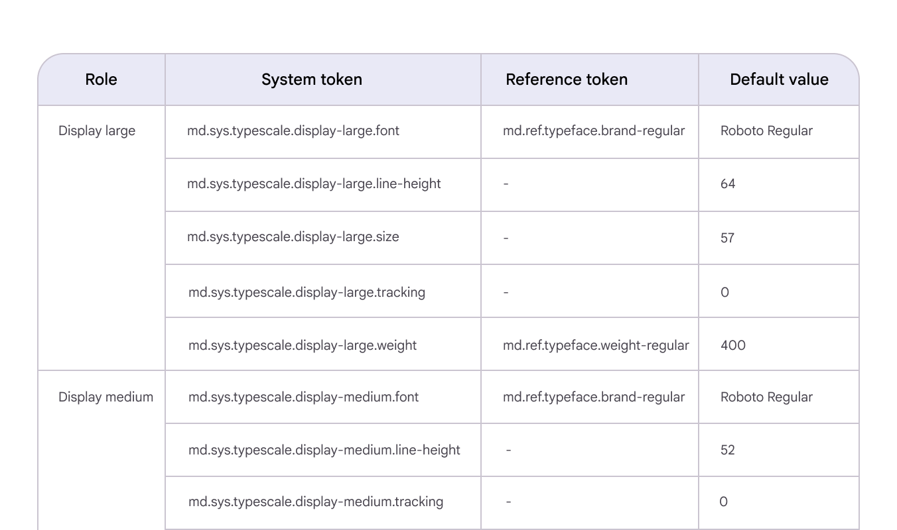
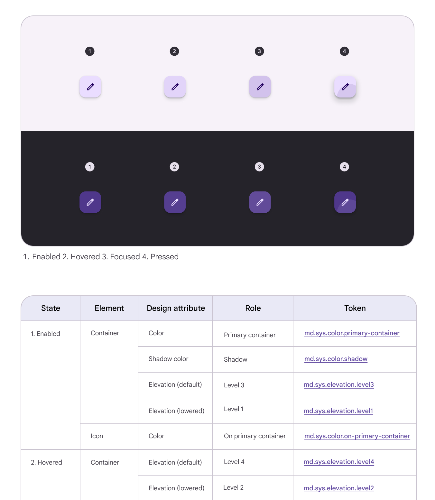
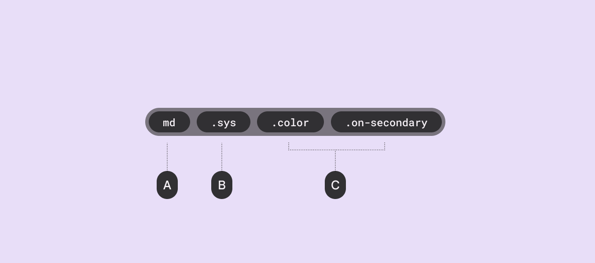
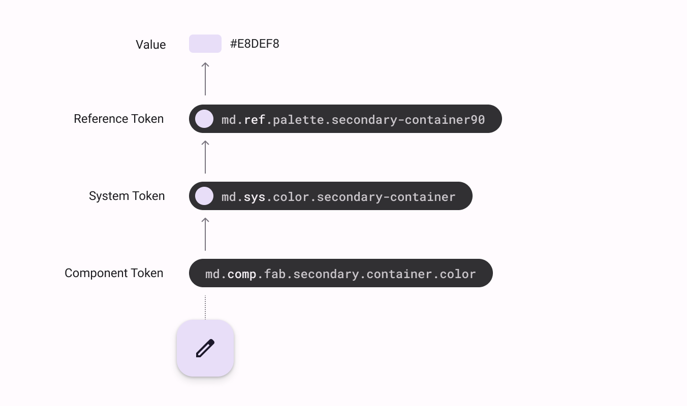
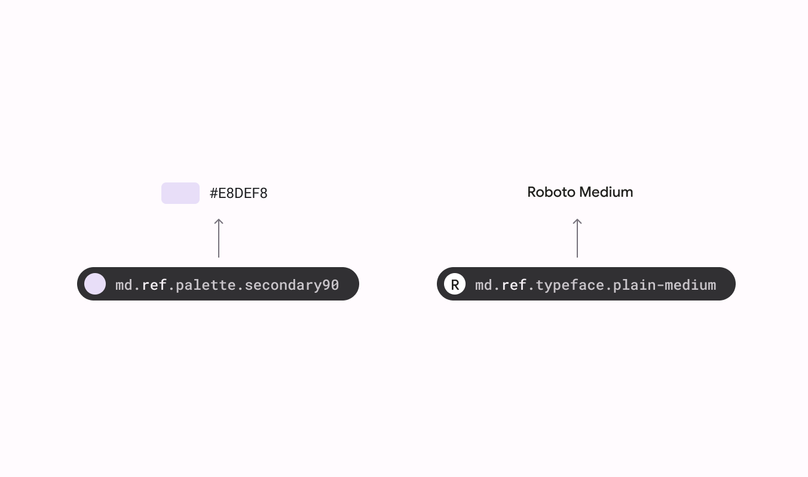
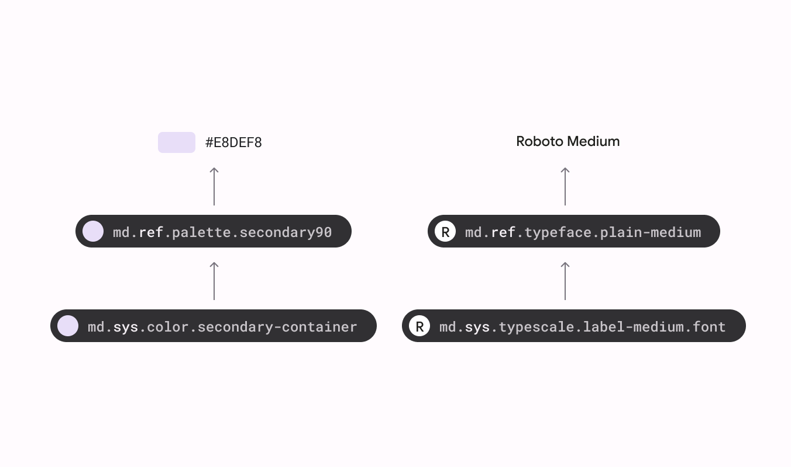
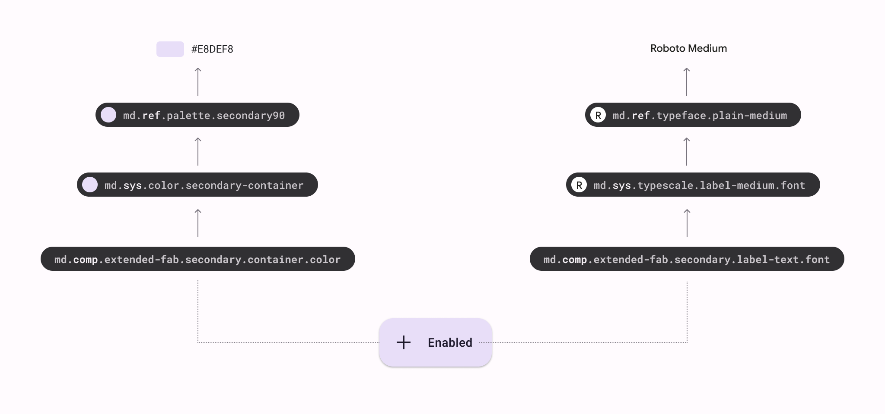
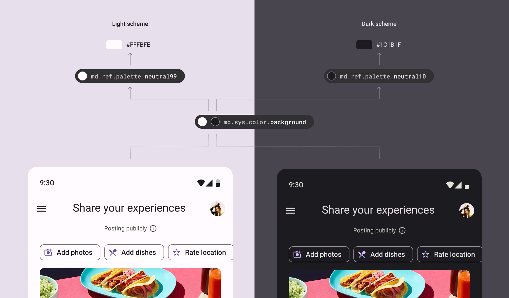

- [トークンの参照方法](#トークンの参照方法)
  - [トークン表](#トークン表)
    - [スタイル](#スタイル)
    - [コンポーネントの仕様](#コンポーネントの仕様)
    - [トークン テーブルの使用](#トークン-テーブルの使用)
    - [トークン名の読み方](#トークン名の読み方)
  - [トークンの種類](#トークンの種類)
    - [参照トークン](#参照トークン)
    - [システム トークン](#システム-トークン)
    - [コンポーネント トークン](#コンポーネント-トークン)
  - [コンテキストに応じて異なるデフォルト値を参照する](#コンテキストに応じて異なるデフォルト値を参照する)
  - [引用元資料](#引用元資料)

# トークンの参照方法

## トークン表

### スタイル

Material のガイドラインには、 [色](https://m3.material.io/m3/pages/static/baseline#c9263303-f4ef-4a33-ad57-7d91dc736b6b) と [タイポグラフィ](https://m3.material.io/m3/pages/typography/tokens#d74b73c2-ac5d-43c5-93b3-088a2f67723d) のトークンをリストした表があります。

トークン参照表を使用すると、色、フォント、フォント サイズ、フォント ウェイトなどの Material のデフォルト値を調べることができます。

表は、ロール、そのシステム トークン、参照トークン、および保存されたデフォルト値の関係をマッピングします。

スタイル記事のトークンテーブルの例

### コンポーネントの仕様

コンポーネント ガイドラインの仕様セクションにもデザイン トークンがあります。

これらの表には、次のデータを含む図が表示されます。

- **状態 ( State )**
  - コンポーネントのインタラクション ステータス (有効、ホバー、押下など)。

- **要素 ( Element )**
  - 特定のトークン、または、値が適用されるコンポーネントの一部 (ボタンのコンテナーや、ボタンのラベルテキストなど) 。

- **デザイン属性 ( Design attribute)**
  - トークンまたは値が適用されるスタイルの外観 (色やフォントなど) 。

- **役割 ( Role )**
  - システム トークンのニックネーム ( `secondary container color` や `Headline 1` など) 。

- **トークンまたは値 ( Token または Value )**
  - トークンに保存されているか、ハードコードされているデザイン属性を定義する情報。

コンポーネント記事の仕様タブに表示される設計図とトークン テーブルの組み合わせの例

### トークン テーブルの使用

例: 塗りつぶされたボタンのラベル テキストの既定の色を調べるには、まず、一般的なボタンのガイドライン ページの仕様タブに移動します。

次に、塗りつぶされたボタンの色の値を示すテーブルを見つけ、要素の下にリストされているラベル テキストを探します。

トークン列のラベル テキストの色のトークンが、探しているものです。

### トークン名の読み方

トークン名の各部分はピリオドで区切られ、最も一般的な情報 ( `md` ) から最も具体的な情報 ( `on-secondary` ) へと続きます。

A. デザイン システム内のすべてのトークン名はシステム名で始まります ( Material Design の場合は md など)

B. トークン タイプの略語を示します。

- `ref` は参照トークン
- `sys` はシステム トークン
- `comp` はコンポーネント トークン

C. トークン名は、トークンの役割を伝える説明的な名前で終わります

## トークンの種類

Material には 3 種類のトークンがあります:

1. **参照トークン**

関連する値を持つすべての使用可能なトークン

2. **システム トークン**

色やタイポグラフィから高度や形状まで、デザイン システムに特徴を与える定義と役割

3. **コンポーネント トークン**

ボタン アイコンの色など、コンポーネント内の要素に割り当てられるデザイン属性

3 種類のトークンを使用して、チームはデザイン決定をグローバルに更新したり、単一のコンポーネントに変更を適用したりできます。

スケーラブルなカラー値を定義する 3 つのトークンのシステムを通じてコン​​テナーの色を受け取るボタンの図。カラー トークンは、トークン構文に影響を与えずに簡単に変更できる特定の 16 進値を指します。

### 参照トークン

参照トークンは `md.ref` で始まります。

これらのトークンは、デザイン システムで使用できるすべてのスタイル オプションで構成されます。

これらは通常、色やフォントの 16 進コードやタイプの太さなど、静的な値を指します。一般的な用途は次のとおりです。

- 16 進数の値を使用して表現された色 
- 書体
- フォントの太さ

参照トークンは他の参照トークンを指すこともできます。ユーザーやデバイスのコンテキストに基づいて変更されることはありません。

Material の参照トークンのリストは、一貫した色、タイプ、測定などの開始点を提供します。

色とタイポグラフィの参照トークンとその値

### システム トークン

サブシステム トークンは `md.sys` で始まります。

これらは、特定のテーマまたはコンテキストのデザイン言語を体系化する決定です。

システム トークンは、UI で参照トークンが果たす目的を定義します。

テーマを適用する場合、システム トークンは、明るいテーマや暗いテーマなど、コンテキストに応じて異なる参照トークンを指すことができます。可能な限り、システム トークンは静的な値ではなく参照トークンを指す必要があります。

システムトークン、参照トークン、およびそれらの値

### コンポーネント トークン

すべてのコンポーネント トークンは md.comp で始まります。

コンポーネント トークンは、コンテナ、ラベル テキスト、アイコン、状態など、コンポーネントを構成する要素と値を表します。

可能な限り、コンポーネント トークンは 16 進コードなどのハード値ではなく、システム トークンまたは参照トークンを指す必要があります。

一部のコンポーネント スタイルの選択はトークンとして表現されませんが、デザインの選択が同様の用途を持つ複数のコンポーネントに適用される場合は常にトークンを使用する必要があります。

注: マテリアル デザイン コンポーネント トークンは現在開発中です。

コンポーネントトークン、システムトークン、参照トークン、およびそれらの値

## コンテキストに応じて異なるデフォルト値を参照する

トークンは、一連の条件に応じて異なる値を指すことができます。これらの条件はコンテキストと呼ばれ、オーバーライド値はコンテキスト値と呼ばれます。

異なるコンテキストの例には、デバイスのフォーム ファクター、ダーク テーマ、高密度レイアウト、右から左への書記体系などがあります。

コンテキストは一種のタグと考えることができます。トークン値がダーク テーマでタグ付けされている場合、ダーク テーマ コンテキストのデフォルトのトークン値がオーバーライドされます。

例えば、背景色の同じシステムトークンは、明るいテーマまたは暗いテーマのコンテキストに応じて異なる参照トークンを指すことができます。

## 引用元資料

- [Design tokens : How to read tokens](https://m3.material.io/foundations/design-tokens/how-to-read-tokens)
