- [Color system](#color-system)
  - [塗り絵のようなものです](#塗り絵のようなものです)
  - [必須用語](#必須用語)
    - [色相、彩度、トーン (HCT) で色を定義](#色相彩度トーン-hct-で色を定義)
      - [色相（Hue）](#色相hue)
      - [彩度（Chroma）](#彩度chroma)
      - [トーン（Tone）](#トーンtone)
  - [ダイナミックカラーの生成と割り当ての全体像](#ダイナミックカラーの生成と割り当ての全体像)
  - [ダイナミックカラーでカラースキームを生成](#ダイナミックカラーでカラースキームを生成)
    - [ソースカラーを選択する](#ソースカラーを選択する)
      - [1. 壁紙から生成](#1-壁紙から生成)
      - [2. アプリ内コンテンツから生成](#2-アプリ内コンテンツから生成)
      - [3. 手作業で選択](#3-手作業で選択)
    - [ソース カラーをアルゴリズムに渡す](#ソース-カラーをアルゴリズムに渡す)
    - [キーカラーを生成する](#キーカラーを生成する)
    - [トーンパレットを作成する](#トーンパレットを作成する)
    - [トーンパレットの特定の色に特定の役割を持たせる](#トーンパレットの特定の色に特定の役割を持たせる)
    - [カラー ロールは UI 要素に反映されます](#カラー-ロールは-ui-要素に反映されます)
  - [ユーザーによって変更可能な 3 段階のコントラスト](#ユーザーによって変更可能な-3-段階のコントラスト)
    - [概要](#概要)
      - [標準](#標準)
      - [中](#中)
      - [高](#高)
    - [コントラストの変更方法](#コントラストの変更方法)
    - [ライトテーマとダークテーマの両方に対応](#ライトテーマとダークテーマの両方に対応)
  - [アクセシブルなトーンの組み合わせ](#アクセシブルなトーンの組み合わせ)
    - [トーンパレットの概要](#トーンパレットの概要)
    - [3 段階のコントラストを実現する仕組み](#3-段階のコントラストを実現する仕組み)

# Color system

## 塗り絵のようなものです

製品画面を塗り絵のキャンバスとして想像してください:

- 画面上の各要素には番号が付いています
- 各番号には色が割り当てられています

UIの各部分には「番号」が割り当てられ、各「番号」には色が割り当てられます

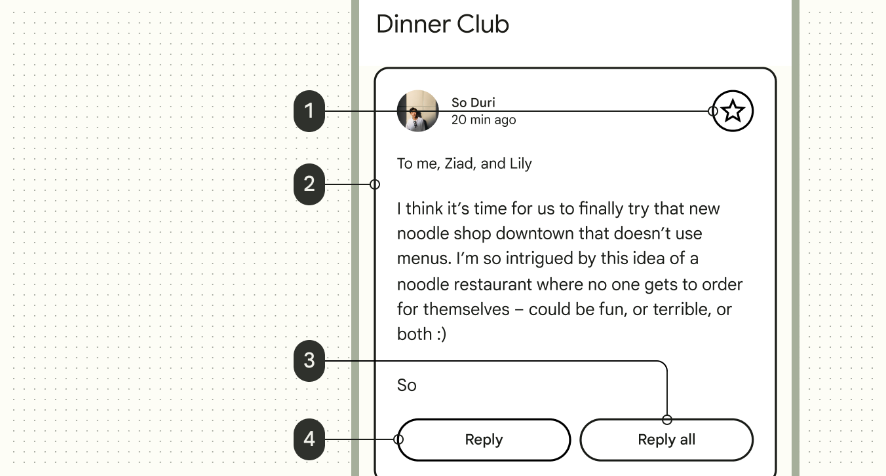

すべての「数字」に手動で色を選択して、静的な配色を作成することもできます。

静的な色は、この緑のアイコンボタンのように、手動で選択されます

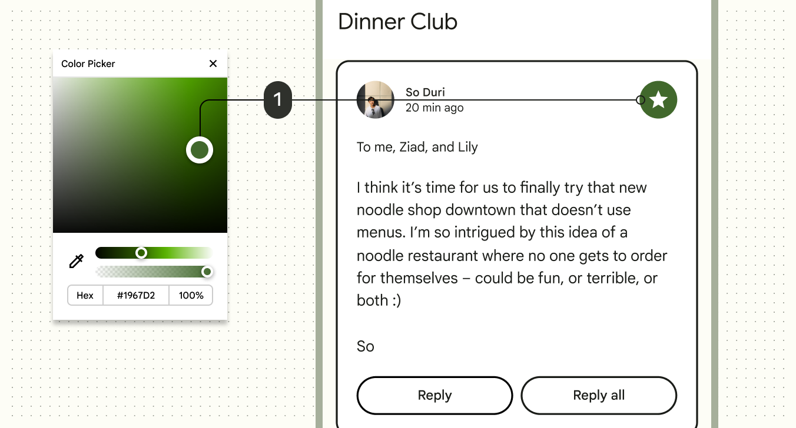

しかし、最近では、Material の動的カラー機能を使用して、各「番号」に割り当てられたアクセス可能な色を自動的に生成できます。

ダイナミックカラーは、ユーザーの壁紙やアプリ内コンテンツから自動的に生成されます。

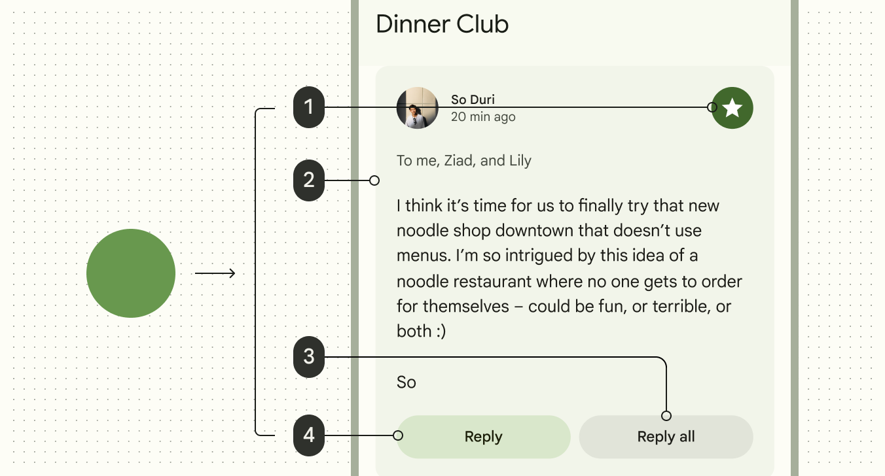

次の方法で、製品内での動的な色の表示方法をカスタマイズできます。

- 色ソースの設定
  - プライマリーカラーやセカンダリーカラーを変更すること
- 静的または調和された色の追加
  - セカンダリーカラーやターシャリーカラーが設定されていなかったアプリに対して、それらの色を設定すること
- どの要素にどの「番号」を割り当てるかを変更する
  - 各要素にどのテーマカラーが設定されるのかを変更すること

[高度なカスタマイズについて学ぶ](https://m3.material.io/styles/color/advanced/overview)

次の図は、カラーソースを変更して、カラースキームを自動的に変更する例です。 UI 要素には、他の「番号」を割り当てることができます。

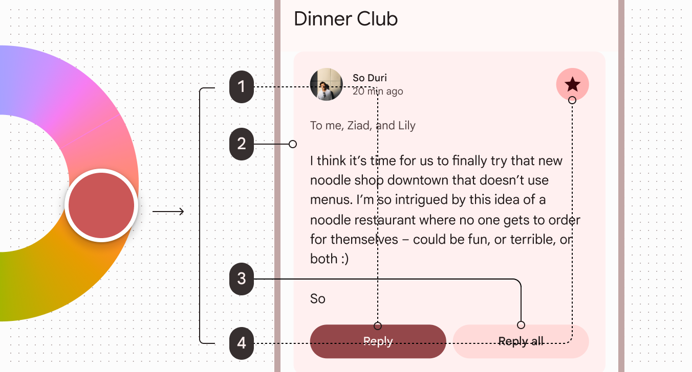

## 必須用語

- **カラーロール (カラースキームとも呼びます)**
  - 塗り絵のキャンバスの「数字」の役割を果たします。
  - カラー ロールは特定の UI 要素に割り当てられます。
  - カラー ロールには、primary、on primary、primary containerなどの名前が付けられています。
  - 同じカラー ロールが、ライト テーマとダーク テーマの両方で使用されます。
  - [すべてのカラーロールを見る。](./2.Color%20roles.md)

- **ダイナミックカラー**
  - ダイナミック カラーは、ユーザーの壁紙またはアプリ内コンテンツから単一の色を取得します。
  - UI 内の要素に使用される配色を作成します。
  - ユーザーの壁紙、または、アプリ内コンテンツが変更されると、アプリ内コンテンツの色もそれに合わせて変更されます。

- **静的カラー**
  - ユーザーの壁紙やアプリ内コンテンツに基づいて変化しない色。
  - 静的カラーは手動で選択することも、 Material Theme Builder などのデザインツールで生成することもできます。
  - それぞれのカラー ロールと UX 要素に割り当てられると、カラーは一定のままになります。

- **ベースラインカラー**
  - マテリアル製品のデフォルトの静的カラースキーム。
  - 明るいテーマと暗いテーマの両方の色が含まれます。
  - [ベースラインカラースキームを参照してください。](https://m3.material.io/styles/color/static/baseline)

### 色相、彩度、トーン (HCT) で色を定義

このシステムでは、HCT と呼ばれる色空間を使用します。HCT は、色相、彩度、トーンの 3 つの次元を使用してすべての色を定義します。

HCT 値を変更すると、柔軟かつ予測可能な方法で色を操作できます。他の色空間 (HSL や RGB など) とは異なり、HCT では色のトーンに影響を与えずに色相と彩度を操作できます。

色相、彩度、トーンは、アクセシブルな配色を作成するために使用される 3 つの色の次元です。

#### 色相（Hue）

色相とは、赤、オレンジ、黄色、緑、青、紫などの色の認識です。色相は 0 ～ 360 の範囲の数値で定量化され、円形のスペクトルです (値 0 と 360 は同じ色相です)。

以下は 360 度の色相環です。

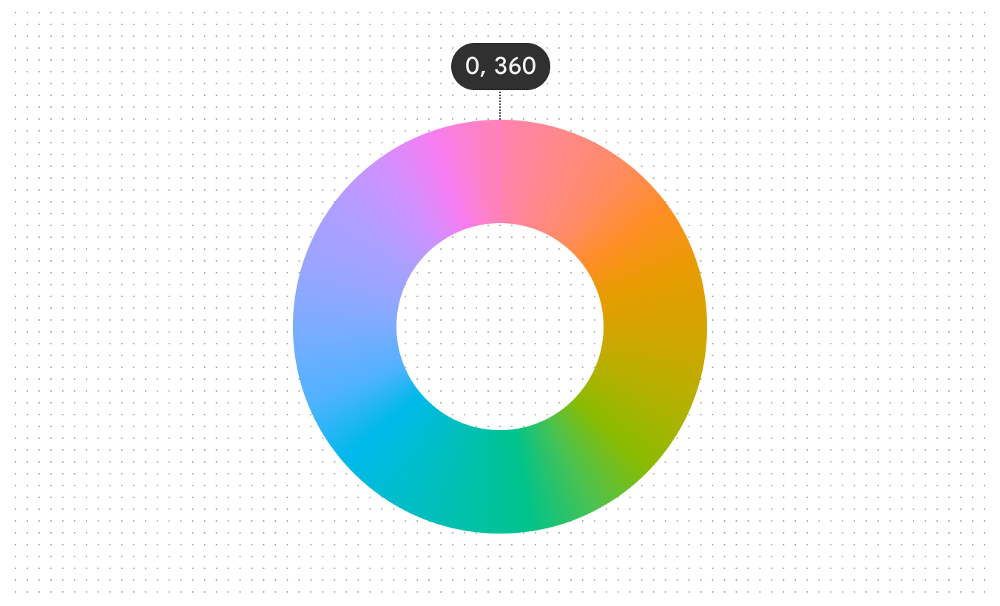

#### 彩度（Chroma）

彩度とは、色がどれだけカラフルまたはニュートラル (灰色、黒、白) に見えるかです。彩度は 0 (完全に灰色、黒、白) から無限大 (最も鮮やか) までの数値で定量化されますが、HCT の彩度値はおよそ 120 で上限となります。

生物学的制限と画面レンダリングの制限により、色相やトーンによって最大彩度値は異なります。

①色純度が高いほど、彩度も高くなります  
②トーンを明るくしたり暗くしたりすることで彩度値も影響を受けることに注意してください

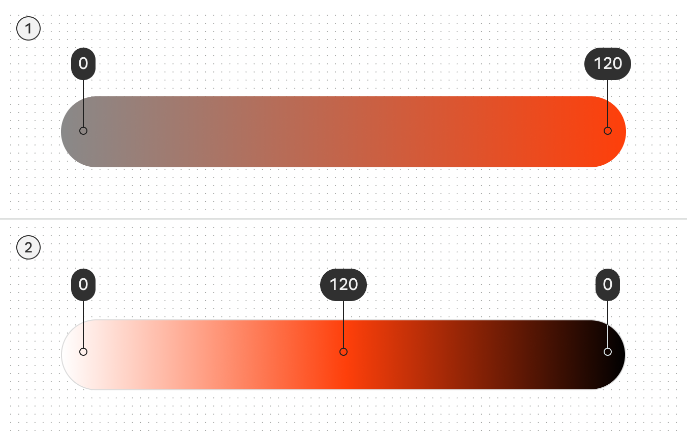

#### トーン（Tone）

トーンとは、色の明るさや暗さの度合いのことです。トーンは輝度とも呼ばれます。トーンは、0 (純粋な黒、輝度なし) から 100 (純粋な白、完全な輝度) までの数値で表されます。

トーンはコントラストを決定するため、視覚的なアクセシビリティにとって非常に重要です。トーンの差が大きい色はコントラストが高くなり、差が小さい色はコントラストが低くなります。

100 トーンは常に 100% 白で、範囲内で最も明るいトーンです。0 トーンは 100% 黒で、範囲内で最も暗いトーンです。

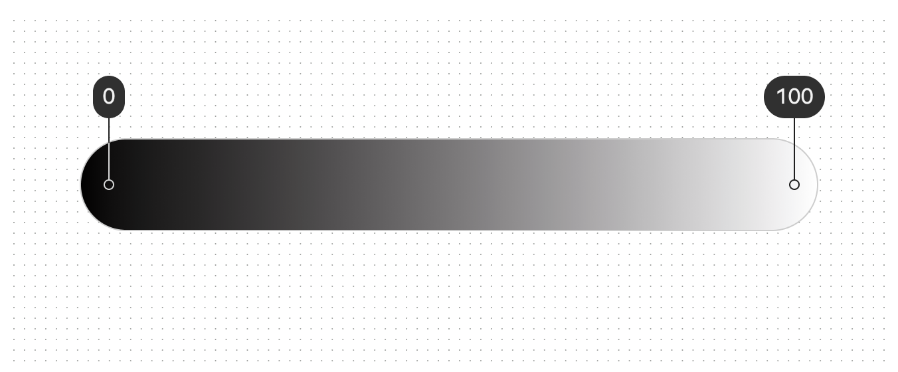

- トーンパレット
  - [トーンパレットを作成する](#トーンパレットを作成する) のセクションを参照してください。

## ダイナミックカラーの生成と割り当ての全体像

ダイナミックカラーの生成、割り当てプロセスは、以下の順で、自動的に行われます。

1. 単一のソースカラーを使用して、以下の 5 つのキーカラーを生成する。詳しくは、 [キーカラーを生成する](#キーカラーを生成する) セクションをご覧ください。
2. 各キーカラーを使用してトーンパレットを作成する。
3. パレットのトーンをカラーロールに割り当てる。 (割り当て後の一覧をカラースキームと呼びます。)
4. 各カラーロールが UI の要素に割り当てられる。

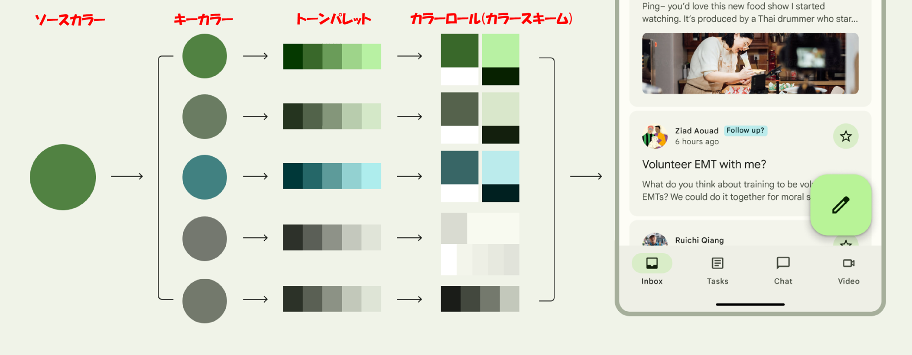

システムは壁紙やアプリ内コンテンツなどの画像の色を使用して動的な配色を生成します。

## ダイナミックカラーでカラースキームを生成

### ソースカラーを選択する

ソースカラーを取得するには 3 つの方法があります。

#### 1. 壁紙から生成

ユーザー生成カラーは、ユーザーの個人的な壁紙から生成されます。壁紙は量子化と呼ばれるプロセスを通じてデジタル分析され、単一の色がソースカラーとして選択されます。

以下は、ユーザーの壁紙から選択されるソースカラーのイメージです。

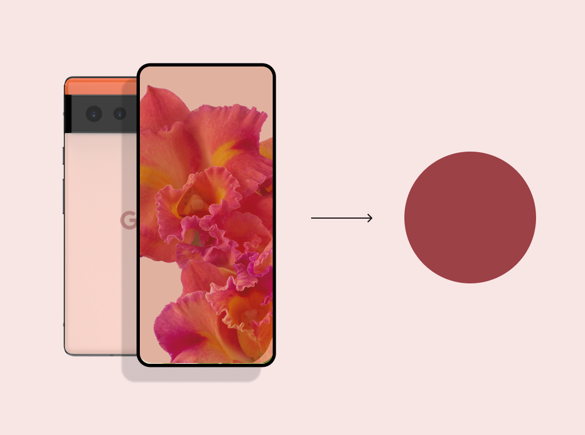

#### 2. アプリ内コンテンツから生成

コンテンツベースの色は、アルバムのサムネイル画像、ロゴ、ビデオのプレビューなどのアプリ内コンテンツから生成されます。

壁紙から生成する場合と同様に、画像は量子化によってデジタル分析され、単一の色がソース色として選択されます。

以下は、アプリ内コンテンツからソースカラーが選択されるイメージです。

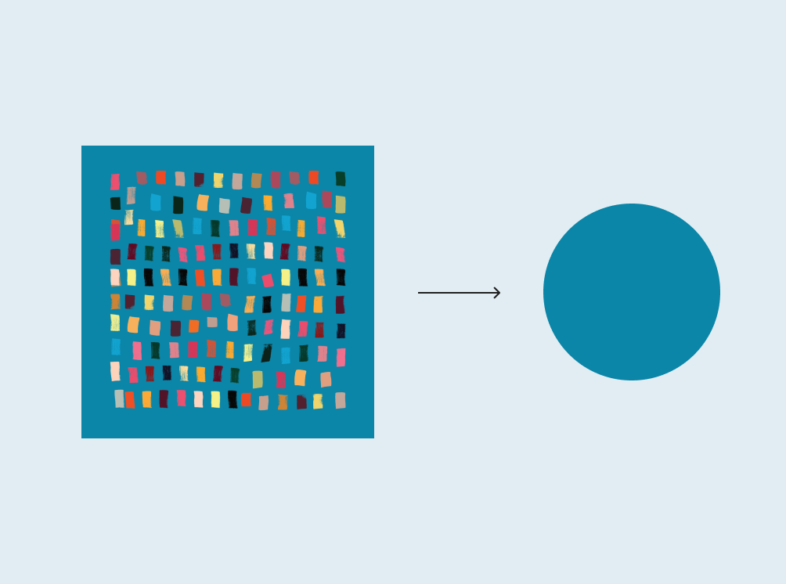

#### 3. 手作業で選択

手作業で選択した色は、デザイナーが意図的に選択します。

ベースラインの配色は、手作業で選択したソースカラーから、テーマカラーの生成が始まります。

以下は、デザイナーがソースカラーを選択するイメージです。

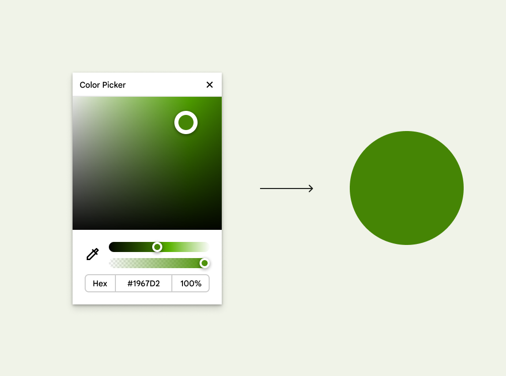

### ソース カラーをアルゴリズムに渡す

ダイナミック カラーは、 [Material Color Utilities ( MCU )](https://github.com/material-foundation/material-color-utilities) によって実現されます。これは、アプリでカラー テーマやスキームを開発しやすくするアルゴリズムとユーティリティを含むカラー ライブラリのセットです。

カラー アルゴリズムは多数ありますが、最も一般的なものは次のとおりです。

**1. ユーザー生成カラー**

個人の壁紙を使用してソース カラーを識別します。システム設計の選択とユーザーの好みの組み合わせに従って、特定のトーン (明るい色または暗い色) のカラーをスキームにマッピングします。

1. ソースカラーをユーザー生成（壁紙ベース）アルゴリズムで実行して配色を作成する

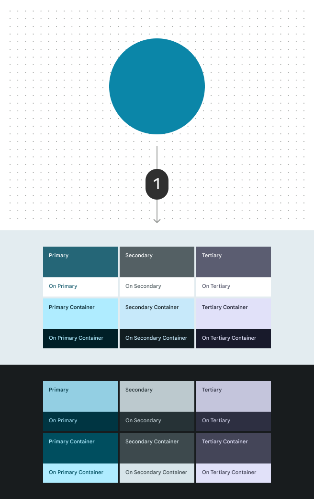

**2. コンテンツ ベースのカラー**

トーンは、アクセス可能なコントラストを維持しながら、ソース イメージの外観に合わせて調整されます。

2. 同じソース カラーをコンテンツ ベースのアルゴリズムに通してカラー スキームを作成します。一部の色のトーン (明るさや暗さ) が調整され、ソース イメージの外観に一致するようになっていることに注意してください。

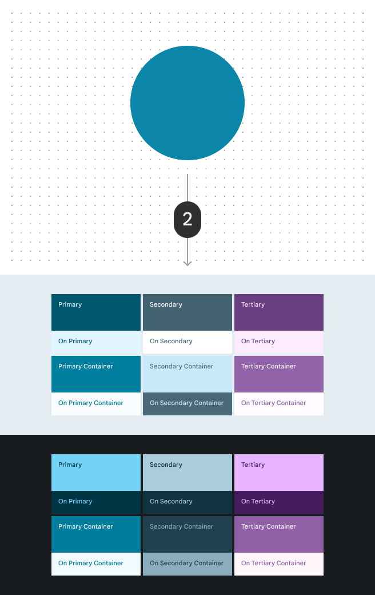

**3. カスタム カラー**

ブランドやセマンティックな意味を表す色など、選択した入力色に厳密に一致する色です。

3. ブランドカラーなどのカスタムカラーは、アルゴリズムを通じて個別に実行され、ブランドに一致するカスタムスキームが作成されます。

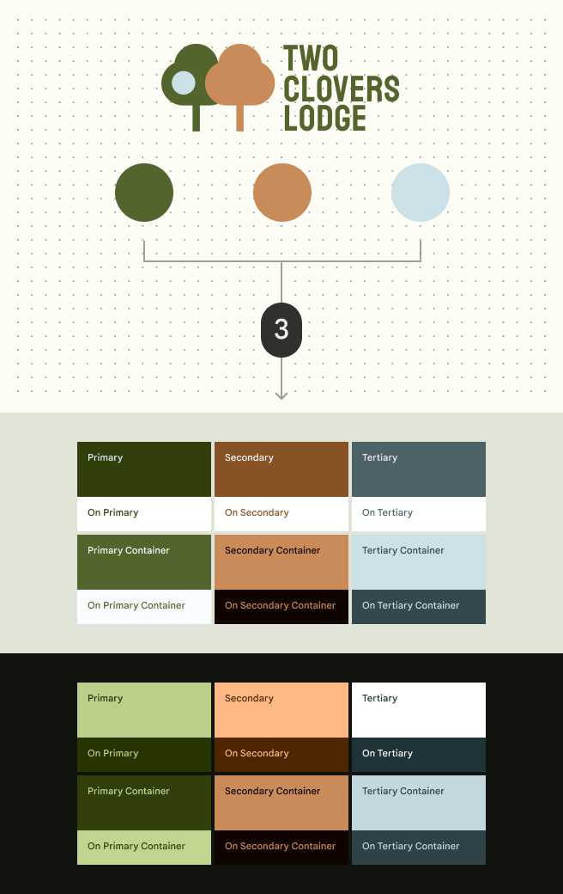

### キーカラーを生成する

マテリアルのカラーアルゴリズムはソースカラーの色相と彩度を操作して 5 つの補色キーカラーを生成します。

これらの色の名前は次のとおりです:

- プライマリ
- セカンダリ
- ターシャリ
- ニュートラル
- ニュートラルバリアント

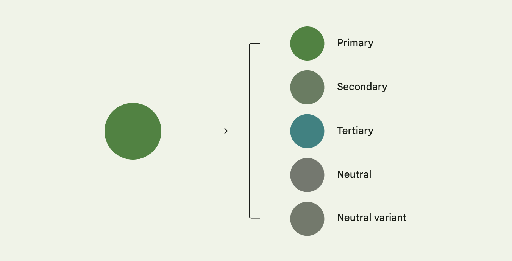

### トーンパレットを作成する

次に、システムはトーンと彩度の値を操作して、各キーカラーのトーンパレットを作成します。

色調値が小さいほど、色が暗くなります

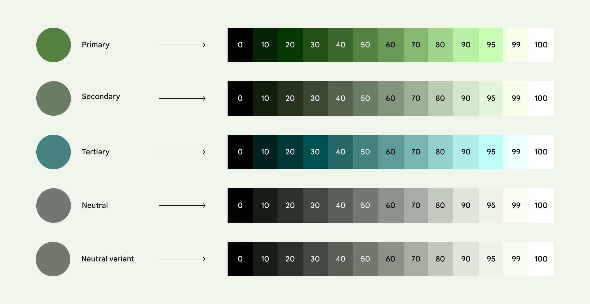

### トーンパレットの特定の色に特定の役割を持たせる

アルゴリズムは、 [アクセス可能な色の関係](#アクセシブルなトーンの組み合わせ) を使用して、特定の色調を 26 の色の役割に割り当てます。

たとえば、色調 primary4​​0 には Primary の役割が割り当てられ、primary100 には On Primary の役割が割り当てられています。

[すべての色の役割](./2.Color%20roles.md)

トーンパレットのトーンはさまざまな役割に適用されます

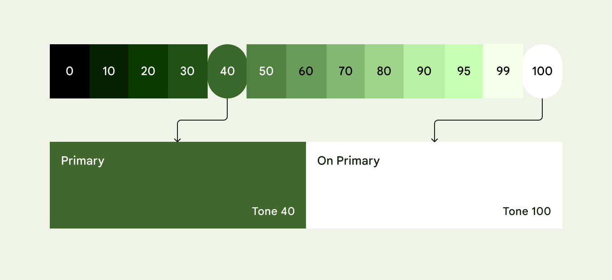

5 つのトーンパレットから、特定の色を特定の役割に割り当てます。たとえば、プライマリーロールはプライマリートーンパレットから選択され、サーフェスロールはニュートラルトーンパレットから選択されます。

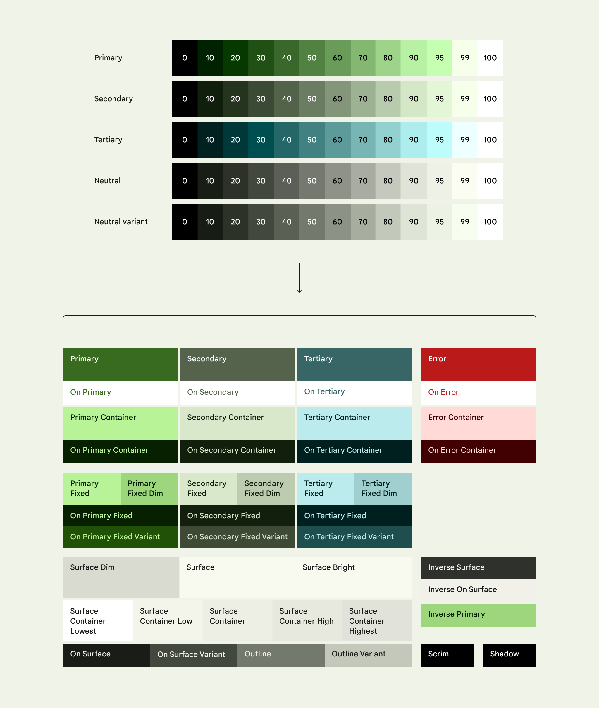

ダーク テーマの色も自動的に割り当てられるため、アプリは単一の色の役割セットを通じてライト テーマとダーク テーマの両方を受け取ることができます。

明るいテーマと暗いテーマで同じ色の役割が使用されています

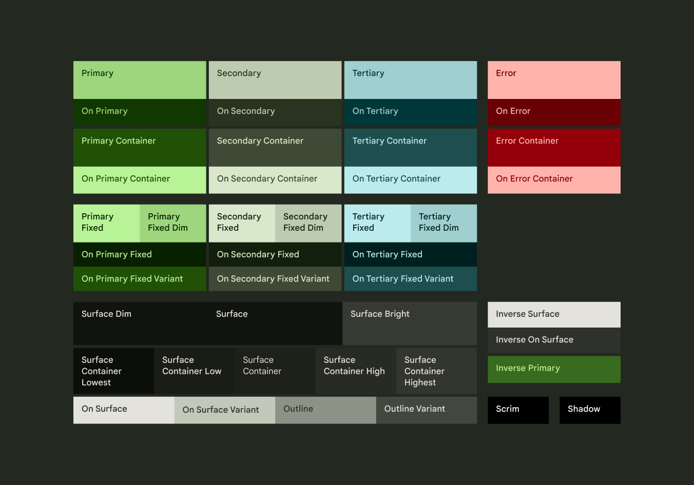

### カラー ロールは UI 要素に反映されます

26 の標準カラー ロールは、すでに UI の要素に割り当てられています。新しいソース カラーが選択されると、UI のカラーが動的に変更されます。

UI に割り当てられた色の役割

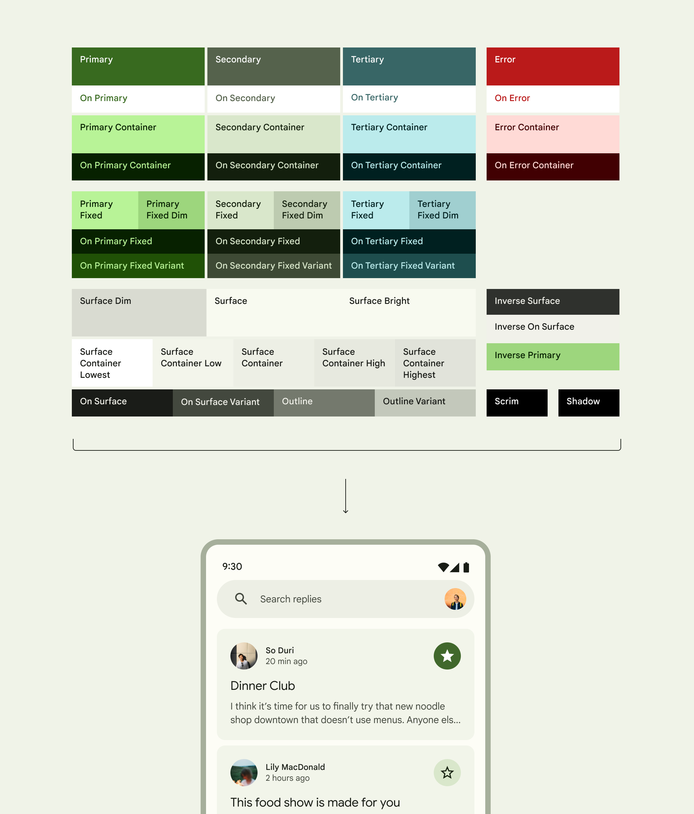

## ユーザーによって変更可能な 3 段階のコントラスト

### 概要

アクセシブルなトーンの組み合わせで色の関係を定義することで、カラー システムは、 **ユーザーが視覚ニーズに最適なコントラスト設定を選択できるようにします。** 選択できるコントラスト レベルは 3 つあります。

#### 標準

認知障害のある人など、視覚的な階層を好む人をサポートするために、ベースラインの配色では、混合コントラストを標準コントラストとして使用しています。

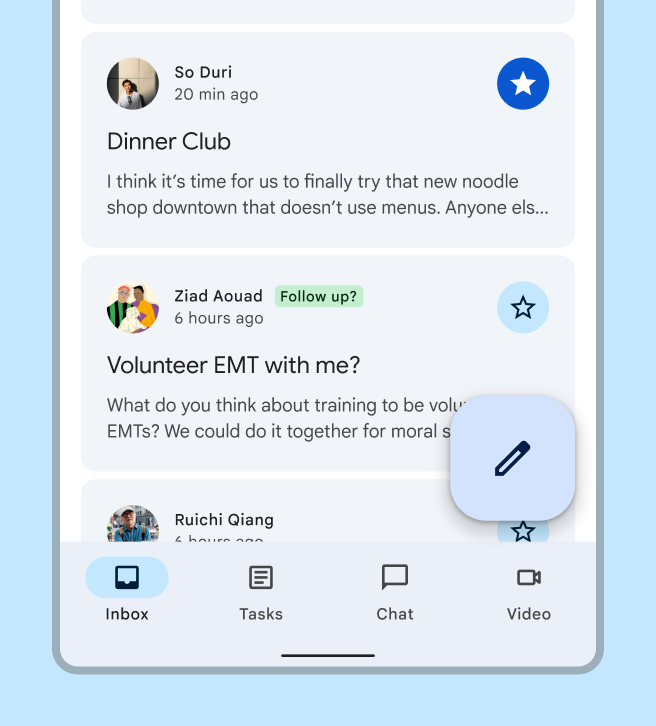

#### 中

高いコントラストで視覚的な不快感を感じるユーザーのために、最低 3:1 のコントラスト比を提供します。画面の明るさを上げると、光がハレーションと呼ばれる効果で、設定された境界を超えて広がるように見える可能性があり、一部のユーザーに不快感を与える可能性があります。

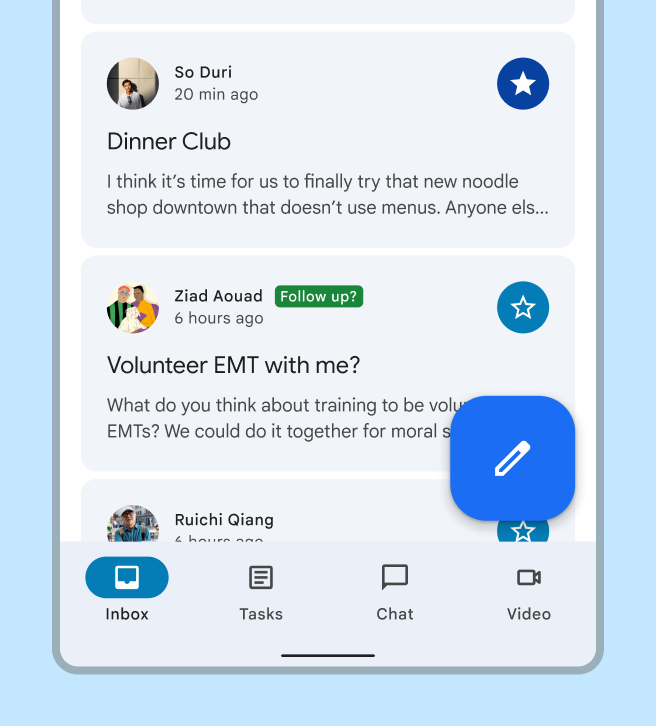

#### 高

色を通じて最大限の視覚的サポートを提供します。ただし、全ての境界において、コントラストを高めるわけではありません。このコントラスト設定は、ユーザーが集中すべきものだけに集中できるように、重要な要素のみを強調します。たとえば、カード内のコンテンツには高コントラストが適用されますが、カード コンテナーは、低いコントラストのままとなります。

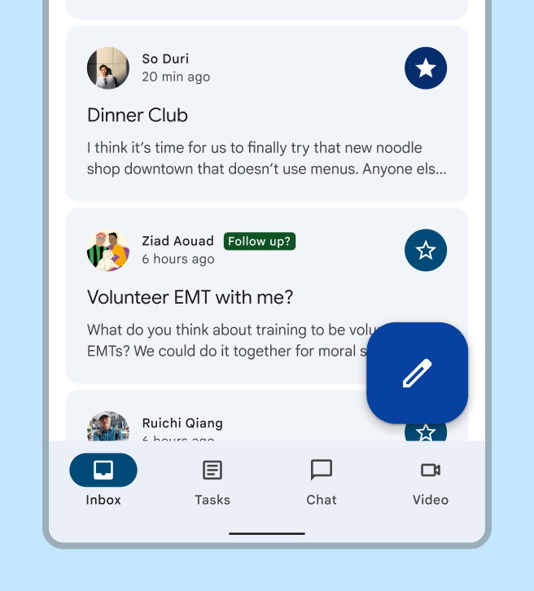

一般的なユーザーは、標準コントラスト設定 (必要最小限のところのみ高コントラストにする設定) の方がメリットがあります。視覚障害のあるユーザーの場合は、中または高コントラスト オプションの方がメリットがあります。

### コントラストの変更方法

新しい中および高コントラスト レベルは、Pixel および Android OS で利用できます。

現時点では、この 3 段階のコントラストの設定は、開発者向けオプションの中の 「描画」 セクションにしか存在していない模様です。 ( 2024 年 10 月現在)

### ライトテーマとダークテーマの両方に対応

コントラスト設定は、明るいテーマと暗いテーマの両方に自動的に適用されます。

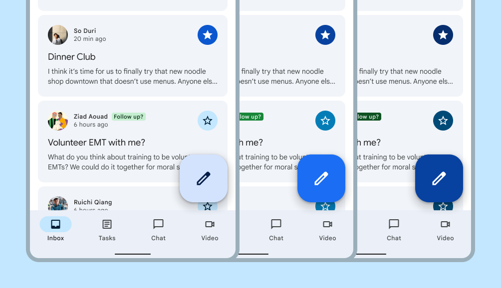

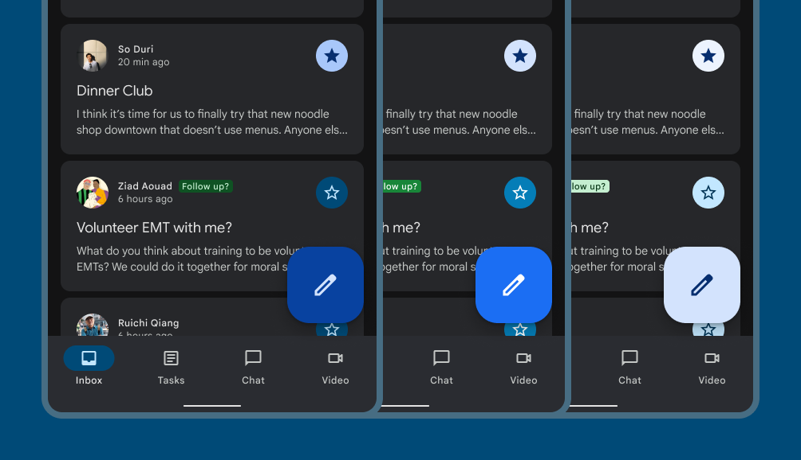

マテリアル コンポーネント ライブラリに含まれないカスタム コンポーネントは、コンテナ上の色とコンテナの色をペアにするなど、カラー ロールと対応するトークンにマップされていない限り、コントラストの変更を継承しません。

このカスタムボリュームスライダーは、標準コントラストで特定の色の値を継承するプライマリコンテナとプライマリコンテナ上のカラーロールを使用します。

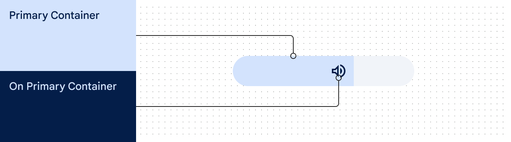

これを解決するには、カスタム コンポーネントは同じ役割と名前を維持しながら、デザイン トークンを通じてトーンに再マップする必要があります。

中程度およびその他のコントラストレベルでは、同じ色の役割は自動的に必要な新しい色の値を継承します。

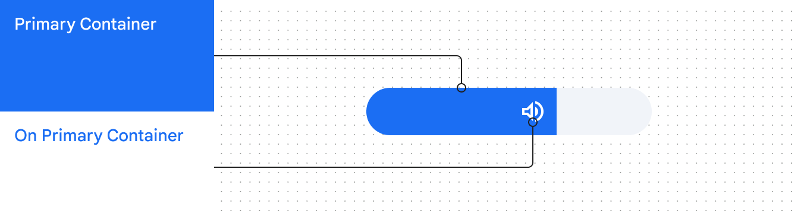

## アクセシブルなトーンの組み合わせ

### トーンパレットの概要

システムは HCT 値を操作して、0 から 100 までの範囲のトーンを持つ各色のトーン パレットを作成します。

色には物理的な制限があります。実際の物理的制限、人間の生物学的視覚制限、または画面上の色レンダリングの制限などです。たとえば、特定の彩度またはトーンでは一部の色相は存在できません。色の制限があるため、明るく輝く青や明るく輝く赤などの色は実現できません。これが、トーン パレット内の一部のトーンの彩度値が増加または減少する理由です。

トーン値の範囲は 0 (黒) から 100 (白) です。トーン値が小さいほど、色が暗くなります。

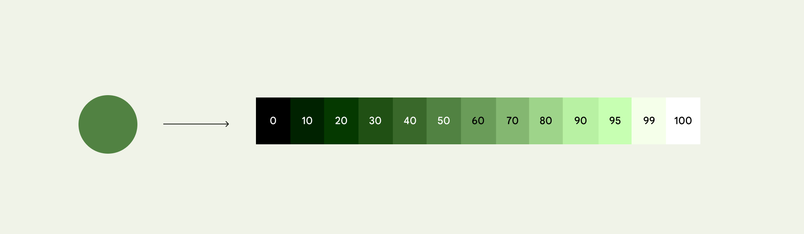

Material のカラー アルゴリズムは、これらのパレットを使用して対照的なトーンを見つけて組み合わせ、アクセシブルな色の組み合わせを作成します。

### 3 段階のコントラストを実現する仕組み

トーンは色の明るさ/暗さを表すことができるため、アクセシブルな色の関係を定義するために使用されます。これらの関係は、Material のカラー アルゴリズムに組み込まれています。

たとえば、アルゴリズムはボタンのコンテナの色に暗いトーンを割り当て、ラベルの色に明るいトーンを割り当てて、色のコントラストが 3:1 になるようにします。

ボタンとそのラベルにトーン 50 と 99 を使用すると、アクセスしやすい 3:1 のコントラストが作成されます

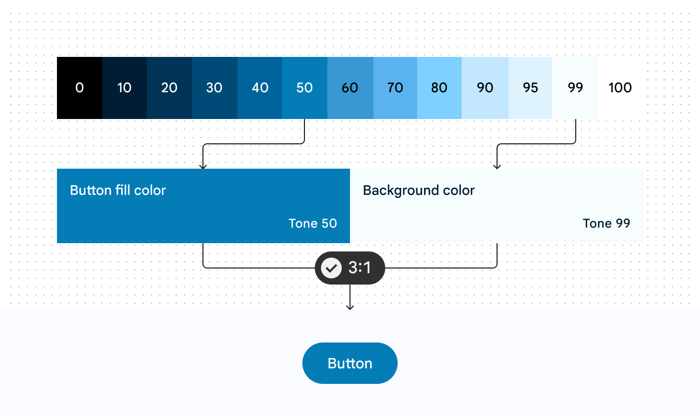

さらにコントラストを高めるために、アルゴリズムはトーンをさらに離して割り当て、7:1 のコントラストを実現します。

これが、ユーザー制御のコントラスト機能の原動力となるコンセプトです。

ボタンとそのラベルにトーン30と99の色を使用すると、7:1のコントラストが生まれます。

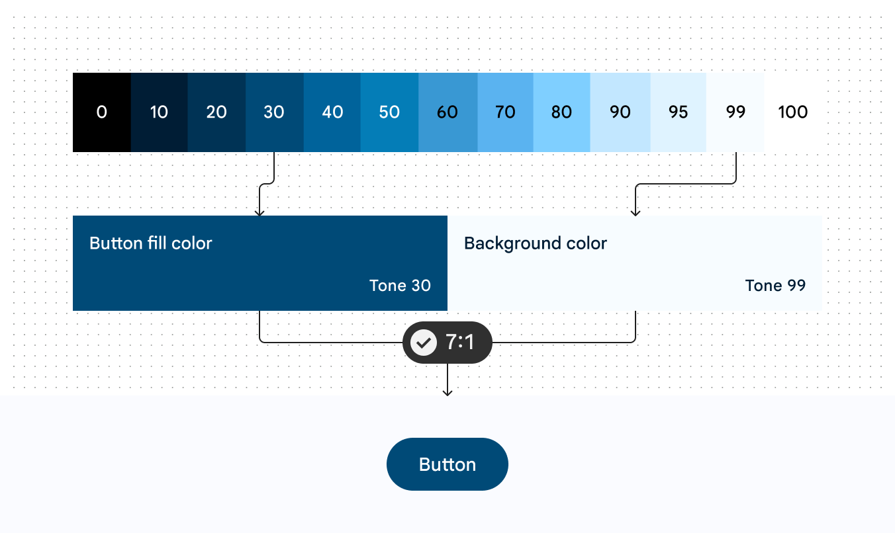

