- [カラーロール](#カラーロール)
  - [カラーロール（カラースキーム）とは](#カラーロールカラースキームとは)
  - [キーカラーがどのカラーロールに反映されるのか](#キーカラーがどのカラーロールに反映されるのか)
  - [基本事項](#基本事項)
    - [ロールの名前](#ロールの名前)
      - [Surface](#surface)
      - [Primary / Secondary / Tertiary（アクセントカラー）](#primary--secondary--tertiaryアクセントカラー)
      - [Container](#container)
        - [アクセントカラーの Container の場合](#アクセントカラーの-container-の場合)
        - [Surface の Container の場合](#surface-の-container-の場合)
      - [On](#on)
      - [Variant（変異体）](#variant変異体)
    - [色を正しくペアリングする](#色を正しくペアリングする)
      - [正しいペアリングをした場合の例](#正しいペアリングをした場合の例)
      - [誤ったペアリングをした場合](#誤ったペアリングをした場合)
  - [Primary](#primary)
    - [Primary に含まれるロール](#primary-に含まれるロール)
    - [使用方針](#使用方針)
    - [主な用途](#主な用途)
    - [具体的な使用例](#具体的な使用例)
  - [Secondary](#secondary)
    - [Secondary に含まれるロール](#secondary-に含まれるロール)
    - [使用方針](#使用方針-1)
      - [Secondary よりも Secondary Container が多く利用される](#secondary-よりも-secondary-container-が多く利用される)
    - [主な用途](#主な用途-1)
    - [具体的な使用例](#具体的な使用例-1)
  - [Tertiary](#tertiary)
    - [Tertiary に含まれるロール](#tertiary-に含まれるロール)
    - [使用方針](#使用方針-2)
    - [主な用途](#主な用途-2)
    - [具体的な使用例](#具体的な使用例-2)
  - [Error](#error)
    - [Error に含まれるロール](#error-に含まれるロール)
    - [使用方針](#使用方針-3)
    - [主な用途](#主な用途-3)
    - [具体的な使用例](#具体的な使用例-3)
  - [Surface](#surface-1)
    - [Surface に含まれるロール](#surface-に含まれるロール)
    - [使用方針](#使用方針-4)
    - [主な用途](#主な用途-4)
    - [具体的な使用例](#具体的な使用例-4)
      - [背景とナビゲーションに使用する例](#背景とナビゲーションに使用する例)
    - [注意点](#注意点)
    - [異なる強調度の Surface Container を追加することでより立体感を表現する](#異なる強調度の-surface-container-を追加することでより立体感を表現する)
    - [Neutral Color のコンポーネントは、デフォルトでいずれかの Surface Container が設定されている](#neutral-color-のコンポーネントはデフォルトでいずれかの-surface-container-が設定されている)
    - [反転色](#反転色)
  - [Outline](#outline)
    - [Outline に含まれるロール](#outline-に含まれるロール)
    - [使用方針](#使用方針-5)
    - [主な用途](#主な用途-5)
    - [具体的な使用例](#具体的な使用例-5)
    - [4 つの間違った使用方法](#4-つの間違った使用方法)
      - [１．区切り線に Outline を使用するのは NG](#１区切り線に-outline-を使用するのは-ng)
      - [２．複数の要素を含むコンポーネントに Outline を使用するのは NG](#２複数の要素を含むコンポーネントに-outline-を使用するのは-ng)
      - [３．Chip の境界に Outline Variant を使用するのは NG](#３chip-の境界に-outline-variant-を使用するのは-ng)
      - [４．UI 要素の区別が必要な場面で Outline Variant を使用するのは NG](#４ui-要素の区別が必要な場面で-outline-variant-を使用するのは-ng)
  - [アドオン（追加的な）カラーロール](#アドオン追加的なカラーロール)
    - [Fixed アクセントカラー](#fixed-アクセントカラー)
    - [On Fixed アクセントカラー](#on-fixed-アクセントカラー)
    - [Surface Dim と Surface Bright](#surface-dim-と-surface-bright)
  - [Scrim](#scrim)
    - [Scrim に含まれるロール](#scrim-に含まれるロール)
    - [使用方針](#使用方針-6)
    - [主な用途](#主な用途-6)
    - [具体的な使用例](#具体的な使用例-6)
  - [Shadow](#shadow)
    - [Shadow に含まれるロール](#shadow-に含まれるロール)

# カラーロール

## カラーロール（カラースキーム）とは

カラー ロールの主な役割は、塗り絵のキャンバスの「数字」のようなものです。UI の要素と、どの色がどこに配置されるかの結合組織です。

カラーロールには、それ以外にも以下の機能があります。

- **マテリアル コンポーネントに連動しており、すぐに使用可能**
  - 静的ベースライン スキームを使用する場合でも、動的カラーを使用する場合でも、これらのカラー ロールを使用します。
  - アプリにカスタム コンポーネントが含まれている場合は、このカラー ロールのセットに適切にマッピングする必要があります。

- **アクセシビリティ (コントラスト) を確保して、視認性を確保**
  - カラー システムは、アクセス可能なカラー ペアに基づいて構築されています。
  - これらのカラー ペアは、アクセス可能な最小 3:1 のコントラストを提供します。

- **デザインツールで意味のある名前として使用可能 (トークン化)**
  - ロールは、トークンを通じてデザインとコードに実装されます。
  - トークンとは、 Figma 等のデザインツール上での意味名のことだと思われます。
  - トークンは、デザイン システムのビジュアル スタイルの一部である、小さく再利用可能なデザインの単位を表します。

以下の図は、オプションのロールである surface colors と fixed accent colors を含む、すべてのマテリアルカラーロールの図です。

## キーカラーがどのカラーロールに反映されるのか

キーカラーがどのカラーロールに反映されるのかは、 [Material Theme Builder](https://material-foundation.github.io/material-theme-builder/) を使用すれば、おおむね確認することができます。

例えば、以下のキーカラーを設定した場合について考えてみます。

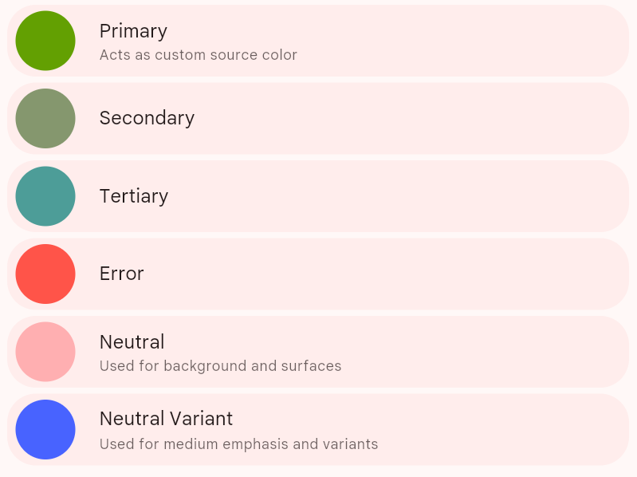

ライトテーマのカラーロールは、以下のようになります。

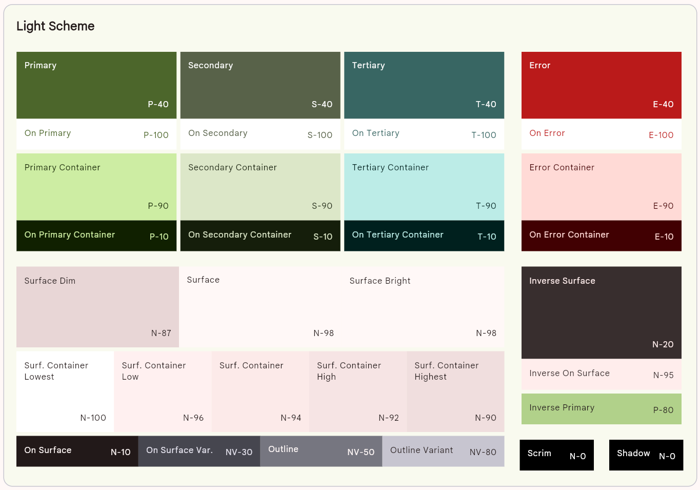

トーンパレットは、以下のようになります。

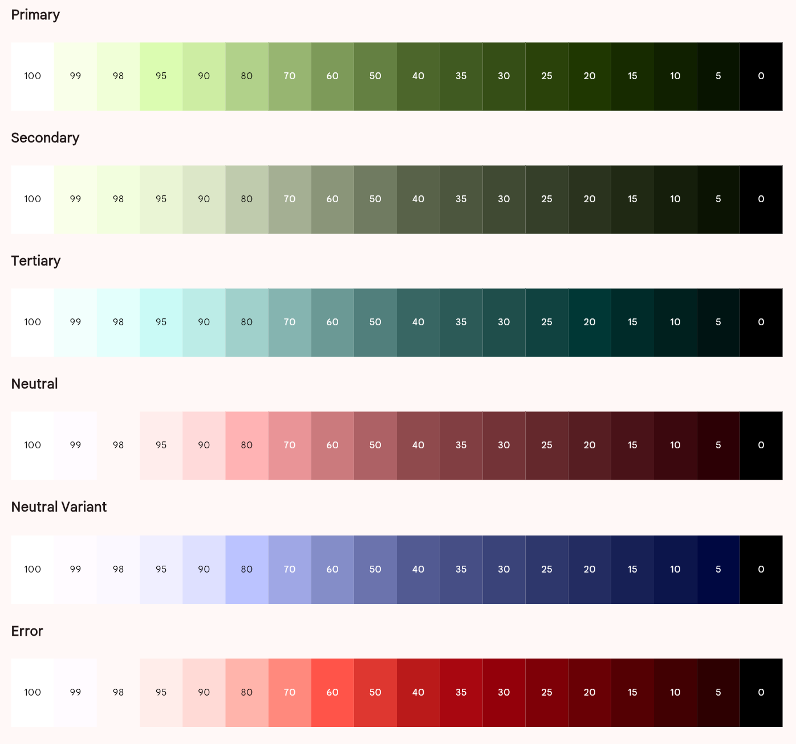

ここで、注目すべきポイントは、各カラーロールの右下の記号です。

例えば、カラーロールの Primary の部分を見てください。右下には、 「 P-40 」 と記載されています。これは、トーンパレットの Primary の頭文字をとって P を表し、 40 はトーンが 40 であることを表していると思われます。

このように、すべてのカラーロールの右下の記号を確認すれば、その色がどこから取得された色なのかを確認することが可能だと思われます。

参考までに、ダークテーマのカラーロールも載せておきます。

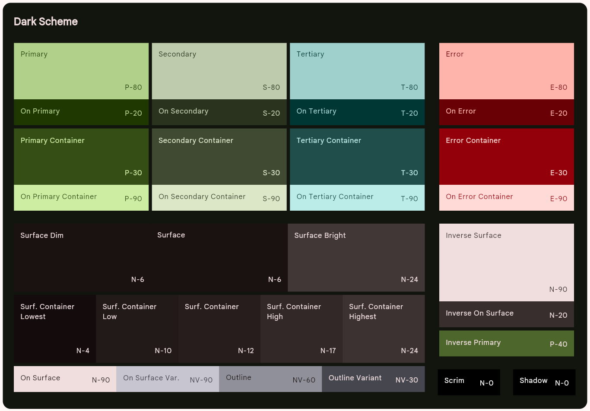

## 基本事項

### ロールの名前

カラーロールの名前で頻繁に使用される単語の意味を以下に説明します。

#### Surface

- 背景や画面上の大きな領域に使用します。
- 強調する必要のない、単なる背景に対して使用します。

#### Primary / Secondary / Tertiary（アクセントカラー）

- 前面に配置される要素を強調したり、強調しないために使用します。
- アプリ内で、アクセントとなる色です。
- アクセントカラーと呼ぶこともあります。

#### Container

- On が付いていない Container をテキストやアイコンに使用しないでください。
  - テキストやアイコンに使用する場合は、 On Xxxx Container の方を使用してください。
- [Material Theme Builder](https://material-foundation.github.io/material-theme-builder/) や Material Color Utilities を使用することで、 Primary などの色を選択すれば、 Container の色を自動生成することが可能です。

##### アクセントカラーの Container の場合

- それぞれのアクセントカラーに調和した色となります。
- ただし、アクセントカラーよりも、若干目立たない色とします。
- アクセントカラーだけでは、視覚的なバランスが崩れてしまう場合などに使用されます。
- 例えば、ボタンと FAB が重なった場合、ボタンと FAB が同じアクセントカラーで塗りつぶされていては、視覚的な分離が難しくなります。それを防ぐために、ボタンと FAB で、アクセントカラーと Container を使い分けることがあります。

##### Surface の Container の場合

- Surface と Surface Container の色が調和された色になる点は、アクセントカラーの場合と同じです。
- ただし、 Surface の場合は、用途が異なってきます。
- Surface Container には、 5 段階の濃淡があり、その濃淡によって、ビューの深さを表現します。

#### On

- On で始まるロールは、テキストまたはアイコンの色が、それと同様の名前の色の上に表示されていることを示します。
- たとえば、 **on primary** は、 primary で塗りつぶされた背景の上で、テキストやアイコンに使用されます。

#### Variant（変異体）

- この用語で終わるロールは、 **非バリアント ペアよりも強調度が低い代替手段を提供します。**
- 以下のロールで Variant カラーが用意されています。
  - On Surface
  - Outline
  - On Primary ( Secondary / Tertiary ) Fixed

### 色を正しくペアリングする

アプリで視覚的なコントラストを確保 (アクセシブルにする) には、次のセクションで説明する 「意図されたペアリング」 または 「レイヤー化の順序」 でのみ、色を適用します。

色を不適切に組み合わせると、特に、 [ユーザーがコントラストの設定を変更](./1.Color%20system.md/#ユーザーによって変更可能な-3-段階のコントラスト) した場合をはじめとする、動的な色の変更によって、必要なコントラストが損なわれる可能性があります。

#### 正しいペアリングをした場合の例

同じカラーロールで、 On が付いているものと、ついていないものをペアリングした場合の例を示します。

1. Primary
2. On Primary
3. Secondary Container
4. On Secondary Container

正しくペアリングされた場合は、ユーザーがコントラストの設定を変更した場合も、必要なコントラストが確保できていることがわかります。

#### 誤ったペアリングをした場合

互換性のないカラーロール同士でペアリングした場合の例を示します。

1. Primary
2. Primary Container
3. Secondary Container
4. On Surface

誤ったペアリングが行われた場合は、コントラストの設定を変更した場合に、必要なコントラストが失われていることがわかります。

## Primary

### Primary に含まれるロール

プライマリカラーの役割には、 primary と primary container が含まれ、それぞれの on カラーが存在します。

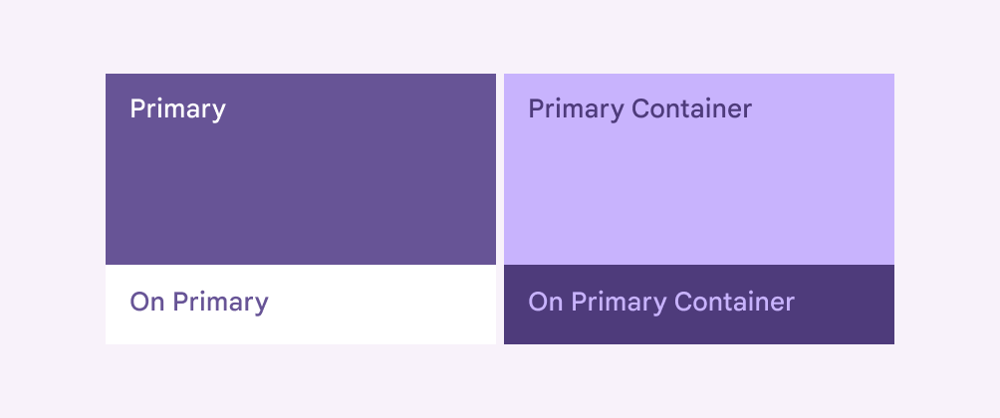

### 使用方針

UI 全体で最も目立つコンポーネントにプライマリ ロールを使用します。

Surface の上に直接使用されることによって、強調表示することが可能になります。そのため、 Surface の上に使用することが一般的だと思われます。

### 主な用途

- FAB
- 強調表示ボタン
- アクティブ状態の UI 要素

### 具体的な使用例

- **Primary**
  - Surface に対して強調表示される塗りつぶし
  - テキストボタンのテキスト
  - 塗りつぶしアイコンの背景
  - 標準アイコンのアイコン自体の色

- **On Primary**
  - Primary の上に表示されるテキストとアイコン

- **Primary Container**
  - FAB の背景の塗りつぶし

- **On Primary Container**
  - Primary Container の上に表示されるテキストとアイコン

1. On primary
2. Primary

3. On primary container
4. Primary container

## Secondary

### Secondary に含まれるロール

セカンダリーカラーの役割には、 Secondary と Secondary Container が含まれ、それぞれの on カラーが存在します。

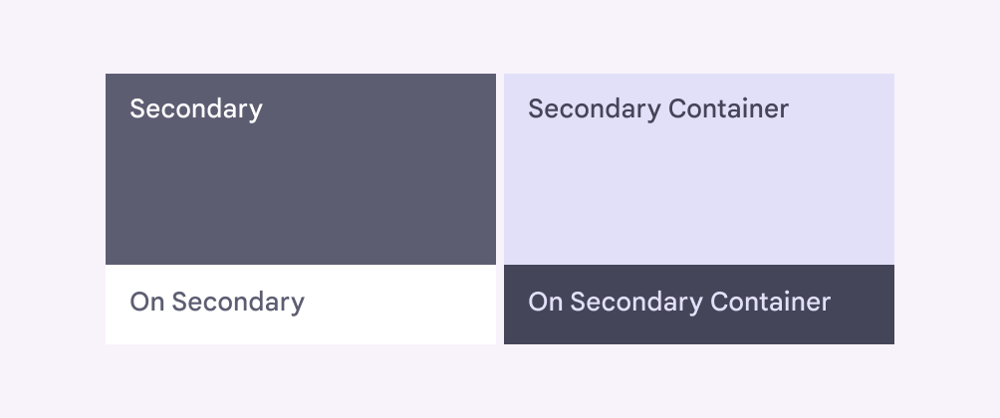

### 使用方針

UI 全体であまり目立たせたくないコンポーネントにセカンダリ ロールを使用します。

Surface の上に直接使用されることによって、弱めの強調表示することが可能になります。そのため、 Surface の上に使用することが一般的だと思われます。

#### Secondary よりも Secondary Container が多く利用される

個人的な見解ですが、 Secondary 自体を使用する機会は少ないと思われます。それよりも、 Secondary Container を使用する機会が多そうです。

なぜなら、 Secondary 自体は、 Primary と同じくらい強調度の高い色のようです。そのため、 Secondary の使用目的である 「 Primary よりも控えめな色」 という役割を果たすことができません。

その一方で、 Secondary Container は、 Primary よりも控えめな色設定になっており、その目的を果たすのに適しているためです。

### 主な用途

- フィルターチップ
- ボタン
- アクティブ状態の UI 要素

### 具体的な使用例

- **Secondary**
  - 「 Surface 上で、目立たない塗りつぶし、テキストボタン、アイコン」と、公式ドキュメントには記載されているが、あまり納得できないため、無視してください。

- **On Secondary**
  - Secondary の上に表示されるテキストとアイコン

- **Secondary Container**
  - Surface に対して目立たない塗りつぶしの色
  - トーン ボタン
  - 最終決定ではない、 「次へ」 のようなボタンの塗りつぶし色
  - キャンセル的なアクションの塗りつぶしの色
  - フィルターチップの塗りつぶし色

- **On Secondary Container**
  - Secondary Container の上に表示されるテキストとアイコン

1. Icon : On Secondary Container
2. Button : Secondary Container

## Tertiary

### Tertiary に含まれるロール

ターシャリーカラーの役割には、 Tertiary と Tertiary Container が含まれ、それぞれの on カラーが存在します。

### 使用方針

Tertiary と Tertiary Container は、 Primary と Primary Container に匹敵するほど、強調度が高い色である場合が多いため、 Primary の代用として使用するのが良いと思われます。

Primary と Tertiary の違いは、その色みにあります。 [Material Theme Builder](https://material-foundation.github.io/material-theme-builder/) では、 Primary と Secondary が類似の色みであるのに対して、 Tertiary は、それらとは異なる色みの色が選択されるという特徴があるようです。

そのため、一つの画面内で、 Primary と Secondary のみを使用している場合は、画面全体の強弱や華やかさが失われがちです。その際に、 Tertiary を加えることによって、強弱や華やかさが一気に生まれてくるような気がしています。

Tertiary を使用するかどうかや、どこに使用するかには、自由度が高く、デザイナーの考え方や好みに左右されることが多いです。

Primary と同様に、 Surface の上で使用するのが良いです。

Tertiary の色みは、 Primary や Secondary とは異なるため、 Primary よりも強調度が少し高くなる傾向があると思われます。 (ただし、一つの画面内で Tertiary が多用されている場合は、全体的に強調されているため、ユーザーがどの画面要素に注目してよいのかが判断できず、強調度が薄まります。)

### 主な用途

- Primary の代用としての意味があるため、 Primary と同様の場所で使用可能です。

### 具体的な使用例

- **Tertiary**
  - Primary を参考にしてください。

- **On Tertiary**
  - Tertiary の上に表示されるテキストとアイコン

- **Tertiary Container**
  - Primary を参考にしてください。

- **On Tertiary Container**
  - Tertiary Container の上に表示されるテキストとアイコン

1. On Tertiary Container
2. Tertiary Container

## Error

### Error に含まれるロール

エラーカラーの役割には、 Error と Error Container が含まれ、それぞれの on カラーが存在します。

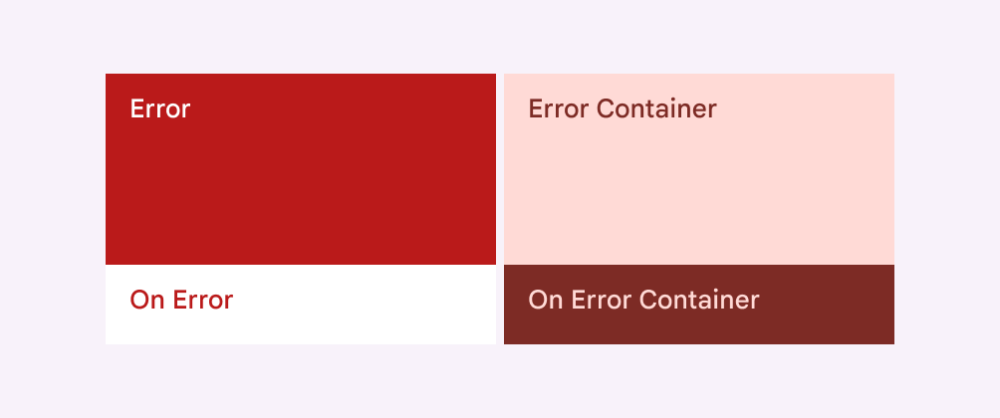

### 使用方針

Surface の上に直接使用されることによって、緊急性を要する強調表示が可能になります。そのため、 Surface の上に使用することが一般的だと思われます。

エラーは静的カラーのうちの一つです (動的配色でも変化しません)。エラー色ロールは、動的カラーの場合でも、デフォルトで静的になります。

### 主な用途

- TextField のエラー状態を伝える
- アイコン右上に表示するバッジ

### 具体的な使用例

- **Error**
  - Surface に対して、緊急性の高い強調表示を意味する塗りつぶし
  - アイコンの右上に表示するバッジの塗りつぶし色
  - 塗りつぶしアイコンの背景
  - 標準アイコンのアイコン自体の色
  - テキスト

- **On Error**
  - Error に対するテキストとアイコン
  - アイコンの右上に表示するバッジのテキストの色

- **Error Container**
  - Error よりも若干弱く、ユーザーにエラーが起きたことを知らせたい場合
    - 例えば、エラーの対象範囲が広い場合の背景の塗りつぶし
      - 範囲が広い場合は、 Error カラーで塗りつぶしてしまうと、必要以上にユーザーを驚かせてしまう可能性があります。
      - 例えば、画面の半分以上の領域が、 Error カラーで塗りつぶされた場合に、ユーザーは恐怖を感じるかもしれません。そのような場合は、代わりに Error Container を使用すると良いでしょう。

- **On Error Container**
  - Error Container に対するテキストとアイコン

## Surface

### Surface に含まれるロール

サーフェスロールには、大きく分類すると、次の 3 つのロールが含まれます。

- Surface
- On Surface
- On Surface Variant

以下は、ライトテーマの場合の各ロールの例です。

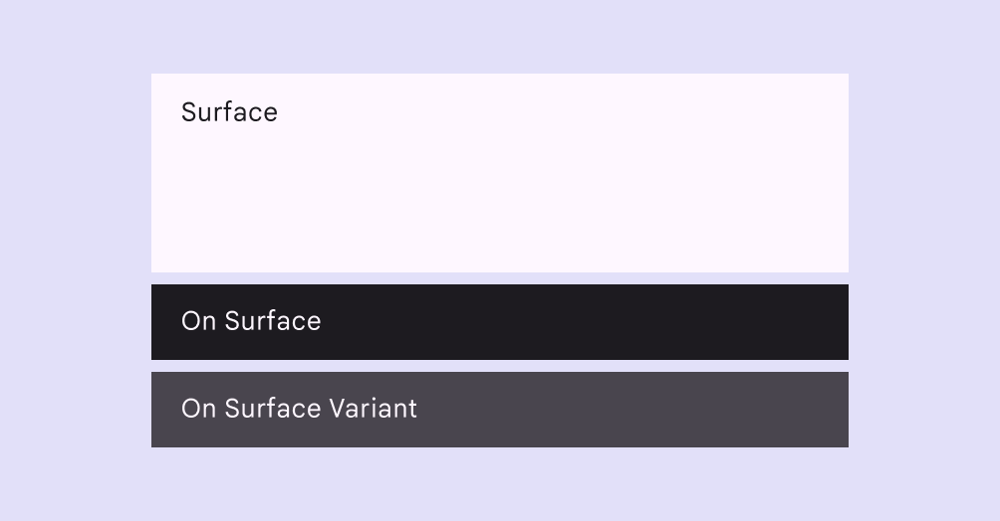

Surface カラーには、トーンの異なるものが、さらに 5 つ存在します。強調度の強さが、そのままロールの名前になっています。

- Surface Container Lowest
- Surface Container Low
- Surface Container
- Surface Container High
- Surface Container Highest

ライトテーマの 5 種類の Surface Container

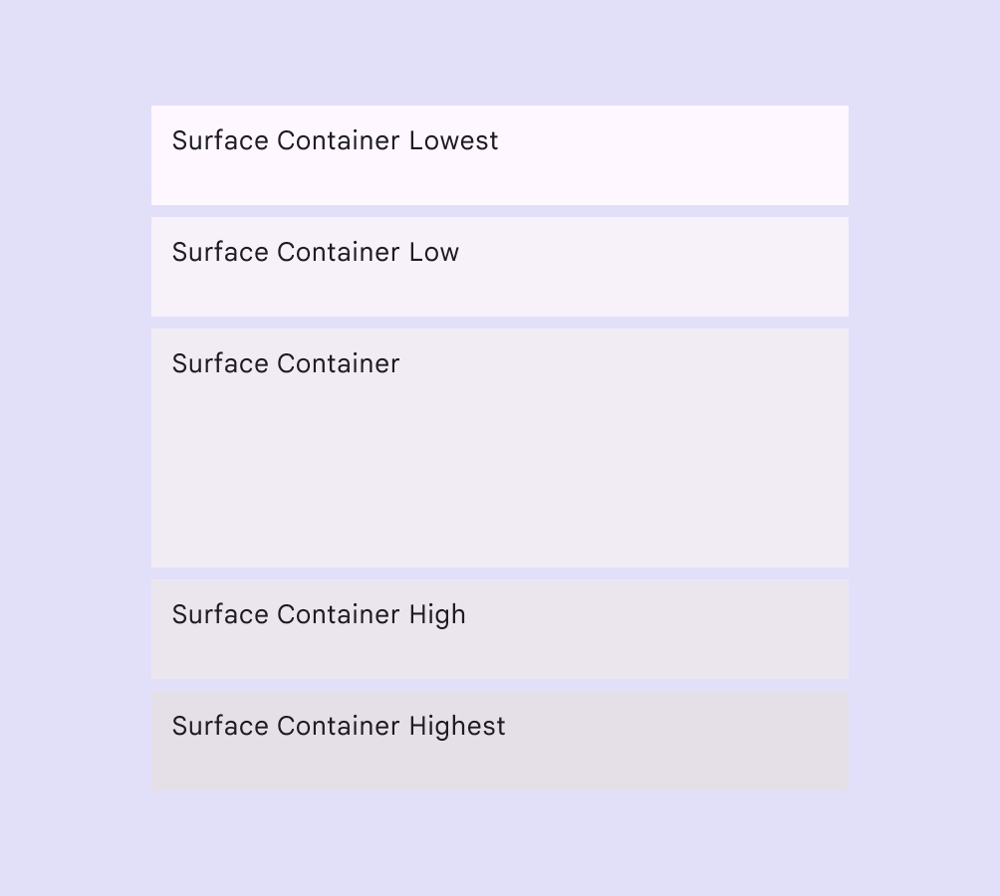

ダークテーマの 5 種類の Surface Container

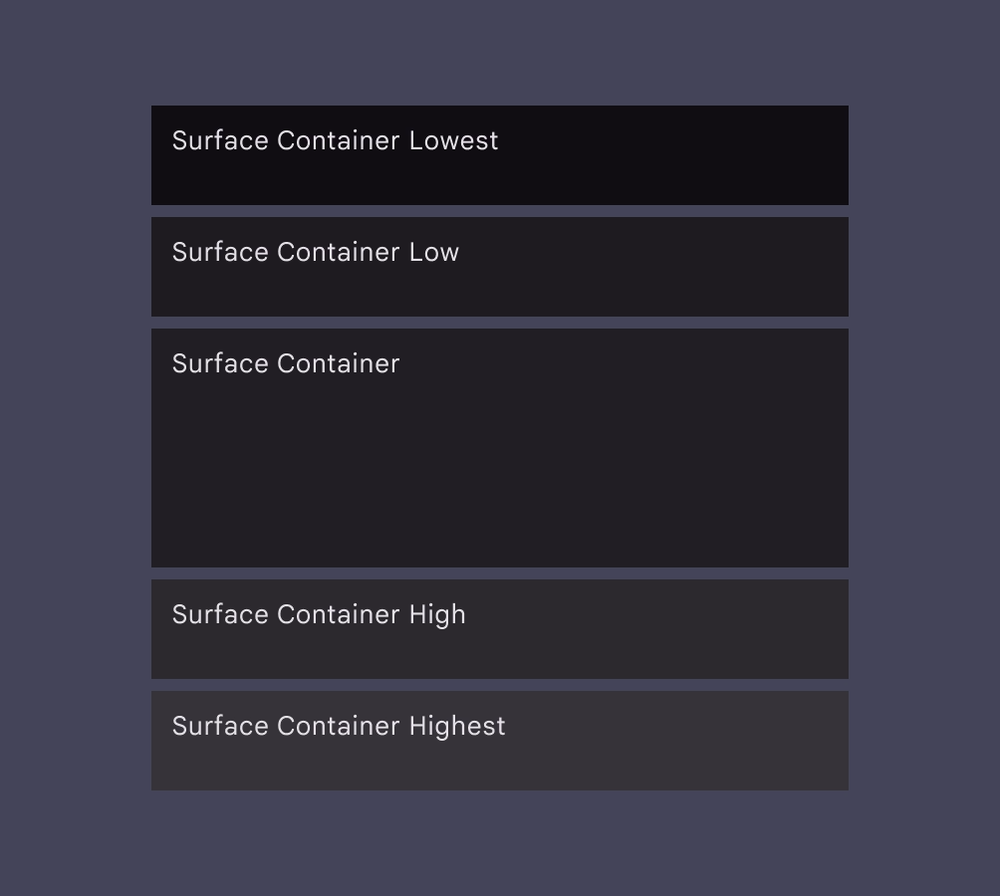

### 使用方針

画面全体の背景の塗りつぶしに使用し、他のロール ( Primary や Secondary など) が、その役割を果たせる下地を作ります。

Card 等、子要素を含む UI 要素の塗りつぶしにも使用することで、子要素の配色を最大限発揮します。

### 主な用途

画面全体の背景には Surface カラーを使用し、カード、シート、ダイアログなどのコンポーネントには Surface Container カラーを使用することによって、トーンの違いによる立体感を作ることができます。

トーンの違いによる立体感を作る場合、別の実装方法も存在します。

Material Design 3 の Surface コンポーネントには、 tonalElevation というパラメータが存在しており、ここに dp でエレベーションを設定することにより、自動的に背景色のトーンを調整する機能もあります。 ( ChatGPT や Gemini によると、 Card コンポーネントにもこの機能があるということでしたが、確認したところ、この機能はありませんでした。)

Material Design 3 の Surface コンポーネントには、 shadowElevation というパラメータも存在しており、こちらを設定すれば、トーンではなく、影でエレベーションを表現することも可能です。

Material Design 3 の Surface ではなく、 androidx.compose.material の Surface を使用した場合は、エレベーションに関するパラメータは、 elevation しか存在しておらず、このパラメータを指定すると、影でエレベーションが表現され、トーンによるエレベーションの表現はありません。

### 具体的な使用例

- **Surface**
  - 画面全体の背景の色

- **On Surface**
  - Surface ( Surface Container を含む) の上に表示するテキストとアイコン

- **On Surface Variant**
  - Surface ( Surface Container を含む) の上に表示するテキストとアイコン
  - ただし、 On Surface よりも強調度が低い

- **Surface Container Lowest**
  - 強調度が最も低いコンテナーの色
  - と、ドキュメントには記載されていますが、自分としては、ライトテーマの場合は、最も強調度が高い色ではないかと思っています。
  - ダークテーマの場合は、ドキュメントに記載の通り、最も強調度の低い色かなと思います。
  - ライトテーマの場合は、 Lowest は、 100% 完全な白色になるため、どうしても周りよりも強調度が高くなると、個人的に感じます。
  - そのため、 Lowest はあまり使用しないほうが良いのではないかと思います。既存のマテリアルデザインコンポーネントでは、デフォルト値として、 Lowest を使用しているコンポーネントは、ほとんど無い気がしているので、意図的に使用しない限りは、ほとんど気にする必要はなさそうです。

- **Surface Container Low**
  - 強調度が低いコンテナーの色

- **Surface Container**
  - デフォルトのコンテナーの色

- **Surface Container High**
  - 強調度が高いコンテナーの色

- **Surface Container Highest**
  - 強調度が最も高いコンテナーの色

サーフェスコンテナは、 [拡張画面のレイアウト](https://m3.material.io/m3/pages/applying-layout/expanded) で階層やネストされたコンテナーを作成する場合に特に役立ちます。

#### 背景とナビゲーションに使用する例

サーフェス ロールの最も一般的な組み合わせでは、背景領域に Surface を使用し、ナビゲーション領域に Surface Container を使用する方法です。

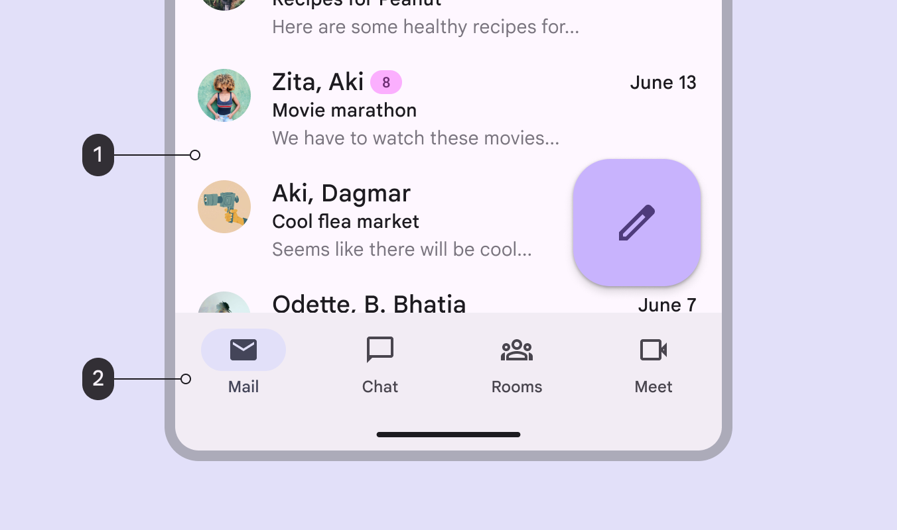

1. Surface
2. Surface Container

### 注意点

すべてのカラー マッピング (特にサーフェス系の色) は、デバイスのウィンドウサイズにかかわらず、同じである必要があります。たとえば、モバイルとタブレットの両方で、コンテンツ領域には Surface を使用し、ナビゲーション領域では Surface Container を使用するようにします。

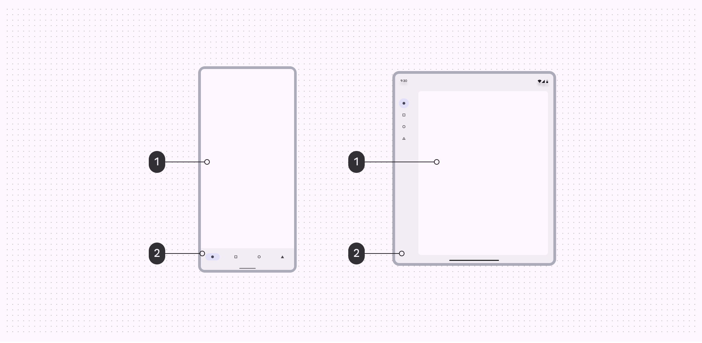

1. Surface
2. Surface Container

デバイスの画面サイズにかかわらず、色が一貫して適用される限り、より大きなウィンドウ クラス サイズで [アドオン サーフェス カラー](#surface-dim-と-surface-bright-の役割) を使用できます。

### 異なる強調度の Surface Container を追加することでより立体感を表現する

以下の例では、画面サイズによらず、コンテンツ領域とナビゲーション領域は、同じ役割の色を使用しています。さらに、画面サイズが大きくなるにつれて、他の強調度のサーフェス コンテナーも追加されています。

https://youtu.be/b8fjcWp9fE4

### Neutral Color のコンポーネントは、デフォルトでいずれかの Surface Container が設定されている

デフォルトでは、ナビゲーション バー、メニュー、ダイアログなどの Neutral Color のコンポーネントは特定の Surface Container にマップされています。ただし、これらの役割はユーザーのニーズに合わせて開発者が [再マップ](https://m3.material.io/m3/pages/advanced/overview) することが可能です。

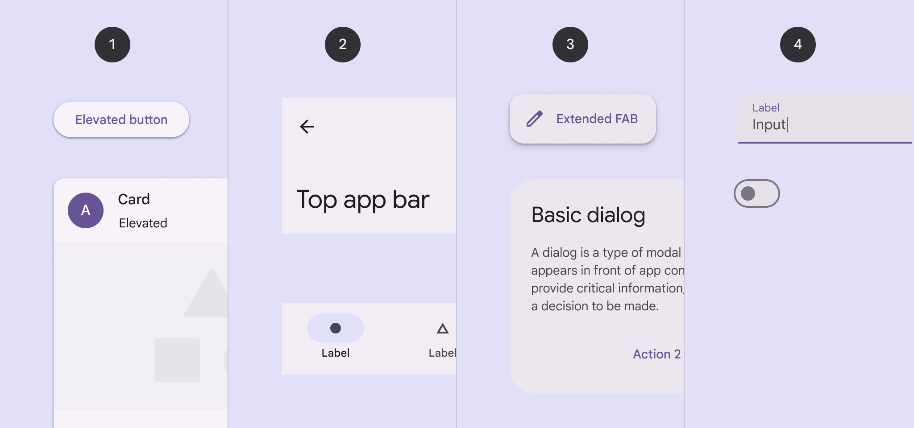

1. Surface Container Low
2. Surface Container
3. Surface Container High
4. Surface Container Highest

### 反転色

インバースロールは、周囲の UI の色と反転した色を実現するために、コンポーネントに選択的に適用され、コントラスト効果を生み出します。

- **Inverse Surface**
  - Surface の上に、コントラストを確保して表示したい要素の背景の塗りつぶし

- **Inverse On Surface**
  - Inverse Surface の上に表示するうテキストとアイコン

- **Inverse Primary**
  - Inverse Surface の上に表示するテキスト ボタンなどのアクション可能な要素

ライトテーマで表示される Inverse Surface , Inverse On Surface および配色における Inverse Primary ロール

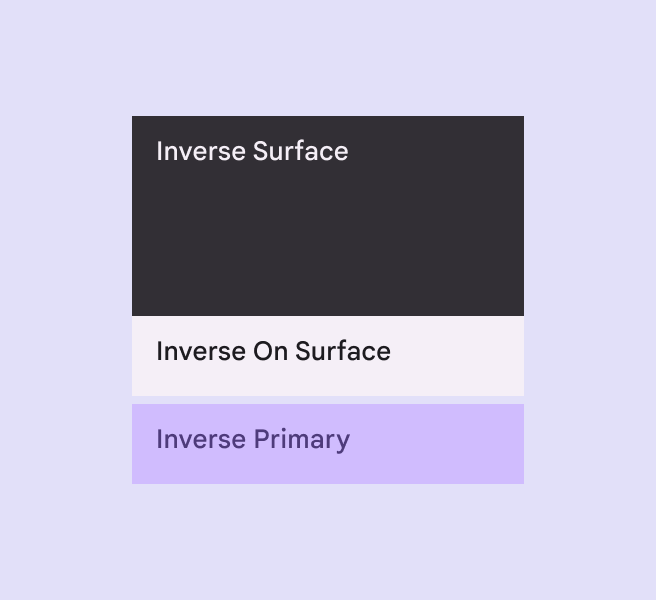

スナックバーの場合

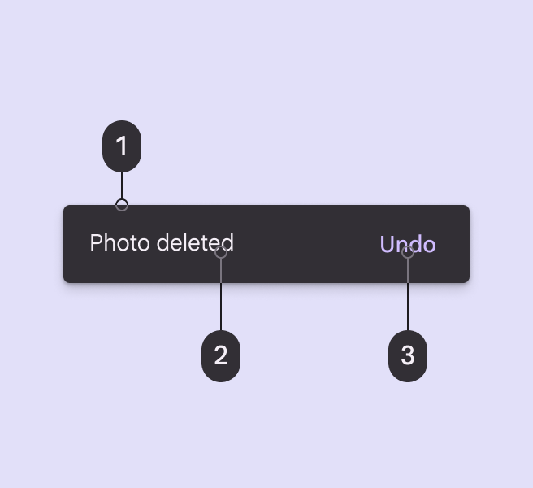

1. Inverse Surface
2. Inverse On Surface
3. Inverse Primary

## Outline

### Outline に含まれるロール

アウトラインカラーには、 Outline と Outline Variant の 2 種類があります。

以下は、ライトテーマの場合のアウトラインの例です。

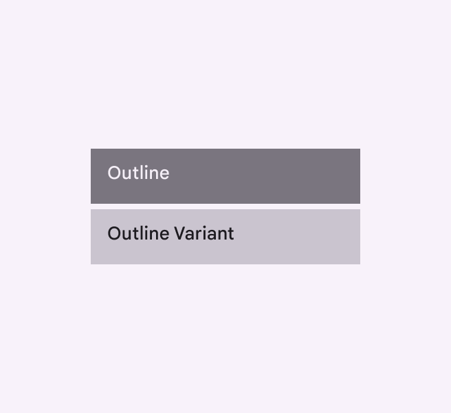

### 使用方針

Outline はコントラストが高くなっており、 Outline Variant はコントラストが低くなっています。

Outline も Outline Variant も、 Surface の上に直接使用することで、適切なコントラストを得ることができます。

Outline は、コントラストが高いため、ユーザーがその UI 要素の境界を明確に認識することが重要な場合に使用します。具体的には、タップエリアや表示エリアを明確に認識することによって、ユーザーの誤操作や誤認識を防ぎます。

Outline Variant は、コントラストが低いため、装飾的な意味合いが高くなります。ユーザーの注目や注意をあまり集めたくない場合に使用します。

### 主な用途

- UI 要素の境界
- 区切り線

### 具体的な使用例

- **Outline**
  - TextField のアウトライン
  - Outlined Button のアウトライン
  - Chip

- **Outline Variant**
  - 区切り線
  - Card のアウトライン
    - Card はその境界よりも、そのコンテンツにユーザーが集中できるように控えめな境界線が好まれると思われます。
    - そもそも、 Card は Surface Container で、その境界が認識できるようになっている場合が多いと思うので、強調度の高い境界線で囲む必要はないでしょう。
  - Card 以外の複数の要素を含む UI 要素
    - 複数の要素を含む UI 要素は、 Card 同様に、そもそも Surface Container で、その境界が認識できるようになっている場合が多いと思うので、強調度の高い境界線で囲む必要はないでしょう。

1. Outline ( TextField の枠線に使用)
2. Outline Variant (リストアイテムの区切り線に使用)

### 4 つの間違った使用方法

#### １．区切り線に Outline を使用するのは NG

区切り線には、高いコントラストは必要ないため、 Outline を使用しないでください。必ず、 Outline Variant を使用してください。

#### ２．複数の要素を含むコンポーネントに Outline を使用するのは NG

カードなどの複数の要素を含むコンポーネントには、 Outline を使用しないでください。必ず、 Outline Variant を使用してください。

#### ３．Chip の境界に Outline Variant を使用するのは NG

チップなどの密集した要素や、互いに近接しているその他の UI 要素には、 Outline Variant カラーを使用しないでください。代わりに、 Outline を使用するか、または、 Surface の色と 3:1 のコントラストを提供する別の色を使用してください。ユーザーがタップ可能なエリアを誤認するのを防ぐために、高いコントラストが必要となります。

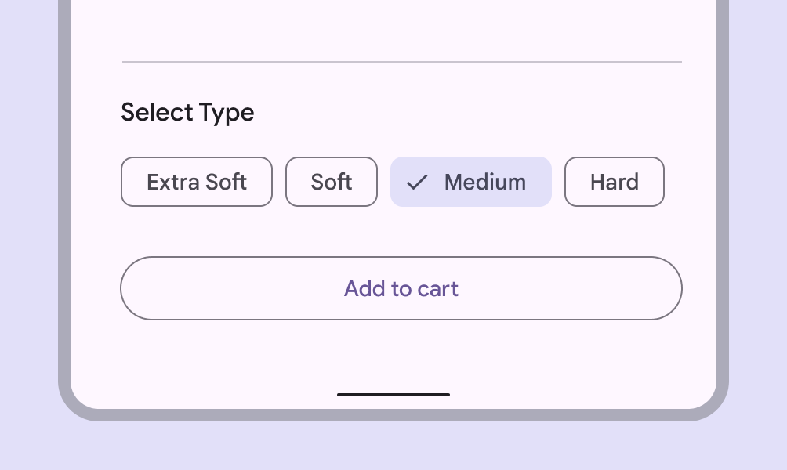

#### ４．UI 要素の区別が必要な場面で Outline Variant を使用するのは NG

Outline Variant カラーを使用して視覚的な階層を作成したり、ターゲットの視覚的な境界を定義したりしないでください。代わりに、 Outline カラーまたは表面カラーと 3:1 のコントラストを提供する別のカラーを使用します。視覚的な境界が必要な場面では、高コントラストの Outline を使用しましょう。

## アドオン（追加的な）カラーロール

ほとんどの製品では、これらのアドオン カラー ロールを使用する必要はありません。ただし、一部の製品では、アドオン ロールが提供する柔軟性と制御性の向上が求められます。製品でアドオン ロールを使用するかどうかわからない場合は、おそらく使用すべきではないため、無視できます。

### Fixed アクセントカラー

Primary Fixed / Secondary Fixed / Tertiary Fixed は、基本的には、 Primary Container / Secondary Container / Tertiary Container と同じ色になります。ただし、これらのカラーは、通常のコンテナ カラーとは異なり、**ライトテーマとダークテーマで同じトーン (ライトテーマのトーン) を使用します。**

Fixed カラー ロールは、このような固定動作が望ましい状況で、同等のコンテナ ロールの代わりに使用できます。

Fixed カラー ロールは、サーフェスの上に使用される塗りつぶしカラーです。

Primary Fixed Dim / Secondary Fixed Dim / Tertiary Fixed Dim のロールは、 Dim なしの Fixed カラーに比べて、より強く、より強調されたトーンを提供します。より濃い色で、同じ固定動作が望ましい場合に使用できます。 ( Dim は略語ではなく、英語の一つの単語です。 Dim には 「薄暗い」 「弱い」 「控えめな」という意味があります。)

以下は、 FAB の塗りつぶし色に (1) Primary Fixed を使用した例です。

以下は、 FAB の塗りつぶし色に (2) Primary Container を使用した例です。ダークテーマになった際に Primary Fixed との違いがあることがわかります。

以下は、 Fiexed と Fixed Dim の使用例です。

1. Primary Fixed ( FAB の背景の塗りつぶし部分)
2. Primary Fixed Dim (アイコンボタンの背景の塗りつぶし部分)

コンテナ ロールと同様に、 Fixed カラーは、非テキスト コントラストの 3:1、テキスト コントラストの 4.5:1 などの最小コントラスト要件を満たしていません。このようなコントラストを必要とする要素には適用しないでください。

最小限のコントラストが必要なアクセントカラーには、 Primary / Secondary / Tertiary ロールを使用します。

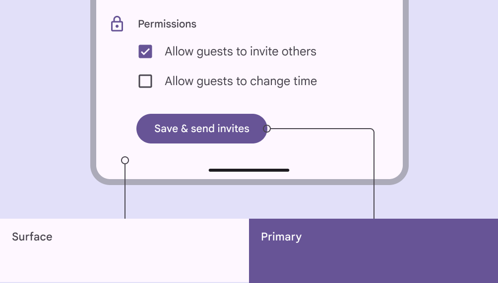

### On Fixed アクセントカラー

On Fixed カラーは、対応する Fixed カラーの上にあるテキストとアイコンに使用されます。たとえば、 On Primary Fixed カラーは、 Primary Fixed カラーに対するテキストとアイコンに使用されます。

On Fixed Variant カラーは、 On Fixed と同様に、対応する Fixed カラーの上に表示するテキストとアイコンに使用されます。ただし、 On Fixed Variant は、 On Fixed よりも、強調度が低くなります。たとえば、 On Primary Fixed Variant は、 Primary Fixed カラーの上のテキストとアイコンに使用されます。

以下は、 On Fixed と On Fixed Variant の例です。

以下は、強調されていないテキストには、 (1) On Primary Fixed Variant を使用し、強調されたテキストには、 (2) On Primary Fixed を使用するカスタマイズされたバナーの例です。

### Surface Dim と Surface Bright

アドオン サーフェス ロールには次の 2 つがあります:

- Surface Dim
  - ライトテーマとダークテーマで最も暗いサーフェスの色
- Surface Bright
  - ライトテーマとダークテーマで最も明るいサーフェスの色

以下は、ライトテーマの例です。

以下は、ダークテーマの例です。

デフォルトの Surface カラーは、ライト テーマとダーク テーマの間で自動的に反転しますが (ライト テーマではライト カラーで、ダーク テーマではダーク カラーに反転します) 、 Surface Dim と Surface Bright は、少し異なる方法で反転します。具体的には、ライト テーマとダーク テーマの両方で、反転しますが、 Surface を基準とした相対的な明るさは維持されます。

たとえば、デフォルトの Surface ロールを使用するインターフェイスでは、マップされた領域はライト テーマで最も明るく、ダーク テーマでは最も暗くなります。 Surface Bright ロールを使用するインターフェイスでは、マップされた領域はライト テーマとダーク テーマの両方で最も明るくなります。

以下にライトテーマとダークテーマで、通常の Surface を使用した例を示します。

1. Surface
2. Surface Container

以下にライトテーマとダークテーマで、 Surface Bright を使用した例を示します。

1. Surface Bright
2. Surface Container

1. Surface Dim (ナビゲーションレール)
2. Surface Bright (チャットウィンドウ)

## Scrim

### Scrim に含まれるロール

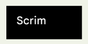

### 使用方針

すくリムロールは薄い幕を意味します。

Scrim は、ライトテーマの場合、 #FF000000 が設定されていることが多く、これは、不透明度が Max で、色は黒であるため、このままでは、背後の UI 要素が見えなくなってしまいます。しかし、実際には、半透明で後ろが見えるようになっているため、どこかで半透明にする処理が入っているものと思われます。

### 主な用途

- ダイアログ表示時に後ろのメイン画面を覆う幕
- ドロワーメニュー表示時に後ろのメイン画面を覆う幕

### 具体的な使用例

- Scrim
  - 上記の主な用途を参照して下さい。

## Shadow

Shadow の詳細については、 [エレベーション](../3.Elevation/) を参照してください。

### Shadow に含まれるロール

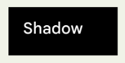

