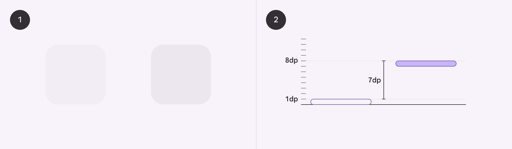
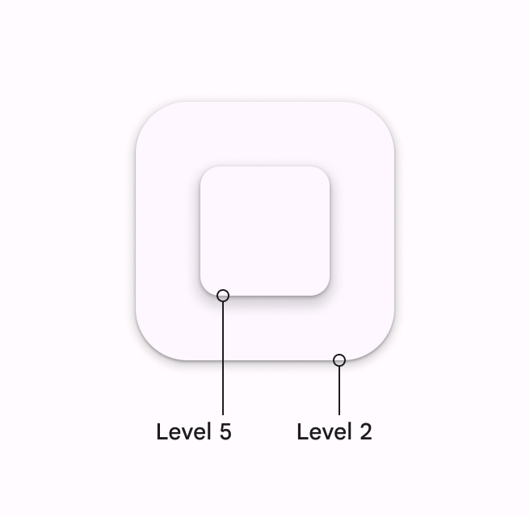
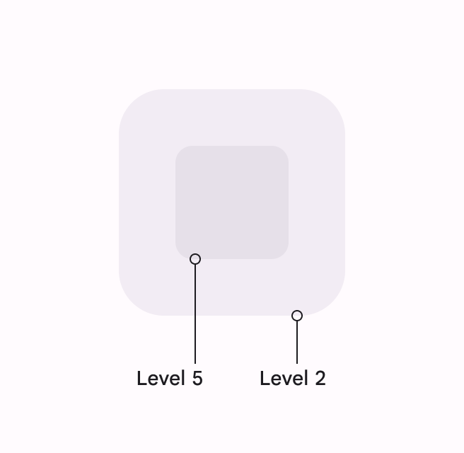
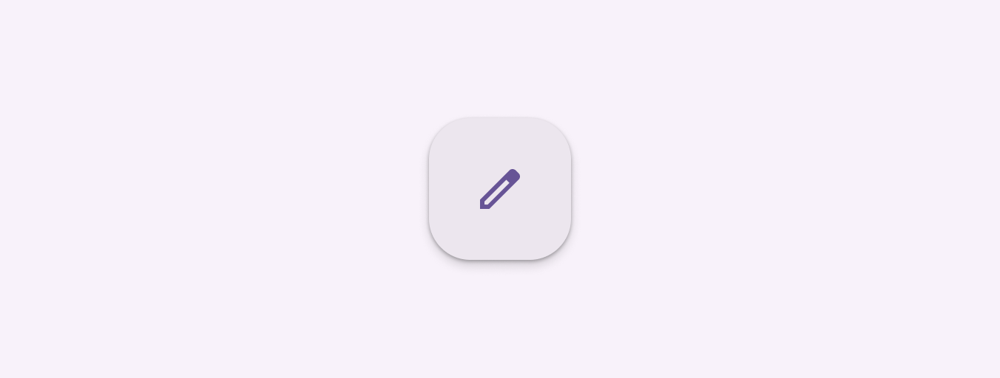

- [概要](#概要)
  - [Material Design 2 と Material Design 3 の違い](#material-design-2-と-material-design-3-の違い)
  - [すべてのサーフェスとコンポーネントには高度値があります](#すべてのサーフェスとコンポーネントには高度値があります)
  - [静止高度 (デフォルト)](#静止高度-デフォルト)
  - [高度の変更](#高度の変更)

# 概要

標高とは、 Z 軸上の 2 つのサーフェス間の距離です。

- 標高はすべてのサーフェスとコンポーネントに適用されます。
- マテリアル 3 コンポーネントのデフォルトの標高を使用します。
- 標高のストーリーはシンプルに保ちます。つまり、レベルが多すぎないようにします。
- サーフェスの色を変更して標高の変化を示します。

標高は、密度非依存ピクセル ( dps ) 単位で、 Z 軸に沿ったコンポーネント間の距離として測定されます。

1. 1dp の標高にあるもの (左) と 8dp の標高にあるもの (右) を正面から見ています。
2. 側面から見た場合、 2 つの標高の差は 7dp です

## Material Design 2 と Material Design 3 の違い

- **シャドウ**
  - M3 では、すべてのレベルにデフォルトでシャドウを適用するのをやめました。必要な場合のみシャドウを適用します。
  - 例えば、次の場合にシャドウを適用します。
    - 背景に対する追加の保護を作成する場合
    - インタラクション (タップ等) を促進したい場合
- **色**
  - M3 では、新しいカラー マッピングとダイナミック カラーとの互換性があります。
- **レベル**
  - M3 では、高度がレベルに基づいて記述されるようになりました。

**M2 の場合** : すべてのレベルで影を適用

**M3 の場合** : 影の代わりに色を使って高度を伝える

## すべてのサーフェスとコンポーネントには高度値があります

異なる高度にあるサーフェスは、次のことを行います:

1. サーフェスが他のサーフェスの前後に移動できるようにします (アプリ バーの背後でスクロールするコンテンツなど) 。つまり、高度がそのまま画面のレイヤーの上下関係になり、高いレイヤーに位置する UI 要素ほど上に表示され、低いレイヤーに位置する UI 要素は、覆い隠されるということだと思います。
2. 空間関係を反映します ( FAB の影がカード コレクションとは別であることを示すなど)
3. 最も高い高度に注目を集めます (ダイアログが一時的に他のサーフェスの前に表示されるなど)

標高は、影や、 Surface の塗りつぶし色の濃さなど、視覚的な手がかりを使用して表現できます。

https://youtu.be/ByORtVbfcoo

## 静止高度 (デフォルト)

すべてのコンポーネントにはデフォルトの静止高度が必要です。マテリアル コンポーネントのデフォルトの高度を変更しないでください。

すべてのコンポーネントにはデフォルトの標高があり、それを使用する必要があります

## 高度の変更

コンポーネントは、システム イベントや、ホバーなどのユーザー操作に応じて高度を変更する必要があります。この高度の変更は、すべての類似要素で一貫している必要があります。

たとえば、FAB にホバーすると、高度が一時的に 1 レベル上昇し、レベル 3 からレベル 4 になります。すべてのマテリアル ボタンは、ホバーすると高度が 1 レベル上昇します。

ボタンの上にマウスを移動すると、ボタンの高さが上がり、ユーザーの操作が表示されます。

https://youtu.be/ULe8N146940

