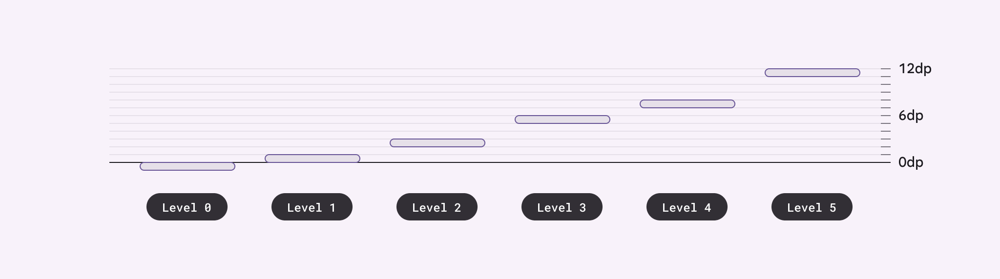
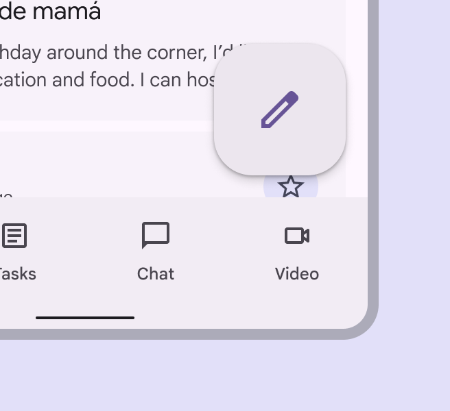
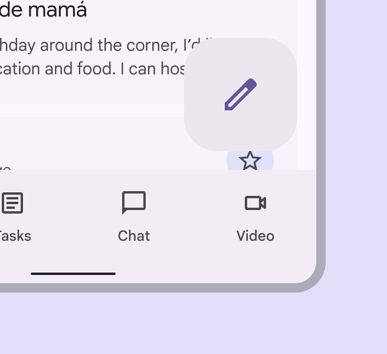
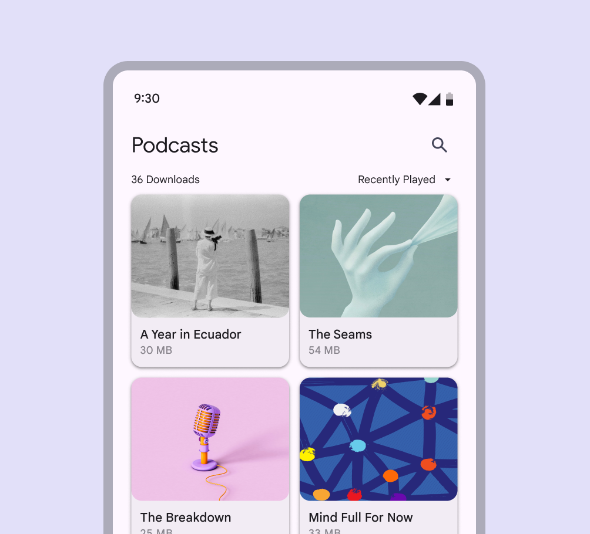
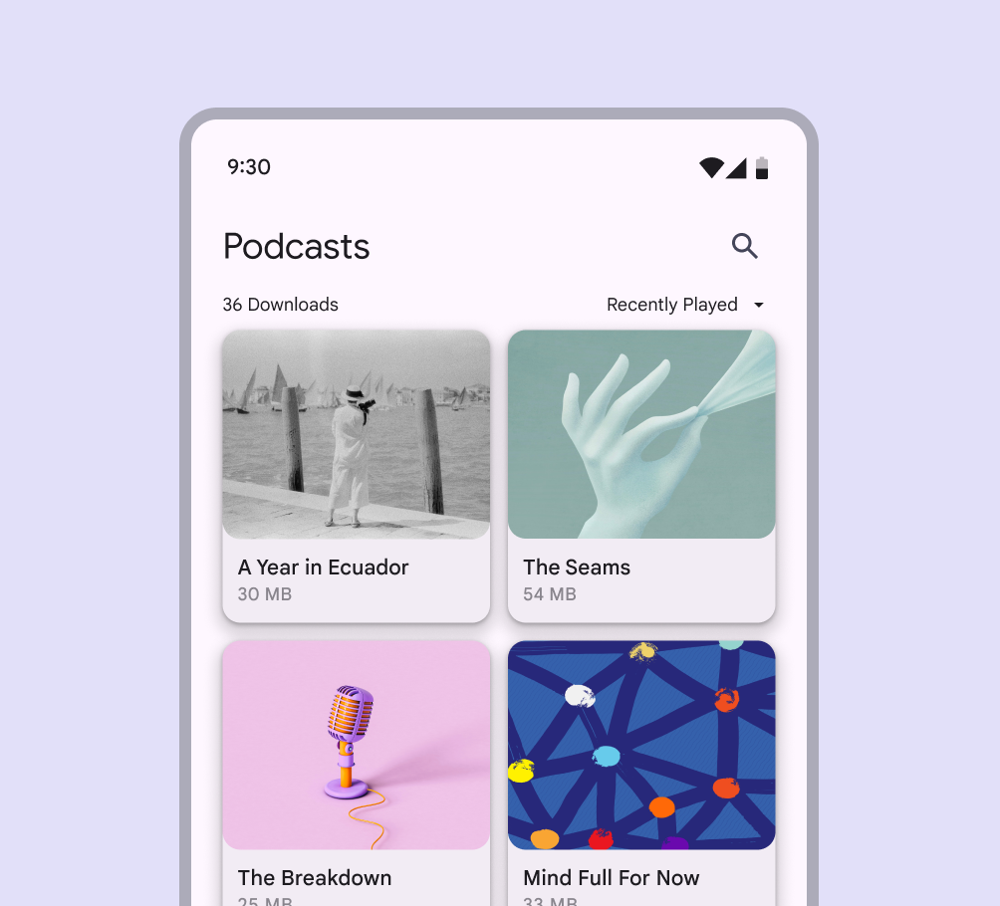
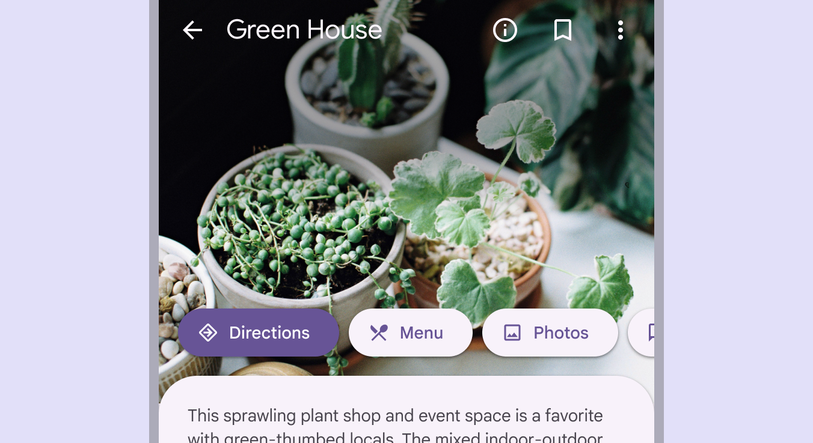
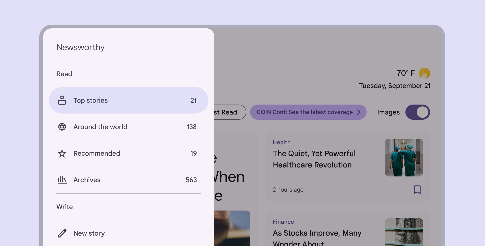

- [エレベーションを適用する](#エレベーションを適用する)
  - [高度の描写](#高度の描写)
    - [色調の違い](#色調の違い)
    - [Surface の色の役割と高度](#surface-の色の役割と高度)
  - [影](#影)
    - [可視影を使用する場合](#可視影を使用する場合)
      - [要素を保護する（視覚的に埋もれないようにする）](#要素を保護する視覚的に埋もれないようにする)
      - [インタラクションの促進](#インタラクションの促進)
  - [スクリム](#スクリム)

# エレベーションを適用する

ボタンの上にマウスを移動すると、ボタンの高さが上がり、ユーザーの操作が表示されます。

マテリアルは 6 つの高度レベルを使用し、それぞれに対応する dp 値があります。これらの値は、 UI の表面からの相対距離に応じて、 0 、 +1 、 +2 、 +3 、 +4 、 +5 と名付けられています。要素の休止状態はレベル 0 から +3 になり、レベル +4 と +5 はホバーやドラッグなどのユーザー操作状態用に予約されています。

## 高度の描写

高度は、影や、色調の違いがある表面の塗りつぶしやスクリムなどの他の視覚的な手がかりを使用して描写できます。

高度をうまく描写するには、表面に次のものが必要です。

- 表面のエッジ、表面を周囲と対比させるもの
- 静止または移動中の他の表面との重なり
- 他の表面からの距離

1. 異なる色調値を持つ 2 つの重なり合う面
2. 影によって分離された同じ色調値を持つ 2 つの重なり合う面
3. スクリム (幕) によって分離された同じ色調値を持つ 2 つの重なり合う面

### 色調の違い

表面間の色調の違いは、 Material Surface の触感を表現するのに役立ちます。 UI のさまざまな部分を識別可能なコンポーネントに分割することで、 1 つの表面がどこで終了し、別の表面がどこから始まるのかを示します。

たとえば、アプリ バーのエッジは、グリッド リストとは別であることを示し、グリッド リストがアプリ バーとは独立してスクロールすることをユーザーに伝えます。

デフォルトでは、 Material 3 の表面は色調の違いを使用して分離を示します。エッジを示すには、次のような他の方法を使用できます。

- 表面にドロップ シャドウを付ける
- 表面の後ろにスクリムを配置する

1. FAB の高さは、本体コンテンツとの区別に役立ちます。
2. 重要性を伝えるために、モーダルの下にスクリムが表示されます。
3. 上部のアプリ バーと本体コンテンツのトーンの違いは、別々のサーフェスであることを表現します。

インタラクティブなコンポーネントの場合、エッジは、表面が互いに分離して見えるように、表面間に十分なコントラストを作成する必要があります (アクセシブルなコントラスト比を満たすか、それを超える必要があります)。

浮遊要素が下の表面と十分なコントラストを持つようにしてください。

コントラストが不十分な色は使用しないでください。サーフェス間の関係は明確でなければなりません。

### Surface の色の役割と高度

さまざまな Surface と Surface Container の色の役割から選択できます。これらの役割は高度に結び付けられておらず、収容領域を定義するための柔軟性を提供します。

重なり合うコンテナ領域、または、コンポーネントには、視覚的に分離を伝えるために異なる色の役割が必要です。

[表面の色の役割に関するガイドライン](../2.Color/2.Color%20roles.md/#Surface)

1. Surface
2. Surface Container

## 影

影は、他の手法では表現できない方法で、表面間の高度の度合いを表現できます。

影のサイズと柔らかさまたは拡散の度合いは、2 つの表面間の距離の度合いを表します。たとえば、小さくてシャープな影のある表面は、その表面が背後の表面に近いことを示します。大きくて柔らかい影は、より遠い距離を表します。

より小さく、より鮮明な影は、表面がその背後の表面に近いことを示している。

より大きく柔らかい影は、表面とその背後にあるものとの間の距離をより大きく表現します。

影の適用に関しては、少ないほど効果的です。UI のレベルが少ないほど、注意とアクションを誘導する力が強くなります。

### 可視影を使用する場合

#### 要素を保護する（視覚的に埋もれないようにする）

背景にパターンがあったり、視覚的に込み入ったものがあったりする場合、ヘアライン スタイル (非常に細い線の例え) では、十分な保護 (視覚的な分離) が得られない可能性があります。このような場合は、下の画像のように、エレベーションを使用してカード、チップ、ボタンなどの要素を分離して強調します。

#### インタラクションの促進

要素は、フォーカス、選択、またはスワイプなどの他の種類のインタラクションによって、一時的に持ち上がることがあります。持ち上がった要素は、より高い要素が現れたときに下がることもあります。

https://youtu.be/ssusYrCmn6Q

## スクリム

スクリムを使用すると、大きなレイヤー サーフェスの視覚的なコントラストを高めることで、特定の要素に焦点を絞ることができます。スクリムは、モーダルや展開するナビゲーション メニューなどの要素の下に使用します。

スクリムは、 Scrim カラー ロールの色を不透明度 32% で使用します。

スクリムはナビゲーションドロワーのような重要な要素に焦点を当てるのに役立ちます

