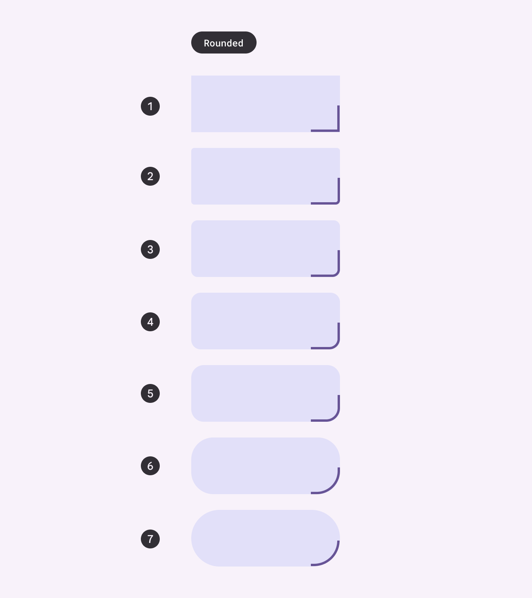
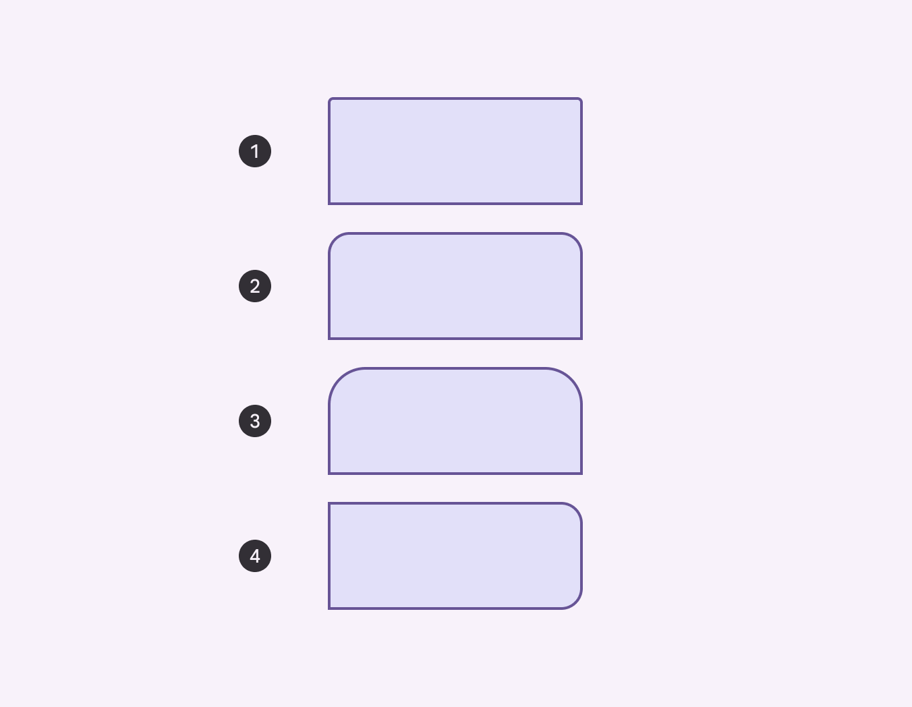
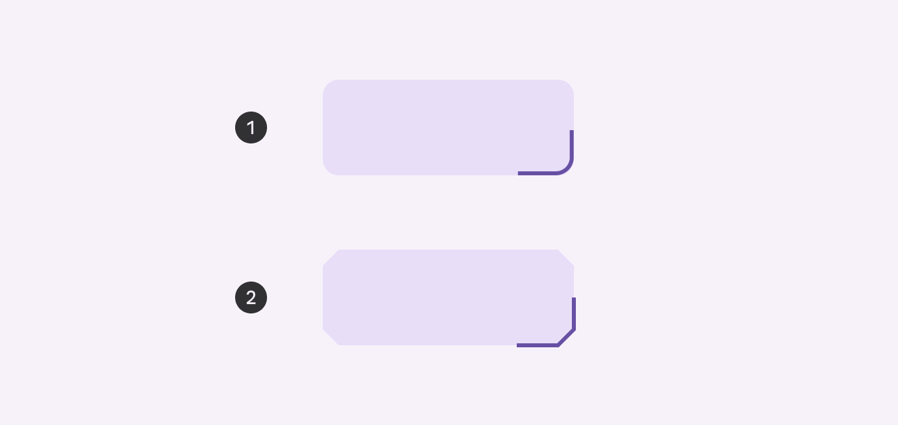

- [シェイプスケールとトークン](#シェイプスケールとトークン)
  - [シェイプスケール](#シェイプスケール)
    - [ベースライン シェイプ](#ベースライン-シェイプ)
    - [対称性](#対称性)
    - [シェイプ ファミリー](#シェイプ-ファミリー)
  - [シェイプのカスタマイズ](#シェイプのカスタマイズ)
    - [スタイルの場合](#スタイルの場合)
    - [特定のコンポーネントの場合](#特定のコンポーネントの場合)
    - [Cut シェイプを使用する際の注意点](#cut-シェイプを使用する際の注意点)
  - [引用元資料](#引用元資料)

# シェイプスケールとトークン

## シェイプスケール

スケールは、角の丸みを定義する 7 つの角の形状スタイルの範囲です: なし、極小、小、中、大、極大、フル。

スケールの各ロールは、次の 2 つのことを定義します:

- 形状ファミリー
- 値

現在、すべてのロールは丸みのある形状ファミリーを使用しています。ほとんどの値は、パーセンテージで表されるフル スタイルを除き、絶対 dp 測定値で表されます。

[トークンを使用して形状スタイルを適用します](https://m3.material.io/foundations/design-tokens/overview)

1. None
2. Extra small
3. Small
4. Medium
5. Large
6. Extra large
7. Full

### ベースライン シェイプ

デフォルトでは、すべてのコンポーネントは 7 つのシェイプ スタイルのいずれかにマッピングされます。

具体的にどのコンポーネントがどのデフォルトシェイプかを確認するには、 [こちらの一覧](https://m3.material.io/styles/shape/shape-scale-tokens#b09934f1-1b0f-4ce4-ade6-4a1f138add6c) を確認してください。

### 対称性

コンポーネントには、対称、または、非対称のコーナー形状があります。対称形状は、すべてのコーナーの値が同じですが、非対称形状は、コーナーの値が異なる場合があります。 Top / Bottom / Start / End などの「方向修飾子」で終わる形状トークンは常に非対称です。

1. Extra small top
2. Large top
3. Extra large top
4. Large end

非対称形状のトークンには、上部、下部、開始、終了などの「方向修飾子」が含まれます。

### シェイプ ファミリー

コンポーネントには、次の 2 つのシェイプ ファミリーのいずれかを使用できます:

- 丸い角
- 切り取られた角

1. Rounded corner
2. Cut corner

## シェイプのカスタマイズ

### スタイルの場合

シェイプ スケール内の任意のスタイル レベルのシェイプ ファミリとサイズをカスタマイズできます。このような変更は、オーバーライドが設定されているコンポーネントを除き、そのシェイプ スタイルにマップされているすべてのコンポーネントに影響します。

Medium スタイルのコーナーサイズをカスタマイズすると、カードや小さな FAB など、 Medium スタイルを使用するすべてのコンポーネントに変更が適用されます。

https://youtu.be/lpdTWovtFfw

### 特定のコンポーネントの場合

コンポーネントがマップされるスタイル レベルを変更できます。

たとえば、デフォルトでは、ボタンはシェイプ スタイル「full」にマップされます。製品に小さい丸みが必要な場合は、シェイプ スケールの small または medium スタイルに再マップできます。

https://youtu.be/wSSkIQoM5QI

### Cut シェイプを使用する際の注意点

シェイプ ファミリを変更すると、コンポーネント内のコンテンツに影響する可能性があります。

たとえば、カード上の大きな切り取られた角は、同じサイズの丸い角よりもコンテンツ領域に侵入し、コンテンツのレイアウトに影響を与えたり、画像が切り取られたりする可能性があります。意図しない結果を回避するには、コンポーネントのレイアウトとコンテンツに合わせてシェイプ ファミリとサイズの選択を検討してください。

https://youtu.be/Wzf9pRuhKpU

## 引用元資料

- [Shape scale & tokens - Material Design 3](https://m3.material.io/styles/shape/shape-scale-tokens)

