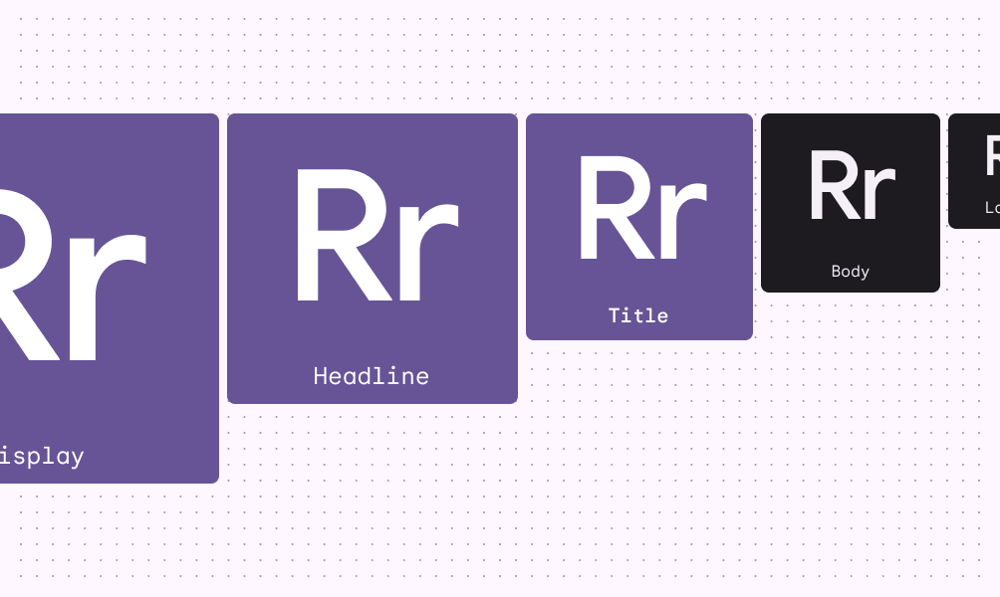
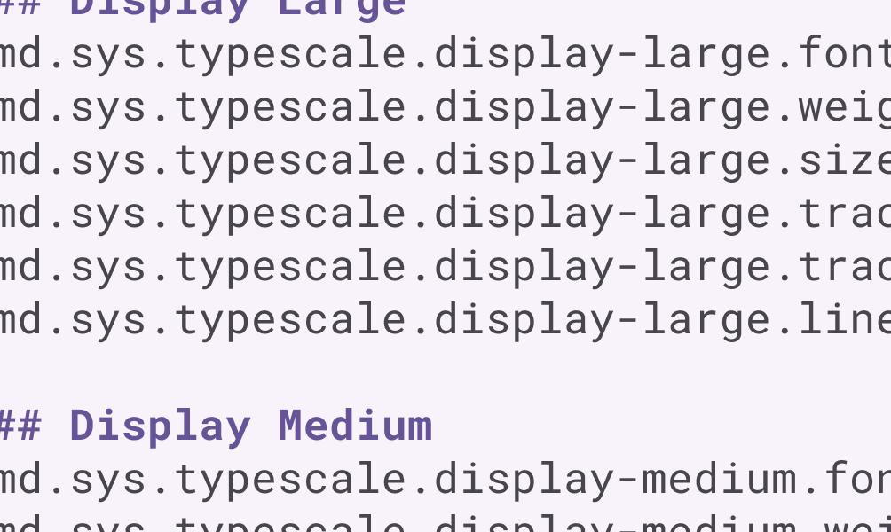

- [概要](#概要)
  - [まとめ](#まとめ)
  - [新機能](#新機能)
    - [可変フォント](#可変フォント)
      - [Roboto Flex と Roboto Serif](#roboto-flex-と-roboto-serif)
    - [5 つの書体スタイ​​ル](#5-つの書体スタイル)
    - [タイポグラフィ トークン](#タイポグラフィ-トークン)

# 概要

タイポグラフィは文章を読みやすく美しくするのに役立ちます。

## まとめ

- 可変フォントは、より高度なタイポグラフィ制御を提供する新しいテクノロジーです。
- 主要な書体スタイ​​ルは、ディスプレイ、見出し、タイトル、本文、ラベルの 5 つです。
- デザイン トークンは、フォント、行の高さ、サイズ、トラッキング、太さなど、デバイス間でタイポグラフィの決定をスケーリングするのに役立ちます。

## 新機能

### 可変フォント

#### Roboto Flex と Roboto Serif

可変フォントとそのカスタマイズ可能な軸を使用する際の最新の考慮事項には、グレード、幅、および光学サイズが含まれます

Roboto FlexとRoboto Serifは、大きな光学サイズで極細から極太まで、流動的なウェイト範囲を備えています。

### 5 つの書体スタイ​​ル

M3 の書体スタイ​​ルは、次の 5 つの役割によって定義されます。

- Display
- Headline
- Title
- Body
- Label

これらの新しい役割はより説明的であり、より幅広いユースケースでより簡単に適用できます。

### タイポグラフィ トークン

以前のバージョンの Material では、タイポグラフィにハードコードされたスタイル値を使用していましたが、 M3 のデザイン トークンは、製品のタイポグラフィを定義するための改善された方法を提供します。

トークンは、設定値ではなく、構成可能な値によって要素の書体スタイ​​ルを割り当てます。

タイプ ロールは、小、中、大などのサイズを記述し、デバイスやコンテキストに適応して対応できるようにします。

タイポグラフィトークンは、デバイスや設定に適応するスケーラブルなサイズを表します。

