- [フォントを適用する](#フォントを適用する)
  - [それぞれの役割](#それぞれの役割)
    - [役割ごとの使用方法一覧](#役割ごとの使用方法一覧)
    - [Display](#display)
    - [Headline](#headline)
    - [Title](#title)
    - [Body](#body)
    - [Label](#label)
  - [フォントの設定（ Typesetting ）](#フォントの設定-typesetting-)
    - [パディングとバウンディング ボックスの使用](#パディングとバウンディング-ボックスの使用)
  - [読みやすさの確保](#読みやすさの確保)
    - [行の高さ](#行の高さ)
    - [幅が均一な数字（ Tabular number / Monospaced number ）](#幅が均一な数字-tabular-number--monospaced-number-)
  - [マテリアル シンボルをタイポグラフィで使用する](#マテリアル-シンボルをタイポグラフィで使用する)
    - [大きさ](#大きさ)
    - [太さ](#太さ)
    - [ベースライン](#ベースライン)
  - [アクセシビリティ](#アクセシビリティ)
    - [色とコントラスト](#色とコントラスト)

# フォントを適用する

階層は、フォントの太さ、サイズ、行の高さ、文字間隔の違いによって伝わります。更新されたフォント スケールでは、スタイルが 5 つの役割に分類され、その役割には目的を表す名前が付けられています。 Display / Headline / Title / Label / Body です。新しい役割はデバイスに依存しないため、さまざまなユース ケースに簡単に適用できます。

## それぞれの役割

### 役割ごとの使用方法一覧

- Display
  - 特徴
    - 特徴的なフォントを使用することが多い
    - 大画面 (タブレットや折り畳みスマホ) で使用されることが多い
    - 周囲に十分な余白を確保して読みやすくすることが多い
  - 使用例
    - アプリのスプラッシュ画面に表示するアプリ名
    - ニュース記事のタイトル
- Headline
  - 特徴
    - 特徴的なフォントを使用することが多い
    - 短い単語に使用することが多い
    - 周囲に十分な余白を確保して読みやすくすることが多い
  - 使用例
    - ダイアログのタイトル
    - ニュース記事の段落ごとの見出し
- Title
  - 特徴
    - Headline に近い使い方がされるが、特徴的なフォントは使用しないことが多い
    - 中程度の長さの文字に使用することが多い
  - 使用例
    - トップアプリバーに表示する文字
- Body
  - 特徴
    - 長い文章に使用することが多い
    - 長い文章でも読みやすいフォントを使用する
  - 使用例
    - ニュース記事の本文
    - 何かの説明文
    - 一文程度の箇条書き
- Label
  - 特徴
    - 短い単語に使用することが多い
  - 使用例
    - ボタンのテキスト
    - ニュース記事の更新日時

### Display

デフォルトのフォント スケールには、 Large / Medium / Smasll の 3 つの表示スタイルがあります。画面上で最も大きなテキストであるため、表示スタイルは短く重要なテキストや数字に使用されます。大画面で最も効果的です。

Display のフォントには、手書きやスクリプト スタイルなど、より表現力豊かなフォントを選択することを検討してください。

使用可能な場合は、使用状況に合わせて適切な光学サイズを設定します。

以下の図は、表現力豊かな書体を Display スタイルに使用した例です。

以下は、 Display サイズを使用したカードの例です。フォント自体は、あまり特徴がありませんが、サイズを大きくしたい場合には有効な使い方です。

表現力豊かな書体は、目を引くデザインで読者を惹きつけることができます。

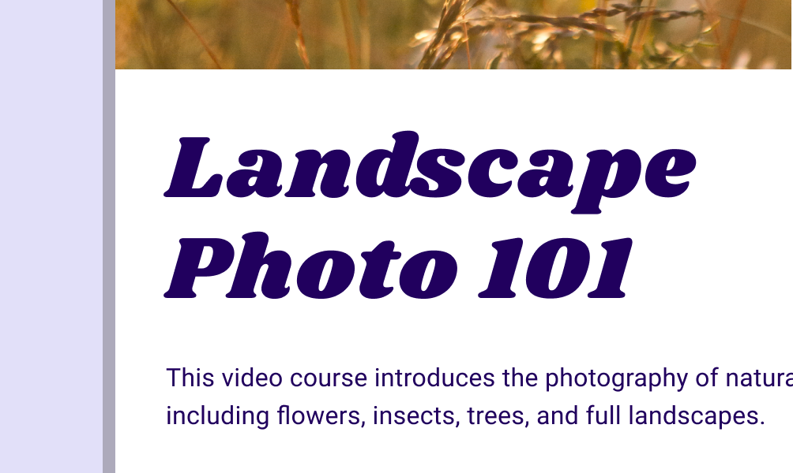

### Headline

Headline は、小さい画面で強調表示が必要な短いテキストに最適です。これらのスタイルは、テキストの主要な部分やコンテンツの重要な領域をマークするのに適しています。

見出しでは、読みやすさを維持するために適切な行の高さと文字間隔も組み込まれていれば、表現力豊かな書体を使用することもできます。

表現力豊かな書体は見出しスタイルにも使用できます

小さな画面上の短いテキストに使用される Headline スタイル

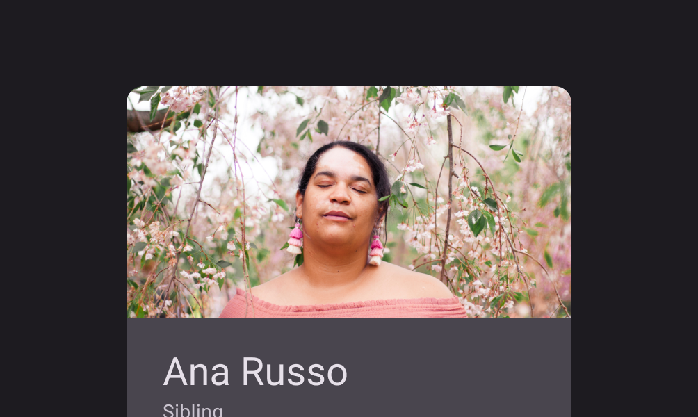

Headline スタイルを使用したダイアログ

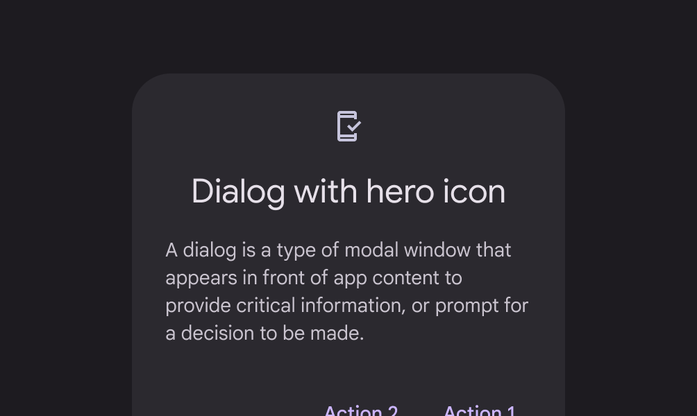

### Title

Title は Headline スタイルよりも小さく、比較的短い中程度の強調テキストに使用する必要があります。たとえば、 Title スタイルを使用して、テキストの二次的な部分やコンテンツの二次的な領域を分割することを検討してください。

Title の場合、 Display スタイル、手書きスタイル、スクリプト スタイルなどの表現力豊かなフォントを使用するときは注意してください。

注目を集めるために Title スタイルを使用したニュース記事のタイトル

Title スタイルを使用したトップアプリバー

カテゴリ ヘッダーに適用された Title スタイルの例 ( Top News の部分)

### Body

Body スタイルは、アプリ内の長い文章に使用されます。

Body スタイル用の書体を使用してください。これは、小さいサイズでも読みやすく、長い文章でも快適に読むことができます。

表現力豊かなフォントや装飾的なフォントは、小さいサイズでは読みにくくなる可能性があるため、本文テキストには使用しないでください。

Body スタイルは長い文章でも読みやすいものでなければならない

ペストに関する記事全体で使用されている Body スタイル

セットアップフロー全体で使用される Body スタイルの例

### Label

Label スタイルは、コンポーネント内のテキストや、キャプションなどのコンテンツ本体内の非常に小さいテキストなどに使用される、より小さい実用的なスタイルです。

たとえば、ボタンでは、 Label の Large スタイルが使用されます。

Label スタイルは、ボタンなどの小さなサイズでも素早く読み取れるようにする必要があります。

経過時間に Label スタイルを使用する音楽プレーヤー

アイコンテキストに Label スタイルを使用するナビゲーションバー

## フォントの設定（ Typesetting ）

縦書きの Typesetting では、パディング、バウンディング ボックス、ベースラインを利用して、あらゆるサイズでテキストの読みやすさを確保します。

Typesetting 、テキストのサイズ変更、密度、アダプティブ レイアウトでのテキストの使用を決定する際には、エンジニアリング上の考慮事項とプラットフォームの規則を考慮してください。

### パディングとバウンディング ボックスの使用

該当する場合は、 Web 製品と iOS 製品にこの方法を使用します。一部のデザイン ツールでも Typesetting にバウンディング ボックスが使用されていますが、その方法はさまざまであり、エンジニアリング実装と調整する必要があることに注意してください。

Web UI では、行の高さとバウンディング ボックスの高さは同じです。テキストは、 CSS で確立された [「ハーフ リーディング」](https://www.w3.org/TR/css-inline-3/#leading-trim) 動作に従って、バウンディング ボックス内で垂直方向に中央揃えされます。

テキストの垂直位置は直接制御されるのではなく、バウンディング ボックスとフォント メトリックの組み合わせによって制御されます。

バウンディング ボックスの高さは指定された行の高さによって定義され、テキストの上下に均等なスペースが配置されます。

パディングとは、画像とバウンディング ボックスの間や、バウンディング ボックスの内側の端とテキストの間など、 UI 要素間のスペースです。

テキスト バウンディング ボックスの周りに存在するパディング

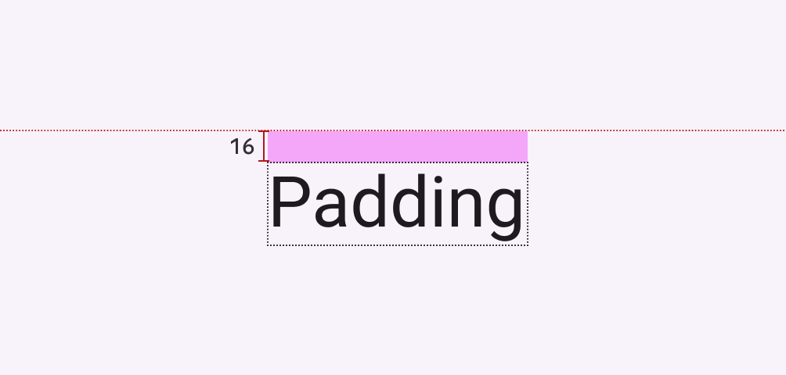

コンテナの端などの固定参照ポイントからの UI 要素の距離を指定します。Web の場合は、Sass または CSS を使用してこの計算を自動化します。

ウェブと iOS でのタイポグラフィを設定するために、行の高さ、パディング、コンテナの測定値を使用します。

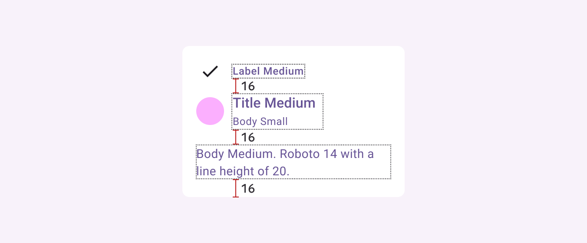

パディングとバウンディング ボックスを使用した垂直方向の配置:

1. **行の高さ**

バウンディング ボックスの高さを計測します

2. **中央揃え**

中央揃えを使用して、バウンディング ボックスの内側のエッジの周りに上下のパディングが均等になるようにします

3. **要素全体の高さ**

バウンディング ボックスの高さと上下のパディングを使用して、要素全体の高さを決定します

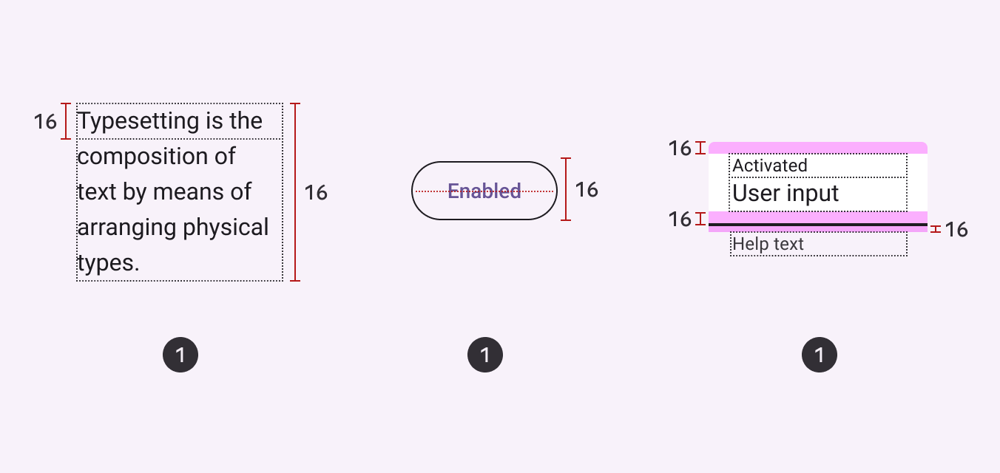

## 読みやすさの確保

### 行の高さ

行の高さは、テキストの各行間のスペースであり、文字サイズに直接関係しています。

Material の文字トークンは、意図されたサイズと用途に合わせて最適化されています。

**Title / Headlien / Display などのスタイルを使用して大きな文字を読みやすくするには、文字サイズの 1.2 倍の行の高さ比を推奨します。**

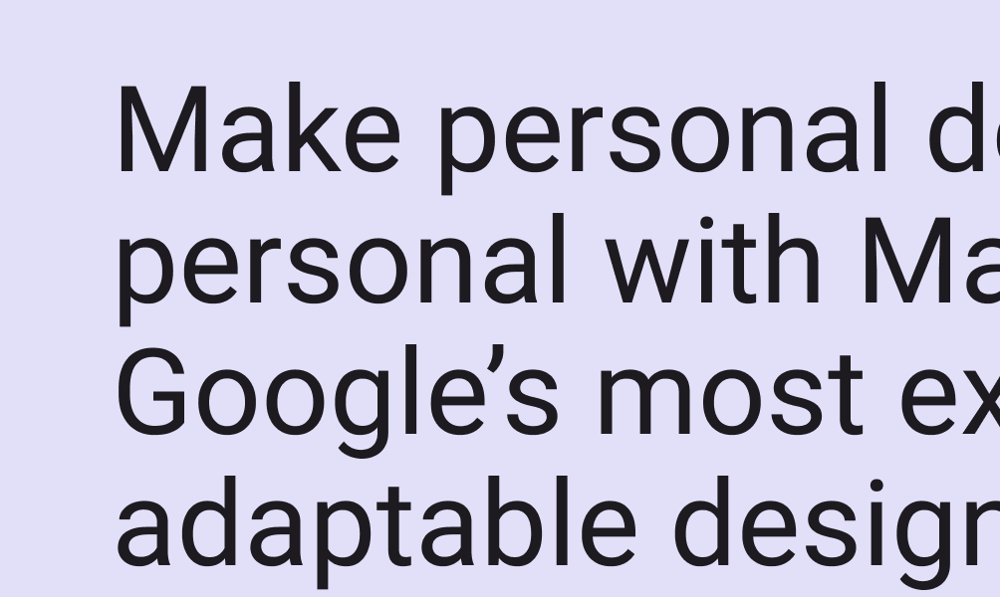

**Body / Label などのスタイルを使用する小さな本文の場合、行の高さの比率を文字サイズの約 1.5 倍にすることをお勧めします。** 行の高さが狭すぎると、テキストの流れが悪くなります。逆に、行の高さが広すぎると、行にまとまりがなくなります。

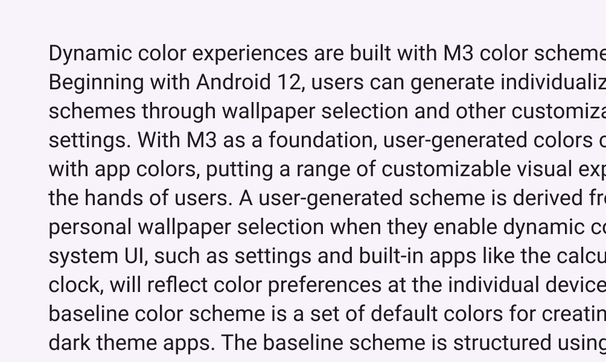

### 幅が均一な数字（ Tabular number / Monospaced number ）

数値計算や時計など、値が頻繁に変わる場所では、比例幅数字ではなく等幅数字 ( Tabular number / Monospaced number ) を使用します。

等幅数字を使用すると、値が視覚的に揃い、スキャンしやすくなります。

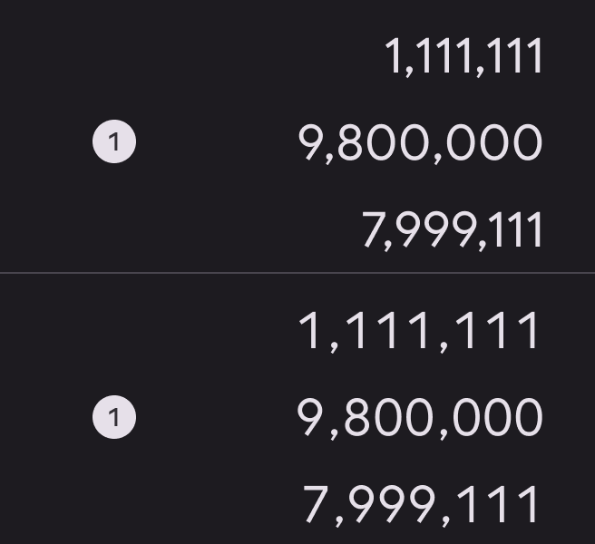

1. 比例幅
2. 等幅

時計の UI など、値が変更されたときにレイアウトがシフトするのを防ぐために、等幅数字を使用します。

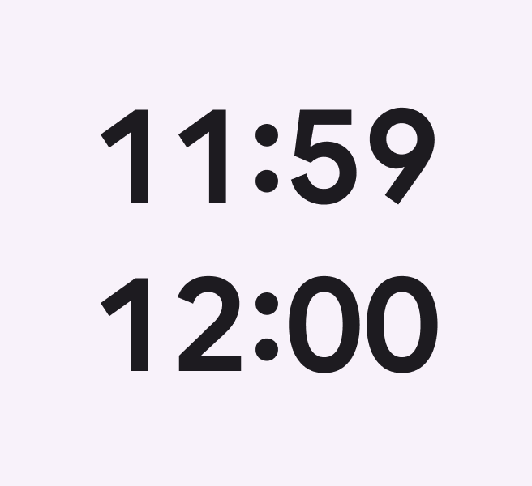

## マテリアル シンボルをタイポグラフィで使用する

マテリアル シンボルは書体と同様の配慮で設計されており、多くの場合、テキストと一緒に表示されます。適切なアイコン セットを選択すると、シンボルとコンテンツを結び付けることができ、製品のブランド統一感を高めることができます。

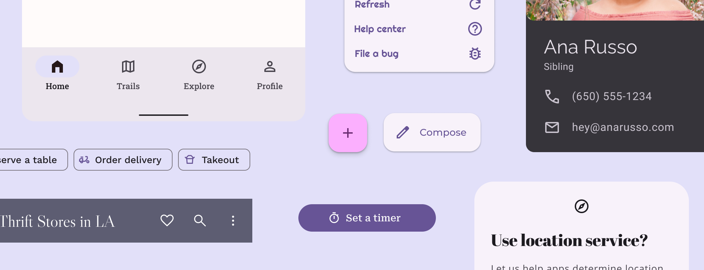

### 大きさ

以下の例は、マテリアルシンボルとテキストに同じサイズを指定した良い例です。

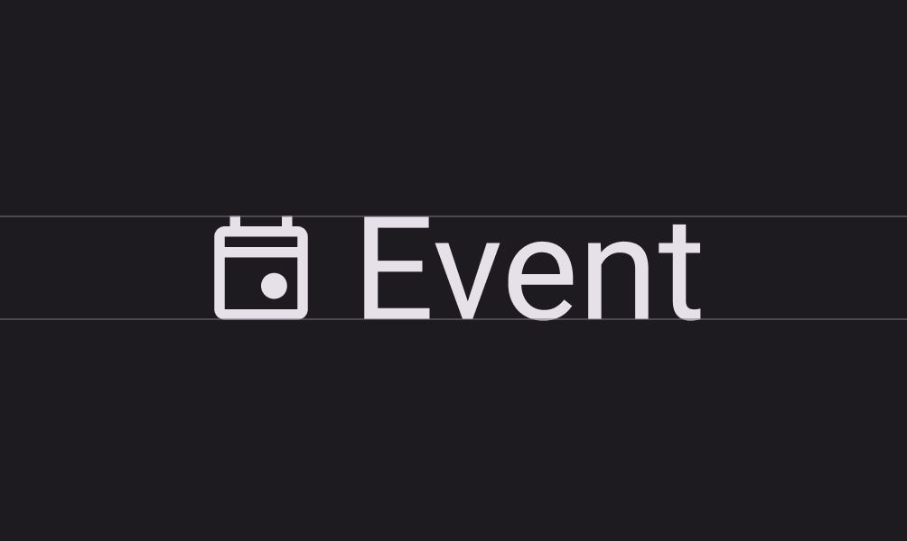

以下の例は、シンボルとテキストのサイズを別々にしてしまった悪い例です。

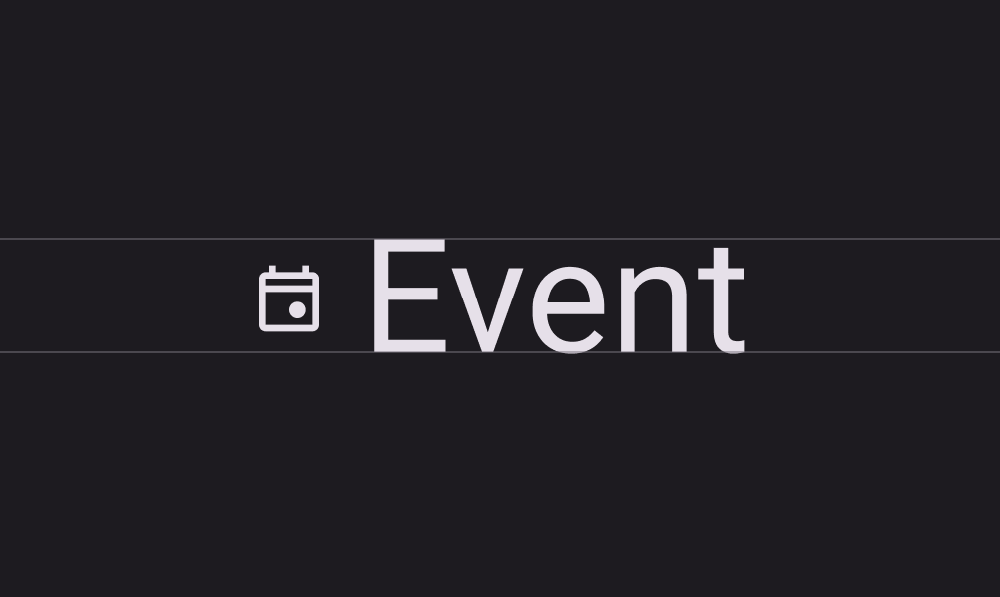

### 太さ

以下の例は、マテリアルシンボルとテキストに同じ太さを指定した良い例です。

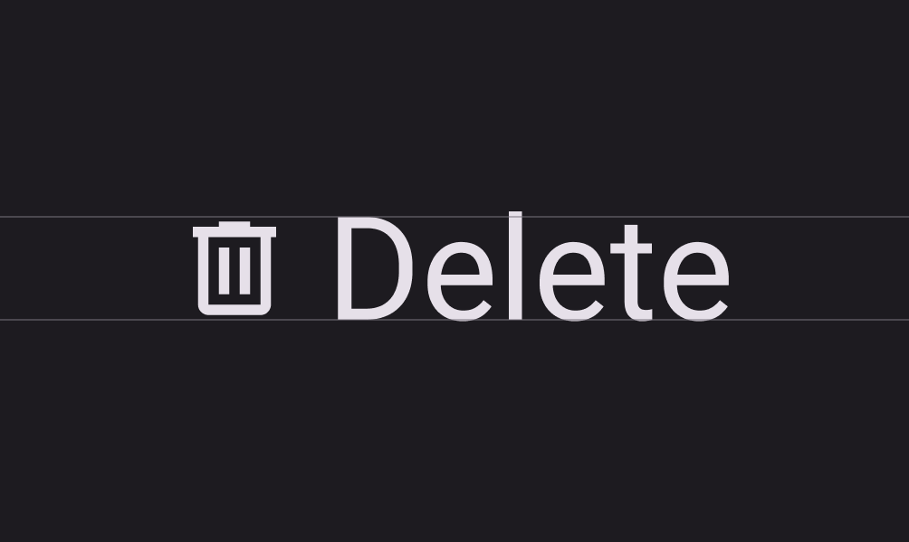

以下の例は、シンボルとテキストの太さを別々にしてしまった悪い例です。

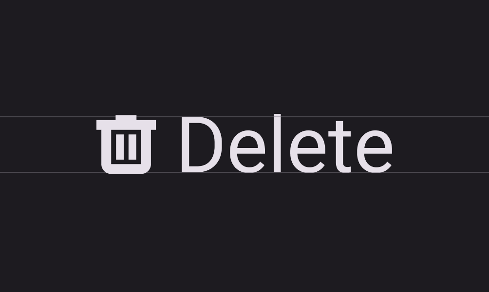

### ベースライン

以下の例は、シンボルのベースラインをテキストサイズの約 11.5 % まで下げた良い例です。

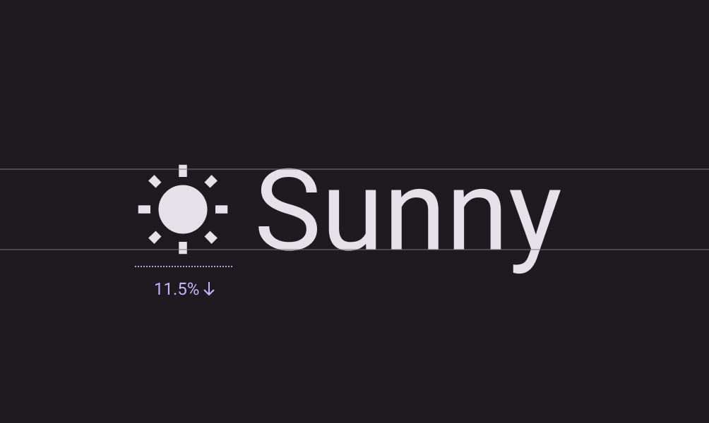

以下の例は、マテリアルシンボルとテキストに同じベースラインを使用してしまった悪い例です。

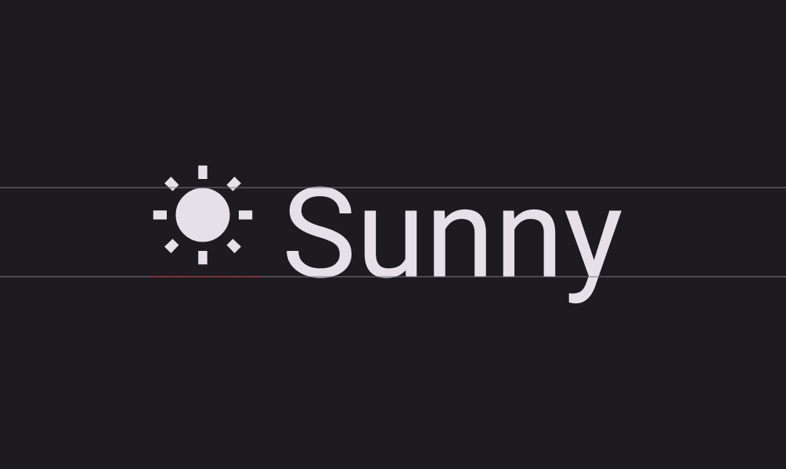

## アクセシビリティ

### 色とコントラスト

製品のテキストと背景の色のコントラストを適切に選択して、視覚的なアクセシビリティをサポートします。コントラストとは、2 つの色の明るさまたは暗さの知覚される差であり、コントラスト比によって定量化されます。主要なコントラスト比は、アクセシビリティに十分なコントラストのレベルを示します。

[コントラストとアクセシビリティの詳細](https://m3.material.io/m3/pages/designing/color-contrast)

Label タイルは、ボタンなどの小さなサイズでも素早く読み取れるようにする必要があります。

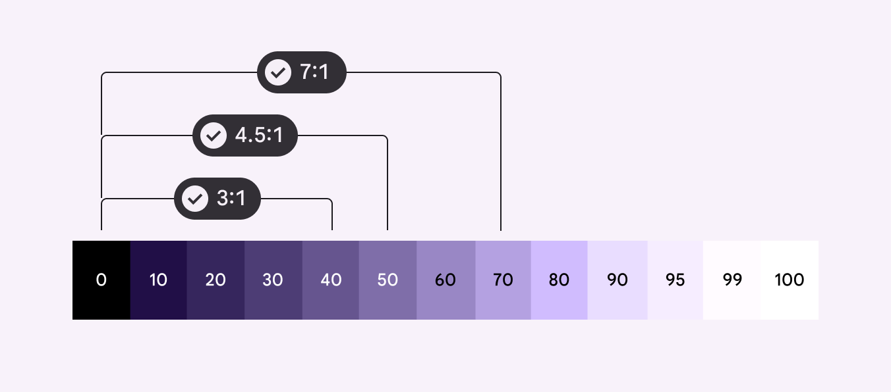

テキストの色と背景の色の間には十分なコントラストが必要です。十分なコントラストは、 **テキストのサイズ** と **必要なアクセシビリティのレベル** によって異なります。

[テキストのコントラスト要件の詳細](https://m3.material.io/m3/pages/designing/color-contrast#b248ecd2-9abd-4877-8f5e-ebfbb87e2048)

WCAG 準拠のためには、大きなテキストのコントラスト比は 3 : 1 以上にする必要があります。以下の図は、 4.5 : 1 のコントラストなので、大きな文字も問題なく読むことができます。

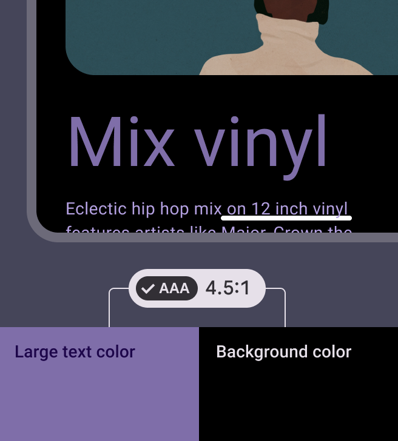

WCAG 準拠のためには、小さなテキストのコントラスト比は 4.5 : 1 以上にする必要があります。以下の図は、 7 : 1 のコントラストなので、小さな文字も問題なく読むことができます。

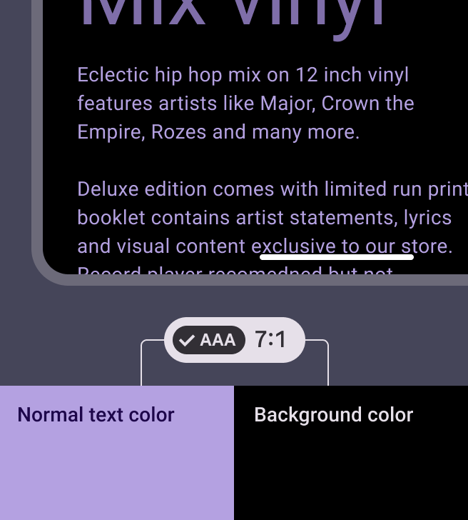

タイポグラフィのデフォルトの色は On Surface ですが、強調度を下げたい場合には On Surface Variant を使用できます。

Surface の色の上に表示されるハイパーリンク テキストには、 Primary を使用します。ただし、リンクを目立たなくするには、 Tertiary を使用できます。

ハイパーリンク テキストには下線も付ける必要があります。

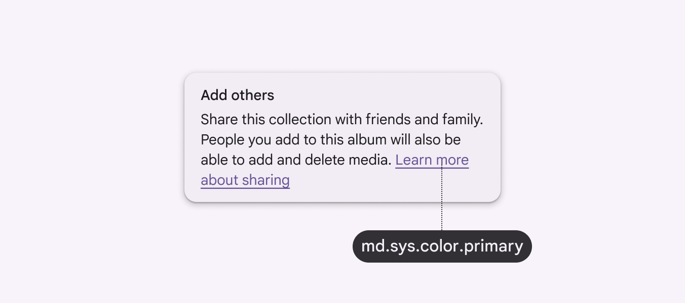

