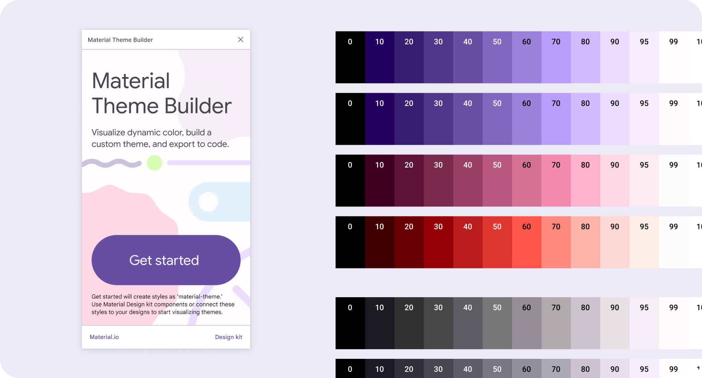
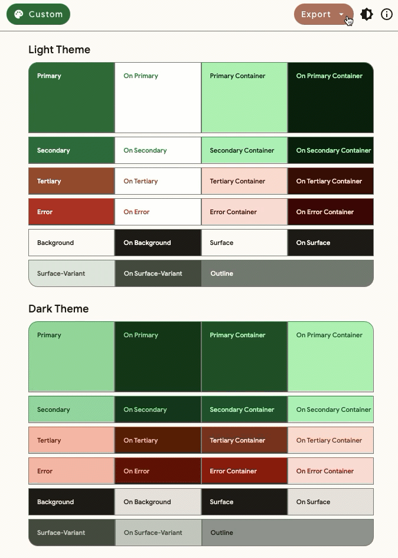
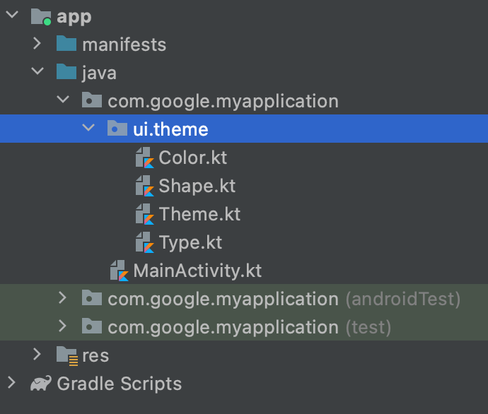

- [Material Theme Builder を導入する](#material-theme-builder-を導入する)
  - [クイック リンク](#クイック-リンク)
  - [デザイン トークンを利用したテーマ](#デザイン-トークンを利用したテーマ)
  - [動的な色を視覚化](#動的な色を視覚化)
  - [カスタムテーマを構築する](#カスタムテーマを構築する)
  - [コードへのエクスポート](#コードへのエクスポート)
    - [Compose Material 3 (Kotlin)](#compose-material-3-kotlin)
    - [MDC-Android (XML)](#mdc-android-xml)
    - [デザイン システム パッケージ](#デザイン-システム-パッケージ)
  - [構築を開始する](#構築を開始する)
  - [引用元資料](#引用元資料)

# Material Theme Builder を導入する

動的な色を視覚化し、カスタムテーマを構築し、コードにエクスポートします。

Material Theme Builder は、 Material You のダイナミック カラーを視覚化し、カスタムの Material Design 3 テーマを作成するのに役立つ新しいツールです。組み込みのコード エクスポート機能を使用すると、 Material の新しいカラー システムに移行して、ダイナミック カラーを活用するのが簡単になります。

## クイック リンク

[Figma プラグインの Material Theme Builder](https://goo.gle/material-theme-builder-figma) をインストールするか、 [Web で Material Theme Builder を試して](https://goo.gle/material-theme-builder-web) 、新しい [Material 3 Design Kit](http://goo.gle/m3-design-kit) を入手してください。

## デザイン トークンを利用したテーマ

Material Design は、さまざまなスタイルの選択を表現するようにカスタマイズできます。テーマとは、製品の外観を定義する一連のスタイルの選択です。Material Design 3 では、システムのビジュアル スタイルを反映する、小さくて再利用可能なデザイン決定であるデザイン トークンを導入しています。静的な値ではなくトークンを使用して構築することで、デザインとコードが信頼できる情報源を共有します。

当社の [Material 3 デザイン キット](http://goo.gle/m3-design-kit) と [Material 3 コンポーネント ライブラリ](http://m3.material.io/) は、新しいデザイン トークンと割り当てられた役割を反映するように更新されました。Figma では、Material Theme Builder がこれらのトークンを Figma スタイルとして生成します。Material Theme Builder は、デザイン トークンを ~~[デザイン システム パッケージ ( DSP )](https://github.com/material-foundation/material-tokens) として直接エクスポートし、~~ **( 2024 年 10 月現在、 DSP 形式のエクスポートは存在していない。 JSON 形式のエクスポートは存在しているが、この形式は DSP 形式とはまた別の形式である。)** Android Views と Jetpack Compose 上の当社の Material 3 ライブラリのテーマ コードを作成します。

## 動的な色を視覚化

ダイナミックカラーは、Material You で重要な役割を果たし、ユーザー向けに個性的で表現力豊かなエクスペリエンスを生み出します。デザイントークンとそれに割り当てられたカラーロールにより、アプリは、事前設定されたカラー値の代わりに、あらゆるダイナミックカラースキームをシームレスに受け入れることができます。

Web 上の Material Theme Builder では、壁紙のダイナミックカラーが UI でどのように表現されるかを垣間見ることができます。Figma プラグインを使用すると、ダイナミックカラーがデザイン全体でどのように表現されるかを確認できます。まず、デザイントークンの Figma スタイルをカスタムコンポーネントに手動でマッピングするか、Material 3 デザインキットのコンポーネントを使用して UI を構築する必要があります。

マテリアル デザイン トークンを使用して UI を構築したら、デザインの要素またはフレームを選択し、「スワップ」をクリックしてマテリアル テーマ スタイルを適用します。これで、マテリアル テーマ ビルダーで行った変更が UI に反映されます。選択中に、月と太陽のアイコン ボタンをクリックすると、明るいテーマと暗いテーマを切り替えることができます。

## カスタムテーマを構築する

Material You で導入された最新の機能を活用するには、Material Design 3 に移行する必要があります。Material 3 テーマは、新しいカラー ロールを導入し、他のカラー ロールを廃止することで、Material 2 のカラー スペースを拡張します。Web 上の Material Theme Builder と Figma を使用すると、ブランドやスタイルに基づいてカスタム カラー スキームを簡単に作成できます。カスタム テーマを作成したら、コードをエクスポートして、Android Views または Jetpack Compose 用の Material Design 3 ライブラリで使用できます。

新しい Material 3 テーマの更新に関する詳細なガイドについては、 [移行ガイド](http://material.io/blog/migrating-material-3) をご覧ください。

## コードへのエクスポート

Material Theme Builder を使用すると、テーマコードを複数の形式 (Android Views (XML)、Jetpack Compose (Kotlin)、 ~~Design System Package (DSP))~~ **( DSP 形式は 2024 年 10 月現在、エクスポートがサポートされていません)** にエクスポートできます。

Material Theme Builder 内にはサーフェスの色 (Surface 1 - 5) が表示され、標高に基づいてサーフェスの色調を視覚化するのに役立ちます。ただし、これらのサーフェスの色調はコードにエクスポートされません。実際の色の値は、Android 内で標高を設定することによって計算されます。Android で標高を設定する方法の詳細については、 [MDC-Android](https://m3.material.io/libraries/mdc-android/color-theming) および [Compose Material 3](https://developer.android.com/jetpack/compose/themes/material?_gl=1*11xgyzk*_ga*NjEyNTQzNDc0LjE2OTYzMjY0ODA.*_ga_QPQ2NRV856*MTcyOTY3MjE2NS43NC4xLjE3Mjk2NzQ1OTUuMC4wLjA.#elevation) のドキュメントを参照してください。

### Compose Material 3 (Kotlin)

Compose Material 3では、 `ui/theme` ディレクトリにテーマファイルを保存します。

Material Theme Builder は、適切なデザイン トークン マッピングを使用して MaterialTheme を設定する `Theme.kt` をエクスポートします。 `Color.kt` には、カスタム テーマのカラー値が格納されます。UI の Colors.kt で定義された値ではなく、 `MaterialTheme.colors` を介して MaterialTheme コンポーザブルに提供されるカラーを参照することを強くお勧めします。これにより、動的なカラーを受け入れ、ライト テーマとダーク テーマを簡単に切り替えることができます。

### MDC-Android (XML)

MDC-Android では、 `res/values` および `res/values-night` ディレクトリにテーマファイルを保存します。

Material Theme Builder は、colors.xml と、ライト テーマとダーク テーマの両方の themes.xml ファイルをエクスポートします。UI でハードコードされた @color 値ではなく、?attr/colorPrimary などの Android カラー属性を参照することを強くお勧めします。これにより、動的な色を受け入れ、ライト テーマとダーク テーマを簡単に切り替えることができます。

### デザイン システム パッケージ

Material Design は、Material Theme Builder 内でマテリアル トークンをインポートおよびエクスポートするためのデザイン システム パッケージ (DSP) をサポートするようになりました。DSP は、デザイナーと開発者のワークフロー ツールおよびマテリアル コンポーネント ライブラリで使用できます。 ~~Visual Studio Code 用の Adob​​e XD 拡張機能をダウンロードしてインストールし、DSP ファイルを製品に統合します。~~ (←現在は存在しない拡張機能です。) [ハウツー ガイド](https://github.com/material-foundation/material-tokens) をお読みください。

## 構築を開始する

Material Design 3 でこれらの更新と、プロセスでデザイナーと開発者をサポートする更新されたツールをお届けできることを大変嬉しく思っています。

- [Material Theme Builder を Figma プラグインとしてインストール](https://goo.gle/material-theme-builder-figma)
- [Web 上の Material Theme Builder](https://goo.gle/material-theme-builder-web)
- [デザイン ラボ: アプリで動的な色を視覚化する](https://goo.gle/visualize-dynamic-color)
- [コードラボ: 動的な色を適用する](https://goo.gle/apply-dynamic-color)

[Schema 2021 での講演](https://youtu.be/clDuqcKgNBQ) をご覧ください。Ivy Knight と Rody Davis が Material Theme Builder の実現について語ります。 [Material Design YouTube チャンネル](https://www.youtube.com/MaterialDesign) を購読し、Twitter で @MaterialDesign をフォローしてください。

## 引用元資料

- [Introducing Material Theme Builder](https://m3.material.io/blog/material-theme-builder)

