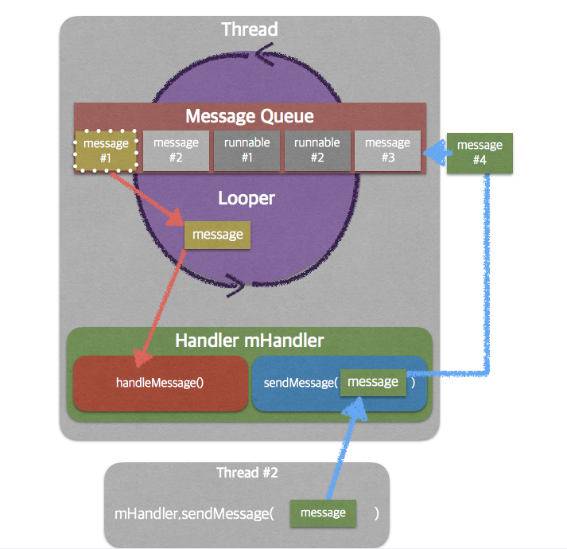

<!-- TOC START min:1 max:3 link:true asterisk:false update:true -->
- [Handler_Looper](#handler_looper)
	- [全体像](#全体像)
	- [Handler](#handler)
		- [主なメソッド](#主なメソッド)
	- [Looper](#looper)
	- [メッセージキュー](#メッセージキュー)
	- [Message](#message)
	- [HandlerThread](#handlerthread)
<!-- TOC END -->


# Handler_Looper

## 全体像




## Handler

- Handlerとは
	- スレッド内に一つ存在する。
	- スレッド間通信のための部品である。
	- 新たに生成すると、生成したスレッドとそのスレッドのLooperにひもづく。
	- 他のスレッドからメッセージ/タスクを受け取り、自身のMessage Queueに格納する。
		- スレッドAからスレッドBへメッセージ/タスクを送るには、スレッドAからスレッドBのHandlerを取得し、そのHandlerのpostメソッドやsendMessageメソッドを呼び出す。
	- Looperからメッセージ/タスクを受け取り、処理を行う。

- その他
	1. `Message`や`Runnable`を将来のある時点で実行するようにスケジューリングする。
	2. 他のスレッドに処理を移譲する。


```java
// 引数なしの場合
//  このHandlerはHandlerを生成したスレッドにひもづきます。
Handler handler = new Handler();
// 引数ありの場合
//  このHandlerは、引数で渡したLooperがひもづいているスレッドにひもづきます。
Handler handler = new Handler(Looper.getMainLooper());
```


```java
// メッセージキューにタスクを格納する方法
handler.post(new Runnable() {
    @Override
    public void run() {
        // Handlerがひもづくスレッド上で実行させたい処理
    }
});
```


### 主なメソッド

`post(Runnable)`
`postAtTime(java.lang.Runnable, long)`
`postDelayed(Runnable, Object, long)`
`sendEmptyMessage(int)`
`sendMessage(Message)`
`sendMessageAtTime(Message, long)`
`sendMessageDelayed(Message, long)`

`sendEmptyMessage`は、メッセージの本文は持たずに、メッセージの分類（int型）のみを渡すメソッドである。


## Looper

- Looperとは
	- スレッド内に一つ存在する。
	- Message Queueからメッセージ/タスクを取り出し、Handlerに渡す。


```java
// メインスレッドのLooperを取得する方法
Looper looper = Looper.getMainLooper();
// 現在のスレッドのLooperを取得する方法
Looper looper = Looper.myLooper();
```


ワーカースレッドにはLooperは存在していません。生成するには以下のように`prepare()`メソッドを実行します。

```java
public class MyThread extends Thread {
    @Override
    public void run() {
        // Looperを初期化
        // Looperは自分を初期化したスレッドにひもづく
        Looper.prepare();
        // 無限ループ（Message/Taskの取得ループ）開始
        Looper.loop();
    }
}
```


## メッセージキュー

- メッセージキューとは
	- スレッドは、メッセージキューを一つ持つ。
	- スレッド上で処理を実行する時には、そのスレッドに紐付くメッセージキューからオブジェクトを取り出して、順次、処理を実行していく。
	- メッセージキューには、タスク(Runnableオブジェクト)とメッセージ(int型の値)を格納することができる。
		- メッセージには、処理の分類コードや処理結果を格納する。


## Message

- Messageとは
	- スレッド間通信でデータを渡すためのラッパークラスである。
	- obtain()メソッドで生成済みのMessageインスタンスを使い回すとパフォーマンスが良い。


**SampleUIThread.java**

```java
// Message受信側の実装
Handler handler = new Handler() {

	@override
	public void handleMessage(Message msg) {
		switch(msg.what) { // whatがメッセージの分類
			case 1:
				// msg.objはObject型なのでキャストする必要がある。objがメッセージの本文。
				Log.d("Handler", (String)msg.obj);
				break;

			・・・

			default :
				break;
		}
	}

	// MessageがHandlerに渡されたときは、handleMessageで受け取って処理をするが、
	// Runnableが渡されたときは、それを受け取るコールバックは存在せず、Runnnableに
	// 記載されたタスクが自動的に実行される。
}
```

**SampleTaskThread.java**

```java
// Message送信側の実装
class TaskTread extends Thread {
	private Handler handler;

	public TaskThread(Handler handler) {
		// Handlerの代わりにLooperを渡して、そのLooperからHandlerを生成してもOK.
		this.handler = handler;
	}

	@override
	public void run() {
		// do something.

		// newで生成するより、
		// Handler.obtainMessage()とするか
		// Message.obtain()とするとプールしているMessageオブジェクトを再利用するため効率が良い。
		Message msg = Message.obtain();
		msg.what = 1;

		// 結果がString型のresultにあると仮定
		msg.obj = result;
		handler.sendMessage(msg);
	}
}
```


**Messageオブジェクトの使用方法**

<フィールド>

- what
	- メッセージの分類を区別するための分類コード
	- int型
- obj
	- メッセージの本文
	- Object型なので、どんな型のデータも格納できる
- sendingUid
	- メッセージの送信者を区別するためのID。user IDの略。
	- int型
- arg1
	- 使い方は色々
	- int型のデータで十分な場合は、Object型のobjフィールドを使用するよりもリソースが削減できる。
	- int型
- arg2
	- arg1と同様

<メソッド>

- getData()
	- Bundle型のデータをメッセージから取り出す
- setData()
	- Bundle型のデータをメッセージへ格納する


## HandlerThread

ThreadクラスはLooperやメッセージキューを持っていません。HandlerThreadクラスはそれらを持っているため、作成の手間を省くことができます。
HandlerThreadのインスタンスが生成されるとそのスレッドのLooperのループが開始されます。

`IntentService`は内部的に`HandlerThread`を使用しており、`Context#startService(Intent)`で渡された`Intent`を順に`Handler`を経由して`HandlerThread`に渡しています。これによって、簡易的なジョブキューの仕組みが実現されています。
