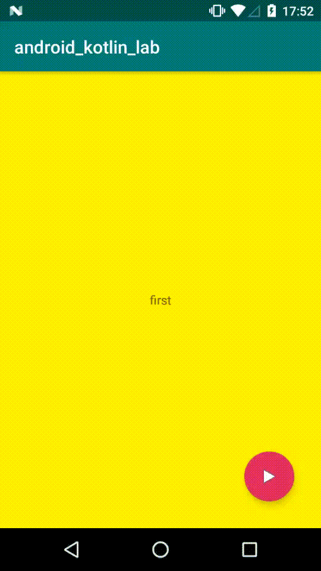

<!-- TOC depthFrom:1 depthTo:6 withLinks:1 updateOnSave:1 orderedList:0 -->

- [トランジションドローワブル](#トランシショントローワフル)
	- [概要](#概要)
	- [xmlファイルでリソースを定義する方法](#xmlファイルでリソースを定義する方法)
	- [上記で定義したxmlファイルの使用方法](#上記で定義したxmlファイルの使用方法)

<!-- /TOC -->


# トランジションドローワブル

## 概要

2つのDrawableリソース間をクロスフェード(※1)できるドローアブルを定義するXMLファイル。

(※1)一つはフェードイン、もう一つはフェードアウトするアニメーション
(フェードインは徐々に現れるやつ。フェードアウトは徐々に消えるやつ。)




## xmlファイルでリソースを定義する方法

以下のサンプルでは、`Drawable`クラスを継承した`TransitionDrawable`インスタンスを生成します。

```XML
<!-- res/drawable/expand_collapse.xml -->
<transition xmlns:android="http://schemas.android.com/apk/res/android">
    <item android:drawable="@drawable/image_expand">
    <item android:drawable="@drawable/image_collapse">
</transition>
```

## 上記で定義したxmlファイルの使用方法

以下は`TransitionDrawable`を`ImageView`にセットするサンプルです。

```Java
Resources res = context.getResources();
TransitionDrawable transition =
    (TransitionDrawable) ResourcesCompat.getDrawable(res, R.drawable.expand_collapse, null);

ImageView image = (ImageView) findViewById(R.id.toggle_image);
image.setImageDrawable(transition);

// Transitionが行われる前のitemに関するDescription
image.setContentDescription(getResources().getString(R.string.collapsed));

// Transitionの開始
transition.startTransition(1000);

// Transitionが終わったらTransition後のitemに関するDescriptionを設定します。
```

