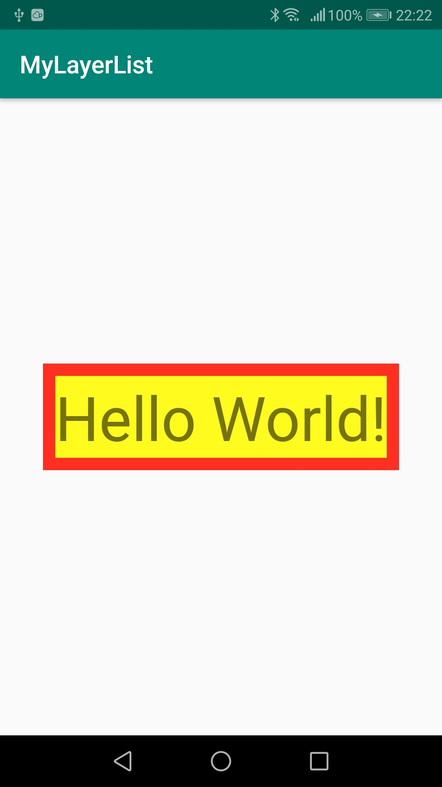

<!-- TOC depthFrom:1 depthTo:6 withLinks:1 updateOnSave:1 orderedList:0 -->

- [レイヤー_複数層リソース](#レイヤー_複数層リソース)
	- [概要](#概要)
	- [コード](#コード)
	- [画面表示](#画面表示)

<!-- /TOC -->


# レイヤー_複数層リソース

## 概要

`<layer-list>`タグを使用すると、複数のDrawableリソースを重ねて、一つのDrawableリソースとして扱うことができます。


## コード

以下のコードは、TextViewの背景に下層は赤色のレイヤ、上層は黄色のレイヤを配置した例です。


**activity_main.xml**

```xml
<?xml version="1.0" encoding="utf-8"?>
<androidx.constraintlayout.widget.ConstraintLayout xmlns:android="http://schemas.android.com/apk/res/android"
    xmlns:app="http://schemas.android.com/apk/res-auto"
    xmlns:tools="http://schemas.android.com/tools"
    android:layout_width="match_parent"
    android:layout_height="match_parent"
    tools:context=".MainActivity">

    <TextView
        android:layout_width="wrap_content"
        android:layout_height="wrap_content"
        android:text="Hello World!"
        android:textSize="50sp"
        android:background="@drawable/layer_list"
        app:layout_constraintBottom_toBottomOf="parent"
        app:layout_constraintLeft_toLeftOf="parent"
        app:layout_constraintRight_toRightOf="parent"
        app:layout_constraintTop_toTopOf="parent" />

</androidx.constraintlayout.widget.ConstraintLayout>
```


**layer_list.xml**

```xml
<?xml version="1.0" encoding="utf-8"?>
<layer-list xmlns:android="http://schemas.android.com/apk/res/android">

    <!-- xmlで上に書くほど下層のレイヤになります。 -->
    <item android:drawable="@drawable/red_rectangle" />

    <item>
        <inset android:inset="10dp">
            <shape android:shape="rectangle">
                <solid android:color="@color/colorYellow" />
            </shape>
        </inset>
    </item>

</layer-list>
```


**red_rectangle.xml**

```xml
<?xml version="1.0" encoding="utf-8"?>
<shape xmlns:android="http://schemas.android.com/apk/res/android"
    android:shape="rectangle">

    <solid android:color="@color/colorRed"/>

</shape>
```


## 画面表示

上記のコードを画面に表示すると以下のようになります。




