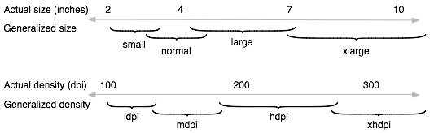

<!-- TOC START min:1 max:3 link:true asterisk:false update:true -->
- [Google Play におけるアプリ公開のフィルタリング](#google-play-におけるアプリ公開のフィルタリング)
  - [概要](#概要)
  - [フィルタリングはアプリのバージョンごとに設定される](#フィルタリングはアプリのバージョンごとに設定される)
  - [アプリ ID を直接指定したリンクからでもアプリは表示されない](#アプリ-id-を直接指定したリンクからでもアプリは表示されない)
  - [Google Play ウェブサイト上のフィルタリング](#google-play-ウェブサイト上のフィルタリング)
  - [マニフェストファイルによるフィルタリング](#マニフェストファイルによるフィルタリング)
    - [画面サイズによるフィルタリング](#画面サイズによるフィルタリング)
    - [ハードウェア機能によるフィルタリング（uses-configuration）](#ハードウェア機能によるフィルタリングuses-configuration)
    - [ハードウェア機能によるフィルタリング（uses-feature）](#ハードウェア機能によるフィルタリングuses-feature)
    - [パーミッションによるフィルタリング](#パーミッションによるフィルタリング)
    - [uses-feature と uses-permission の違い](#uses-feature-と-uses-permission-の違い)
    - [uses-permission を宣言する場合には、対応する uses-feature も宣言する](#uses-permission-を宣言する場合には対応する-uses-feature-も宣言する)
    - [minSdkVersionによるフィルタリング](#minsdkversionによるフィルタリング)
  - [Play Console によるフィルタリング](#play-console-によるフィルタリング)
<!-- TOC END -->


# Google Play におけるアプリ公開のフィルタリング

## 概要

Google Play は、アプリを表示するかどうかを決定する際に、デバイスのハードウェア要件と  
ソフトウェア要件を確認し、同時に携帯通信会社、ロケーション、その他の特性も確認します。  
次にこれらを、アプリのマニフェストファイルと公開情報 (Play Console) で指定されている  
制限事項や依存関係と比較します。  
フィルタルールに基づいてアプリがデバイスに対応していれば、 Google Play はそのアプリをユーザーに表示します。  
対応していない場合、 Google Play は、検索結果やブラウジング結果にそのアプリを表示しません。

フィルターに複数の条件を設定している場合には、どれか一つでも条件を満たさない場合には、  
アプリは表示されません。


## フィルタリングはアプリのバージョンごとに設定される

たとえば、あるユーザーがアプリをインストール済みであり、そのアプリをそのユーザーに表示しない  
アップデートを公開すると、そのユーザーにはアップデートが利用可能であることがわかりません。


## アプリ ID を直接指定したリンクからでもアプリは表示されない

ユーザーが Google Play 内のアプリ ID を直接指定するディープリンクをタップして明示的にアプリを  
リクエストした場合でも、非対応のアプリが表示されることはありません。


## Google Play ウェブサイト上のフィルタリング

ユーザーが [ [Google Play ウェブサイト](https://play.google.com/apps) ] をブラウジングする際には、公開されているすべてのアプリが表示されます。  
ただし、Google Play ウェブサイトでは、ユーザーが保有している (同 Google アカウントでログイン済み)  
デバイスごとにアプリが対応しているかどうかアプリの要件を比較し、保有しているのどれか一つ以上のデバイスに  
対応しているアプリだけをインストールできるようになっています。


## マニフェストファイルによるフィルタリング


### 画面サイズによるフィルタリング

`<supports-screens>` 要素の属性を設定することで、アプリがサポート可能な画面サイズを指定できます。  

一般的なルールとして、 Google Play は、小さいアプリの画面レイアウトを大きな画面に表示できる一方で、  
大きなレイアウトを小さな画面に表示できるような調整はできないと想定しています。  
そのため、アプリが「通常」の画面サイズだけをサポートすると宣言している場合、Google Play は、  
「通常」画面サイズのデバイスと「大型」画面サイズのデバイスの両方に対してそのアプリを使用できるようにしますが、  
「小型」画面サイズのデバイスに対してはそのアプリを使用できないようにフィルタリングします。

アプリが `<supports-screens>` 属性を宣言していない場合、 Google Play は、この属性のデフォルト値を使用します。  
すべての属性のデフォルト値は `"true"` になります。  
この場合、アプリはデフォルトですべての画面サイズをサポートすると見なされます。

```
【注意】
以下に示す android:smallScreens / android:normalScreens / android:largeScreens / android:xlargeScreens
についての解説は、公式ドキュメントを自分で解釈し、詳細な記載に改めたものである。
公式ドキュメントには詳細な解説は載っておらず、間違った解釈をしている可能性もある。
公式ドキュメントに詳細な解説が載っていない以上、途中で仕様がサイレント修正される可能性もあり、
アプリ公開条件としては、あまり細かな仕様設定はできないと考えた方がよい。

公式ドキュメントは以下のサイトを参考にした。
https://developer.android.com/guide/topics/manifest/supports-screens-element
```

`android:smallScreens` 属性は、アプリが小さい画面のデバイスをサポートしているかどうかを示します。  
小さい画面とは、以下に示す「標準」画面より画素数が小さい画面のことです。  
ただし、WQVGA (低密度) と WVGA (高密度) は標準とみなされます。  
値が `true` の場合、サポートしていることを示します。

`android:normalScreens` 属性は、アプリが標準画面のデバイスをサポートしているかどうかを示します。  
標準画面とは、 HVGA (中密度) 以上の画素数を持つ画面です。  
ただし、WQVGA (低密度) と WVGA (高密度) は標準とみなされます。

`android:largeScreens` 属性は、アプリが大きい画面のデバイスをサポートしているかどうかを示します。  
大きい画面とは、おおよそタブレットが該当すると思われます。

`android:xlargeScreens` 属性は、アプリが特大画面のデバイスをサポートしているかどうかを示します。  
特大画面とは、大きめのタブレットやテレビなどのタブレットよりもさらに大きい画面が該当すると思われます。

以下の表は、 `android:normalScreens` に含まれる画面サイズの一覧

| サイズの名称        | 解像度  | 縦横比 | 画素数  | normalScreensの代表的なサイズである HVGA との関係 |
|---------------------|---------|--------|---------|-------------------------------------|
| WQVGA (Wide-QVGA) ① | 400×240 | 15:9   | 96,000  | 低密度                              |
| WQVGA (Wide-QVGA) ② | 480×272 | 16:9   | 130,560 | 低密度                              |
| HVGA (Half-VGA) ①   | 480×320 | 3:2    | 153,600 | 中密度 ( HVGA そのもの)                |
| HVGA (Half-VGA) ②   | 640×240 | 8:3    | 153,600 | 中密度 ( HVGA そのもの)                |
| WVGA (Wide-VGA)     | 800×480 | 15:9   | 384,000 | 高密度                              |

参考までに、拾い物の画像を以下に載せておきます。(2017年あたりの情報)




### ハードウェア機能によるフィルタリング（uses-configuration）

`<uses-configuration>` 要素の属性を設定することで、特定のハードウェア機能を備えたデバイスに  
対してのみアプリを表示します。

`<uses-configuration>` 要素でフィルタリングできるのは、  
キーボード、ナビゲーション、タッチスクリーンの機能の有無です。  
それ以外のハードウェア機能は以下に示す `<uses-feature>` に含まれています。


### ハードウェア機能によるフィルタリング（uses-feature）

`<uses-feature>` 要素の属性を設定することで、特定のハードウェア機能を備えたデバイスに  
対してのみアプリを表示します。

**ハードウェア機能**

マイク、ブルートゥース、カメラ、GPS、時計端末、テレビ端末、自動車端末、指紋認証、  
加速度センサー、温度センサー、ジャイロセンサー、5本指マルチタッチ、Wi-Fi等

**ソフトウェア機能**

ボイスオーバーIP (VOIP) 、ウェブビュー、バックアップ、セキュアブート、印刷、ウィジェット等

ただし、 「特定のハードウェア機能が必須ではない場合」 には、`android:required="false"`  
を指定します。これにより、アプリが Google Play 上でフィルタリングされるのを防ぐことができます。  
「必須でないなら `<uses-feature>` を宣言しなくて良いのでは？」 と思ってしまうが、  
`<uses-permission>` との絡みで、宣言が必要になることがある。詳細は後ろの項目で説明している。


### パーミッションによるフィルタリング

`<uses-permission>`	属性自体には、アプリ表示のフィルタリング機能はありませんが、特定の条件下で、  
フィルタリングの効果を発揮します。

Google Play は `<uses-permission>` が宣言されているが、対応する `<uses-feature>` が  
宣言されていない場合、暗黙的に `<uses-feature>` を宣言します。  
たとえば、アプリが CAMERA パーミッションをリクエストしつつ、 `<uses-feature>` 要素を  
宣言していない場合、 Google Play は、このアプリがカメラを機能をリクエストしていると見なし、  
カメラを搭載していないデバイスのユーザーにはアプリを表示しません。

`<uses-permission>` から暗黙的に `<uses-feature>` を宣言するリストについては、  
このドキュメント [ [端末のハードウェアの使用を暗黙的に示す端末のパーミッション](https://developer.android.com/guide/topics/manifest/uses-feature-element#permissions-features) ] をご覧ください。


### uses-feature と uses-permission の違い

`<uses-feature>` は、 Google Play 上でアプリを表示するか、非表示しないかをコントロールします。  

`<uses-permission>` は、アプリがユーザに特定の機能の使用許可を得るために使用します。


### uses-permission を宣言する場合には、対応する uses-feature も宣言する

`<uses-permission>` が宣言されている場合、 `<uses-feature>` の宣言が必要になる可能性が高い。

しかし、 `<uses-feature>` の宣言が忘れられていたり、 `name` 属性の入力間違いなどで設定が  
有効になっていない可能性がある。  
そのような場合を考慮して、 `<uses-permission>` が宣言されているが、 `<uses-feature>`  
が宣言されていない場合には、暗黙的に `<uses-feature>` が宣言される仕組みになっている。

ただし、暗黙的に宣言した場合には、該当の機能がアプリで必須なのか、必須でないのかがわからないため、  
必須であるとして扱われます。必須でなかったとしても、必須であるとして扱われてしまいます。  
そのため、 `<uses-feature>` を宣言しないことは、想定外の状態になる可能性を含んでいます。

それを避けるために、 `<uses-permission>` を宣言する場合には、必ず `<uses-feature>`  
を宣言するようにしてください。


### minSdkVersionによるフィルタリング

**【注意】このフィルタリングは行わないでください**  
`<uses-sdk android:minSdkVersion="XX">` を記述することにより、デバイスの API レベルで  
アプリをフィルタリングすることができます。しかし、マニフェストファイルの `minSdkVersion` は、  
`build.gradle` に記載された値で上書きされます。そのため、マニフェストファイルに `<uses-sdk>`  
属性を記述することは意味がないことがほとんどです。  
混乱を避けるためにもマニフェストファイルへの `<uses-sdk>` の記述は避けるべきです。


## Play Console によるフィルタリング

Play Console から、アプリを公開する国を指定することができます。
