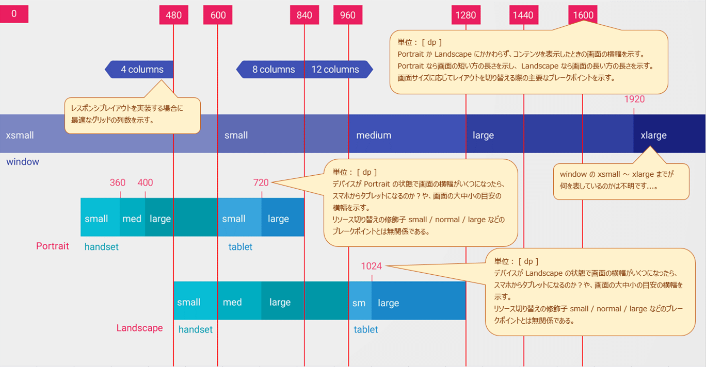
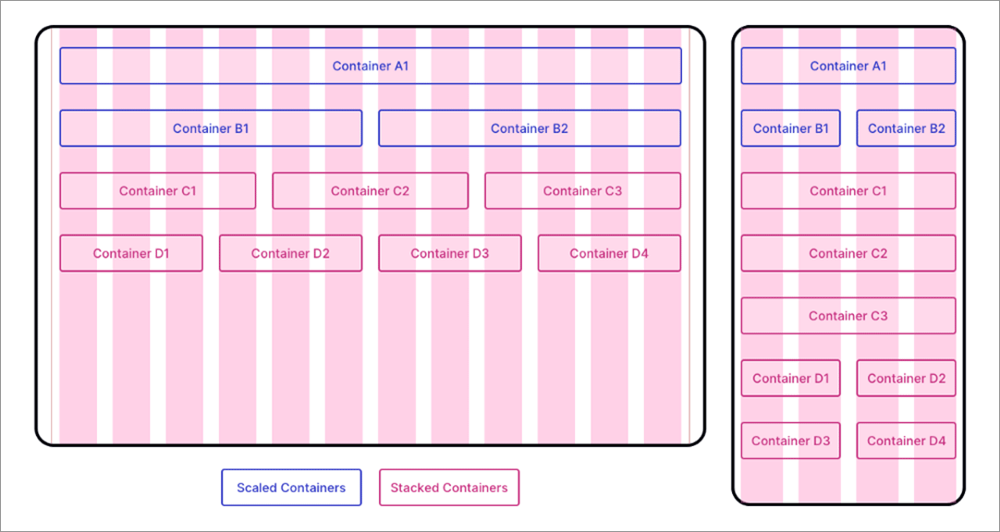
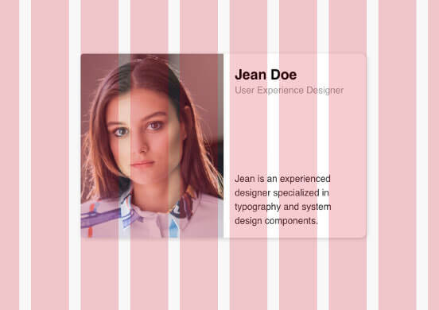
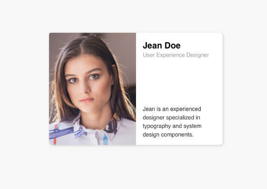
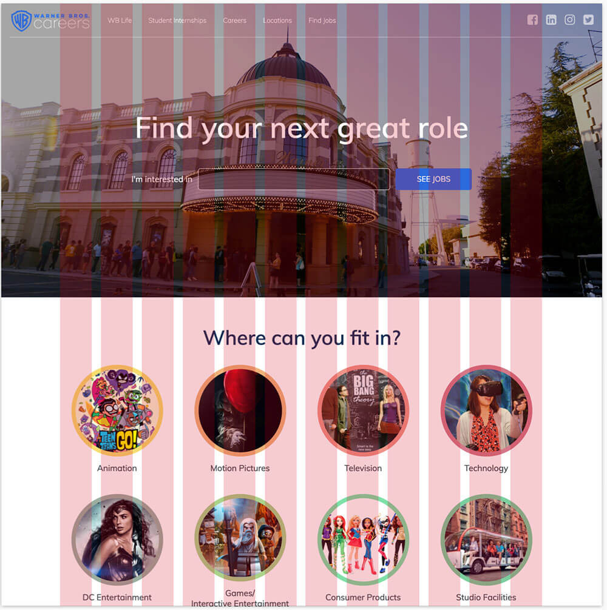
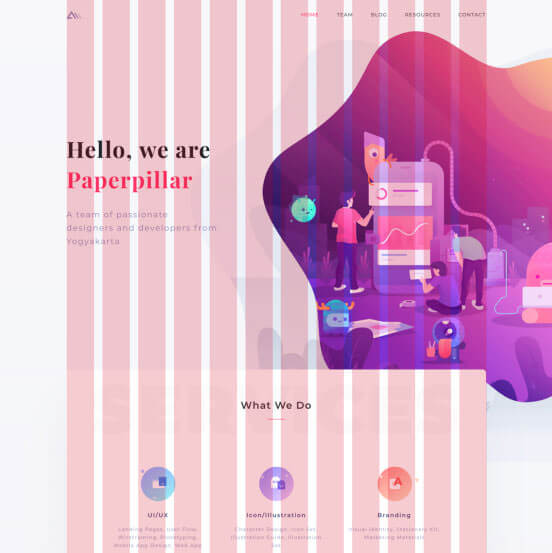
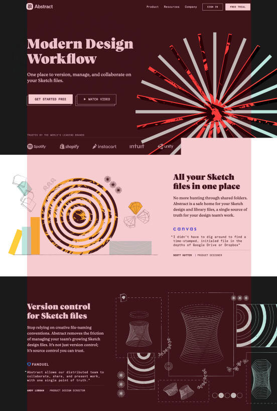
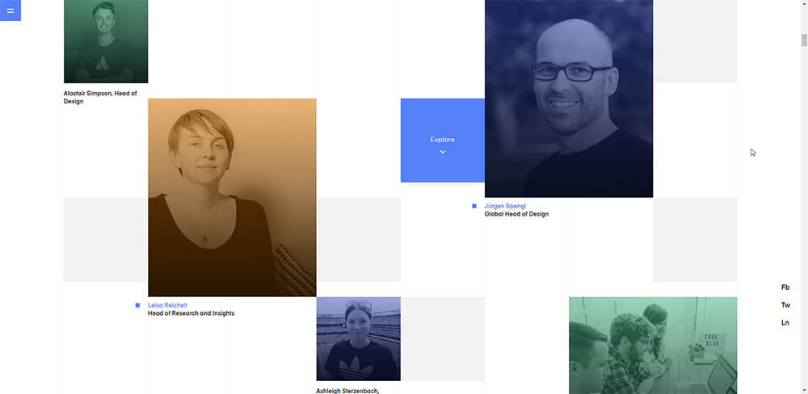

<!-- TOC START min:1 max:3 link:true asterisk:false update:true -->
- [レスポンシブレイアウトグリッド](#レスポンシブレイアウトグリッド)
  - [ブレークポイント](#ブレークポイント)
  - [レンジ](#レンジ)
  - [列（カラム）](#列カラム)
  - [溝（ガーター）](#溝ガーター)
    - [溝の幅をコンテンツの幅以上にしない](#溝の幅をコンテンツの幅以上にしない)
  - [左右余白（サイドマージン）](#左右余白サイドマージン)
  - [フィールド要素](#フィールド要素)
  - [横スクロール画面の場合](#横スクロール画面の場合)
    - [縦にグリッドを区切るのではなく、横に区切る](#縦にグリッドを区切るのではなく横に区切る)
    - [アプリバーなどがある場合は、それを除外した高さでレンジを決定する](#アプリバーなどがある場合はそれを除外した高さでレンジを決定する)
  - [ブレークポイント一覧（マテリアルデザインページより引用）](#ブレークポイント一覧マテリアルデザインページより引用)
  - [ブレークポイント一覧（ Android 開発者ページより引用）](#ブレークポイント一覧-android-開発者ページより引用)
  - [結局、開発時に設定するブレークポイントはどれか？](#結局開発時に設定するブレークポイントはどれか)
  - [デフォルトの layout フォルダのレイアウトはどのサイズを考えて設計するか](#デフォルトの-layout-フォルダのレイアウトはどのサイズを考えて設計するか)
  - [固定（Fixed）グリッドと流体（Fluid）グリッド](#固定fixedグリッドと流体fluidグリッド)
  - [伸縮するコンテンツとしないコンテンツ](#伸縮するコンテンツとしないコンテンツ)
  - [ネストしたフィールド要素は親フィールド要素が列に沿っていれば基本的には OK](#ネストしたフィールド要素は親フィールド要素が列に沿っていれば基本的には-ok)
  - [例外的に列（カラム）からはみ出して良いもの](#例外的に列カラムからはみ出して良いもの)
    - [1. ページヘッダのフルスクリーン画像](#1-ページヘッダのフルスクリーン画像)
    - [2. 意図的に画面からはみ出すようなデザイン](#2-意図的に画面からはみ出すようなデザイン)
    - [3. スクロールしても表示し続ける背景](#3-スクロールしても表示し続ける背景)
    - [4. ヘッダーとフッター](#4-ヘッダーとフッター)
  - [慣れてきたら独自のグリッドシステムを構築しても良い](#慣れてきたら独自のグリッドシステムを構築しても良い)
<!-- TOC END -->


# レスポンシブレイアウトグリッド

## ブレークポイント

ブレークポイントとは、画面の幅を一定の範囲で区切ったときのしきい値のことである。


## レンジ

ブレークポイントで囲まれた同じルールを適用する画面サイズの範囲のことである。


## 列（カラム）

列とは、コンテンツを配置する場所のことです。  
コンテンツは、一つ以上の列 (カラム) の左端から右端に配置されるとバランスよく画面に表示されます。

- 列の数は、画面の幅がどのレンジに入るかによって決まる。
  - ただし、コンテンツの粒度によって、列数 4 のところを 6 にしたり 12 にすることも可能。
  - 列数を 6 にしたい場合には、 12 分割してから 2 列で 1 列と見なすとよい。
- 列の幅は、パーセンテージで指定する。
  - 基本的にはすべてパーセンテージで指定するが、左右余白が固定値の場合のみ、固定値指定も可能。


## 溝（ガーター）

- 溝の幅は、画面の幅がどのレンジに入るかによって決まる
- 溝の幅を変更することは許容されますが、各レンジで共通の幅を使用してください。
- 8 dp の溝は狭めです。溝を挟んだコンテンツ同士に関連がある場合にこの設定にすると良いです。
- 32 dp の溝は広めです。溝を挟んだコンテンツ同士に関連がない場合にこの設定にすると良いです。


### 溝の幅をコンテンツの幅以上にしない

溝の幅が広すぎると、せっかくグリッド状にコンテンツを配置しても、ユーザがグリッドを認識しずらく、  
統一感のないレイアウトに感じてしまうため。


## 左右余白（サイドマージン）

画面の右端からコンテンツまでの距離、画面の左端からコンテンツまでの距離のことである。

- 余白の幅は、画面の幅がどのレンジに入るかによって決まる
- 余白の幅を変更することは許容されますが、各レンジで共通の幅を使用してください。
- 余白の幅を変更する場合は、規定の幅の整数倍の値にしてください。


## フィールド要素

列 (カラム) にあわせて配置するコンテンツをフィールド要素と呼びます。


## 横スクロール画面の場合

### 縦にグリッドを区切るのではなく、横に区切る

### アプリバーなどがある場合は、それを除外した高さでレンジを決定する

アプリバー、ステータスバー、ホームボタン領域などがある場合は、それを除外した高さで、  
デバイスがどのレンジに属するかを決定する。


## ブレークポイント一覧（マテリアルデザインページより引用）

スクリーンの幅  | 列の数 | 溝の幅   | 余白の幅 | コンテンツ領域の幅
----------------|--------|----------|----------|-------------------
0 ～ 599 dp     | 4      | 8 の倍数 | 16 dp    | 変動
600 ～ 904 dp   | 8      | 8 の倍数 | 32 dp    | 変動
905 ～ 1239 dp  | 12     | 8 の倍数 | 変動     | 840 dp
1240 ～ 1439 dp | 12     | 8 の倍数 | 200 dp   | 変動
1440 dp ～      | 12     | 8 の倍数 | 変動     | 1040 dp

スクリーンの幅が 1440 dp 以上の場合は、デスクトップパソコンレベルであるため、  
デスクトップ向けアプリ開発でない限り、無視してアプリ開発を行う。


## ブレークポイント一覧（ Android 開発者ページより引用）




## 結局、開発時に設定するブレークポイントはどれか？

上記のマテリアルデザインと Android 開発者ページの情報をあわせて、以下のようにブレークポイントを設定する。

```
layout
layout-w480dp-port
layout-w600dp-port
layout-w480dp-land
layout-w600dp-land
layout-w905dp-land
layout-w1240dp-land
```

リソースフォルダ    | スマホ小 | スマホ中 | スマホ大 | タブレット小 | タブレット中 | タブレット大 | 縦 | 横
--------------------|----------|----------|----------|--------------|--------------|--------------|----|---
layout (※ 1 ) | ○        |          |          |              |              |              | ○  |
layout-w360dp-port  |          | ○        |          |              |              |              | ○  |
layout-w480dp-port  |          |          | ○        |              |              |              | ○  |
layout-w600dp-port  |          |          |          | ○            | ○            | ○            | ○  |
layout-w480dp-land  | ○        |          |          |              |              |              |    | ○
layout-w600dp-land  |          | ○        |          |              |              |              |    | ○
layout-w905dp-land  |          |          | ○        | ○            | ○            |              |    | ○
layout-w1240dp-land |          |          |          |              |              | ○            |    | ○

(※ 1 ) w240dp を想定してレイアウトを作成すると良いと思われる。


| リソースフォルダ    | 列の数 | 溝の幅   | 左右余白の幅 | コンテンツ領域の幅 (※ 1 ) | 列の幅 (※ 2 ) |
|---------------------|--------|----------|--------------|-------------------------|--------|
| layout              | 4      | 8 の倍数 | 16 dp        | 変動                    | 変動   |
| layout-w480dp-port  | 4      | 8 の倍数 | 16 dp        | 変動                    | 変動   |
| layout-w600dp-port  | 8      | 8 の倍数 | 32 dp        | 変動                    | 変動   |
| layout-w480dp-land  | 4      | 8 の倍数 | 16 dp        | 変動                    | 変動   |
| layout-w600dp-land  | 8      | 8 の倍数 | 32 dp        | 変動                    | 変動   |
| layout-w905dp-land  | 12     | 8 の倍数 | 変動         | 840 dp                  | 固定   |
| layout-w1240dp-land | 12     | 8 の倍数 | 200 dp       | 変動                    | 変動   |

(※ 1 ) 一番左にある列 (カラム) の左端から一番右にある列 (カラム) の右端までの距離  
(※ 2 ) 列の数や溝の幅や左右余白の幅によって、列の最小幅は変わる。列の最小幅の一覧は別紙 「グリッドシステム_最小列幅.xlsx」 を参照


## デフォルトの layout フォルダのレイアウトはどのサイズを考えて設計するか

`w480dp` や `w600dp` の修飾子が付与されたフォルダ内のレイアウトは、その修飾子で指定した  
画面の横幅をレイアウト適用の最小幅とする。そのため、列の最小幅を求めることができる。  
列の最小幅を求めることができれば、アプリに使用する画像が見切れずに表示される画像のサイズを  
決定することができる。

逆に、デフォルトの `layout` フォルダ内のレイアウトは、どんな画面サイズの端末にも適用される  
可能性があり、列の最小幅を決定することができない。よって、最小の画像サイズを決定することが  
困難になる。

これを解決するために、デフォルトの `layout` フォルダ内のレイアウトにも、何らかの画面の  
最小幅を想定してレイアウトを作成することとする。

2021 年に発売されているスマホのほとんどが最小幅 360 dp に収まっている。  
**2015 年に発売されていたスマホまでさかのぼると、 幅 480 ピクセルのデバイスが存在していた。  
よって、デフォルトの `layout` フォルダのレイアウトは、最小幅を 240 dp として設計すれば、  
どんなスマホにも見切れが発生しないレイアウトを提供できると思われる。**


## 固定（Fixed）グリッドと流体（Fluid）グリッド

上記の表において、 layout-w905-land の場合のみ、コンテンツ領域の幅が 840 dp 固定であるため、  
列 (カラム) の幅も固定になります。これを固定グリッドと呼びます。

ちなみに、世間では、両者を合わせたハイブリッドグリッドもあります。  
デスクトップでは固定グリッド、モバイルでは流体グリッドにするというやり方がハイブリッドグリッドと呼ばれます。


## 伸縮するコンテンツとしないコンテンツ

伸縮するコンテンツとしないコンテンツとそれらのハイブリッド型コンテンツがあります。

伸縮するコンテンツは、ブレークポイントをまたいでも、折り返されることなく、一行で表示されるコンテンツです。  
伸縮しないコンテンツは、ブレークポイントをまたいだ時に、折り返されて表示されるコンテンツです。  
それらのハイブリッド型コンテンツは、ある程度までは伸縮しますが、一定の幅になると折り返されるコンテンツです。



青が伸縮するコンテンツ / 赤の C1 ～ C3 が伸縮しないコンテンツ / 赤の D1 ～ D4 がハイブリッドのイメージです。

<p>

これらの種類のコンテンツが存在することを意識して画面設計をすると良いでしょう。


## ネストしたフィールド要素は親フィールド要素が列に沿っていれば基本的には OK

以下の例では、カードが列に沿って配置されているため、カード内の写真は列に沿っていなくても  
きれいに配置されていることがわかります。ただし、他の似たようなフィールド要素を上下に並べた場合、  
写真の右端がずれていると違和感になるため、注意してください。





## 例外的に列（カラム）からはみ出して良いもの

### 1. ページヘッダのフルスクリーン画像




### 2. 意図的に画面からはみ出すようなデザイン




### 3. スクロールしても表示し続ける背景

例は、 「 2. 意図的に画面からはみ出すようなデザイン」 を参照。


### 4. ヘッダーとフッター

「 2. 意図的に画面からはみ出すようなデザイン」 に近い用途であるが、  
ヘッダーとフッターは例外的に列 (カラム) からはみ出すことを許容される。  
特に、ヘッダーやフッター上に配置する画像は列 (カラム) からはみ出すことも多い。




## 慣れてきたら独自のグリッドシステムを構築しても良い

Google やマテリアルデザインの提唱するグリッドシステムの仕様に忠実に従う必要はありません。  
慣れてきたら、独自のグリッドシステムを構築することで、アプリに独特のテーマを持たせることも  
できるようになるでしょう。

以下は、溝なしのグリッドを上手く活用した例です。


