- [DrawableとBitmapとBitmapDrawableの違い](#drawableとbitmapとbitmapdrawableの違い)
  - [各クラスの関係図](#各クラスの関係図)
  - [BitmapDrawable と Bitmap は、どちらもドット形式の画像を扱うためのクラス](#bitmapdrawable-と-bitmap-はどちらもドット形式の画像を扱うためのクラス)
  - [BitmapDrawable と Bitmap の親クラス](#bitmapdrawable-と-bitmap-の親クラス)
  - [Drawable クラスとは](#drawable-クラスとは)
  - [BitmapDrawable の使い時](#bitmapdrawable-の使い時)
  - [Bitmap の使い時](#bitmap-の使い時)

# DrawableとBitmapとBitmapDrawableの違い

## 各クラスの関係図

## BitmapDrawable と Bitmap は、どちらもドット形式の画像を扱うためのクラス

`BitmapDrawable` と `Bitmap` は、どちらもドット形式の画像を保持する具象クラスです。  
ドット形式の画像には、よく使うものに、 `.png` / `.jpg` / `.webp` / `.gif` などがあります。

## BitmapDrawable と Bitmap の親クラス

`BitmapDrawable` は、 `Drawable` 抽象クラスを継承した具象クラスです。  
`Bitmap` は、 `Object` クラスしか継承していない、ほぼ単独で使用可能なクラスです。

## Drawable クラスとは

`Drawable` クラスは、抽象クラスであるため、それ自身をインスタンス化することはありません。  
何らかのサブクラスをインスタンス化して使用します。  
サブクラスには、ドット形式以外の描画可能なオブジェクトが含まれ、例えば、  
「9パッチ」ファイルや「ScaleDrawable」ファイルなどが含まれます。

## BitmapDrawable の使い時

`BitmapDrawable` は `Drawable` を継承しているため、 `Drawable` が必要な場面で使用可能です。  
逆に `Bitmap` の型指定がある場面では使用できません。

## Bitmap の使い時

`Bitmap` の型指定がある場面で使用可能です。
逆に、 `Drawable` を継承していないため、 `Drawable` が必要な場面では使用できません。  

