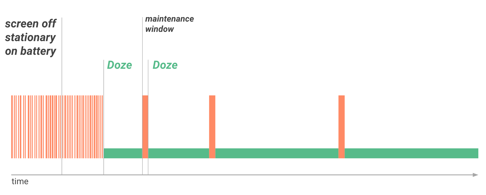

<!-- TOC START min:1 max:3 link:true asterisk:false update:true -->
- [Doze](#doze)
  - [Doze とは](#doze-とは)
  - [Doze モードに入る契機](#doze-モードに入る契機)
  - [Doze モード中の制限内容](#doze-モード中の制限内容)
  - [Doze モードの一時停止と再開](#doze-モードの一時停止と再開)
  - [Doze モードの解除](#doze-モードの解除)
  - [Doze モードのバックオフポリシー](#doze-モードのバックオフポリシー)
<!-- TOC END -->


# Doze

## Doze とは

Doze は、 Android 6.0 ( API Level 23 ) で導入された機能です。

Doze は、デバイスが長い間使用されていない場合にアプリのバックグラウンド CPU と  
ネットワークアクティビティを保留することで電力消費を抑える仕組みです。


## Doze モードに入る契機

以下の条件を満たすと、デバイスは Doze モードになります。

```
ユーザーがデバイスを電源と接続せずに静止状態にしている。
かつ
画面がオフのまま一定時間が過ぎる。
```


## Doze モード中の制限内容

Doze モードでは、ネットワークや CPU に高負荷をかけるサービスへの  
アプリのアクセスをシステムで制限することにより電池を節約しようとします。

さらに、ネットワークへのアプリのアクセスが切断され、ジョブ、同期、標準アラームが保留になります。


## Doze モードの一時停止と再開

システムは定期的に Doze モードを一時停止します。  
この一時停止期間をメンテナンス枠と呼びます。

メンテナンス枠を使用して、アプリが保留アクティビティを完了できるようにします。  
メンテナンス枠内で、システムはすべての保留中の同期、ジョブ、アラームを実行し、  
アプリがネットワークにアクセスできるようにします。

メンテナンスの時間が終了するたびにシステムは再び Doze モードに入り、  
ネットワークへのアクセスを切断し、ジョブ、同期、アラームを保留にします。


## Doze モードの解除

放置していたデバイスを動かしたり、画面をオンにしたり、充電器に接続したりする  
などの動作によってデバイスをアクティブにすると、Doze モードは解除され、  
すべてのアプリが通常のアクティビティに戻ります。


## Doze モードのバックオフポリシー



図1. Doze モードのバックオフポリシーのイメージ

デバイスが充電中ではなく長期間使用されていない場合、システムはメンテナンスの  
発生頻度を徐々に減らしていき、電池の消費量を抑えます。