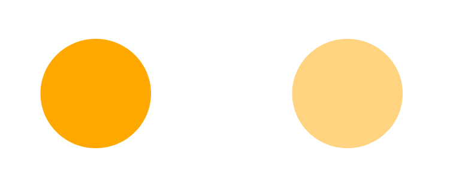

- [マスク](#マスク)
  - [概要](#概要)
  - [レイヤーパネルの見方](#レイヤーパネルの見方)
  - [マスクの種類](#マスクの種類)
  - [アルファマスク](#アルファマスク)
  - [ルミナスマスク](#ルミナスマスク)
  - [ベクターマスク](#ベクターマスク)

# マスク

## 概要

マスクとは、複数の View を重ねた際に、重なっている部分のみを表示し、重なっていない部分を非表示にする機能のことです。

## レイヤーパネルの見方

レイヤーパネルでは、以下のように表示されます。

まず、基本のおさらいとして、複数のオブジェクトが同じ階層に配置されている場合、レイヤーパネル上で上に配置されているものほど、上のレイヤーに配置されていることになります。

マスクが定義されると、そのマスクグループの一番下のレイヤーにマスクオブジェクト ( 画像中の Mask ) が生成されます。

マスクオブジェクトのレイヤーより上のレイヤーに配置されたオブジェクトは、マスクオブジェクトと重なった部分のみが表示され、マスクオブジェクトと重なっていない部分は非表示になります。

（例）

上記の例では、中央にある黄色い四角の部分がマスクオブジェクトで、青い丸と緑の三角は、その上のレイヤーに配置されたオブジェクトです。

## マスクの種類

マスクには 3 種類あり、どれを選択するかによって、何を基準にしてマスクを行うかが変わってきます。 3 種類のマスクは以下になります。

- アルファ (透明度) マスク
  - アルファの強さによって、ぼかしの強さが変わる
- ルミナス (輝度) マスク
  - 塗りつぶしの色の 「濃さ」 によって、ぼかしの強さが変わる
- ベクター (形) マスク
  - ぼしの設定は常に不可

## アルファマスク

マスクオブジェクトのアルファを変更すると、マスクオブジェクトの上のレイヤーに配置したオブジェクトにぼかしをつけることができます。

上記の例では、丸いマスクオブジェクトの上に四角いオレンジ色一色のオブジェクトを配置して、丸く切り取ったものを二つ配置しています。

左側は、マスクオブジェクトのアルファ (不透明度) を 100 % に設定したものです。右側は、アルファを 50 % に設定したものです。アルファが高いほど、マスクされたオブジェクトはくっきり表示され、アルファが低くなるにつれて、ぼかしが強くなっていきます。

## ルミナスマスク

マスクオブジェクトの塗りつぶしの色が薄い (白っぽい) ほど、マスクされたオブジェクトがくっきりと表示され、色が濃い (黒っぽい) ほど、ぼかしが強くなります。

## ベクターマスク

マスクオブジェクトのアルファや塗りつぶしの色が何であろうと、必ずぼかしなしでマスクがかかります。

