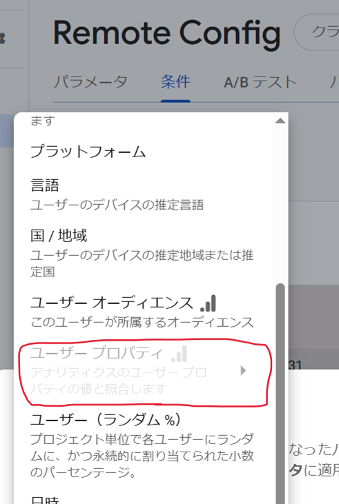

- [Authentication](#authentication)
  - [🔐 主な認証方法](#-主な認証方法)
  - [🧩 Firebase Authentication を使うメリット](#-firebase-authentication-を使うメリット)
  - [他の Firebase サービスとの連携例](#他の-firebase-サービスとの連携例)
    - [Firebase Firestore / Realtime Database との連携](#firebase-firestore--realtime-database-との連携)
    - [Firebase Cloud Storage との連携](#firebase-cloud-storage-との連携)
    - [Firebase Cloud Functions との連携](#firebase-cloud-functions-との連携)
    - [Firebase Analytics との連携](#firebase-analytics-との連携)
    - [Firebase Remote Config + Firebase Analytics との連携](#firebase-remote-config--firebase-analytics-との連携)
  - [引用元資料](#引用元資料)


# Authentication

Firebase Authentication は、Google が提供している認証機能で、アプリにログイン機能を簡単に追加できるサービスです。


## 🔐 主な認証方法

- メールアドレスとパスワード
- 電話番号認証（SMS）
- ソーシャルログイン
  - Google
  - Facebook
  - Twitter（X）
  - GitHub など
- 匿名認証（ゲストログイン的なもの）
- カスタム認証（独自のバックエンドとの連携）


## 🧩 Firebase Authentication を使うメリット

- セキュリティが強固（ Google がバックエンドを管理）
- 他の Firebase サービスと連携がスムーズ
- ログイン UI のテンプレートも用意されている（ FirebaseUI ）


## 他の Firebase サービスとの連携例

### Firebase Firestore / Realtime Database との連携

- 目的: 認証済みユーザーごとのデータを管理。
- 連携の例:
  - ログイン後にユーザーID（uid）をキーにしてデータを読み書き。
  - セキュリティルールで request.auth.uid を使い、本人のみが自分のデータにアクセスできるよう制限。


### Firebase Cloud Storage との連携

- 目的: ユーザーがアップロードする画像やファイルを管理。
- 連携の例:
  - uid を含むパスにファイルを保存（例: users/{uid}/profile.jpg）。
  - セキュリティルールで本人だけがファイルにアクセスできるよう制御。


### Firebase Cloud Functions との連携

- 目的: サーバーサイド処理を安全に行う。
- 連携の例:
  - 認証済みユーザーの `uid` をリクエストから取得し、処理の中で検証。
  - ログインユーザーのアクション（例: 投稿、削除など）に応じて通知送信やDB更新を行う。

```kotlin
exports.processAction = functions.https.onCall((data, context) => {
    if (!context.auth) {
        throw new functions.https.HttpsError('unauthenticated', 'User must be authenticated');
    }
    const uid = context.auth.uid;
    // ユーザーに基づく処理を行う
});
```


### Firebase Analytics との連携

- 目的: 認証状態に応じたユーザー行動のトラッキング。
- 連携の例:
  - ユーザーがログインしたタイミングや、ユーザー属性（例 : 課金ユーザー）をイベントとして記録。

```kotlin
Firebase.analytics.setUserId(Firebase.auth.currentUser?.uid)
Firebase.analytics.logEvent("login_success", null)
```


### Firebase Remote Config + Firebase Analytics との連携

- 目的: ログインユーザーに応じて UI や機能を動的に変更。
- 連携の例:
  - ユーザーのログイン状況や属性に応じて設定値を切り替える（例: 特定ユーザーのみベータ機能有効）。

```kotlin
val remoteConfig = Firebase.remoteConfig
remoteConfig.fetchAndActivate().addOnCompleteListener { task ->
    if (task.isSuccessful) {
        val showFeature = remoteConfig.getBoolean("show_new_feature")
        if (showFeature) {
            // 新機能を表示
            showNewFeatureUI()
        } else {
            // 旧UIのまま
            showOldFeatureUI()
        }
    }
}
```

上記の例では、 Firebase Authentication を使用していませんが、その背後では、次のような仕組みで、 Authentication が使用されています。

まず、 Authentication を判定に使用して、 Firebase Analytics のユーザープロパティを設定します。

```kotlin
if (Firebase.auth.currentUser != null) {
    Firebase.analytics.setUserProperty("is_logged_in", "true")
} else {
    Firebase.analytics.setUserProperty("is_logged_in", "false")
}
```

Analytics で設定したプロパティ ( `is_logged_in` ) は、 Remote Config の「条件」として使用できるようになります。



`is_logged_in` の状態によって、 `show_new_feature` で返す値を変更するように、 Remote Config を設定します。


## 引用元資料

- ChatGPT


