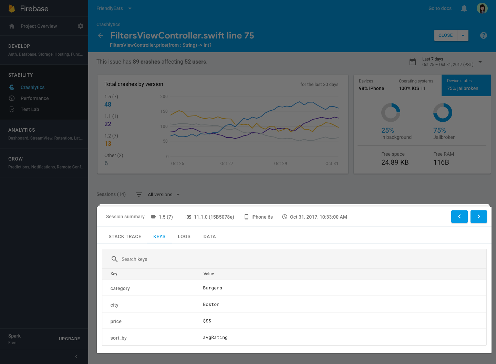

- [Crashlytics](#crashlytics)
  - [概要](#概要)
  - [送信してはいけないデータ](#送信してはいけないデータ)
  - [【参考】Log.e() や Log.d() は](#参考loge-や-logd-は)
  - [ログの送信方法](#ログの送信方法)
  - [Firebase Analytics との違い](#firebase-analytics-との違い)
  - [サーバーへ送信されるタイミング](#サーバーへ送信されるタイミング)
  - [ログの記録方法](#ログの記録方法)
    - [log() と setCustomKey() の違い](#log-と-setcustomkey-の違い)
    - [複数のカスタムキーを同時に設定することも可能](#複数のカスタムキーを同時に設定することも可能)
    - [クラッシュ発生時にカスタムキーを設定することも可能](#クラッシュ発生時にカスタムキーを設定することも可能)
  - [テスト方法に関する注意点](#テスト方法に関する注意点)
  - [引用元資料](#引用元資料)


# Crashlytics

## 概要

Firebase Crashlytics は、アプリで例外などの想定外の状況が発生した場合に、そのスタックトレースを Firebase に送信する機能です。

スタックトレースは、 Google Play Console で確認できます。

アプリでクラッシュ (異常終了) 、または、 ANR が発生した場合には、デフォルトで、 ( Android Vitals によって、) そのスタックトレースが送信されます。ただし、発生した例外をキャッチした場合には、クラッシュを回避しているため、このデフォルトのログは送信されません。そのため、想定外の例外を早期に検出することができません。一方で、 Crashlytics は、ログを手動で出力することができるため、キャッチした例外のスタックトレースを送信することができます。

Crashlytics では、例外が発生した際に、どのような操作が行われたのか？どのようなパラメータが設定されていたのか？といった、解析のヒントをログに出力することも可能です。


## 送信してはいけないデータ

ユーザーの **個人情報** (※ 1 ) は、 Crashlytics では、送信してはいけません。

(※ 1 ) その情報を知っていたら、それが誰なのかがわかる (個人が特定できる) 情報

個人情報には、例えば、以下のものがあります。これらは、それさえ知っていれば個人が特定できるため、単体でも送信不可です。

- 名前
- メールアドレス
- 住所
- 電話番号
- 住所
- 学籍番号

アプリ内で生成した「ユーザー ID 」は、それ単体では、個人を特定することができないため、 Crashlytics で送信することが可能です。ただし、その ID が、バックエンドサーバー上で、名前を紐づけられる場合などは、そのユーザー ID は、個人情報とみなされます。そのため、 Crashlytics で送信してはいけません。

その他、認証トークンや API キーなどの、 **機密情報** は、送信してはいけません。 Play Console 上で確認できてしまうと、内部関係者による不正利用や流出のリスクが高まります。


## 【参考】Log.e() や Log.d() は

Log.e() や Log.d() で出力されるログは、 Google Play Console には送信されません。デバイス内部にのみ蓄えられます。


## ログの送信方法


```kotlin
FirebaseCrashlytics.getInstance().log(...)
```


## Firebase Analytics との違い

- Crashlitycs がスタックトレースを出力するのに対して、 Analytics はスタックトレースを出力しません。
- Analytics は、ある期間におけるログの送信された回数を集計して表示します。 (統計的な使い方)
- Analytics は、ログを長期間 ( 14 ヶ月など) 保有するのに対し、 Crashlytics は、短期間 (数週間～数ヶ月) しかログを保有しません。
- Analytics で送信するデータは、イベント・スクリーンビュー・ユーザー属性など、ユーザーの行動や傾向に関する情報です。


## サーバーへ送信されるタイミング

Crashlytics のログや例外は、通常以下のいずれかのタイミングでサーバーに送信されます。

- アプリが次に起動されたとき
  - アプリが異常終了した場合は、次回起動時に前回のクラッシュ情報を送信。
  - `recordException()` のような非クラッシュの例外でも、起動時に送信されることがある。
- バッファがいっぱいになったとき
  - ログや例外がある程度たまると自動的に送信される。
- 一定時間が経過したとき
  - Crashlytics SDK は内部的に一定の間隔で送信処理を行っている（正確な間隔は非公開）。
- 手動で強制送信したとき
  - 以下のメソッドを呼び出すことで、即座にレポートを送信します。
  - `FirebaseCrashlytics.getInstance().sendUnsentReports()`


## ログの記録方法

ログをローカルに記録するには、以下の 3 つのメソッドのいずれかを呼び出します。ローカルに記録されたログは、 [特定のタイミング](#サーバーへ送信されるタイミング) で自動的にサーバーへ送信されます。

```kotlin
// 画面遷移やイベントを記録するには、「ログ」を使用する。
FirebaseCrashlytics.getInstance().log("Navigated: Home → Detail")

// クラッシュ時のパラメータがどうなっていたかを記録するには、「カスタムキー」を使用する。
FirebaseCrashlytics.getInstance().setCustomKey("userId", "abc123")

// 例外を記録（try-catch内で）
try {
    // 何かエラーが起きる処理
} catch (e: Exception) {
    FirebaseCrashlytics.getInstance().recordException(e)
}
```

- log()
  - 画面遷移やイベントを記録します。
  - 最大で 64 件 or 合計 16 KB までログを保持します。（※公式には件数で制限されているが、実際にはサイズ制限もあると推測されています）
  - 上限を超えると、古いログから順に自動的に破棄されます。
  - アプリがクラッシュ or `recordException()` を呼んだときに、保持中のログがクラッシュレポートに紐づけられます。
  - アプリがクラッシュ or `recordException()` が呼ばれない限り、 log() で記録した内容は、サーバーに送信されません。
  - クラッシュ or `recordException()` が呼ばれる前に起こったイベントや操作を記録しておくことで、解析に役立てます。

コンソール上では、ログは以下のように表示されます。


- setCustomKey()
  - 「キー & バリュー」形式で、状態を記録します。
  - 同じキーに対して、値が複数回設定された場合には、最後に設定された値が有効になります。
  - クラッシュ発生時 or `recordException()` が呼ばれた際に、「設定したプロパティの状態がどうなっていたか」を確認するのに使用します。
  - 最大で 64 件まで保持可能で、それ以上のキーが設定された場合は、古いエントリーから削除されます。

コンソール上では、カスタムキーは以下のように表示されます。




### log() と setCustomKey() の違い

- コンソール上での表示のされ方
  - log() は、時系列で表示されます。
    - もし、同じキーに対して複数回ログを記録した場合、どちらもコンソール上に表示されるため、どれがクラッシュ発生時の値なのか、見間違える可能性があります。
  - setCustomKey() は、クラッシュ発生時の「キー & バリュー」の一覧が表示され、最新の値だけが表示されます。
    - クラッシュ発生時のプロパティの一覧を表示するのに適しています。

例えば、以下のように使い分けるのが適しています。

- ユーザーがどの画面を見ていたか
  - カスタムキー
- 最後に何の操作をしたか
  - ログ
- API 通信中のパラメータやフラグの状態
  - カスタムキー
- 処理フローの通過点を記録したい
  - ログ


### 複数のカスタムキーを同時に設定することも可能

```kotlin
val crashlytics = Firebase.crashlytics
crashlytics.setCustomKeys {
    key("my_string_key", "foo") // String value
    key("my_bool_key", true) // boolean value
    key("my_double_key", 1.0) // double value
    key("my_float_key", 1.0f) // float value
    key("my_int_key", 1) // int value
}
```


### クラッシュ発生時にカスタムキーを設定することも可能

```kotlin
try {
    methodThatThrows()
} catch (e: Exception) {
    Firebase.crashlytics.recordException(e) {
        key("string key", "string value")
        key("boolean key", true)
        key("float key", Float.MAX_VALUE)
    }
    // handle your exception here
}
```


## テスト方法に関する注意点

開発中やデバッグビルドでは、Crashlytics の動作が制限されていることがあるので、リリースビルドやステージング環境でのテストが推奨されます。


## 引用元資料

- ChatGPT

