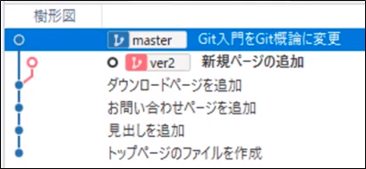
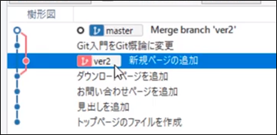
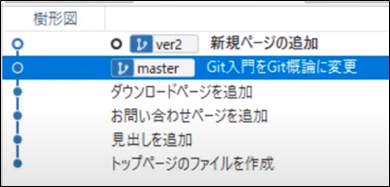

<!-- TOC START min:1 max:3 link:true asterisk:false update:true -->
- [マージとリベースの違い](#マージとリベースの違い)
  - [共通点](#共通点)
  - [相違点](#相違点)
    - [二つのブランチを統合した時に、コミット履歴の作成される順序が異なる。](#二つのブランチを統合した時にコミット履歴の作成される順序が異なる)
    - [樹形図が枝分かれするかどうかが異なる。](#樹形図が枝分かれするかどうかが異なる)
    - [統合後に本流のポインタ (ブランチ) がどこを示すかが異なる。 (図 1 ～ 3 を参照)](#統合後に本流のポインタ-ブランチ-がどこを示すかが異なる-図-1--3-を参照)
    - [統合後に分流のポインタ (ブランチ) がどこを示すかが異なる。 (図 1 ～ 3 を参照)](#統合後に分流のポインタ-ブランチ-がどこを示すかが異なる-図-1--3-を参照)
    - [マージコミットが作成されるかされないか](#マージコミットが作成されるかされないか)
    - [図 1 ～ 3](#図-1--3)
<!-- TOC END -->

# マージとリベースの違い

## 共通点

- 枝分かれしたブランチを一つのブランチに統合する

## 相違点

### 二つのブランチを統合した時に、コミット履歴の作成される順序が異なる。

- リベースの場合は、コミット履歴がブランチごとにまとまっている。
- マージの場合は、コミット履歴が時系列で並ぶため、ブランチごとにコミット履歴がまとまっていない。

### 樹形図が枝分かれするかどうかが異なる。

- マージの場合は、樹形図が枝分かれしたまま残る。 (例外的に、本流にコミットがない場合などは残らない。)
- リベースの場合は、樹形図が必ず統合され、枝分かれしたまま残ることはない。

### 統合後に本流のポインタ (ブランチ) がどこを示すかが異なる。 (図 1 ～ 3 を参照)

- マージの場合は、本流のポインタが、統合後に、マージコミットを示す。
- リベースの場合は、本流のポインタが、統合後に、統合前のコミットを示す。 (進まない。)
  - 統合後に、本流のポインタを進めずに、新たなコミットを行うと、再度、枝分かれする。
  - **統合後に、本流のポインタを進めるには、マージ処理が必要**になります。

### 統合後に分流のポインタ (ブランチ) がどこを示すかが異なる。 (図 1 ～ 3 を参照)
- マージの場合は、分流のポインタが、統合後に、マージコミットの一つ前のコミットを示す。
- リベースの場合は、分流のポインタが、統合後に、最新のコミットを示す。

### マージコミットが作成されるかされないか

- マージの場合は、マージコミットが作成される (例外的に、本流にコミットがない場合などは作成されない。)
- リベースの場合は、マージコミットが作成されない

### 図 1 ～ 3

図 1 ：マージやリベースの実施前の状態

図 2 ：マージ後の状態

図 3 ：リベース後の状態
