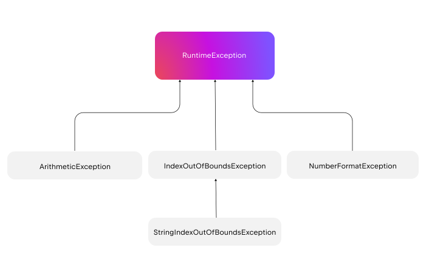

- [例外(公式ドキュメント)](#例外公式ドキュメント)
  - [例外をスローする](#例外をスローする)
    - [前提条件関数を使用して例外をスローする](#前提条件関数を使用して例外をスローする)
      - [require() 関数](#require-関数)
        - [スマートキャスト機能](#スマートキャスト機能)
      - [check() 関数](#check-関数)
        - [スマートキャスト機能](#スマートキャスト機能-1)
      - [error() 関数](#error-関数)
      - [assert() 関数](#assert-関数)
  - [try-catch ブロックを使用して例外を処理する](#try-catch-ブロックを使用して例外を処理する)
    - [finally ブロック](#finally-ブロック)
  - [カスタム例外の作成](#カスタム例外の作成)
  - [Nothing 型](#nothing-型)
  - [例外クラス](#例外クラス)
    - [例外階層](#例外階層)
  - [スタック トレース](#スタック-トレース)
  - [Java、Swift、Objective-C との例外の相互運用性](#javaswiftobjective-c-との例外の相互運用性)


# 例外(公式ドキュメント)

例外は、プログラムの実行を妨げる可能性のあるランタイム エラーが発生した場合でも、コードをより予測どおりに実行するのに役立ちます。Kotlin は、デフォルトですべての例外を未チェックとして扱います。未チェックの例外により、例外処理プロセスが簡素化されます。例外をキャッチすることはできますが、明示的に処理または宣言する必要はありません。

Java、Swift、Objective-C と相互運用するときに Kotlin が例外を処理する方法の詳細については、 [「Java、Swift、Objective-C との例外の相互運用性」](#javaswiftobjective-c-との例外の相互運用性) セクションを参照してください。

例外の処理は、2 つの主なアクションで構成されます。

- **例外のスロー**: 問題が発生したときに通知します。

- **例外のキャッチ**: 問題を解決するか、開発者、または、アプリケーション ユーザーに通知することにより、予期しない例外を手動で処理します。

例外は、Throwable クラスのサブクラスである Exception クラスのサブクラスによって表されます。階層の詳細については、 [「Exception 階層」](#例外階層) セクションを参照してください。 Exception はオープン クラスであるため、アプリケーションの特定のニーズに合わせてカスタム例外を作成できます。


## 例外をスローする

throw キーワードを使用して、手動で例外をスローできます。例外をスローすると、コード内で予期しないランタイム エラーが発生したことを示します。例外はオブジェクトであり、例外をスローすると例外クラスのインスタンスが作成されます。

パラメータなしで例外をスローできます。

```kotlin
throw IllegalArgumentException()
```

問題の原因をより深く理解するには、カスタム メッセージや元の原因などの追加情報を含めてください。


```kotlin
val cause = IllegalStateException("Original cause: illegal state")

// Throws an IllegalArgumentException if userInput is negative
// Additionally, it shows the original cause, represented by the cause IllegalStateException
if (userInput < 0) {
    throw IllegalArgumentException("Input must be non-negative", cause)
}
```

この例では、ユーザーが負の値を入力すると、IllegalArgumentException がスローされます。カスタム エラー メッセージを作成し、例外の元の原因 ( cause ) を保持できます。これはスタック トレースに含まれます。


### 前提条件関数を使用して例外をスローする

Kotlin には、前提条件関数を使用して、例外を自動的にスローする追加の方法が用意されています。前提条件関数には次のものが含まれます。

| 前提条件関数 | ユースケース                                             | スローされる例外                                                                                             |
| ------------ | -------------------------------------------------------- | ------------------------------------------------------------------------------------------------------------ |
| require()    | ユーザー入力の有効性をチェックする                       | [IllegalArgumentException](https://kotlinlang.org/api/latest/jvm/stdlib/kotlin/-illegal-argument-exception/) |
| check()      | オブジェクト、または、変数の状態の有効性をチェックします | [IllegalStateException](https://kotlinlang.org/api/latest/jvm/stdlib/kotlin/-illegal-state-exception/)       |
| error()      | 不適切な状態、または、条件を示します                     | [IllegalStateException](https://kotlinlang.org/api/latest/jvm/stdlib/kotlin/-illegal-state-exception/)       |


これらの関数は、特定の条件が満たされない際に、プログラムを続行できない場合に使用します。これにより、コードが合理化され、これらのチェックの処理が効率的になります。


#### require() 関数

関数の操作にパラメータが必須で、これらのパラメータが無効な場合は、関数が続行できない場合は、 [require()](https://kotlinlang.org/api/latest/jvm/stdlib/kotlin/require.html) 関数を使用して、 **パラメータ** を検証します。

require() の条件が満たされない場合は、 [IllegalArgumentException](https://kotlinlang.org/api/latest/jvm/stdlib/kotlin/-illegal-argument-exception/) がスローされます。

```kotlin
fun getIndices(count: Int): List<Int> {
    require(count >= 0) { "Count must be non-negative. You set count to $count." }
    // 以下のコードでは、 count で指定されたサイズの List を生成し、
    // 各要素には、インデックスに +1 した値が格納されます。
    return List(count) { it + 1 }
}

fun main() {
    // このコードは IllegalArgumentException をスローします。
    println(getIndices(-1))
    
    // 以下のコードのコメントを解除した場合、
    // println(getIndices(3))
    // 次のような結果が出力されます。
    // [1, 2, 3]
}
```

```
実行結果

Exception in thread "main" java.lang.IllegalArgumentException: Count must be non-negative. You set count to -1.
 at FileKt.getIndices (File.kt:2) 
 at FileKt.main (File.kt:8) 
 at FileKt.main (File.kt:-1) 
```


##### スマートキャスト機能

require() 関数を使用すると、コンパイラはスマートキャストを実行できます。チェックが成功すると、変数は自動的に非 null 型にキャストされます。これらの関数は、処理を進める前に変数が null でないことを確認するために、null 可能性チェックによく使用されます。 (ただし、これは、 require 関数自体の機能ではなく、 Kotlin の型システムと例外のフローによるものです。)

例:

```kotlin
fun printNonNullString(str: String?) {
    // Nullability check
    require(str != null)
    // After this successful check, 'str' is guaranteed to be
    // non-null and is automatically smart cast to non-nullable String
    println(str.length)
}
```


#### check() 関数

[check()](https://kotlinlang.org/api/latest/jvm/stdlib/kotlin/check.html) 関数を使用して、 **オブジェクト、または、変数の状態** を検証します。チェックが失敗した場合は、対処が必要なロジック エラーがあることを示します。

check() 関数で指定された条件が false の場合、 [IllegalStateException](https://kotlinlang.org/api/latest/jvm/stdlib/kotlin/-illegal-state-exception/) がスローされます。

```kotlin
fun main() {
    var someState: String? = null

    fun getStateValue(): String {
        // checkNotNull 関数も check 関数の仲間です。
        // パラメータで渡されたオブジェクトが null かどうかをチェックします。
        val state = checkNotNull(someState) { "State must be set beforehand!" }

        // パラメータで渡された文字列が空かどうかをチェックします。
        check(state.isNotEmpty()) { "State must be non-empty!" }

        return state
    }
    
    // 次のコメントアウトを解除した場合、 IllegalStateException をスローします。
    // ( someState が null のため、例外をスローします。)
    // getStateValue()

    someState = ""
    // 次のコメントアウトを解除した場合、 IllegalStateException をスローします。
    // ( someState が 空文字 のため、例外をスローします。)
    // getStateValue()

    someState = "non-empty-state"
    // 次のコードは、例外をスローせず、 "non-empty-state" と出力されます。
    println(getStateValue())
}
```

```
実行結果

non-empty-state
```


##### スマートキャスト機能

check() 関数を使用すると、コンパイラはスマート キャストを実行できます。チェックが成功すると、変数は自動的に null 非許容型にキャストされます。これらの関数は、処理を進める前に変数が null でないことを確認するために、 null 可能性チェックによく使用されます。 (ただし、これは、 require 関数自体の機能ではなく、 Kotlin の型システムと例外のフローによるものです。)

例:

```kotlin
fun printNonNullString(str: String?) {
    // Nullability check
    check(str != null)
    // After this successful check, 'str' is guaranteed to be
    // non-null and is automatically smart cast to non-nullable String
    println(str.length)
}
```


#### error() 関数

[error()](https://kotlinlang.org/api/latest/jvm/stdlib/kotlin/error.html) 関数は、コード内で論理的に発生すべきではない不正な状態、または、条件を通知するために使用されます。コードが予期しない状態に遭遇した場合など、コード内で意図的に例外をスローするシナリオに適しています。この関数は、when 式で特に役立ち、論理的に発生すべきではないケースを処理する明確な方法を提供します。

error() 関数は、 require() 関数や check() 関数とは異なり、パラメータに条件を渡して、判定することはしません。つまり、 error() 関数を呼び出す際には、既に判定が済んでおり、例外をスローすることが確定している必要があります。

次の例では、error() 関数を使用して、未定義のユーザー ロールを処理します。ロールが定義済みのロールの 1 つでない場合は、 [IllegalStateException](https://kotlinlang.org/api/latest/jvm/stdlib/kotlin/-illegal-state-exception/) がスローされます。

```kotlin
class User(val name: String, val role: String)

fun processUserRole(user: User) {
    when (user.role) {
        "admin" -> println("${user.name} is an admin.")
        "editor" -> println("${user.name} is an editor.")
        "viewer" -> println("${user.name} is a viewer.")
        else -> error("Undefined role: ${user.role}")
    }
}

fun main() {
    // This works as expected
    val user1 = User("Alice", "admin")
    processUserRole(user1)
    // Alice is an admin.

    // This throws an IllegalStateException
    val user2 = User("Bob", "guest")
    processUserRole(user2)
}
```

```
実行結果

Alice is an admin.
Exception in thread "main" java.lang.IllegalStateException: Undefined role: guest
 at FileKt.processUserRole (File.kt:8) 
 at FileKt.main (File.kt:20) 
 at FileKt.main (File.kt:-1) 
```


#### assert() 関数

require() 関数、 check() 関数、 error() 関数によく似た関数に assert() 関数があります。 assert() 関数については、 [こちら](../バリデーションチェック/require%20check%20assert%20の違い.md) を参照してください。


## try-catch ブロックを使用して例外を処理する

例外がスローされると、プログラムの通常の実行が中断されます。try キーワードと catch キーワードを使用して例外を適切に処理し、プログラムを安定させることができます。try ブロックには例外をスローする可能性のあるコードが含まれ、catch ブロックは例外が発生した場合にそれをキャッチして処理します。例外は、その特定のタイプ、または、例外のスーパークラスに一致する最初の catch ブロックによってキャッチされます。

try キーワードと catch キーワードを一緒に使用する方法は次のとおりです。

```kotlin
try {
    // Code that may throw an exception
} catch (e: SomeException) {
    // Code for handling the exception
}
```

try-catch を式として使用するのが一般的なアプローチです。これにより、try ブロックまたは catch ブロックのいずれかから値を返すことができます。

```kotlin
fun main() {
    val num: Int = try {

        // もし、 count() 関数が、例外をスローすることなく終了した場合、
        // count() 関数の結果は、 num 変数に格納されます。
        count()
        
    } catch (e: ArithmeticException) {
        
        // もし、 count() が例外をスローした場合、 catch ブロックは -1 を返します。
        // 返された -1 は、 num 変数に代入されます。
        -1
    }
    println("Result: $num")
}

// ArithmeticException をスローする可能性のある関数
fun count(): Int {
    
    // この値を変更して、例外をスローしない場合の動作も試すことができます。
    val a = 0
    
    return 10 / a
}
```

同じ try ブロックに複数の catch ハンドラを使用できます。さまざまな例外を区別して処理するために、必要な数の catch ブロックを追加できます。複数の catch ブロックがある場合は、コード内の上から下の順序に従って、最も具体的な例外から最も具体的でない例外の順に並べることが重要です。この並びは、プログラムの実行順序と一致します。

カスタム例外を使用した次の例を検討してください。

```kotlin
open class WithdrawalException(message: String) : Exception(message)
class InsufficientFundsException(message: String) : WithdrawalException(message)

fun processWithdrawal(amount: Double, availableFunds: Double) {
    if (amount > availableFunds) {
        throw InsufficientFundsException("Insufficient funds for the withdrawal.")
    }
    // amount が 1 未満、もしくは、小数の場合
    if (amount < 1 || amount % 1 != 0.0) {
        throw WithdrawalException("Invalid withdrawal amount.")
    }
    println("Withdrawal processed")
}

fun main() {
    val availableFunds = 500.0

    // 別のシナリオを試すために、この値を変更してください。
    val withdrawalAmount = 500.5

    try {
        processWithdrawal(withdrawalAmount.toDouble(), availableFunds)

    // catch blocks の順序は重要です。
    } catch (e: InsufficientFundsException) {
        println("Caught an InsufficientFundsException: ${e.message}")
    } catch (e: WithdrawalException) {
        println("Caught a WithdrawalException: ${e.message}")
    }
}
```

```
実行結果

Caught an InsufficientFundsException: Insufficient funds for the withdrawal.
```

InsufficientFundsException は、 WithdrawalException のサブタイプであるため、 `catch (e: WithdrawalException) {}` ブロックは、 InsufficientFundsException 例外もキャッチします。(ただし、その catch ブロックより前に、その例外がキャッチされている場合は、 `catch (e: WithdrawalException) {}` ブロックには到達しません。)


### finally ブロック

finally ブロックには、try ブロックが正常に完了するか、例外をスローするかに関係なく、常に実行されるコードが含まれています。finally ブロックを使用すると、try ブロックと catch ブロックの実行後にコードをクリーンアップできます。これは、ファイルやネットワーク接続などのリソースを操作するときに特に重要です。finally は、リソースが適切に閉じられるか、解放されることを保証するためです。

try-catch-finally ブロックを一緒に使用する一般的な方法は次のとおりです。

```kotlin
try {
    // Code that may throw an exception
}
catch (e: YourException) {
    // Exception handler
}
finally {
    // Code that is always executed
}
```

**try 式の戻り値は、try ブロック、または catch ブロックのいずれかで最後に実行された式によって決まります。** 例外が発生しない場合、結果は try ブロックから取得されます。例外が処理された場合、結果は catch ブロックから取得されます。 **finally ブロックは常に実行されますが、 try-catch ブロックの結果は変更されません。**

例を見てみましょう。

```kotlin
fun divideOrNull(a: Int): Int {
    
    // try ブロックは常に実行されます。
    // 0 による割り算によって、例外が発生すると、即座に catch ブロックへジャンプします
    try {
        val b = 44 / a
        println("try block: Executing division: $b")
        return b
    }
    // ArithmeticException によって、 catch ブロックが実行されます。
    // ( a が 0 の場合、 0 による割り算によって ArithmeticException が発生します。)
    catch (e: ArithmeticException) {
        println("catch block: Encountered ArithmeticException $e")
        return -1
    }
    finally {
        println("finally block: The finally block is always executed")
    }
}

fun main() {
    
    // 別の結果を取得するには、この値を変更してください。
    // ArithmeticException が発生すると、 -1 が返されます。
    divideOrNull(0)
}
```

```
実行結果

catch block: Encountered ArithmeticException java.lang.ArithmeticException: / by zero
finally block: The finally block is always executed
```

Kotlin では、FileInputStream や FileOutputStream などのファイル ストリームなど、 [AutoClosable](https://kotlinlang.org/api/latest/jvm/stdlib/kotlin/-auto-closeable/) インターフェースを実装するリソースを管理する慣用的な方法は、 [.use()](https://kotlinlang.org/api/latest/jvm/stdlib/kotlin/use.html) 関数を使用することです。この関数は、例外がスローされるかどうかに関係なく、コード ブロックが完了するとリソースを自動的に閉じるため、finally ブロックは不要になります。したがって、Kotlin では、リソース管理に Java の [try-with-resources](https://docs.oracle.com/javase/tutorial/essential/exceptions/tryResourceClose.html) のような特別な構文は必要ありません。

```kotlin
FileWriter("test.txt").use { writer ->
writer.write("some text")
    // このブロックが実行された後、 use 関数は、自動的に writer.close() を呼び出します。
    // finally ブロックで writer.close() が呼び出されるのと同様に動作します。
}
```

コードで例外を処理せずにリソースをクリーンアップする必要がある場合は、catch ブロックなしで finally ブロックで try を使用することもできます。

```kotlin
try {

    // Attempts to use the resource 
    resource.use()

} finally {

    // Ensures that the resource is always closed, even if an exception occurs 
    resource.close()
}

// This line is not printed if an exception is thrown
println("End of the program")
```

```
実行結果

Resource being used
Resource closed
Exception in thread "main" java.lang.ArithmeticException: / by zero
 at MockResource.use (File.kt:6) 
 at FileKt.main (File.kt:23) 
 at FileKt.main (File.kt:-1) 
```

​ご覧のとおり、finally ブロックは、例外が発生したかどうかに関係なく、リソースが閉じられることを保証します。

Kotlin では、特定のニーズに応じて catch ブロックのみ、finally ブロックのみ、またはその両方を柔軟に使用できますが、try ブロックには、常に、少なくとも 1 つの catch ブロック、または、 finally ブロックが伴う必要があります。


## カスタム例外の作成

Kotlin では、組み込みの Exception クラスを拡張するクラスを作成することで、カスタム例外を定義できます。これにより、アプリケーションのニーズに合わせて、より具体的なエラー タイプを作成できます。

作成するには、Exception を拡張するクラスを定義します。

```kotlin
class MyException: Exception("My message")
```

この例では、デフォルトのエラー メッセージ「My message」がありますが、必要に応じて空白のままにすることができます。

Kotlin の例外はステートフル オブジェクトであり、スタック トレースと呼ばれる、作成時のコンテキストに固有の情報を保持します。オブジェクト宣言を使用して、例外を作成することは避けてください。代わりに、必要なときに毎回例外の新しいインスタンスを作成してください。こうすることで、例外の状態が特定のコンテキストを正確に反映していることを確認できます。

カスタム例外は、既存の例外サブクラス ( ArithmeticException など) のサブクラスにすることもできます。

```kotlin
class NumberTooLargeException: ArithmeticException("My message")
```

カスタム例外のサブクラスを作成する場合、クラスはデフォルトで final であり、それ以外の場合はサブクラス化できないため、親クラスをオープンとして宣言する必要があります。

例:

```kotlin
// open クラスとしてカスタム例外を定義することで、
// 継承可能にできます。
open class MyCustomException(message: String): Exception(message)

// カスタム例外のサブクラスを定義します。
class SpecificCustomException: MyCustomException("Specific error message")
```

カスタム例外は、組み込みの例外と同じように動作します。 throw キーワードを使用して例外をスローし、 try-catch-finally ブロックで処理することができます。例を見てみましょう。

```kotlin
class NegativeNumberException: Exception("Parameter is less than zero.")
class NonNegativeNumberException: Exception("Parameter is a non-negative number.")

fun myFunction(number: Int) {
    if (number < 0) throw NegativeNumberException()
    else if (number >= 0) throw NonNegativeNumberException()
}

fun main() {
    
    // 異なる結果を得るためには、この値を変更してください。
    myFunction(1)
}
```

```
実行結果

Exception in thread "main" NonNegativeNumberException: Parameter is a non-negative number.
 at FileKt.myFunction (File.kt:6) 
 at FileKt.main (File.kt:12) 
 at FileKt.main (File.kt:-1) 
```

多様なエラー シナリオを持つアプリケーションでは、例外の階層を作成すると、コードをより明確かつ具体的にすることができます。これを実現するには、一般的な例外機能のベースとして、抽象クラス、または、シール クラスを使用し、詳細な例外タイプ用に特定のサブクラスを作成します。さらに、オプション パラメータを持つカスタム例外は柔軟性を提供し、さまざまなメッセージで初期化できるため、よりきめ細かいエラー処理が可能になります。

例外階層のベースとしてシール クラス AccountException を使用し、サブクラスであるクラス APIKeyExpiredException を使用する例を見てみましょう。これは、オプション パラメータを使用して例外の詳細を改善する方法を示しています。

```kotlin
// アカウント関連のエラーの例外階層のベースとして、抽象クラスを定義します。
sealed class AccountException(message: String, cause: Throwable? = null): Exception(message, cause)

// AccountException のサブクラスを定義します。
class InvalidAccountCredentialsException : AccountException("Invalid account credentials detected")

// AccountException のサブクラスを定義します。
// 独自のメッセージと原因の設定を可能にします。
class APIKeyExpiredException(message: String = "API key expired", cause: Throwable? = null): AccountException(message, cause)

// 異なる結果を取得するには、この関数の戻り値を変更してください。
fun areCredentialsValid(): Boolean = true
fun isAPIKeyExpired(): Boolean = true

// アカウント認証と API キーを検証します。
fun validateAccount() {
    if (!areCredentialsValid()) throw InvalidAccountCredentialsException()
    if (isAPIKeyExpired()) {
        // ネットワークエラーが原因で APIKeyExpiredException をスローする例
        val cause = RuntimeException("API key validation failed due to network error")
        throw APIKeyExpiredException(cause = cause)
    }
}

fun main() {
    try {
        validateAccount()
        println("Operation successful: Account credentials and API key are valid.")
    } catch (e: AccountException) {
        println("Error: ${e.message}")
        e.cause?.let { println("Caused by: ${it.message}") }
    }
}
```

```
実行結果

Error: API key expired
Caused by: API key validation failed due to network error
```


## Nothing 型

Kotlin では、すべての式に型があります。式 `throw IllegalArgumentException()` の型は [Nothing](https://kotlinlang.org/api/latest/jvm/stdlib/kotlin/-nothing.html) です。これは、他のすべての型のサブタイプである組み込み型で、 [ボトム型](https://en.wikipedia.org/wiki/Bottom_type) とも呼ばれます。つまり、他の型が期待される場所で Nothing を戻り型またはジェネリック型として使用しても、型エラーは発生しません。

Nothing は、常に例外をスローするか、無限ループのような無限実行パスに入るために、 **正常に完了しない関数、または、式を表す** ために使用される Kotlin の特別な型です。 Nothing を使用して、 **まだ実装されていない関数や、常に例外をスローするように設計された関数をマークし、コンパイラとコード リーダーの両方に意図を明確に示すことができます。** コンパイラが関数シグネチャで Nothing 型を推測すると、警告が表示されます。 Nothing を戻り型として明示的に定義すると、この警告を回避できます。

この Kotlin コードは、コンパイラが関数呼び出しに続くコードを到達不能としてマークする Nothing 型の使用を示しています。

```kotlin
class Person(val name: String?)

// この関数は、戻り値型が Nothing であるため、
// 何らかの理由で、正常に終了しないことを意味します。
fun fail(message: String): Nothing {
    throw IllegalArgumentException(message)
    // この関数は、決して正常終了することはありません。
    // 常に例外をスローします。
}

fun main() {
    // name プロパティが null の Person インスタンスを生成
    val person = Person(name = null)
    
    val s: String = person.name ?: fail("Name required")

    // s は、この時点では、初期化済みであることが保証されます。
    println(s)
}
```

```
実行結果

Exception in thread "main" java.lang.IllegalArgumentException: Name required
 at FileKt.fail (File.kt:4) 
 at FileKt.main (File.kt:13) 
 at FileKt.main (File.kt:-1) 
```

Kotlin の [TODO()](https://kotlinlang.org/api/latest/jvm/stdlib/kotlin/-t-o-d-o.html) 関数も Nothing 型を使用し、将来の実装が必要なコード領域を強調表示するためのプレースホルダーとして機能します。

```kotlin
fun notImplementedFunction(): Int {
    TODO("This function is not yet implemented")
}

fun main() {
    val result = notImplementedFunction()
    // 上記の関数は NotImplementedError をスローします。
    println(result)
}
```

```
実行結果

Exception in thread "main" kotlin.NotImplementedError: An operation is not implemented: This function is not yet implemented
 at FileKt.notImplementedFunction (File.kt:2) 
 at FileKt.main (File.kt:6) 
 at FileKt.main (File.kt:-1) 
```

ご覧のとおり、TODO() 関数は常に [NotImplementedError](https://kotlinlang.org/api/latest/jvm/stdlib/kotlin/-not-implemented-error/) 例外をスローします。


## 例外クラス

Kotlin でよく使用される例外クラスをいくつか見てみましょう。これらはすべて [RuntimeException](https://kotlinlang.org/api/latest/jvm/stdlib/kotlin/-runtime-exception/) クラスのサブクラスです。

- [ArithmeticException](https://kotlinlang.org/api/latest/jvm/stdlib/kotlin/-arithmetic-exception/): この例外は、ゼロ除算などの算術演算が実行できない場合に発生します。

```kotlin
val example = 2 / 0 // throws ArithmeticException
```

- [IndexOutOfBoundsException](https://kotlinlang.org/api/latest/jvm/stdlib/kotlin/-index-out-of-bounds-exception/): この例外は、配列や文字列などの何らかのインデックスが範囲外であることを示すためにスローされます。

```kotlin
val myList = mutableListOf(1, 2, 3)
myList.removeAt(3)  // throws IndexOutOfBoundsException
```

この例外を回避するには、 [getOrNull()](https://kotlinlang.org/api/latest/jvm/stdlib/kotlin.collections/get-or-null.html) 関数などのより安全な代替手段を使用します。

```kotlin
val myList = listOf(1, 2, 3)
// Returns null, instead of IndexOutOfBoundsException
val element = myList.getOrNull(3)
println("Element at index 3: $element")
```

- [NoSuchElementException](https://kotlinlang.org/api/latest/jvm/stdlib/kotlin/-no-such-element-exception/): この例外は、特定のコレクションに存在しない要素にアクセスしたときにスローされます。これは、 [first()](https://kotlinlang.org/api/latest/jvm/stdlib/kotlin.collections/first.html) 、 [last()](https://kotlinlang.org/api/latest/jvm/stdlib/kotlin.collections/last.html) 、 [elementAt()](https://kotlinlang.org/api/latest/jvm/stdlib/kotlin.collections/element-at.html) などの特定の要素を期待するメソッドを使用するときに発生します。

```kotlin
val emptyList = listOf<Int>()
val firstElement = emptyList.first()  // throws NoSuchElementException
```

この例外を回避するには、より安全な代替手段、たとえば [firstOrNull()](https://kotlinlang.org/api/latest/jvm/stdlib/kotlin.collections/first-or-null.html) 関数を使用します。

```kotlin
val emptyList = listOf<Int>()
// Returns null, instead of NoSuchElementException
val firstElement = emptyList.firstOrNull()
println("First element in empty list: $firstElement")
```

- [NumberFormatException](https://kotlinlang.org/api/latest/jvm/stdlib/kotlin/-number-format-exception/): この例外は、文字列を数値型に変換しようとしたが、文字列の形式が適切でない場合に発生します。

```kotlin
val string = "This is not a number"
val number = string.toInt() // throws NumberFormatException
```

この例外を回避するには、toIntOrNull() 関数などのより安全な代替手段を使用します。

```kotlin
val nonNumericString = "not a number"
// Returns null, instead of NumberFormatException
val number = nonNumericString.toIntOrNull()
println("Converted number: $number")
```

- [NullPointerException](https://kotlinlang.org/api/latest/jvm/stdlib/kotlin/-null-pointer-exception/): この例外は、アプリケーションが null 値を持つオブジェクト参照を使用しようとしたときにスローされます。Kotlin の null 安全性機能により NullPointerException のリスクは大幅に軽減されますが、!! 演算子を意図的に使用したり、Kotlin の null 安全性がない Java とやり取りしたりすると、依然として NullPointerException が発生する可能性があります。

```kotlin
val text: String? = null
println(text!!.length)  // throws a NullPointerException
```

繰り返しになりますが、 Kotlin では、すべての例外がチェックされません。そのため、キャッチが必須の例外はありませんが、必要に応じてキャッチするようにしてください。

Kotlin で、すべての例外がチェックされなくなった理由は、開発体験向上のためだそうです。 Java では、 catch を必須にしてしまったために、空の catch ブロックが定義されるなど、無意味なコードが増えてしまったようで、それを回避するために、 Kotlin では、チェック例外を無くしたようです。

その一方で、 catch ブロックを記述するべき処理でも、通常はワーニングが表示されなくなったようです。ワーニングを表示するには、 lint ツールを使用すると良いそうです。


### 例外階層

Kotlin 例外階層のルートは [Throwable](https://kotlinlang.org/api/latest/jvm/stdlib/kotlin/-throwable/) クラスです。このクラスには、 [Error](https://kotlinlang.org/api/latest/jvm/stdlib/kotlin/-error/) と [Exception](https://kotlinlang.org/api/latest/jvm/stdlib/kotlin/-exception/) という 2 つの直接のサブクラスがあります。

- Error サブクラスは、アプリケーションが単独では回復できない可能性のある深刻な根本的な問題を表します。これらは、 [OutOfMemoryError](https://kotlinlang.org/api/latest/jvm/stdlib/kotlin/-out-of-memory-error/) や StackOverflowError など、通常は、アプリでは対処しない問題です。

- Exception サブクラスは、処理する必要がある可能性のある条件に使用されます。 [RuntimeException](https://kotlinlang.org/api/latest/jvm/stdlib/kotlin/-runtime-exception/) や IOException (入出力例外) などの Exception タイプのサブタイプは、アプリケーション内で対処します。


RuntimeException は通常、プログラム コードのチェックが不十分なために発生し、プログラムで防止できます。Kotlin は、NullPointerException などの一般的な RuntimeException を防止するのに役立ち、ゼロ除算などの潜在的なランタイム エラーに対してコンパイル時の警告を提供します。次の図は、RuntimeException から派生したサブタイプの階層を示しています。




## スタック トレース

スタック トレースは、ランタイム環境によって生成されるレポートで、デバッグに使用されます。プログラム内の特定のポイント、特にエラーや例外が発生したポイントに至る関数呼び出しのシーケンスを示します。

JVM 環境での例外が原因で、スタック トレースが自動的に出力される例を見てみましょう。

```kotlin
throw ArithmeticException("This is an arithmetic exception!")
```

```
実行結果

Exception in thread "main" java.lang.ArithmeticException: This is an arithmetic exception!
 at FileKt.main (File.kt:3) 
 at FileKt.main (File.kt:-1) 
 at jdk.internal.reflect.NativeMethodAccessorImpl.invoke0 (:-2) 
```

このコードを JVM 環境で実行すると、次の出力が生成されます。

```
Exception in thread "main" java.lang.ArithmeticException: This is an arithmetic exception!
    at MainKt.main(Main.kt:3)
    at MainKt.main(Main.kt)
```

最初の行は例外の説明で、次の内容が含まれます。

- 例外タイプ: java.lang.ArithmeticException

- スレッド: main

- 例外メッセージ: 「This is an arithmetic exception!」

例外の説明の後の at で始まる他の各行はスタック トレースです。1 行はスタック トレース要素、または、スタック フレームと呼ばれます。

- at MainKt.main (Main.kt:3): これはメソッド名 (MainKt.main) と、メソッドが呼び出されたソース ファイルと行番号 (Main.kt:3) を示しています。

- at MainKt.main (Main.kt): これは例外が Main.kt ファイルの main() 関数で発生したことを示しています。


## Java、Swift、Objective-C との例外の相互運用性

Kotlin はすべての例外をチェックなしとして扱うため、チェックあり例外とチェックなし例外を区別する言語からそのような例外が呼び出されると、問題が発生する可能性があります。 Kotlin と Java、Swift、Objective-C などの言語間の例外処理の相違に対処するには、 [@Throws](https://kotlinlang.org/api/latest/jvm/stdlib/kotlin/-throws/) アノテーションを使用します。このアノテーションは、発生する可能性のある例外について、呼び出し元に警告します。詳細については、 [「Java から Kotlin を呼び出す」](https://kotlinlang.org/docs/java-to-kotlin-interop.html#checked-exceptions) および [「Swift/Objective-C との相互運用性」](https://kotlinlang.org/docs/native-objc-interop.html#errors-and-exceptions) を参照してください。


