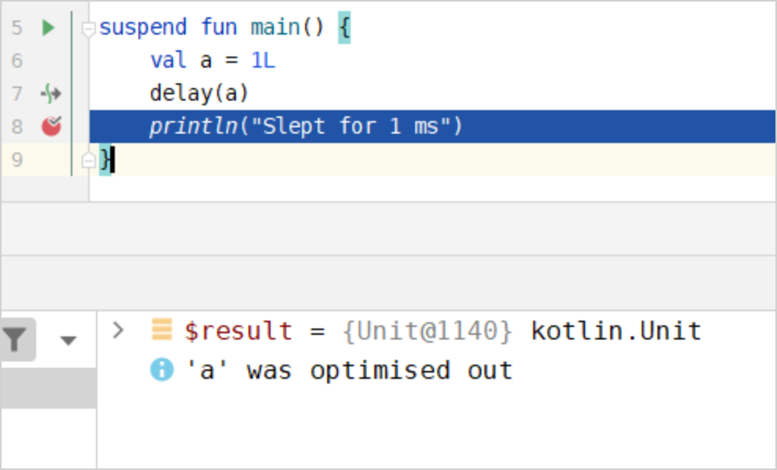

- [IntelliJ IDEA を使用してコルーチンをデバッグするチュートリアル](#intellij-idea-を使用してコルーチンをデバッグするチュートリアル)
  - [コルーチンの作成](#コルーチンの作成)
  - [コルーチンのデバッグ](#コルーチンのデバッグ)
    - [最適化された変数](#最適化された変数)


# IntelliJ IDEA を使用してコルーチンをデバッグするチュートリアル

このチュートリアルでは、 Kotlin コルーチンを作成し、 IntelliJ IDEA を使用してデバッグする方法を説明します。

このチュートリアルでは、コルーチンの概念に関する事前知識があることを前提としています。


## コルーチンの作成

1. IntelliJ IDEA で Kotlin プロジェクトを開きます。プロジェクトがない場合は作成します。

2. Gradle プロジェクトで kotlinx.coroutines ライブラリを使用するには、 build.gradle(.kts) に次の依存関係を追加します。

```kotlin
dependencies {
    implementation("org.jetbrains.kotlinx:kotlinx-coroutines-android:1.9.0-RC")
}
```

**結果の APK にデバッグインフラストラクチャを含めないようにする**

kotlinx-coroutines-core アーティファクトには、デバッガーによってのみ使用されるリソースファイルが含まれています。これは、コルーチンが正常に動作するために必要ではないものです。機能を損なうことなくこれを除外するには、アプリケーションサブプロジェクトの Gradle ファイルの android ブロックに次のスニペットを追加します。

```kotlin
packagingOptions {
    resources.excludes += "DebugProbesKt.bin"
}
```

3. src/main/kotlin の Main.kt ファイルを開きます。

src ディレクトリには、 Kotlin のソースファイルとリソースが含まれています。 Main.kt ファイルには、 Hello World! を出力するサンプルコードが含まれています。

4. main() 関数のコードを変更します。

- runBlocking() ブロックを使用してコルーチンをラップします。
- async() 関数を使用して、遅延値 ( deferred values ) a と b を計算するコルーチンを作成します。
- await() 関数を使用して、計算結果を待機します。
- println() 関数を使用して、計算ステータスと乗算結果を出力します。

```kotlin
import kotlinx.coroutines.*

fun main() = runBlocking<Unit> {
    val a = async {
        println("I'm computing part of the answer")
        6
    }
    val b = async {
        println("I'm computing another part of the answer")
        7
    }
    println("The answer is ${a.await() * b.await()}")
}
```

5. Build the code by clicking Build Project.


## コルーチンのデバッグ

1. println() 関数呼び出しの行にブレークポイントを設定します。


2. 画面上部の実行構成の横にある 「デバッグ」 をクリックして、コードをデバッグモードで実行します。


デバッグツールウィンドウが表示されます。

- Frames タブには、コールスタックが含まれています。
- Variables タブには、現在のコンテキストの変数が含まれています。
- Coroutines タブには、実行中または一時停止中のコルーチンに関する情報が含まれています。 3 つのコルーチンがあることがわかります。最初のコルーチンは RUNNING ステータスで、他の 2 つは CREATED ステータスです。


3. デバッグツールウィンドウで [プログラムの再開] をクリックして、デバッガーセッションを再開します。


これで、 [コルーチン] タブに次の内容が表示されます:

- 最初のコルーチンは SUSPENDED ステータスです。値を乗算できるように待機しています。
- 2 番目のコルーチンは a の値を計算しています。 RUNNING ステータスです。
- 3 番目のコルーチンは CREATED ステータスで、 b の値は計算されていません。

4. デバッグツールウィンドウで [プログラムの再開] をクリックして、デバッガーセッションを再開します。


これで、 [コルーチン] タブに次の内容が表示されます:

- 最初のコルーチンは SUSPENDED ステータスです。乗算できるように値を待機しています。
- 2 番目のコルーチンは値を計算し、消えました。
- 3 番目のコルーチンは b の値を計算しています。 RUNNING ステータスです。

IntelliJ IDEA デバッガーを使用すると、各コルーチンを詳しく調べてコードをデバッグできます。


### 最適化された変数

suspend 関数を使用する場合、デバッガーで変数名の横に 「最適化されました」 というメッセージが表示されることがあります。



このメッセージは、変数の有効期間が短縮され、変数が存在しなくなったことを意味します。最適化された変数は値が表示されないため、コードをデバッグするのは困難です。この動作は、 `-Xdebug` コンパイラオプションで無効にできます。

**このフラグは本番環境では使用しないでください。 -Xdebug はメモリ リークを引き起こす可能性があります。**


