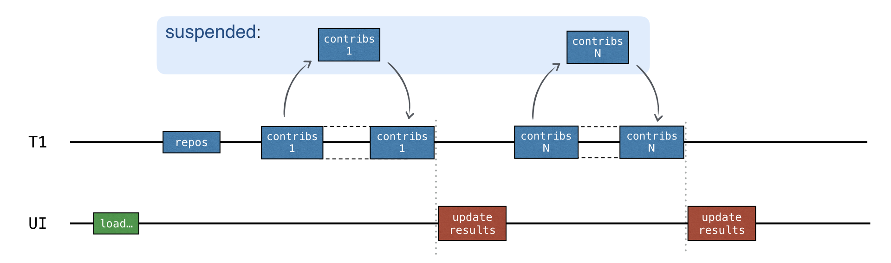
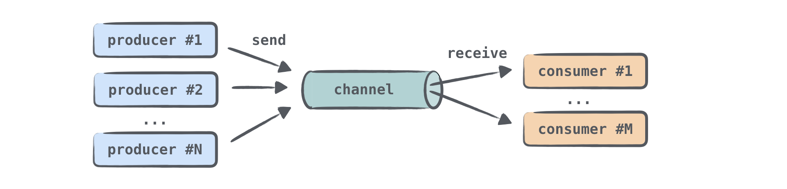

- [コルーチンとチャネルチュートリアル](#コルーチンとチャネルチュートリアル)
  - [コルーチン](#コルーチン)
  - [同時実行性](#同時実行性)
    - [async と launch の違い](#async-と-launch-の違い)
    - [async で処理結果を取得する](#async-で処理結果を取得する)
    - [処理を実行するスレッドを指定する](#処理を実行するスレッドを指定する)
  - [構造化された同時実行](#構造化された同時実行)
    - [coroutineScope 関数](#coroutinescope-関数)
    - [グローバルスコープのコルーチン](#グローバルスコープのコルーチン)
    - [処理のキャンセル](#処理のキャンセル)
    - [包含スコープのコンテキストを使用する](#包含スコープのコンテキストを使用する)
  - [進捗状況の表示](#進捗状況の表示)
  - [チャネル](#チャネル)
    - [概要](#概要)
    - [複数のコルーチンが一つのチャネルにアクセス](#複数のコルーチンが一つのチャネルにアクセス)
    - [チャネルの構造](#チャネルの構造)
    - [要素の取り出しは一度だけ](#要素の取り出しは一度だけ)
    - [receive 関数はスレッドセーフ](#receive-関数はスレッドセーフ)
    - [送信と受信の一時停止](#送信と受信の一時停止)
    - [4 種類のチャネル](#4-種類のチャネル)
      - [1.要素数に上限がないチャネル](#1要素数に上限がないチャネル)
      - [2.バッファーリングされたチャネル](#2バッファーリングされたチャネル)
      - [3.待ち合わせチャネル（ランデブーチャネル）](#3待ち合わせチャネルランデブーチャネル)
      - [4.統合されたチャネル（ Conflated channel ）](#4統合されたチャネル-conflated-channel-)
    - [各チャネルの生成方法](#各チャネルの生成方法)
    - [ランデブーチャネルの使用例](#ランデブーチャネルの使用例)
  - [テスト用コルーチン](#テスト用コルーチン)
  - [引用元資料](#引用元資料)


# コルーチンとチャネルチュートリアル

このチュートリアルでは、スレッドやコールバックをブロックすることなくネットワークリクエストを行う方法を説明します。

以下の内容を学習します。

- ネットワークリクエストを実行するために、なぜ suspending 関数を使用するのか、どのように suspending 関数を使用するのか
- コルーチンを使用して同期リクエストをどのように送るのか
- チャネルを使用して、異なるコルーチン間でどのように情報を共有するのか

ここでは、ネットワークリクエストに Retrofit ライブラリを使用しますが、他のライブラリでも同様のアプローチを行います。


## コルーチン

スレッドにおけるブロックは、コルーチンにおける一時停止 ( suspend ) に対応します。 **コルーチン内は、一時停止が可能なエリアです。コルーチン内で suspend 関数を呼び出すと、そのスレッドは解放されます。**

```kotlin
launch {
    // コルーチン内は、一時停止可能なエリアです。
    // 一時停止してもスレッドはブロックされません。

    val loadedData = loadDataSuspend(request)
    updateUI(loadedData)
}
```

上記の launch は、 「データの読み込み」 と 「その結果の表示」 を行う処理を開始します。この処理は、一時停止可能な suspend 関数となっています。サーバーリクエストを開始すると、処理は一時停止され、基になるスレッドが解放されます。サーバーリクエストが結果を返すと、処理が再開します。このような一時停止可能な処理はコルーチンと呼ばれます。

コルーチンはスレッド上で実行され、一時停止が可能です。コルーチンが一時停止されると、対応する処理が一時停止され、スレッドから除外され、メモリ上に退避されます。その間、スレッドは他のタスクを実行することが可能になります。


処理を続行する準備ができたら、一時停止中の処理はスレッドに返されます。その際、使用するスレッドは、一時停止前と同じスレッドとは限りません。

レスポンスを待機している間、スレッドは他のタスクによって使用されることができます。すべてのサーバーリクエストが UI スレッドで行われているにもかかわらず、UI はブロックさておらず、応答が可能です。

サスペンド関数は、スレッドを公平に扱い、一時停止のためにブロックしません。ただし、 suspend 関数を用意しただけでは、まだ同時実行性は実現されません。


## 同時実行性

**【重要】 Kotlin コルーチンでは、新しい処理を並列で実行したい場合は、必ず新しいコルーチンを作成する必要があります。**

新しいコルーチンを開始するには、主要なコルーチンビルダーのいずれか ( launch , async , runBlocking ) を使用します。さまざまなライブラリで、追加のコルーチンビルダーを使用できます。


### async と launch の違い

async と launch の主な違いは、以下の点です。

launch はコルーチンを表す Job を返します。そのため、 launch は結果を返さない処理に使用されます。 Job.join() を呼び出すことで、 Job が完了するまで待機することも可能です。

async は新しいコルーチンを開始し、 Deferred (延期) オブジェクトを返します。 Deferred は、 Future や Promise などの別名で知られる概念を表します。処理を保存しますが、最終結果を取得する瞬間を延期し、 **将来** のある時点で結果を **約束** します。

Deferred は Job を拡張するジェネリック型です。 async は、そのラムダ式が返すものに応じて、 `Deferred<Int>` または `Deferred<CustomType>` を返すことができます。ラムダ式の最後の一文が返す型が `Deffered<T>` の T になります。


### async で処理結果を取得する

コルーチンの結果を取得するには、 Deferred インスタンスで `await()` を呼び出します。結果を待機している間、この await() が呼び出されるコルーチンは一時停止しています。

```kotlin
import kotlinx.coroutines.*

fun main() = runBlocking {
    val deferred: Deferred<Int> = async {
        loadData()
    }
    println("waiting...")
    println(deferred.await())
    println("completed.")
}

suspend fun loadData(): Int {
    println("loading...")
    delay(1000L)
    println("loaded!")
    return 42
}
```

```
処理結果

waiting...
loading...
loaded!
42
completed.
```

runBlocking は、通常の関数とサスペンド関数の間、または、ブロッキングと非ブロッキングの世界の間の橋渡しとして使用されます。これは、トップレベルのメインコルーチンを開始するためのアダプターとして機能します。主に main() 関数とテストで使用することを目的としています。

遅延オブジェクトのリストがある場合は、 `awaitAll()` を呼び出して、それらすべての結果を待機できます。

```kotlin
fun main() = runBlocking {
    val deferreds: List<Deferred<Int>> = (1..3).map {
        // この async は、 runBlocking の CoroutineScope で実行されます。
        async {
            delay(1000L * it)
            println("Loading $it")
            it
        }
    }
    val sum = deferreds.awaitAll().sum()
    println("$sum")
}
```

```
処理結果

Loading 1
Loading 2
Loading 3
6
```

複数のサーバーリクエストを行う場合に、あるレスポンスが返ってきてから、次のリクエストを出すのではなく、複数のレスポンスを同時に待機するためには、リクエスト毎にコルーチンを生成する必要があります。


この実装方法では、コールバック関数を実装する必要がありません。さらに、 async を使用した方法では、どの部分が同時並行で実行されるのかが明白になります。

await() は、 Deferred オブジェクトの中身を取り出して返します。 awaitAll() も同様です。そのため、 `List<Deferred<List<User>>>` のようなオブジェクトで awaitAll() を実行すると `List<List<User>>` 型のオブジェクトが返されます。


### 処理を実行するスレッドを指定する

async や launch などのコルーチンビルダー関数内の処理は、何も指定しなかった場合には、デフォルトでは、その関数を呼び出したスレッドで実行されます。 (詳細は、 [CoroutineContext の優先順位](./【ブログ】1.まずはじめに.md/#coroutinecontext-のプロパティの優先順位と継承) を参照) もし、実行するスレッドを呼び出し元とは異なるスレッドにしたい場合には、関数の第一引数に `Dispatchers.Default` を渡します。

```kotlin
async(Dispatchers.Default) { }

launch(Dispatchers.Default) { }
```

Dispatchers.Default は、 JVM のスレッドプールを意味します。このプールは同時実行の方法を提供します。入手可能な CPU コア数までスレッド数を確保することが可能ですが、 CPU コア数が 1 の場合は、スレッドを 2 つまで確保することが可能です。 ( CPU コア数が上限となるため、無尽蔵にスレッドが増えることはないと思われます。)

メインスレッドを指定したい場合には、コルーチンビルダーに `Dispatchers.Main` を渡します。

```kotlin
async(Dispatchers.Main) { }

launch(Dispatchers.Main) { }
```

もし、指定したスレッドが既に他の処理を実行中である場合には、スレッドが空くまで、コルーチンの処理は一時停止し、空き次第、処理が開始されます。

新しいコルーチンを生成することなく、コルーチン内の一部の処理だけ、別のスレッドで実行したい場合には、 `withContext` 関数を使用します。

```kotlin
launch(Dispatchers.Default) {
    val users = loadUserDatas(service, req)
    withContext(Dispatchers.Main) {
        // UI スレッドで実行されます。
        updateUI(users, startTime)

        // ブロック内の最後の一文は、 withContext 関数の戻り値となります。
    }
}
```


## 構造化された同時実行

コルーチンスコープは、異なるコルーチン間の構造と親子関係に対する責任を持ちます。新しいコルーチンは通常、スコープ内で開始する必要があります。

コルーチンコンテキストには、コルーチンのカスタム名や、コルーチンをスケジュールするスレッドを指定するディスパッチャなど、特定のコルーチンを実行するために使用される追加の技術情報が格納されます。

launch , async , runBlocking を使用して新しいコルーチンを開始すると、その関数に渡されたラムダ式がコルーチンのスコープとなります。ラムダ式内では、 this で CoroutineScope を参照することができます。

```kotlin
launch { // this: CoroutineScope

}
```

- 新しいコルーチンは、スコープ内でのみ開始できます。
  - launch と async は、 CoroutineScope の拡張関数として定義されています。そのため、暗黙的でも明示的でも、それらの関数を呼び出す場合は CoroutineScope がレシーバーとして渡されます。
  - runBlocking によって開始されるコルーチンは、runBlocking がトップレベル関数として定義されているため、唯一の例外です。ただし、現在のスレッドをブロックするため、主に main() 関数、および、テストでブリッジ関数として使用することを目的としています。

```kotlin
fun main() = runBlocking { /* this: CoroutineScope */
    launch { /* this で CoroutineScope が参照可能 */ }
    // 上と下の launch は同じ意味です。
    this.launch { /* this で CoroutineScope が参照可能 */ }
}
```


### coroutineScope 関数

coroutineScope 関数を使用することで、コルーチンの新しいスコープを定義することができます。この関数で定義されたコルーチンは、すぐには開始されません。


### グローバルスコープのコルーチン

グローバルスコープのコルーチンを開始するには、 `GlobalScope.async` もしくは、 `GlobalScope.launch` を使用します。これらは、トップレベルの独立したコルーチンを生成します。

ノングローバルスコープのコルーチンによって構造化されたコルーチンは、グローバルスコープのコルーチンに比べて次の利点があります。

- 子コルーチンの生存期間は、スコープの生存期間に限定されます。
- 何か問題が発生した場合、または、ユーザーが考えを変えて操作を取り消すことにした場合、子コルーチンを自動的にキャンセルできます。
- スコープは、すべての子コルーチンの完了を自動的に待機します。したがって、スコープがコルーチンに対応している場合、親コルーチンは、そのスコープで起動されたすべてのコルーチンが完了するまで完了しません。

GlobalScope.async を使用する場合、複数のコルーチンをより小さなスコープにバインドする構造はありません。グローバル スコープから開始されたコルーチンはすべて独立しており、その有効期間はアプリケーション全体の有効期間によってのみ制限されます。グローバルスコープから開始されたコルーチンへの参照を保存し、その完了を待機するか、明示的にキャンセルすることは可能ですが、ノングローバルスコープの場合のように自動的に行われることはありません。


### 処理のキャンセル

コルーチンの処理をキャンセルするには、 `Job.cancel()` 関数を呼び出します。

構造化されたコルーチンでは、親のコルーチンをキャンセルすると、その全ての子コルーチンも自動的にキャンセルされます。


### 包含スコープのコンテキストを使用する

特定のスコープ内で、新しいコルーチンを開始した場合、それらが、同じコンテキストで実行されるのを、簡単に保証できます。また、必要に応じてコンテキストを置き換えることも簡単になります。

coroutineScope 、または、コルーチンビルダーによって作成された、新しいスコープは、常に外部スコープからコンテキストを継承します。

ネストされたコルーチンは、継承されたコンテキストで自動的に開始されます。ディスパッチャは、コンテキストの一部です。そのため、新しいコルーチンを開始した場合、デフォルトでは、継承されたディスパッチャで処理が実行されます。

```kotlin
launch(Dispatchers.Default) {  // 包含スコープ
    val users = loadContributorsConcurrent(service, req)
    // ...
}

suspend fun loadContributorsConcurrent(
    service: GitHubService, req: RequestData
): List<User> = coroutineScope {
    // 包含スコープのコンテキストを継承
    // この例では、 Dispatchers.Default を使用します。
    // ...
    async {
        // 継承したコンテキストをここでも使用
        // この例では、 Dispatchers.Default を使用します。

        // ...
    }
    // ...
}
```

コルーチンのディスパッチャーを変更したい場合は、変更したいコルーチンの生成時に、適応したいディスパッチャーを渡します。コルーチンが、さらにネストしている場合は、ディスパッチャーの変更が、そのコルーチンの子孫にも影響することに注意してください。

Android アプリケーションなどの UI アプリケーションでコルーチンを使用する場合、最上位のコルーチンにはデフォルトで CoroutineDispatchers.Main を使用し、別のスレッドでコードを実行する必要がある場合は別のディスパッチャーを明示的に配置するのが一般的な方法です。


## 進捗状況の表示

同時実行が可能になったとしても、取得したデータを順次表示したり、進捗状況を表示しなければ、すべての処理が完了するまで、ユーザーはその結果を見ることができません。

```kotlin
suspend fun loadContributorsProgress(
    service: GitHubService,
    req: RequestData,
    updateResults: suspend (List<User>, completed: Boolean) -> Unit
) {
    val repos = service
        .getOrgRepos(req.org)
        .also { logRepos(req, it) }
        .bodyList()

    var allUsers = emptyList<User>()
    for ((index, repo) in repos.withIndex()) {
        // getRepoContributors が suspend 関数なので、
        // for 文をループする度に、この関数で毎回一時停止する。
        val users = service.getRepoContributors(req.org, repo.name)
            .also { logUsers(repo, it) }
            .bodyList()

        // リストに要素を足し込む
        allUsers = (allUsers + users).aggregate()
        updateResults(allUsers, index == repos.lastIndex)
    }
}
```

上記のコードは for 文の中で毎回一時停止します。一時停止している間に、次の for 文の処理が開始されれば良いのですが、開始されないために、無駄な待ち時間があります。 (以下の処理イメージを参照)



for 文内の処理を同時並行で実行することが一番の理想形です。 (以下の処理イメージを参照)


これを実現するにはチャネルを使用します。


## チャネル

### 概要

共有された可変状態 ( shared mutable state ) を持つコードを記述することは、非常に難しく、エラーが発生しやすくなります。より簡単な方法は、共通の可変状態を使用するのではなく、通信によって情報を共有することです。コルーチンは、チャネルを介して相互に通信できます。

チャネルは、コルーチン間でデータを渡すことができる通信の基本機能です。 一つのコルーチンがチャネルに情報を送信し、別のコルーチンがそのチャネルからその情報を受け取ることができます。


情報を送信 (生成) するコルーチンは **プロデューサー** と呼ばれ、情報を受信 (消費) するコルーチンは **コンシューマー** と呼ばれます。


### 複数のコルーチンが一つのチャネルにアクセス

一つ、または、複数のコルーチンが同じチャネルに情報を送信でき、一つ、または、複数のコルーチンがそのチャネルからデータを受信できます。




### チャネルの構造

チャネルは、SendChannel , ReceiveChannel , Channel の三つの異なるインターフェースで構成されます。 Channel は SendChannel と ReceiveChannel を継承したものです。通常、 Channel を作成し、プロデューサーには SendChannel インスタンスとして渡して、コンシューマーには ReceiveChannel として渡します。これは、プロデューサーだけがチャネルに情報を送信できるようにし、コンシューマーだけがチャネルから受信できるようにするためです。 send 関数と receive 関数は両方とも suspend として宣言されます。

```kotlin
interface SendChannel<in E> {
    suspend fun send(element: E)
    fun close(): Boolean
}

interface ReceiveChannel<out E> {
    suspend fun receive(): E
}

interface Channel<E> : SendChannel<E>, ReceiveChannel<E>
```


### 要素の取り出しは一度だけ

チャネルは、キューに似たものと考えることができます。キューでは、一方の端に要素が追加され、もう一方の端から要素が取り出されます。

チャネルから情報を受信する場合、要素は、一つのコンシューマーによって、一回だけ処理されます。つまり、 **要素が参照されると、その要素はすぐにチャネルから削除されます。**


### receive 関数はスレッドセーフ

receive 関数はスレッドセーフであるため、追加の同期処理を実装する必要はありません。


### 送信と受信の一時停止

同期バージョンであっても、 **チャネルは send() および receive() 操作を一時停止することがあります。これは、チャネルが 「空」 または 「いっぱい」 の場合に発生します。** チャネルサイズに上限がある場合は、チャネルがいっぱいになることがあります。

ライブラリでは、いくつかのタイプのチャネルが定義されています。それらは、内部に格納できる要素の数と、send() 呼び出しを一時停止できるかどうかが異なります。 receive() 呼び出しは、すべてのチャネル タイプで同じ様に動作します。チャネルが空でない場合は要素を受信し、そうでない場合は一時停止します。

プロデューサーは、これ以上要素が来ないことを示すために **チャネルを閉じることができます。**


### 4 種類のチャネル

#### 1.要素数に上限がないチャネル

無制限チャネルは、キューに最も近いものです。プロデューサーはこのチャネルに要素を送信でき、チャネルには、無制限に要素を追加できます。要素の追加が一時停止されることはありません。ただし、メモリが不足すると、 OutOfMemoryException が発生します。

無制限チャネルは、送信が一時停止されることはありませんが、受信が一時停止されることはあります。コンシューマーが空のチャネルから受信しようとすると、新しい要素がチャネルに追加されるまで、受信処理は一時停止されます。


#### 2.バッファーリングされたチャネル

バッファリングされたチャネルの要素数は、指定された数によって制限されます。プロデューサーは、サイズ制限に達するまで、このチャネルに要素を送信でき、要素は内部に保存されます。チャネルがいっぱいの状態で、 `send` 呼び出しを行った場合は、要素の追加が一時停止されます。


#### 3.待ち合わせチャネル（ランデブーチャネル）

ランデブーチャネルはバッファーのないチャネルで、これは、サイズがゼロのバッファ付きチャネルと見なすことができます。 send() または receive() 関数は、対応する反対の関数が呼び出されるまで一時停止します。

send() 関数が呼び出され際に、一時停止中の receive() 呼び出しがない場合、send() は一時停止されます。同様に、receive() 関数が呼び出され、チャネルが空の場合、つまり、一時停止中の send() 呼び出しがない場合、receive() 呼び出しは一時停止されます。

「ランデブー」という名前 (「合意された時間と場所での会議」) は、send() と receive() が「時間どおりに会う」必要があるという意味を含んでいます。


#### 4.統合されたチャネル（ Conflated channel ）

統合されたチャネルに送信された新しい要素は、以前に送信された要素を上書きするため、受信側は常に最新の要素のみを取得します。 send() 呼び出しが一時停止することはありません。


Conflation には、複数のものを一つに合成するという意味があります。


### 各チャネルの生成方法

```kotlin
val rendezvousChannel = Channel<String>()
// 引数でバッファーサイズを指定する
val bufferedChannel = Channel<String>(10)
val conflatedChannel = Channel<String>(CONFLATED)
val unlimitedChannel = Channel<String>(UNLIMITED)
```

デフォルトでは、ランデブーチャネルが生成されます。


### ランデブーチャネルの使用例

```kotlin
import kotlinx.coroutines.channels.Channel
import kotlinx.coroutines.*

fun main() = runBlocking<Unit> {
    val channel = Channel<String>()
    launch {
        channel.send("A1")
        channel.send("A2")
        log("A done")
    }
    launch {
        channel.send("B1")
        log("B done")
    }
    launch {
        repeat(3) {
            val x = channel.receive()
            log(x)
        }
    }
}

fun log(message: Any?) {
    println("[${Thread.currentThread().name}] $message")
}
```

```
実行結果

[main] A1
[main] B1
[main] A done
[main] B done
[main] A2
```

一つ目のコルーチンは "A1" が送信された後、受信が来るまで一時停止するため、すぐに "A2" が送信されることはありません。

一つ目のコルーチンが一時停止中になると、二つ目のコルーチンが開始されます。 "B1" を送信しますが、まだ受信側が来ていないため、二つ目のコルーチンも send("B2") の部分で一時停止します。

二つ目のコルーチンが一時停止すると、三つ目のコルーチンが開始されます。以前に送信された "A1" と "B1" を受信し、さらにもう一つ receive() 関数が呼び出されるため、送信側が来るまで、三つ目のコルーチンは一時停止します。

三つ目のコルーチンが一時停止すると、一つ目のコルーチンが再開し、 "A2" が送信されます。今回の例では、すべてのコルーチンがメインスレッド上で実行しているため、 "A2" の send() 関数呼び出し後、すぐに三つ目のコルーチンが再開するのではなく、一つ目のコルーチンの log("A done") までが実行されます。

一つ目のコルーチンが終了すると、メインスレッドが空くため、二つ目のコルーチンが再開します。 log("B done") の実行後、二つ目のコルーチンも終了します。

二つ目のコルーチンが終了すると、三つ目のコルーチンが再開し、 "A2" をログに出力して、三つ目のコルーチンが終了します。


## テスト用コルーチン

コルーチン実装後に、そのパフォーマンスの計測等で、何度も処理を実行する場合には、わずか 2 ～ 3 秒の処理でも、何度も実行することで、時間がかかってしまいます。しかし、それを回避する仕組みがあります。その仕組みは、テストデータが準備されているために、レスポンスを待機することなく、すぐにレスポンスが返ってきたとして、処理を再開することです。

この仕組みを使用するには、 runBlocking 呼び出しを runTest に置き換えます。 runTest は、 TestScope というスコープを持つ、ラムダ式を引数に取ります。この特別なスコープ内の suspend 関数で delay を呼び出すと、 delay は実際の時間で遅延するのではなく、仮想時間を増加させます。

```kotlin
@Test
fun testDelayInSuspend() = runTest {
    val realStartTime = System.currentTimeMillis()
    val virtualStartTime = currentTime

    foo()
    // 実際には数ミリ秒以下
    println("${System.currentTimeMillis() - realStartTime} ms")
    // 仮想時間では 1000 ミリ秒前後
    println("${currentTime - virtualStartTime} ms")
}

suspend fun foo() {
    // 仮想的に遅延を再現するだけで、
    // 実際には遅延せずに次の処理を開始します。
    delay(1000)

    // この処理は仮想時間を使用することで、
    // 1000 ミリ秒の遅延なしで開始されます。
    println("foo")
}
```


## 引用元資料

- [Coroutines and channels − tutorial](https://kotlinlang.org/docs/coroutines-and-channels.html)


