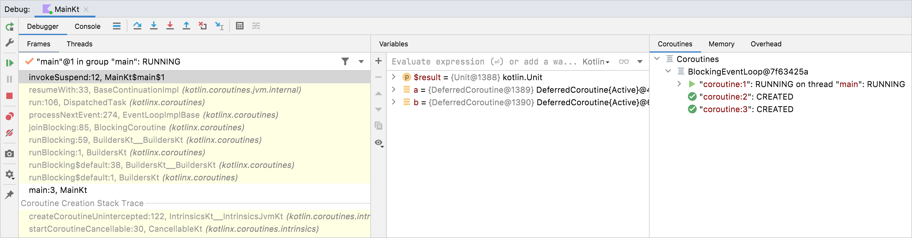

- [コルーチンコンテキストとディスパッチャー](#コルーチンコンテキストとディスパッチャー)
  - [ディスパッチャーとスレッド](#ディスパッチャーとスレッド)
  - [Dispatchers.Default と Dispatchers.IO の違い](#dispatchersdefault-と-dispatchersio-の違い)
  - [Unconfined ディスパッチャー](#unconfined-ディスパッチャー)
  - [コルーチンとスレッドのデバッグ](#コルーチンとスレッドのデバッグ)
    - [IDEA でデバッグする](#idea-でデバッグする)
    - [ログ出力を使用してデバッグする](#ログ出力を使用してデバッグする)
  - [スレッド間をジャンプする](#スレッド間をジャンプする)
  - [コンテキストの中にあるジョブを取得する](#コンテキストの中にあるジョブを取得する)
  - [子コルーチン](#子コルーチン)
  - [親の責任](#親の責任)
  - [デバッグ用にコルーチン名を設定する](#デバッグ用にコルーチン名を設定する)
  - [コンテキスト要素を組み合わせる](#コンテキスト要素を組み合わせる)
  - [コルーチンのライフサイクルをライフサイクルを持つコンポーネントに紐づける](#コルーチンのライフサイクルをライフサイクルを持つコンポーネントに紐づける)
    - [スレッドローカルデータ](#スレッドローカルデータ)


# コルーチンコンテキストとディスパッチャー

コルーチンは常に、 Kotlin 標準ライブラリで定義されている CoroutineContext 型の値によって表されるコンテキストで実行されます。

コルーチンコンテキストは、さまざまな要素のセットです。主な要素は、前に説明したコルーチンの Job と、このセクションで説明するディスパッチャーです。


## ディスパッチャーとスレッド

コルーチンコンテキストには、コルーチンディスパッチャ ( [CoroutineDispatcher](https://kotlinlang.org/api/kotlinx.coroutines/kotlinx-coroutines-core/kotlinx.coroutines/-coroutine-dispatcher/) を参照) が含まれます。コルーチンディスパッチャーは、コルーチンが実行に使用するスレッド (もしくはスレッドプール) を決定する役割を担います。つまり、コルーチンディスパッチャーは、コルーチンの実行を特定のスレッド or 特定のスレッドプールに制限したり、制限なしで実行するように指示します。

launch や async などのすべてのコルーチンビルダーは、引数に CoroutineContext を渡すことが可能です。 CoroutineContext は、新しいコルーチンやその他のコンテキスト要素に対して、ディスパッチャを明示的に指定することができます。

次の例を試してください。

```kotlin
fun main() = runBlocking<Unit> {
    // 親 ( main runBlocking ) のコルーチンを使用します。
    launch {
        println("main runBlocking      : I'm working in thread ${Thread.currentThread().name}")
    }

    // メインスレッドを使用するように見えますが、
    // 実際には他のメカニズムです。（詳細は後述します。）
    // 一般的には Unconfined は使用しません。
    launch(Dispatchers.Unconfined) {
        println("Unconfined            : I'm working in thread ${Thread.currentThread().name}")
    }

    // DefaultDispatcher が使用されます。
    launch(Dispatchers.Default) { // will get dispatched to  
        println("Default               : I'm working in thread ${Thread.currentThread().name}")
    }

    // 自分専用の新しいスレッドを生成して使用します。
    launch(newSingleThreadContext("MyOwnThread")) {
        println("newSingleThreadContext: I'm working in thread ${Thread.currentThread().name}")
    }
}
```

```
実行結果（順序は異なることがあります。）

main runBlocking      : I'm working in thread main
Unconfined            : I'm working in thread main
Default               : I'm working in thread DefaultDispatcher-worker-1
newSingleThreadContext: I'm working in thread MyOwnThread
```

**パラメータなしの launch**

起動元の CoroutineScope からコンテキスト (ディスパッチャーを含む) を継承します。この場合、メインスレッドで実行される runBlocking コルーチンのコンテキストを継承します。

**Dispatchers.Unconfined**

メインスレッドで実行されるように見える特殊なディスパッチャですが、実際には、後で説明する別のメカニズムです。

**Dispatchers.Default**

共有のバックグラウンドスレッドプールを使用します。

**newSingleThreadContext**

コルーチンを実行するためのスレッドを作成します。専用スレッドは非常に高価なリソースです。実際のアプリケーションでは、不要になったときに close 関数を使用して解放するか、最上位の変数に格納してアプリケーション全体で再利用する必要があります。

**Dispatchers.Main**

メインスレッドを使用します。

**Dispatchers.IO**

ネットワークリクエスト、ファイル操作、データベース操作等の IO 操作に使用します。


## Dispatchers.Default と Dispatchers.IO の違い

Dispatchers.Default は、 CPU コア数に基づいてスレッドが割り当てられます。通常、 CPU のコア数と同じ数のスレッドが用意されます。そのため、高負荷な処理に向いています。

Dispatchers.IO は、スレッド数はシステムに応じて動的に調整されることが多いです。 IO リクエストの処理は、大抵の場合、主要な処理はアプリで処理するのではなく、サーバーや OS が処理します。そのため、高負荷な処理というよりも、リクエストだけを出してから応答が返ってくるまでの待機のためのスレッドと考えられます。

つまり、高負荷な処理なのか、単に待機するための処理なのかによって、スレッドの利用方法を変えていると思われます。


## Unconfined ディスパッチャー

**Unconfined ディスパッチャは、高度な設定で、副作用が発生しやすいため、一般的なコードでは使用しないでください。**

Dispatchers.Unconfined ディスパッチャは、呼び出し元スレッドでコルーチンを開始しますが、それは、最初の一時停止ポイントまでです。一時停止後は、再開のトリガーが発生するスレッドで再開されます。これは、再開後にどのスレッドで開始されるかは全く制御も予測もできないことを意味します。

つまり、 UI スレッドである保証がないため、 UI の更新はできず、また、 ワーカースレッドである保証もないため、処理時間が長くなる処理も実行できません。よって、実行可能な処理は、 「 UI を更新せず、短時間の処理」 のみとなります。

```kotlin
fun main() = runBlocking<Unit> {
    // メインスレッドで実行されます。
    launch(Dispatchers.Unconfined) {
        println("Unconfined      : I'm working in thread ${Thread.currentThread().name}")
        delay(500)
        println("Unconfined      : After delay in thread ${Thread.currentThread().name}")
    }

    // 親 ( mainBlocking ) のディスパッチャーで実行されます。
    launch {
        println("main runBlocking: I'm working in thread ${Thread.currentThread().name}")
        delay(1000)
        println("main runBlocking: After delay in thread ${Thread.currentThread().name}")
    }
}
```

```
実行結果（例）

Unconfined      : I'm working in thread main
main runBlocking: I'm working in thread main
Unconfined      : After delay in thread kotlinx.coroutines.DefaultExecutor
main runBlocking: After delay in thread main
```


## コルーチンとスレッドのデバッグ

コルーチンは、あるスレッドで中断し、別のスレッドで再開することができます。シングルスレッドのディスパッチャーであっても、特別なツールがなければ、コルーチンが何を、どこで、いつ実行していたかを把握するのは難しくなることがあります。


### IDEA でデバッグする

Kotlin プラグインの Coroutine Debugger は、IntelliJ IDEA でのコルーチンのデバッグを簡素化します。

デバッグは、 kotlinx-coroutines-core のバージョン 1.3.8 以降で機能します。

デバッグ ツール ウィンドウには、Coroutines タブがあります。このタブでは、現在実行中のコルーチンと一時停止中のコルーチンの両方に関する情報を確認できます。コルーチンは、実行されているディスパッチャーごとにグループ化されています。



コルーチン デバッガーを使用すると、次の操作を実行できます。

- 各コルーチンの状態を確認します。
- 実行中のコルーチンと一時停止中のコルーチンの両方について、ローカル変数とキャプチャ変数の値を確認します。
- コルーチン作成スタック全体と、コルーチン内の呼び出しスタックを確認します。スタックには、変数値を持つすべてのフレームが含まれます。標準デバッグ中に失われるものも含みます。
- 各コルーチンとそのスタックの状態を含む完全なレポートを取得します。レポートを取得するには、 [コルーチン] タブ内を右クリックし、[コルーチン ダンプを取得] をクリックします。

コルーチンのデバッグを開始するには、ブレークポイントを設定してアプリケーションをデバッグ モードで実行するだけです。

[チュートリアル](https://kotlinlang.org/docs/debug-coroutines-with-idea.html) でコルーチンのデバッグについて詳しく学習します。


### ログ出力を使用してデバッグする

コルーチン デバッガーを使用せずにスレッドを含むアプリケーションをデバッグする別の方法は、各ログ ステートメントのログ ファイルにスレッド名を出力することです。この機能は、ロギング フレームワークによって広くサポートされています。コルーチンを使用する場合、スレッド名だけではコンテキストがあまり伝わらないため、 `kotlinx.coroutines` にはデバッグを容易にする機能が含まれています。

`-Dkotlinx.coroutines.debug` JVM オプションを使用して次のコードを実行します。

```kotlin
fun log(msg: String) = println("[${Thread.currentThread().name}] $msg")

fun main() = runBlocking<Unit> {
    val a = async {
        log("I'm computing a piece of the answer")
        6
    }
    val b = async {
        log("I'm computing another piece of the answer")
        7
    }
    log("The answer is ${a.await() * b.await()}")
}
```

コルーチンは三つあります。 runBlocking と async の二つのコルーチンです。これらはすべて runBlocking のコンテキストで実行され、メインスレッドに限定されます。このコードの出力は次のようになります。

```
実行結果

[main @coroutine#2] I'm computing a piece of the answer
[main @coroutine#3] I'm computing another piece of the answer
[main @coroutine#1] The answer is 42
```

log 関数は、スレッドの名前を大括弧で囲んで出力します。このスレッドがメインスレッドであり、現在実行中のコルーチンの識別子が付加されていることがわかります。この識別子は、デバッグモードがオンの場合、作成されたすべてのコルーチンに付与されます。

JVM が `-ea` オプション付きで実行されると、デバッグモードもオンになります。デバッグ機能の詳細については、 [DEBUG_PROPERTY_NAME](https://kotlinlang.org/api/kotlinx.coroutines/kotlinx-coroutines-core/kotlinx.coroutines/-d-e-b-u-g_-p-r-o-p-e-r-t-y_-n-a-m-e.html) プロパティのドキュメントを参照してください。


## スレッド間をジャンプする

同じコルーチン内でも、処理の一部分だけ使用するスレッドを変更することが可能です。

`-Dkotlinx.coroutines.debug` JVM オプションを使用して次のコードを実行します ( [デバッグ](https://kotlinlang.org/docs/coroutine-context-and-dispatchers.html#debugging-coroutines-and-threads) を参照)。


```kotlin
fun log(msg: String) = println("[${Thread.currentThread().name}] $msg")

fun main() {
    newSingleThreadContext("Ctx1").use { ctx1 ->
        newSingleThreadContext("Ctx2").use { ctx2 ->
            runBlocking(ctx1) {
                log("Started in ctx1")
                withContext(ctx2) {
                    log("Working in ctx2")
                }
                log("Back to ctx1")
            }
        }
    }
}
```

これは、いくつかの新しいテクニックを示しています。一つは、明示的に指定されたコンテキストで runBlocking を使用するもので、もう一つは、以下の出力に示すように、同じコルーチンにとどまりながら、 withContext 関数を使用してコルーチンのコンテキストを変更するものです。

```
実行結果

[Ctx1 @coroutine#1] Started in ctx1
[Ctx2 @coroutine#1] Working in ctx2
[Ctx1 @coroutine#1] Back to ctx1
```

この例では、 Kotlin 標準ライブラリの kotlin.io.Closeable.kt の use 関数を使用することで、 [newSingleThreadContext](https://kotlinlang.org/api/kotlinx.coroutines/kotlinx-coroutines-core/kotlinx.coroutines/new-single-thread-context.html) で作成されたスレッドが不要になったときに、自動的に解放しています。


## コンテキストの中にあるジョブを取得する

コルーチンの [Job](https://kotlinlang.org/api/kotlinx.coroutines/kotlinx-coroutines-core/kotlinx.coroutines/-job/) はそのコンテキストの一部であり、 `coroutineContext[Job]` 式を使用してコンテキストから取得できます。

```kotlin
import kotlinx.coroutines.Job

fun main() = runBlocking<Unit> {
    println("My job is ${coroutineContext[Job]}")
}
```

`coroutineContext` は、 `CoroutineScope` インターフェースに定義されているプロパティです。

デバッグモードでは、次のような出力が行われます:

```
実行結果

My job is "coroutine#1":BlockingCoroutine{Active}@6d311334
```

コルーチンの `isActive` は `coroutineContext[Job]?.isActive == true` の便利なショートカットです。


## 子コルーチン

コルーチンが別のコルーチンの CoroutineScope で起動されると、そのコルーチンは CoroutineScope.coroutineContext を介してコンテキストを継承し、新しいコルーチンのジョブは親コルーチンのジョブの子ジョブになります。親コルーチンがキャンセルされると、そのすべての子も再帰的にキャンセルされます。

ただし、この親子関係は、次の二つの方法のいずれかで明示的にオーバーライドできます。

1. コルーチンを起動するときに別のスコープが明示的に指定されている場合 (たとえば、GlobalScope.launch など) は、親スコープのジョブと子スコープのジョブは親子関係にはなりません。
2. 新しいコルーチンのコンテキストとして別のジョブオブジェクトが渡された場合 (以下の例を参照) 、親スコープのジョブがオーバーライドされます。

どちらの場合も、起動されたコルーチンは起動元のスコープに結び付けられず、独立して動作します。

```kotlin
fun main() = runBlocking<Unit> {
    // 受け取った何らかのリクエストを処理するためにコルーチンを起動する
    val request = launch {
        // 二つのジョブ生成する

        launch(Job()) { 
            println("job1: I run in my own Job and execute independently!")
            delay(1000)
            println("job1: I am not affected by cancellation of the request")
        }

        // こちらは親のコンテキストを継承するため、
        // ジョブに親子関係が生まれます。
        launch {
            delay(100)
            println("job2: I am a child of the request coroutine")
            delay(1000)
            println("job2: I will not execute this line if my parent request is cancelled")
        }
    }
    delay(500)
    // 親のジョブをキャンセルします。
    request.cancel()
    println("main: Who has survived request cancellation?")
    // 二つの子ジョブがキャンセルされたかどうかを
    // 確認するために、メインスレッドを一時停止します。
    delay(1000)
}
```

```
実行結果

job1: I run in my own Job and execute independently!
job2: I am a child of the request coroutine
main: Who has survived request cancellation?
job1: I am not affected by cancellation of the request
```


## 親の責任

親コルーチンは、明示的に指定しなくても、常にすべての子の完了を待機します。親は起動したすべての子を明示的に追跡する必要はなく、最後に Job.join を使用してそれらを待機する必要もありません。

```kotlin
fun main() = runBlocking<Unit> {
    // 受け取った何らかのリクエストを処理するためにコルーチンを起動する
    val request = coroutineScope {
        repeat(3) { i -> // 三つの子ジョブを開始
            launch  {
                // 様々な一時停止 ( 200ms, 400ms, 600ms )
                delay((i + 1) * 200L) 
                println("Coroutine $i is done")
            }
        }
        println("request: I'm done and I don't explicitly join my children that are still active")
    }
    println("Now processing of the request is complete")
}
```

```
実行結果

request: I'm done and I don't explicitly join my children that are still active
Coroutine 0 is done
Coroutine 1 is done
Coroutine 2 is done
Now processing of the request is complete
```


```kotlin
fun main() = runBlocking<Unit> {
    // 受け取った何らかのリクエストを処理するためにコルーチンを起動する
    val request = launch {
        repeat(3) { i -> // 三つの子ジョブを開始
            launch  {
                // 様々な一時停止 ( 200ms, 400ms, 600ms )
                delay((i + 1) * 200L) 
                println("Coroutine $i is done")
            }
        }
        println("request: I'm done and I don't explicitly join my children that are still active")
    }
    // launch で生成したコルーチンは、親コルーチンになれないため、子コルーチンの終了を待機しません。
    // したがって、明示的に join 関数を使用して、子コルーチンの終了を待つ必要があります。
    request.join()
    println("Now processing of the request is complete")
}
```

この実行結果は、一つ上の coroutineScope 関数を使用した場合の結果と同じになります。もし、 `request.join()` を実行しなかった場合は、以下のような結果になります。

```
実行結果

Now processing of the request is complete
request: I'm done and I don't explicitly join my children that are still active
Coroutine 0 is done
Coroutine 1 is done
Coroutine 2 is done
```


## デバッグ用にコルーチン名を設定する

スレッド名を取得した際に表示されるコルーチン名を自分で指定することが可能です。指定しなかった場合は、 ID のような数値のみで管理されていますが、場合によっては、名前を付与した方がデバッグがはかどるでしょう。

```kotlin
fun log(msg: String) = println("[${Thread.currentThread().name}] $msg")

fun main() = runBlocking(CoroutineName("main")) {
    log("Started main coroutine")
    
    val v1 = async(CoroutineName("v1coroutine")) {
        delay(500)
        log("Computing v1")
        6
    }
    val v2 = async(CoroutineName("v2coroutine")) {
        delay(1000)
        log("Computing v2")
        7
    }
    log("The answer for v1 * v2 = ${v1.await() * v2.await()}")
}
```

JVM オプション `-Dkotlinx.coroutines.debug` で実行した結果は次のようになります。

```
実行結果

[main @main#1] Started main coroutine
[main @v1coroutine#2] Computing v1
[main @v2coroutine#3] Computing v2
[main @main#1] The answer for v1 * v2 = 42
```


## コンテキスト要素を組み合わせる

場合によっては、コルーチンコンテキストに複数の要素を定義する必要があります。そのためには、 `+` 演算子を使用できます。たとえば、明示的に指定されたディスパッチャーと明示的に指定された名前を同時に持つコルーチンを起動できます。

```kotlin
fun main() = runBlocking<Unit> {
    launch(Dispatchers.Default + CoroutineName("test")) {
        println("I'm working in thread ${Thread.currentThread().name}")
    }
}
```

```
実行結果

I'm working in thread DefaultDispatcher-worker-1 @test#2
```


## コルーチンのライフサイクルをライフサイクルを持つコンポーネントに紐づける

アプリケーションにライフサイクルを持つオブジェクトがあります。たとえば、 Android アプリケーションを作成し、 Android アクティビティのコンテキストでさまざまなコルーチンを起動して、データの取得と更新、アニメーションの実行などの非同期操作を実行します。アクティビティが破棄されたときに、メモリリークを回避するために、これらのコルーチンはすべてキャンセルする必要があります。もちろん、手動でコルーチンのライフサイクルを結び付けることもできますが、 Android では、各ライフサイクルコンポーネントがその機能を提供しています。詳しくは各ドキュメントを参照してください。例えば、 Fragment の場合のドキュメントは [こちら](https://developer.android.com/topic/libraries/architecture/coroutines?hl=ja#lifecyclescope) になります。

```kotlin
class MyFragment: Fragment() {
    override fun onViewCreated(view: View, savedInstanceState: Bundle?) {
        super.onViewCreated(view, savedInstanceState)
        viewLifecycleOwner.lifecycleScope.launch {
            val params = TextViewCompat.getTextMetricsParams(textView)
            val precomputedText = withContext(Dispatchers.Default) {
                PrecomputedTextCompat.create(longTextContent, params)
            }
            TextViewCompat.setPrecomputedText(textView, precomputedText)
        }
    }
}
```


### スレッドローカルデータ

内容が難しいのでパスします。ただし、スレッドローカル変数について、簡単に記載しておきます。


Java のスレッドローカル変数とは、各スレッドが自分専用の変数を持つことができる仕組みです。これにより、異なるスレッドが同じ変数にアクセスしても、スレッドごとに独立した値を保持することができます。これを実現するために、 Java は ThreadLocal クラスを提供しています。


