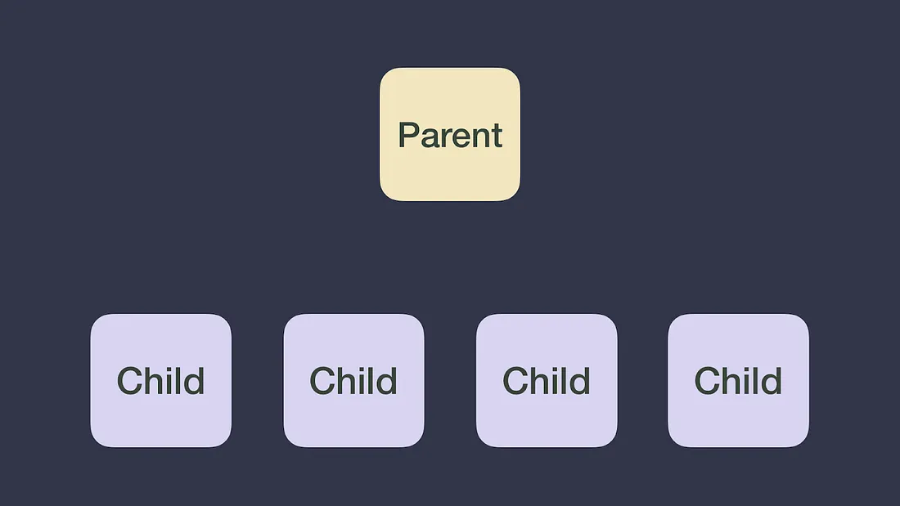
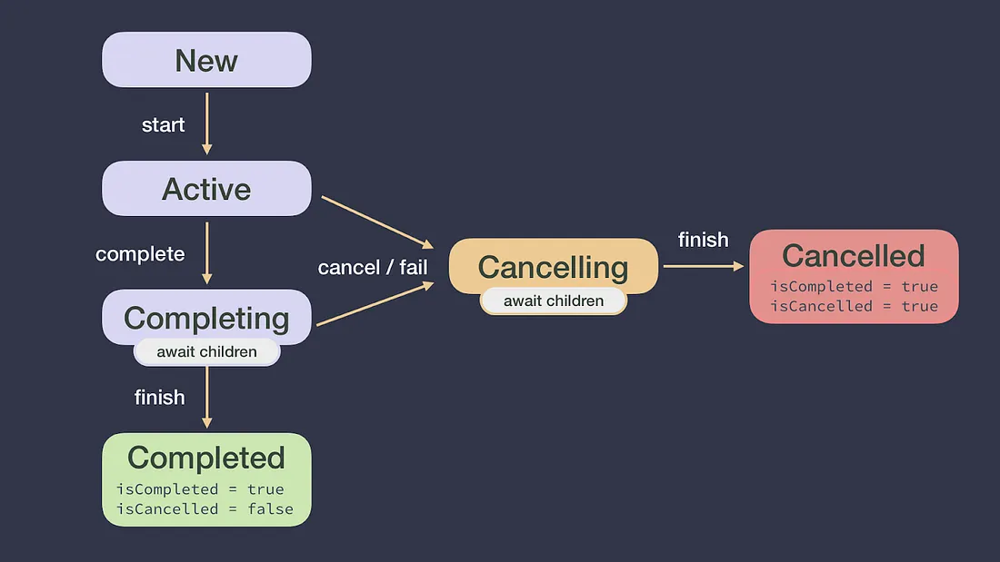
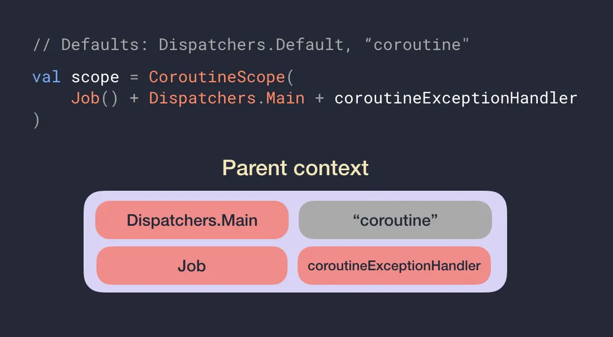
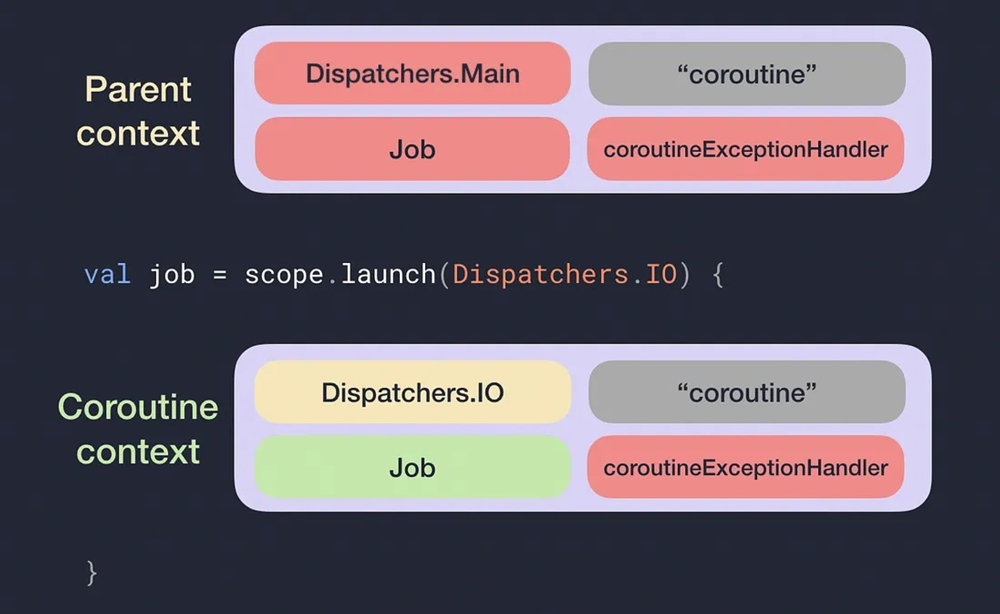

- [コルーチン：まずはじめに](#コルーチンまずはじめに)
  - [CoroutineScope](#coroutinescope)
  - [Job](#job)
  - [CoroutineContext](#coroutinecontext)
  - [ジョブのライフサイクル](#ジョブのライフサイクル)
  - [CoroutineContext のプロパティの優先順位と継承](#coroutinecontext-のプロパティの優先順位と継承)
    - [まとめ](#まとめ)
  - [引用元資料](#引用元資料)


# コルーチン：まずはじめに

このブログ投稿シリーズでは、コルーチンのキャンセルと例外について詳しく説明します。キャンセルは、メモリとバッテリー寿命を浪費する可能性のある、必要以上の作業を回避するために重要です。適切な例外処理は、優れたユーザー エクスペリエンスの鍵となります。シリーズの他の 2 つのパート (パート 2: キャンセル、パート 3: 例外) の基礎として、CoroutineScope , Job , CoroutineContext などのコアコルーチン概念を定義して、全員が同じ認識を持つことが重要です。

ビデオの方がお好みの場合は、Florina Muntenescu と私が行った KotlinConf’19 での [この講演](https://www.youtube.com/watch?v=w0kfnydnFWI) をご覧ください。


## CoroutineScope

CoroutineScope は、launch または async (これらは CoroutineScope の拡張関数) を使用して作成したコルーチンを追跡します。進行中の作業 (実行中のコルーチン) は、いつでも scope.cancel() を呼び出すことでキャンセルできます。

アプリの特定のレイヤーで、コルーチンのライフサイクルを開始、および、制御する場合は、常に CoroutineScope を作成する必要があります。Android などの一部のプラットフォームでは、viewModelScope や lifecycleScope などの特定のライフサイクル クラスで CoroutineScope を既に提供している [KTX ライブラリ ( Android 上で Kotlin を使用する上で便利なライブラリ)](https://developer.android.com/kotlin/ktx?hl=ja) があります。

CoroutineScope を作成するときは、コンストラクターへのパラメーターとして CoroutineContext を受け取ります。次のコードを使用して、新しいスコープとコルーチンを作成できます。

```kotlin
// Job と Dispatcher は、 CoroutineContext に統合されます。
// 詳しくは後ほど説明します。
val scope = CoroutineScope(Job() + Dispatchers.Main)
val job = scope.launch {
    // new coroutine
}
```


## Job

Job は、コルーチンへのハンドルです。 ( launch または async で) 作成するコルーチンごとに、コルーチンを一意に識別し、そのライフサイクルを管理する Job インスタンスを返します。上で軽く触れたように、 Job を CoroutineScope に渡して、そのライフサイクルのハンドルを保持することもできます。


## CoroutineContext

CoroutineContext は、コルーチンの動作を定義する要素のセットです。次の要素で構成されます。

- Job
  - コルーチンのライフサイクルを制御します。
- CoroutineDispatcher
  - 作業を適切なスレッドにディスパッチします (割り当てます) 。
- CoroutineName
  - コルーチンの名前。デバッグに役立ちます。
- CoroutineExceptionHandler
  - キャッチされていない例外を処理します。シリーズのパート 3 で説明します。

新しいコルーチンの CoroutineContext とは何でしょうか。Job の新しいインスタンスが作成され、そのライフサイクルを制御できることは既にわかっています。 **残りの三つの要素は、その親の CoroutineContext (別のコルーチン、または、それが作成された CoroutineScope) から継承されます。**

CoroutineScope は、コルーチンを作成でき、コルーチン内にさらにコルーチンを作成できるため、暗黙的なタスク階層が作成されます。次のコード スニペットでは、CoroutineScope を使用して新しいコルーチンを作成する以外に、コルーチン内にさらにコルーチンを作成する方法を示します。

```kotlin
val scope = CoroutineScope(Job() + Dispatchers.Main)
val job = scope.launch {
    // 新しいコルーチン (親は CoroutineScope コンストラクタで生成されたコルーチンスコープ)

    val result = async {
        // 新しいコルーチン (親は launch で開始されたコルーチン)
    }.await()
}
```

コルーチンの階層のルートは通常 CoroutineScope です。階層は次のように視覚化できます。




## ジョブのライフサイクル

ジョブは、 **新規、アクティブ、完了中、完了、キャンセル中、キャンセル済み** という一連の状態を経由します。状態自体にはアクセスできませんが、ジョブのプロパティである `isActive` , `isCancelled` , `isCompleted` にはアクセスできます。



コルーチンがアクティブ状態の場合、コルーチンが失敗するか、または、 `job.cancel()` の呼び出しにより、ジョブはキャンセル中状態 ( `isActive = false , isCancelled = true` ) に移行します。すべての子が作業を完了すると、コルーチンはキャンセル済み状態になり、 `isCompleted = true` になります。

| 状態       | isActive       | isCancelled | isCompleted |
| ---------- | -------------- | ----------- | ----------- |
| New        | false          | false       | false       |
| Active     | true           | false       | false       |
| Completing | 場合によりけり | false       | false       |
| Completed  | false          | false       | true        |
| Cancelling | false          | true        | false       |
| Cancelled  | false          | true        | true        |


## CoroutineContext のプロパティの優先順位と継承

CoroutineContext は、 **デフォルト値 / 継承された CoroutineContext / 引数** の三つによって構築されます。

各項目の詳細は次の通りです。

- 一部の要素にはデフォルト値があります
  - CoroutineDispatcher のデフォルト値は、 Dispatchers.Default です。
  - CoroutineName のデフォルト値は "coroutine" です。
- 継承された CoroutineContext
  - 新しいコルーチンを作成した CoroutineScope の CoroutineContext を継承します。
- コルーチンビルダーの引数
  - 引数で CoroutineContext の要素の値をオーバーライドできます。

要素の適用優先順位は以下の通りです。

**ビルダーの引数値 > 継承値 > デフォルト値**

**CoroutineContext は "+" 演算子を使用して結合できます。プラス記号の右側の要素が左側の要素をオーバーライド** した新しい CoroutineContext が作成されます。

例: `(Dispatchers.Main, “name”) + (Dispatchers.IO) = (Dispatchers.IO, “name”)`



上記の CoroutineContext を親として、以下の子コルーチンを起動します。

```kotlin
val job = scope.launch(Dispatchers.IO) {
    // new coroutine
}
```

すると、子の CoroutineContext は、次のようになります。



結果として得られる親 CoroutineContext の Job が scope の Job インスタンス (赤色) であること、および、新しいコルーチンの実際の CoroutineContext に Job の新しいインスタンス (緑色) が割り当てられていることが確認できます。

シリーズのパート 3 で説明するように、CoroutineScope は CoroutineContext に SupervisorJob と呼ばれる別の Job 実装を持つことができ、これによって CoroutineScope が例外を処理する方法が変わります。したがって、そのスコープで作成された新しいコルーチンは、親 Job として SupervisorJob を持つことができます。ただし、コルーチンの親が別のコルーチンである場合、親 Job は常に Job 型になります。


### まとめ

これでコルーチンの基本がわかりました。このシリーズのパート II とパート III で、コルーチンのキャンセルと例外についてさらに学習してください。


## 引用元資料

[Coroutines: first things first](https://medium.com/androiddevelopers/coroutines-first-things-first-e6187bf3bb21)


