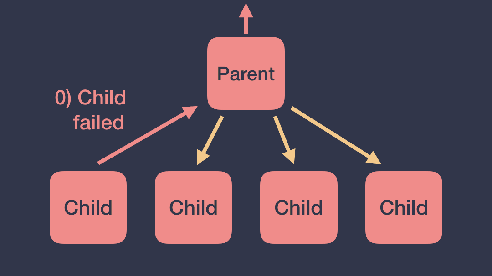
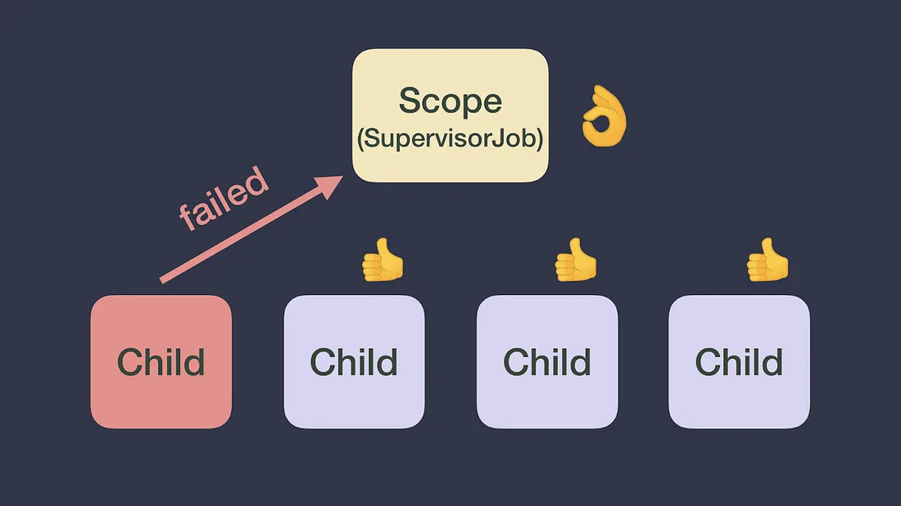
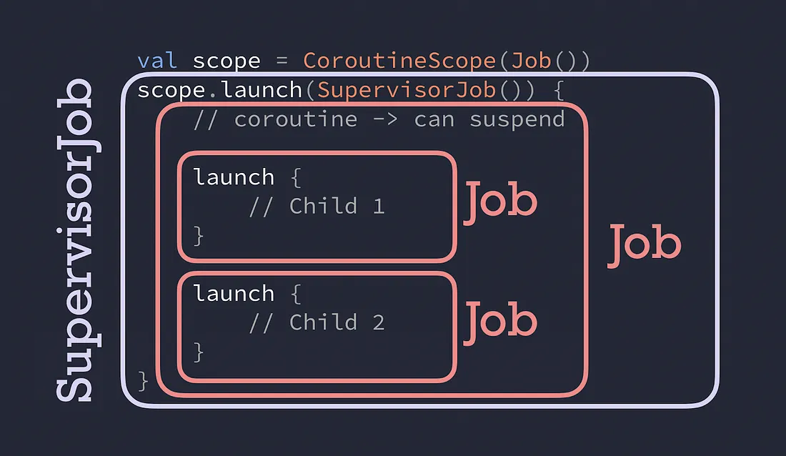

- [【ブログ】コルーチンの例外](#ブログコルーチンの例外)
  - [コルーチンが突然失敗しました。次はどうすればいいですか？ 😱](#コルーチンが突然失敗しました次はどうすればいいですか-)
  - [SupervisorJob が救世主](#supervisorjob-が救世主)
  - [Job または SupervisorJob どちらを使用するか？ 🤔](#job-または-supervisorjob-どちらを使用するか-)
  - [クイズです。私の親は誰ですか](#クイズです私の親は誰ですか)
  - [仕組み](#仕組み)
  - [例外の処理 👩‍🚒](#例外の処理-)
    - [launch コルーチンビルダーの場合](#launch-コルーチンビルダーの場合)
    - [async コルーチンビルダーの場合](#async-コルーチンビルダーの場合)
  - [CoroutineExceptionHandler](#coroutineexceptionhandler)
  - [まとめ](#まとめ)
  - [引用元資料](#引用元資料)


# 【ブログ】コルーチンの例外

私たち開発者は、通常、アプリのハッピーパス (ユーザーに辿ってほしい一番シンプルで簡単な道筋) を磨くのに多くの時間を費やします。ただし、物事が期待どおりに進まなかったときに、適切なユーザーエクスペリエンスを提供することも同様に重要です。 **アプリケーションがクラッシュするのは、ユーザーにとって悪いエクスペリエンスです。その代わりに、ユーザーに適切なメッセージを表示することは不可欠です。**

例外を適切に処理することは、ユーザーが 「アプリケーションをどのように認識するか」 に大きな影響を与えます。この記事では、コルーチンにおける以下の 3 点を説明します。

- 例外がどのように伝播されるか
- 例外を常に制御する方法
- 例外を処理するさまざまな方法

ビデオの方がお好みの場合は、Florina Muntenescu と私が行った KotlinConf’19 での [この講演](https://www.youtube.com/watch?v=w0kfnydnFWI) をご覧ください。


## コルーチンが突然失敗しました。次はどうすればいいですか？ 😱

コルーチンが例外で失敗すると、その例外が親に伝わります。その後、親は 1) 残りの子をキャンセルし、2) 自身をキャンセルし、3) 子で発生した例外を、さらに一つ上の親に伝えます。

例外は、コルーチン階層のルートに到達し、 `CoroutineScope` (※ 1 ) によって開始されたその他のすべてのコルーチンもキャンセルされます。

(※ 1 )  
Android では、直接 CoroutineScope を作成することは少なく、代わりに、自動生成される viewModelScope ( ViewModel のライフサイクルに連動) や lifecycleScope ( Activity / Fragment のライフサイクルに連動) を使用します。



例外を伝播することが理にかなっている場合もありますが、望ましくない場合もあります。ユーザー操作を処理する UI 関連の CoroutineScope を想像してください。子コルーチンが例外をスローすると、UI スコープがキャンセルされ、キャンセルされたスコープは、それ以上コルーチンを開始できないため、UI コンポーネント全体が応答しなくなります。 ( UI スレッド上で、アニメーションを実行するコルーチンスコープをキャンセルしたら、アニメーションが途中で止まってしまうなどの現象が発生します。)

例外の伝搬が不要な場合はどうすればよいでしょうか。代わりに、 SupervisorJob と呼ばれる、別の Job を使用できます。


## SupervisorJob が救世主

SupervisorJob を使用すると、子の失敗が他の子に影響することはありません。SupervisorJob は、自分自身も、その残りの子もキャンセルしません。さらに、 SupervisorJob は例外を伝播せず、例外をスローした子コルーチン自身にその例外を処理させます。



SupervisorJob のコルーチンスコープを定義するには、 2 つの方法があります。

- `val uiScope = CoroutineScope(SupervisorJob())`
- `coroutineScope{}` の代わりに `supervisorScope{}` を使用する

**SupervisorJob の子コルーチンで例外が処理されず、CoroutineContext に CoroutineExceptionHandler がない場合** (後述)、デフォルトスレッドの ExceptionHandler に到達します。 JVM では、例外はコンソールに記録されます。 Android では、どの Dispatcher で発生したかに関係なく、 **アプリがクラッシュします。**

**💥 キャッチされない例外は、使用するジョブの種類に関係なく常にスローされます**

同じ動作が、スコープビルダー coroutineScope と supervisorScope に適用されます。これらは、サブスコープ (親として Job または SupervisorJob を使用) を作成し、コルーチンを論理的にグループ化できます。グループ化することで、並列計算を実行したり、コルーチンが互いに影響を受けるような関係を構築することができます。

**警告** : SupervisorJob は、スコープの一部である場合 (※ 1 ) にのみ、説明どおりに機能します。  
(※ 1 ) `supervisorScope` または `CoroutineScope(SupervisorJob())` を使用して作成された場合


## Job または SupervisorJob どちらを使用するか？ 🤔

Job または SupervisorJob は、いつ使用すべきでしょうか？親と兄弟がキャンセルされるのを避けたい場合は、 `SupervisorJob` または `supervisorScope` を使用します。

例:

```kotlin
val scope = CoroutineScope(SupervisorJob())
scope.launch {
    // Child 1
}
scope.launch {
    // Child 2
}
```

この場合、child#1 が失敗しても、 scope も child#2 もキャンセルされません。

別の例:

```kotlin
val scope = CoroutineScope(Job())
scope.launch {
    supervisorScope {
        launch {
            // Child 1
        }
        launch {
            // Child 2
        }
    }
}
```

`supervisorScope{}` は `CoroutineScope(SupervisorJob())` と同じような意味であるため (※ 1 ) 、 child#1 が失敗しても child#2 はキャンセルされません。 supervisorScope の代わりに coroutineScope を使用すると、失敗が伝播し、関連する全てのスコープやコルーチンもキャンセルされます。

(※ 1 ) 正確には使用方法が違うので少し注意が必要です。次のセクション [クイズです。私の親は誰ですか](#クイズです私の親は誰ですか) を参照してください。


## クイズです。私の親は誰ですか

次のコードスニペットから、 child#1 の親がどのような種類のジョブであるかを特定できますか？

```kotlin
val scope = CoroutineScope(Job())
scope.launch(SupervisorJob()) {
    // new coroutine -> can suspend
    launch {
        // Child 1
    }
    launch {
        // Child 2
    }
}
```

正解は、 child#1 の parentJob は Job 型になります。第一印象では、SupervisorJob になると思われるかもしれませんが、そうではありません。 child#1 の親には、 coroutineScope の引数の Job() が割り当てられ、その親が SupervisorJob になります。



したがって、child#1 または child#2 のいずれかが失敗すると、その失敗はスコープに到達し、そのスコープによって開始されたすべての作業がキャンセルされます。

SupervisorJob は、 `supervisorScope{}` または `val scope = CoroutineScope(SupervisorJob())` を使用して作成されたスコープの一部である場合にのみ、説明どおりに動作することに注意してください。 SupervisorJob をコルーチンビルダーのパラメーターとして渡しても、キャンセルに対して期待した効果は得られません。

例外に関しては、いずれかの子が例外をスローした場合、その SupervisorJob は例外を階層の上位に伝播せず、そのコルーチンで処理します。


## 仕組み

Job が内部でどのように動作するかに興味がある場合は、JobSupport.kt ファイルで関数 childCancelled と notificationCancelling の実装を確認してください。

SupervisorJob 実装では、childCancelled メソッドは単に false を返します。つまり、キャンセルは伝播されませんが、例外も処理されません。


## 例外の処理 👩‍🚒

コルーチンの例外の処理には、 Kotlin の通常の例外処理を適用します。具体的には、以下のいずれかが使用される場合が多いです。

- try/catch
- runCatching (内部で try/catch を使用)

以前に記載した通り、 **キャッチされない例外は常にスローされます。** ただし、コルーチンビルダーが launch なのか、 async なのかによって、例外の処理方法は異なります。これから、それらについて、詳細を説明していきます。


### launch コルーチンビルダーの場合

`launch` では、例外が発生すると、すぐにスローされます。したがって、次の例のように、例外をスローできるコードを try/catch 内にラップできます。

```kotlin
scope.launch {
    try {
        codeThatCanThrowExceptions()
    } catch(e: Exception) {
        // Handle exception
    }
}
```

**launch を使用すると、例外が発生した際に、すぐにスローされます。**


### async コルーチンビルダーの場合

`async` がルートコルーチン ( CoroutineScope インスタンス、または、 supervisorScope の直接の子であるコルーチン) として使用される場合、 **例外が発生しても、すぐにはスローされず、 .await() を呼び出した際にスローされます。**

ルートコルーチンであるときに async でスローされる例外を処理するには、.await() 呼び出しを try/catch 内にラップします。

```kotlin
supervisorScope {
    val deferred = async {
        codeThatCanThrowExceptions()
    }
    try {
        deferred.await()
    } catch(e: Exception) {
        // Handle exception thrown in async
    }
}
```

この場合、async を呼び出しても、例外はスローされないことに注意してください。そのため、async をラップする必要もありません。await が、async コルーチン内で発生した例外をスローします。このような仕組みになっている理由は、おそらく、 await がコルーチンの処理結果を返すため、コルーチンの処理が成功した場合と、失敗した場合の結果が、同じ ところから返され、処理フローがシンプルになり、実装漏れ等に気が付きやすいためでしょう。

**async をルートコルーチンとして使用すると、.await を呼び出すときに例外がスローされます。**

また、 supervisorScope を使用して async と await を呼び出していることにも注意してください。前に述べたように、 SupervisorJob を使用すると、コルーチンで例外を処理できます。一方、 Job は例外を階層内で自動的に伝播するため、 catch ブロックは呼び出されません。

```kotlin
// coroutineScope で生成されたコルーチンは、
// SupervisorJob ではなく Job なので、
// そのスコープ内で発生した例外はキャッチできない。
coroutineScope {
    try {
        val deferred = async {
            codeThatCanThrowExceptions()
        }
        deferred.await()
    } catch(e: Exception) {
        // async 内で発生した例外は、ここでキャッチすることができません。ただし、親のコルーチンスコープに伝搬されます。

        // ************************************
        // ただし、現在、 Kotlin にバグがあり、
        // ここでもキャッチできてしまうそうです！！！
        // ************************************
    }
}
```

さらに、他のコルーチンによって作成されたコルーチンで発生する例外は、コルーチンビルダーに関係なく常に伝播されます。

例:

```kotlin
val scope = CoroutineScope(Job())
scope.launch {
    async {
        // If async throws, launch throws without calling .await()
    }
}
```

この場合、 async が例外をスローすると、スコープの直接の子であるコルーチンが launch であるため、例外は発生するとすぐにスローされます。その理由は、 async ( CoroutineContext に Job がある) が、例外をスローする親 ( launch ) に例外を自動的に伝播するためです。

**⚠️ coroutineScope ビルダー内でスローされた例外、または、他のコルーチンによって作成されたコルーチンでスローされた例外は、 try/catch でキャッチされません!**

SupervisorJob セクションで、 CoroutineExceptionHandler の存在について言及しています。詳しく見ていきましょう!


## CoroutineExceptionHandler

CoroutineExceptionHandler は、キャッチされていない例外を処理できる CoroutineContext のオプションの要素です。

CoroutineExceptionHandler を定義する方法は次のとおりです。例外がキャッチされるたびに、例外が発生した CoroutineContext と例外自体に関する情報が得られます。

```kotlin
val handler = CoroutineExceptionHandler {
    // context : 例外が発生した CoroutineContext
    // exception : 発生した例外自身に関する情報
    context, exception -> println("Caught $exception")
}
```

以下の要件が満たされると、例外がキャッチされます:

- **いつ ⏰** : 例外が自動的にスローされるコルーチンかどうか？
  - launch によって生成されたコルーチンは自動的にスローします。
  - async や produce によって生成されたコルーチンは自動的にスローしません。

- **ハンドラーがどこにインストールされているか 🌍** : CoroutineScope またはルートコルーチン ( CoroutineScope または supervisorScope の直接の子) の CoroutineContext 内にある場合。

上記で定義した CoroutineExceptionHandler を使用した例をいくつか見てみましょう。

次の例では、例外はハンドラーによってキャッチされます:

```kotlin
val scope = CoroutineScope(Job())
// handler が例外をキャッチできます。
scope.launch(handler) {
    launch {
        throw Exception("Failed coroutine")
    }
}
```

次の例では、ハンドラが内側のコルーチンにインストールされているため、例外をキャッチできません。

```kotlin
val scope = CoroutineScope(Job())
scope.launch {
    // handler が例外をキャッチできません。
    launch(handler) {
        throw Exception("Failed coroutine")
    }
}
```

例外がキャッチされないのは、ハンドラーが適切な CoroutineContext にインストールされていないためです。内側の launch は、例外が発生するとすぐに親に例外を伝播します。親はハンドラーについて何も知らないため、例外がスローされます。


## まとめ

アプリケーションで例外を適切に処理することは、期待どおりに進まなかった場合でも、優れたユーザー エクスペリエンスを実現するために重要です。

例外が発生したときにキャンセルを伝播させたくない場合は SupervisorJob を使用し、そうでない場合は Job を使用することを忘れないでください。

キャッチされていない例外は伝播されます。それらをキャッチして優れた UX を提供してください。


## 引用元資料

[Exceptions in coroutines](https://medium.com/androiddevelopers/exceptions-in-coroutines-ce8da1ec060c)


