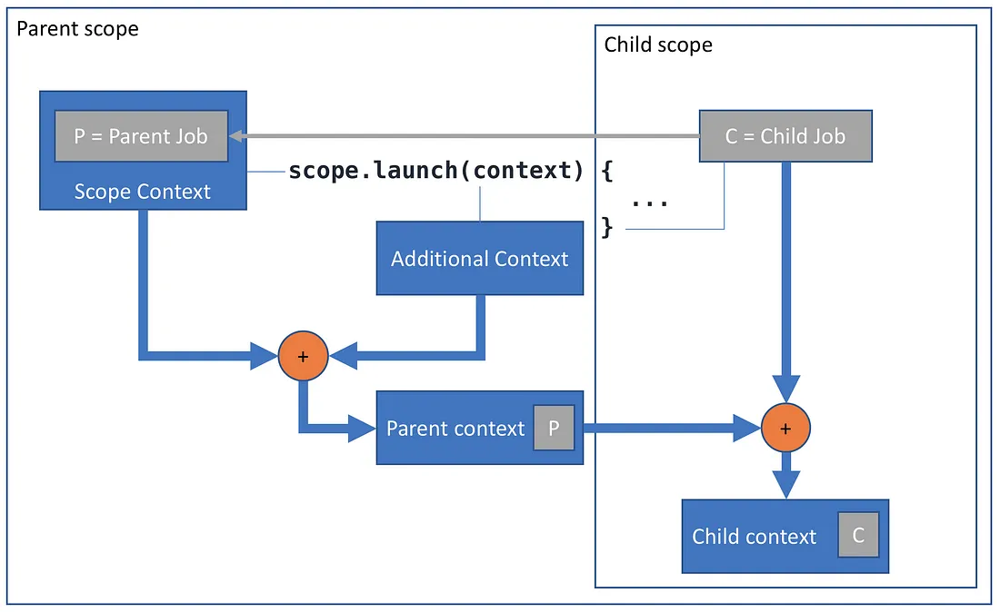

- [CoroutineContext と Scope](#coroutinecontext-と-scope)
  - [CoroutineContext](#coroutinecontext)
  - [CoroutineContext の変更](#coroutinecontext-の変更)
  - [コルーチンの Job](#コルーチンの-job)
  - [CoroutineContext と CoroutineScope の違い](#coroutinecontext-と-coroutinescope-の違い)
  - [参考資料](#参考資料)
  - [引用元資料](#引用元資料)


# CoroutineContext と Scope

物理的にほぼ同一のものの、用途が異なる場合は、通常、その用途を強調するために異なる名前を付けます。用途に応じて、船員は、物質的には同じものであっても、ロープに対して 12 以上の単語を使用します。( [Hindley-Milner 型システムに関する Wikipedia](https://en.wikipedia.org/wiki/Hindley%E2%80%93Milner_type_system) )


## CoroutineContext

Kotlin のすべてのコルーチンには、CoroutineContext インターフェースのインスタンスによって表されるコンテキストがあります。コンテキストは要素のセットであり、現在のコルーチン コンテキストは coroutineContext プロパティを介して利用できます。

```kotlin
import kotlinx.coroutines.*

fun main() = runBlocking<Unit> {
    println("My context is: $coroutineContext")
}
```

```
実行結果

My context is: [CoroutineId(1), "coroutine#1":BlockingCoroutine{Active}@2471cca7, BlockingEventLoop@5fe5c6f]
```


## CoroutineContext の変更

コルーチン コンテキストは不変 ( Immutable ) です。ただし、セットに要素を追加するのと同じように、プラス演算子を使用してコンテキストに要素を追加することができます。その場合、新しいコンテキスト インスタンスを生成します。

```kotlin
import kotlinx.coroutines.*

fun main() = runBlocking<Unit> {
    println("A context with name: ${coroutineContext + CoroutineName("test")}")
}
```

```
実行結果

A context with name: [CoroutineId(1), "coroutine#1":BlockingCoroutine{Active}@2471cca7, CoroutineName(test), BlockingEventLoop@5fe5c6f]
```


## コルーチンの Job

コルーチン自体はジョブで表されます。ジョブは、コルーチンのライフサイクル、キャンセル、親子関係を持っています。現在のジョブは、現在のコルーチンのコンテキストから取得できます。

```kotlin
import kotlinx.coroutines.*

fun main() = runBlocking<Unit> {
    println("My job is: ${coroutineContext[Job]}")
}
```

```
実行結果

My job is: "coroutine#1":BlockingCoroutine{Active}@6f79caec
```


## CoroutineContext と CoroutineScope の違い

CoroutineScope というインターフェースもあり、これは `val coroutineContext: CoroutineContext` という 1 つのプロパティだけで構成されています。コンテキスト以外は何もありません。では、なぜこのインターフェースが存在するのでしょうか。また、コンテキスト自体とどう違うのでしょうか。コンテキストとスコープの違いは、その目的にあります。

コルーチンは通常、 `launch` コルーチンビルダーを使用して起動されます。

```kotlin
fun CoroutineScope.launch(
    context: CoroutineContext = EmptyCoroutineContext,
    // ...
): Job
```

これは CoroutineScope の拡張関数として定義され、CoroutineContext をパラメーターとして受け取るため、実際には 2 つのコルーチン コンテキストを受け取ります。これらをどのように処理するのでしょうか。

プラス演算子を使用してこれらをマージし、要素の和集合を生成するため、パラメーターのコンテキストの要素が、スコープのコンテキストの要素よりも優先されます。結果のコンテキストは、新しいコルーチンを開始するために使用されますが、これは新しいコルーチンのコンテキストではなく、新しいコルーチンの親コンテキストです。新しいコルーチンは独自の子 Job インスタンスを作成し (このコンテキストのジョブを親として使用)、その子コンテキストを親コンテキストとそのジョブとして定義します。



launch 、および、その他すべてのコルーチン ビルダーの CoroutineScope レシーバーの本来の目的は、新しいコルーチンが起動されるスコープを参照することです。慣例により、 CoroutineScope のコンテキストには、新しいコルーチンの親になるジョブが含まれます (ただし、 [GlobalScope は例外で、これは避けるべきです ¹](#参考資料) )。

一方、 launch のパラメーター ( `context: CoroutineContext` ) の本来の目的は、親スコープから継承される要素をオーバーライドするための追加のコンテキスト要素を提供することです。例:

```kotlin
import kotlinx.coroutines.*

fun main() = runBlocking<Unit> {
    launch(CoroutineName("child")) {
       println("My context is $coroutineContext}")        
    }
}
```

```
実行結果

My context is [CoroutineName(child), CoroutineId(2), "child#2":StandaloneCoroutine{Active}@66048bfd, BlockingEventLoop@61443d8f]}
```

慣例により、通常はコンテキスト パラメータでジョブを launch に渡すことはありません。これは、たとえば NonCancellable ジョブを使用して明示的に親子関係を壊す場合を除き、親子関係が壊れるためです。

launch 内のコード ブロックは、 CoroutineScope をレシーバーとして定義されることに注意してください。

```kotlin
fun CoroutineScope.launch(
    // ...
    block: suspend CoroutineScope.() -> Unit
): Job
```

すべてのコルーチン ビルダーが従う慣例により、このスコープの coroutineContext プロパティは、このブロック内で実行されているコルーチンのコンテキストと同じになります。

```kotlin
import kotlinx.coroutines.*
import kotlin.coroutines.*

fun main() = runBlocking<Unit> {
    launch { scopeCheck(this) }
}

suspend fun scopeCheck(scope: CoroutineScope) {
    println(scope.coroutineContext === coroutineContext)
}
```

```
実行結果

true
```

このように、 this で修飾されていない coroutineContext 参照が見られても、対応する名前のトップレベル プロパティとスコープのプロパティが混同されることはありません。これらは設計上、常に同じだからです。

IntelliJ IDEA は、コルーチン ビルダー内のコード ブロックに CoroutineScope ヒントという便利なマークを付けます。これにより、通常のコード ブロックと異なるコンテキストのブロックをすぐに区別できます。

さらに、この新しい CoroutineScope のコンテキストには、常に新しい Job があります。したがって、ソース コードで明示的なレシーバーのない launch { … } を見つけた場合、CoroutineScope としてマークされた外側のブロックを探すことで、どのスコープで起動されているかをすぐに判断できます。

コンテキストとスコープは、実質的に同じものなので、次の関数に示すように、現在の coroutineContext を CoroutineScope のインスタンスにラップするだけで、スコープにアクセスせず、 GlobalScope も使用せずにコルーチンを起動できます。

```kotlin
import kotlinx.coroutines.*
import kotlin.coroutines.*

suspend fun doNotDoThis() {
    CoroutineScope(coroutineContext).launch {
        println("I'm confused")
    }
}

fun main() = runBlocking<Unit> {
    doNotDoThis()
}
```

```
実行結果

I'm confused
```

これは行わないでください。コルーチンが起動されるスコープが不透明かつ暗黙的になり、関数シグネチャで明示的に通知することなく、外部ジョブをキャプチャして、新しいコルーチンを起動します。コルーチンは、コードの残りの部分と並行して実行される作業であり、その起動は [明示的に行う必要があります ²](#参考資料) 。

関数が返された後も実行し続けるコルーチンを起動する必要がある場合は、関数を CoroutineScope の拡張にするか、関数シグネチャで意図を明確にするために、scope: CoroutineScope をパラメータとして渡します。これらの関数を中断させないでください。

```kotlin
import kotlinx.coroutines.*

fun CoroutineScope.doThis() {
    launch { println("I'm fine") }
}

fun doThatIn(scope: CoroutineScope) {
    scope.launch { println("I'm fine, too") }
}

fun main() = runBlocking<Unit> {
    doThis()
    doThatIn(this)
}
```

```
実行結果

I'm fine
I'm fine, too
```

一方、サスペンド関数は非ブロッキングになるように設計されており、並列処理を開始する副作用はありません。サスペンド関数は、呼び出し元に戻る前にすべての作業が完了するまで待機できます。また、 [待機する必要があります ³](#参考資料) 。


## 参考資料

[[1]^ GlobalScope を避けるべき理由](https://medium.com/@elizarov/the-reason-to-avoid-globalscope-835337445abc)

[[2]^ 明示的な並行性](https://medium.com/@elizarov/explicit-concurrency-67a8e8fd9b25)

[[3]^ スレッドのブロック、コルーチンの中断](https://medium.com/@elizarov/blocking-threads-suspending-coroutines-d33e11bf4761)


## 引用元資料

- [Coroutine Context and Scope](https://elizarov.medium.com/coroutine-context-and-scope-c8b255d59055)


