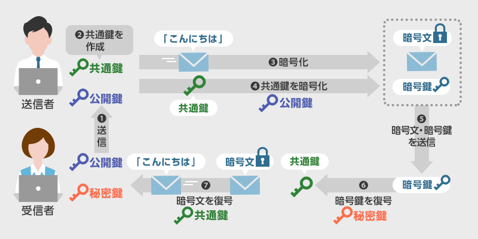

<!-- TOC START min:1 max:3 link:true asterisk:false update:true -->
- [ハイブリッド暗号方式](#ハイブリッド暗号方式)
  - [使用されている場面](#使用されている場面)
<!-- TOC END -->

# ハイブリッド暗号方式

共通鍵暗号方式と公開鍵暗号方式の弱点を補うハイブリッド暗号と呼ばれるものがある。  
共通鍵暗号方式の場合は、鍵管理に問題がある。  
公開鍵暗号方式には、暗号化や復号の処理に時間がかかるという問題がある。  
それらを補うかたちで組み合わせた暗号は、 **ハイブリッド暗号方式** と呼ばれる。

ハイブリッド暗号では、メッセージの暗号化を共通鍵で実施する。  
共通鍵は相手の公開鍵で暗号化して送信する。

## 使用されている場面

- SSL / TSL を使用した通信の暗号化
