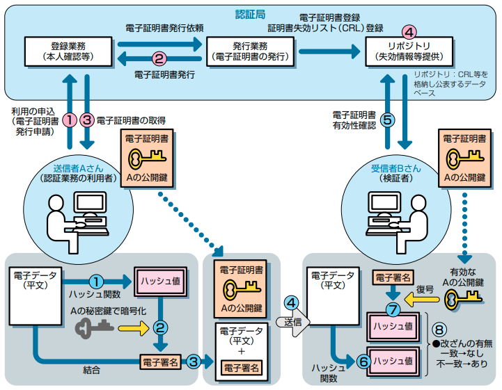
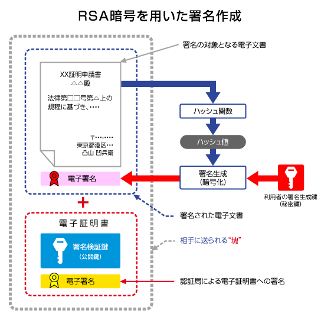
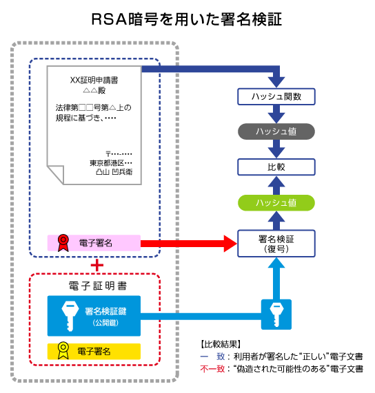

<!-- TOC START min:1 max:3 link:true asterisk:false update:true -->
- [電子署名](#電子署名)
  - [電子署名で立証できること](#電子署名で立証できること)
  - [電子署名の仕組みを表した図](#電子署名の仕組みを表した図)
    - [全体図](#全体図)
    - [署名作成側のみを取り出した図](#署名作成側のみを取り出した図)
    - [署名検証側のみを取り出した図](#署名検証側のみを取り出した図)
<!-- TOC END -->

# 電子署名

## 電子署名で立証できること

電子署名では、 **文書が改ざんされていないこと** および、  
**文書は、電子証明書が指し示す本人が作成したこと** を立証することができます。  
ただし、前提として認証局が信用できる認証局である必要があります。

## 電子署名の仕組みを表した図

わかりやすいように、二つの参考サイトから図を引用し、以下に貼り付けています。  
どちらのサイトから引用した図も、いずれも **RSA 暗号を用いた電子署名** を表しています。

電子署名の方式には、 RSA 暗号以外にも DSA 署名方式、 ECDSA 署名方式が存在していますが、  
権利の問題等で、 DSA と ECDSA はあまり使用されていないようです。

### 全体図

この図を理解する前提として、 [公開鍵と秘密鍵の特性](../暗号方式/公開鍵暗号方式/公開鍵暗号方式.md/#公開鍵と秘密鍵) を理解している必要があります。

電子証明書には、Aさんの作成した公開鍵が含まれています。  
電子証明書には、公開鍵が誰のものかを保証する役割があります。

### 署名作成側のみを取り出した図

### 署名検証側のみを取り出した図

