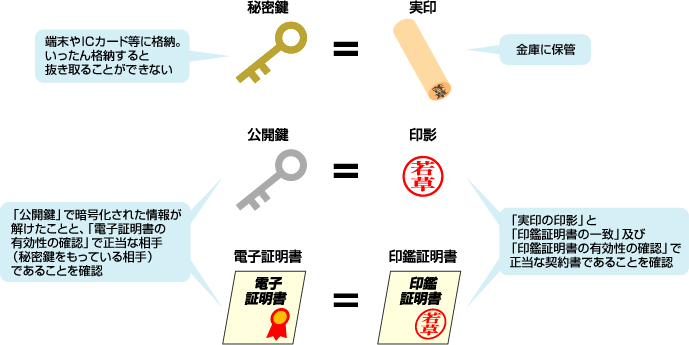

<!-- TOC START min:1 max:3 link:true asterisk:false update:true -->
- [電子証明書](#電子証明書)
  - [広義の電子証明書](#広義の電子証明書)
    - [意味](#意味)
    - [現実世界との対比](#現実世界との対比)
  - [狭義の電子証明書](#狭義の電子証明書)
    - [公開鍵暗号方式における電子証明書](#公開鍵暗号方式における電子証明書)
<!-- TOC END -->

# 電子証明書

電子証明書はさまざまな場面で利用され、その利用場面ごとに呼び方や利用方法が少し変わってくる  
かもしれません。

## 広義の電子証明書

### 意味

電子証明書は、現実世界におけるパスポートや印鑑証明書のような「身分証明書」です。  
パスポートや印鑑証明書と同じように、認証局と呼ばれる組織が、持ち主の身元情報を認証し発行します。

### 現実世界との対比

## 狭義の電子証明書

### 公開鍵暗号方式における電子証明書

公開鍵暗号方式における電子証明書は、**公開鍵証明書** と呼ばれることがあります。  
その名の通り、公開鍵が誰のものなのかを証明する役割があります。  
公開鍵証明書の中には、 `公開鍵そのもの` と `認証局による認証局の署名` が含まれています。
