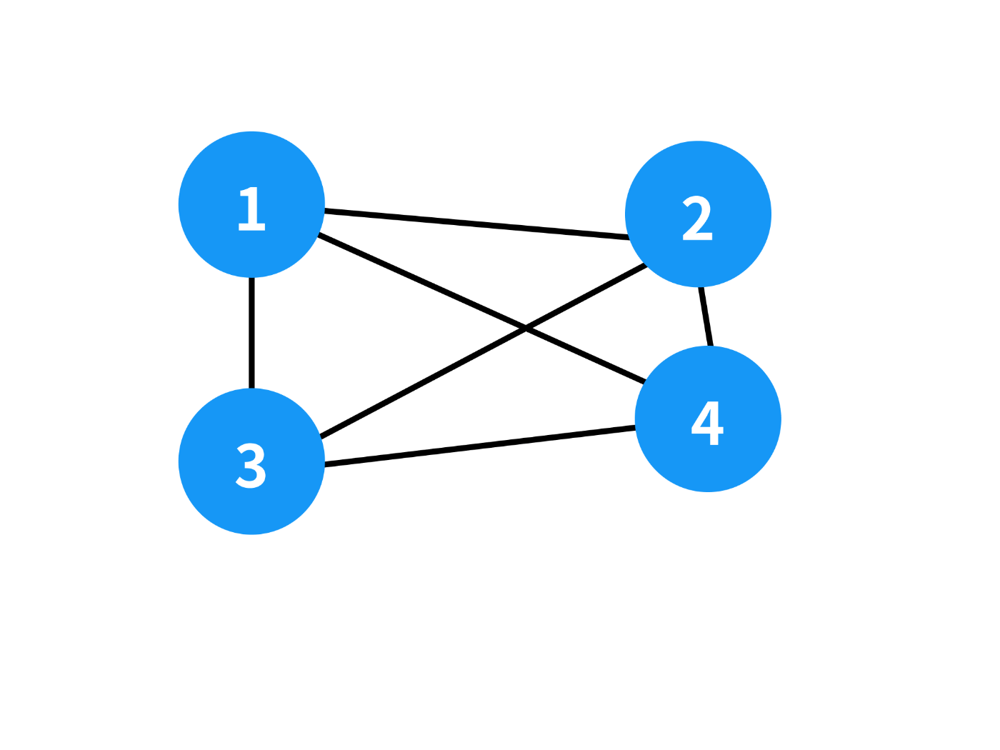
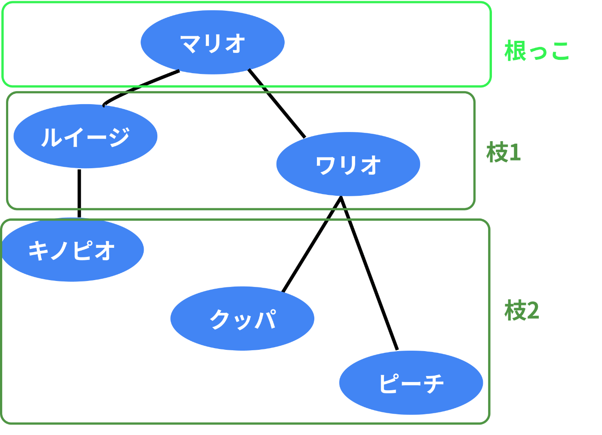

- [GraphQL](#graphql)
  - [GraphQL の仕組み](#graphql-の仕組み)
    - [ざっくりと理解する](#ざっくりと理解する)
    - [グラフ理論と GraphQL](#グラフ理論と-graphql)
  - [GraphQLを理解する上で必要な知識](#graphqlを理解する上で必要な知識)
    - [Schema](#schema)
    - [Query](#query)
      - [Query の基本](#query-の基本)
    - [Mutation](#mutation)
    - [Subscription](#subscription)
    - [Argument](#argument)


# GraphQL

GraphQL とは、 REST に代わる新しいサーバーとの通信方式のことです。 REST API の問題を解決するために、 Facebook ( Meta ) によって開発されました。

GraphQL は、異なるリソースに対して異なる HTTP のエンドポイントを充てるのではなく、 HTTP エンドポイントに「クエリ」を POST します。つまり、 「対サーバーのクエリ」 と言えるでしょう。

GraphQL 最大の特徴は必要以上に大きなデータが返されることを防ぐことにあります。つまり、必要最低限のリクエストで、必要なデータだけを抽出できます。その一方で、柔軟さと豊富な表現と引き換えに、 GraphQL で開発された API は複雑になる可能性があります。

GraphQL で開発された API は、データの問い合わせ ( query ) 、書き換え ( mutation ) や購読 ( subscription ) をサポートしています。


## GraphQL の仕組み

### ざっくりと理解する

GitHub が GraphQL の API を提供しているため、それに従って説明します。以下は 「 GraphQL という名前を含むリポジトリを検索して、それに当てはまるリポジトリの数を取得する」 クエリです。

```graphql
query RepositorySearch { 
    search(query: "GraphQL", type: REPOSITORY) {
        repositoryCount
    }
}
```

この結果として、以下のようなJSONが出力されます。

```json
{
    "data": {
        "search": {
            "repositoryCount": 165655
        }
    }
}
```

GraphQL で開発した API からデータを取得する大まかな流れは以下の通りである。

1. GraphQL は、クライアントがクエリ内容を記述した document を送信し、 GraphQL サービスがクエリを実行して結果を送信する。 document は **GraphQL query language** を用いて記述。
2. 単一の API エンドポイントへこの document を POST することで、クエリが実行される。
3. 実行結果 (いわゆるレスポンス) が JSON 形式で出力される。


### グラフ理論と GraphQL

GraphQLを学習するにあたって、グラフ理論に関する理解を深めておくとAPIの全体像を把握できる。グラフ理論とは、ノード(頂点)とエッジ(線)の集合で構成されるグラフに関する数学の理論だ。これがどのようにGraphQLに関係しているのだろうか。



GraphQLとグラフ理論の関連性をより理解できるようにするために、TwitterのようなSNSを考えてみる。以下の画像は、マリオを基点に彼のTwitterで繋がっている友人関係をリクエストした時の繋がりを表現している。そのように考えると、このリクエストは以下のような木構造になる。指定したマリオが根っこで、そのマリオに基づく友人関係が枝になるような理解だ。

このリクエストで、マリオは彼の友人同士とエッジで接続されることがわかるだろう。実は、 **この構造そのものが GraphQL のクエリによく似ている。**



```
木構造

- person
    - name
    - location
    - birthday
    - friends
        * friend name
        * friend location
        * friend birthday
```

```graphql
# GraphQLのクエリ
query {
    me {
        name
        location
        birthday
        friends {
            name
            location
            birthday
        }
    }
}
```


## GraphQLを理解する上で必要な知識

### Schema

GraphQL は、型を持ったデータを返すことが可能ですが、そのためには、スキーマが定義されている必要があります。

例えば、Personという型を定義する。

```graphql
type Person {
    name: String!
    age: Int!
}
```

上述のデータ型は2つのフィールドを持っている。

- name：名前。文字列なのでStringのデータ型を使う。
- age：年齢。数字なのでIntのデータ型を扱う。

`!` をデータ型の後ろにつけることで、データ入力が **必須のフィールド** にできる。

また、データ型同士で別のデータ型を参照することができる。例えば、ブログのアプリケーションに必要なデータ型を想定する。 Person は新しいデータ型である Post に関連したデータ型を以下のように関連付けられる。

```graphql
type Post {
    title: String!
    author: Person!
}
```

データ型Personは以下のように定義する。

```graphql
type Person {
    name: String!
    age: Int!
    posts: [Post!]!
}
```

Person と Post を相互参照させることもできる。また、 `[]` でデータ型を囲むことで、配列のデータ型を定義することもできる。


### Query

REST API を使用する場合、データは必ず特定のエンドポイントから読み込まれる。それぞれのエンドポイントでは、返す情報の構造が明確に定義されている。 REST API では、リソースを URL で表現する。

一方で、 GraphQL で採用されているアプローチは根本的に異なっている。

GraphQL API は、単一のエンドポイントのみを公開する。 GraphQL API は返されるデータの構造が明確ではない代わりに、クライアントが実際に必要なデータだけを抽出できる。

要は、クライアントは必要なデータの種類を表現するために、より多くの情報をサーバに送信する必要がある。この情報を Query と呼ぶ。


#### Query の基本

クライアントがサーバに送信する具体的なクエリの例を考えてみよう。

```graphql
query {
    allPersons {
        name
    }
}
```

上述のallPersonsはQueryの根底となるFieldになる。このQueryで指定されているFieldはnameだけである。このQueryは、現在データベースに保存されているすべての人物のリストを返す。以下はそのレスポンスの例だ。

```json
{
    "allPersons": [
        { "name": "Johnny" },
        { "name": "Sarah" },
        { "name": "Alice" }
    ]
}
```

それぞれのレスポンスにはnameしか出力されていないが、他のFieldが出力されていない。Queryで指定されたFieldがnameのみだったからだ。

仮に、クライアントがage等の他のFieldを必要としているなら、Queryを少しだけ調整するだけでいい。

```graphql
{
    allPersons {
        name
        age
    }
}
```

これを出力すると、以下のようにJSONが出力される。

```json
{
    "allPersons": [
        { "name": "Johnny", "age": 40 },
        { "name": "Sarah", "age": 23 },
        { "name": "Alice", "age": 34 }
    ]
}
```

このように、GraphQLではQueryを調整することで必要なデータの種類をJSON形式で出力できる。


### Mutation

サーバに情報を要求するだけではなく、ほとんどのアプリケーションではバックエンドに保存されているデータを変更する方法が必要だ。GraphQLでは、データの変更はMutationを使用して実施される。

GraphQLにおけるMutationには以下の3種類が存在する。

- データの新規作成
- データの上書き
- データの削除

例えば、以下のGraphQLのコードを考える。

```graphql
# 出力するデータ
type Query {
    allPersons(last: Int): [Person!]!
    allPosts(last: Int): [Post!]!
}

# データの作成、上書きと削除に関する処理
type Mutation {
    createPerson(name: String!, age: Int!): Person!
    updatePerson(id: ID!, name: String!, age: String!): Person!
    deletePerson(id: ID!): Person!
}

type Person {
    id: ID!
    name: String!
    age: Int!
    posts: [Post!]!
}

type Post {
    title: String!
    author: Person!
}
```

データを新規で作成する場合は、予約語mutationで以下のように記述する。createPersonという関数を作成して、引数に必要なFieldとその値を指定する。このとき、idはデータが新規作成された後は自動で指定されるので表記する必要はない。

```graphql
mutation {
    createPerson(name: "Bob", age: 36) {
        name
        age
    }
}
```


### Subscription

Subscriptionとは、GraphQLサーバにデータ変化等の特定のイベントが生じるたびにクライアント側に通知を送信する仕組み。主にチャットアプリの通知で活用されている。

予約語subscriptionを使って、以下のように記述する。

```graphql
subscription {
    newPerson {
        name
        age
    }
}
```

このようにSubscriptionを定義しておくと、新規でPersonのデータが作成された場合に自動でサーバに情報が追加される。


### Argument

ArgumentはGraphQLにおけるクエリ制御である。これを簡単に言えば、特定のデータの値に合致したデータを出力する仕組みである。仕組みとしては、データベースのフィルタリングに近い。

以下の例では、都道府県名と天気を使って、Argumentを用いて都道府県と街のリストからTokyoに含まれるsunnyの街を取得する。


```graphql
query {
    prefecture(name: "Tokyo") {
        prefName
        cities(weather: "sunny") {
            cityName
            rainyPercent
        }
    }
}
```

このQueryを実行すると、以下のようにJSONが出力される。

```graphql
{
    "prefecture": {
        {
            "prefName": "Tokyo",
            "cities": [
                {
                    "cityName": "Shinjuku",
                    "rainyPercent": 10
                },{
                    "cityName": "Ikebukuro",
                    "rainyPercent": 0
                }]
        }
    }
}
```

