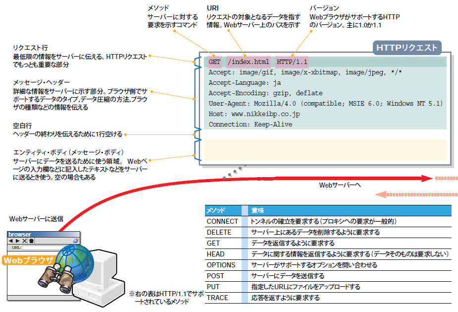

<!-- TOC START min:1 max:3 link:true asterisk:false update:true -->
- [HTTP](#http)
  - [HTTP のフォーマット / 構造](#http-のフォーマット--構造)
  - [ヘッダーフィールドの分類](#ヘッダーフィールドの分類)
<!-- TOC END -->

# HTTP

## HTTP のフォーマット / 構造

HTTP のフォーマットにおいて、各部の呼び方が人によって多少異なる。  
以下に様々な呼び方を記載する。

- リクエスト行の別名
  - スタートライン
  - リクエストライン (リクエストの場合のみ)
  - ステータスライン (レスポンスの場合のみ)
- メッセージ・ヘッダーの別名
  - ヘッダーフィールド
  - リクエスト・ヘッダー (リクエストの場合のみ)
  - レスポンス・ヘッダー (レスポンスの場合のみ)
  - エンティティ・ヘッダー
- エンティティ・ボディーの別名
  - メッセージ・ボディー

メッセージ・ヘッダーとエンティティ・ボディーを合わせて 「エンティティ」 と呼ぶこともある。  
エンティティは、 「ペイロード」 とも呼ばれる。

## ヘッダーフィールドの分類

- リクエスト・ヘッダー
  - ヘッダーフィールドの中でも、リクエストの場合のみ使用可能なフィールドを意味する
- レスポンス・ヘッダー
  - ヘッダーフィールドの中でも、レスポンスの場合のみ使用可能なフィールドを意味する
- 一般・ヘッダー
  - ヘッダーフィールドの中でも、リクエストとレスポンスの両方で使用可能なフィールドを意味する
- エンティティ・ヘッダー
  - ヘッダーフィールドの中でも、ボディ部に格納されているデータについて記述するフィールドを意味する
