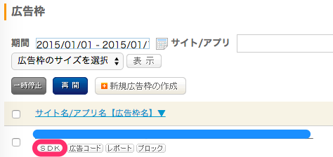
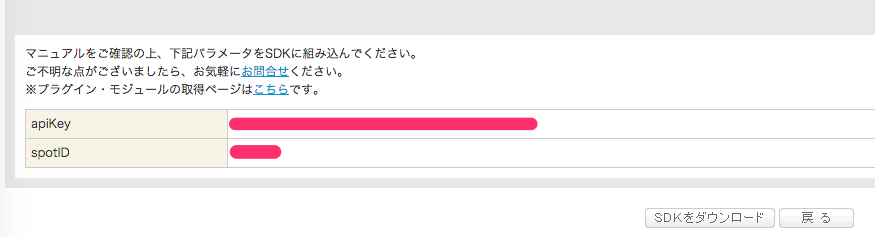

<!-- TOC START min:1 max:3 link:true asterisk:false update:true -->
- [apiKey / spotID の確認](#apikey--spotid-の確認)
<!-- TOC END -->

# apiKey / spotID の確認

「広告枠の管理」 タブのドロップダウンメニューの 「広告枠」 を選択する。  
以下の丸で囲った 「 SDK 」 をクリックする。

すると、 apiKey と spotID が表示されます。

