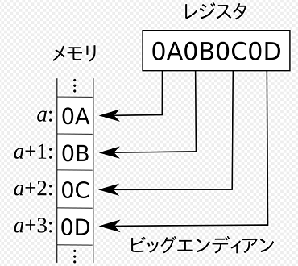
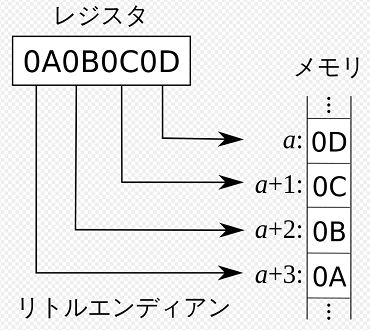
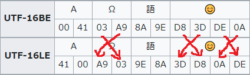
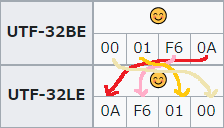

<!-- TOC START min:1 max:3 link:true asterisk:false update:true -->
- [Unicode 文字符号化モデル](#unicode-文字符号化モデル)
  - [概要](#概要)
  - [文字符号化方式](#文字符号化方式)
    - [ビッグエンディアンとリトルエンディアン](#ビッグエンディアンとリトルエンディアン)
    - [UTF-16 / UTF-16BE / UTF-16LE の違い](#utf-16--utf-16be--utf-16le-の違い)
    - [各符号化方式ごとの具体的な BOM の値](#各符号化方式ごとの具体的な-bom-の値)
    - [BOM を付与する場合と付与しない場合](#bom-を付与する場合と付与しない場合)
<!-- TOC END -->

# Unicode 文字符号化モデル

## 概要

- 抽象文字集合 ( ACR )
  - 単なる文字の集合のこと。
  - この時点では、文字コードは一切関係ありません。
- 符号化文字集合 ( CCS )
  - 抽象文字集合を非負整数 ( Unicode コードポイント) に対応したもの。
- 文字符号化形式 ( CEF )
  - Unicode のコードポイントを UTF-8 / UTF-16 / UTF-32 で定義されたどの文字コードに変換するか、の形式のこと
- 文字符号化方式 ( CES )
  - ビッグエンディアンなのか、リトルエンディアンなのか、それ以外のエンディアンなのか、の方式のこと
  - UTF-8 には、エンディアンが無関係のため、関係のない項目である。
  - 例えば、文字 「 A 」 をメモリ上に `00 41` として格納するのか、 `41 00` として格納するのかの方式のこと

## 文字符号化方式

### ビッグエンディアンとリトルエンディアン

ビッグエンディアンは、レジスタの内容を先頭からメモリに書き込む方式です。  
  
図 1 : ビッグエンディアンの動作

レジスタとは、 CPU 内部に存在する 「メモリよりもさらに高速にアクセスできるメモリ」 のイメージです。

リトルエンディアンは、レジスタの内容を末尾からメモリに書き込む方式です。  
  
図 2 : リトルエンディアンの動作

以下に例を示します。  
  
図 3 : ビッグエンディアンとリトルエンディアンの例 (UTF-16 の場合)

UTF-16 の場合は、 1 符号単位が 16 ビットであるため、上記の絵文字の例では、前半 16 ビットと  
後半 16 ビットの内部のみで、メモリへの書き込み順序が逆になります。  

UTF-32 の場合は、以下のようになります。  
  
図 4 : ビッグエンディアンとリトルエンディアンの例 (UTF-32 の場合)

### UTF-16 / UTF-16BE / UTF-16LE の違い

Wikipedia を参照すると、 **UTF-16BE と UTF-16LE は、 BOM を付与できない** と記載されており、  
**UTF-16 は、 BOM が付与できる** と記載されています。

しかし、サクラエディタでファイルを保存する際には、 `UnicodeBE` という方式を選択した場合に、  
BOM 有りと BOM 無しを選択することが可能になっています。

Wikipedia の記載内容が正しい場合は、 `UnicodeBE` という方式を選択した場合に、  
BOM 有りを選択できてしまうのは、おかしいと言えます。

つまり、この状況から判断すると、 UTF-16 / UTF-16BE / UTF-16LE の使い分けは、  
単なる設計書上の意味合いに過ぎないと思われます。

詳しく説明するにあたって、まずは、次の表を見てください。

| 文字符号化方式 | BOM   | エンディアン       |
|----------------|-------|--------------------|
| UTF-16BE       | なし  | ビッグエンディアン |
| UTF-16LE       | なし  | リトルエンディアン |
| UTF-16         | なし  | 実行環境に依存する |
| UTF-16         | FE FF | ビッグエンディアン |
| UTF-16         | FF FE | リトルエンディアン |

設計書に 「 UTF-16BE 」 と記載されていれば、  
エンディアンは、ビッグエンディアンで、  
BOM は付与されていないよ。  
という解釈をせよ。という意味になると考えられます。

「 UTF-16LE 」 も同様に解釈することができます。

UTF-16BE の場合と UTF-16LE の場合は、開発者にとって、優しい設計書であると言えます。

「 UTF-16 」 の場合は、開発者が困る可能性のあるパターンです。  
「BOM が必ず付与されています」 と設計書に記載があれば、 BOM を見て、ビッグエンディアンなのか、  
それともリトルエンディアンなのかを判定することができます。

しかし、 BOM が付与されているかどうかがわからない場合は、まず、 BOM が付与されているかどうかの  
判定から始めなければいけません。  
BOM が付与されていれば良いですが、付与されていない場合は、実行環境に依存するため、  
ビッグエンディアンなのか、リトルエンディアンなのかが定まらない可能性があります。

**【参考】**  
ビッグエンディアンか、リトルエンディアンかの明記がない場合は、例えば、次のようになっています。  
Windows 上の文書における 「 Unicode テキスト」 は特に明記のない場合、リトルエンディアンの  
UTF-16 符号化方式のことを指す。 TCP / IP ネットワークでは、プロトコルヘッダや MIME 等の手段で  
符号化方式が指定されず BOM も付与されない場合、ビッグエンディアンとして扱うと決められている。

### 各符号化方式ごとの具体的な BOM の値

| 符号化形式 | エンディアンの区別 | 具体的な BOM の値          |
|------------|--------------------|----------------------------|
| UTF-8      | -                  | EF BB BF                   |
| UTF-16     | ビッグ             | FE FF                      |
| UTF-16     | リトル             | FF FE                      |
| UTF-16BE   | ビッグ             | 通常、付与しない仕様である |
| UTF-16LE   | リトル             | 通常、付与しない仕様である |
| UTF-32     | ビッグ             | 00 00 FE FF                |
| UTF-32     | リトル             | FF FE 00 00                |
| UTF-32BE   | ビッグ             | 通常、付与しない仕様である |
| UTF-32LE   | リトル             | 通常、付与しない仕様である |

UTF-8 には、 BOM が付与されないこともある。  
BOM 無しは、 UTF-8 と区別するために、 UTF-8N と呼ばれることがある。

### BOM を付与する場合と付与しない場合

#### XML の場合

"XML Media Types" ( RFC 3023 ) では、 XML を UTF-16 で符号化する場合は先頭の BOM を必須とし、  
また、 XML を解釈するソフトウェアでは、先頭に BOM があった場合は xml 宣言における  
`<?xml encoding="..."?>` の指定よりも優先してエンコーディングを判別すべきとしている。  
詳細は、以下のリンクに記載されているらしい。

[“RFC 3023 - XML Media Types”. 2012年7月25日閲覧。](https://www.ietf.org/rfc/rfc3023.txt)

#### JSON の場合

JSON の場合は、ネットワークで送信する場合は、 BOM を付けてはならないとしている。  
詳細は、以下のリンクに記載されているらしい。

[8.1. Character Encoding - STD 90 - The JavaScript Object Notation (JSON) Data Interchange Format](https://www.rfc-editor.org/info/std90#section-8.1)
